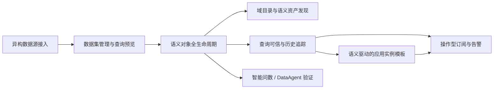

# Feature Research

**Domain:** Enterprise data application platform with semantic-centric analytics
**Researched:** 2026-03-25
**Confidence:** MEDIUM

## Feature Landscape

### Table Stakes (Users Expect These)

These are the non-negotiables for an internal production-ready v1. Missing them makes the platform feel like a demo instead of a usable data application layer.

| Feature | Why Expected | Complexity | Notes |
|---------|--------------|------------|-------|
| 异构数据源接入、连接校验、元数据同步、查询预览 | 企业用户默认要能“连上、看见、验证”数据；没有稳定的接入和预览，后续语义层和应用层都无法落地 | MEDIUM | 重点不是连接器数量，而是接入成功率、schema 变化可见性、预览响应稳定性 |
| 语义对象全生命周期管理（`Cube / View / Domain / Recipe`） | 2026 年的语义中心不再只是建模页面，而是可发布、可校验、可追踪的语义资产系统 | HIGH | 需要支持创建、编辑、发布、回滚/重建、校验、依赖查看，至少要有 dev/prod 分离或等价机制 |
| 域目录与语义资产发现 | 语义层没有组织层会迅速退化成“模型文件堆”；域、主题、负责人、标签、说明是可用性的基本门槛 | MEDIUM | 应支持搜索、分组、描述、依赖关系、ownership 视图，先做内网可维护版本，不做重型治理 |
| 查询可信能力：生成 SQL 可见、结果可复现、历史可追踪 | 企业分析平台必须回答“这个结果怎么来的”；查询黑盒会直接破坏信任 | HIGH | 至少要暴露生成 SQL、查询历史、失败原因、缓存/预聚合命中情况和刷新状态 |
| 语义驱动的应用实例模板 | 数据应用平台的用户不会只停留在查询；模板化应用实例是把语义层变成消费层的最短路径 | MEDIUM | 先做少量高频模板，而不是开放式应用市场；模板必须绑定语义对象和查询能力 |
| 操作型订阅与告警（数据异常、看板变化、Schema 漂移、刷新失败） | 2026 年的数据平台期待“被动查询”之外还要能“主动提醒”；这已经是 BI/数据应用平台的基本运营能力 | MEDIUM | 先做消息通知 + 运行记录 + 触发条件，不要一开始就做复杂工作流编排 |

### Differentiators (Competitive Advantage)

These are the features that can justify the platform versus generic BI or plain SQL tooling. For this project, differentiation should come from semantic completeness and tight app consumption loops, not from breadth.

| Feature | Value Proposition | Complexity | Notes |
|---------|-------------------|------------|-------|
| 领域模型驱动的语义中心 | 把业务域、实体、指标、关系组织成可理解的语义图谱，降低语义资产的认知和维护成本 | HIGH | 这比单纯的表/字段目录更有长期价值，直接支撑后续问数和应用消费 |
| 基于语义层的订阅型数据应用 | 把告警、看板、数据集、漂移监测做成可复用订阅，而不是一次性报表 | HIGH | 适合企业内部“运营数据产品”场景，能把分析从查询扩展到持续消费 |
| 可信查询体验 | 给用户明确的生成 SQL、依赖对象、刷新状态和命中缓存信息，让结果更容易被业务接受 | MEDIUM | 这是 query trust 的核心，能显著降低“这个数对不对”的沟通成本 |
| 受控的智能问数与垂直 DataAgent 验证 | 让智能能力建立在语义层之上，而不是直接打到原始表；先证明闭环，再谈效果优化 | HIGH | 只做验证型场景，重点是可追溯、可解释、可回退，不做通用 Agent 平台 |
| 模板化应用实例与语义对象联动 | 一个模板可以复用同一套语义对象和订阅逻辑，形成“建模一次，消费多次”的复用模式 | MEDIUM | 对 brownfield 仓库尤其重要，能最大化利用已有应用实例雏形 |

### Anti-Features (Commonly Requested, Often Problematic)

These look attractive but usually create scope creep, trust problems, or infrastructure debt.

| Feature | Why Requested | Why Problematic | Alternative |
|---------|---------------|-----------------|-------------|
| 通用 Agent 平台 | 看起来能“一把梭”覆盖所有智能场景 | 需要复杂的工具编排、权限、记忆、评估和安全边界，和当前验证阶段目标冲突 | 只做语义层驱动的问数与垂直 DataAgent 闭环 |
| Prompt-to-App / 低代码全自动应用生成 | 很容易让人联想到快速交付 | 生成结果往往缺少语义约束、稳定性和可维护性，后期返工成本高 | 先用少量强约束模板，把语义对象和订阅机制打牢 |
| 直接把原始 SQL 作为主消费接口 | SQL 用户短期看起来很高效 | 容易绕过语义层，导致指标定义分裂、口径不一致、信任下降 | 通过语义 SQL / 受控查询预览暴露能力，保留原始 SQL 但不让它成为主路径 |
| v1 就做完整多租户和全量权限治理 | 企业常会提出“顺手补上” | 会把单机内网验证目标拖成平台级治理项目 | 明确单环境优先，权限治理保持为后续独立议题 |
| 追求实时化一切 | 业务常要求“越实时越好” | 实时链路会放大复杂度，尤其会放大语义层、订阅、告警和刷新的一致性问题 | 先把批处理/准实时闭环做稳，再评估真正需要实时的场景 |

## Feature Dependencies

### Dependency Notes

- **异构数据源接入 requires 数据集管理与查询预览:** 只有先确认连接、schema 和预览结果稳定，语义层建模才有可信输入。
- **数据集管理与查询预览 requires 语义对象全生命周期:** 语义对象必须能发布和回溯，否则查询预览无法稳定依赖统一口径。
- **语义对象全生命周期 requires 域目录与语义资产发现:** 没有域组织和资产可发现性，语义层会迅速失控。
- **查询可信与历史追踪 enhances 语义驱动的应用实例模板:** 模板消费层越靠近业务，越需要可解释和可审计的查询链路。
- **语义对象全生命周期 requires 智能问数 / DataAgent 验证:** 智能能力必须挂在稳定语义层上，否则只能得到不可信的演示效果。
- **语义驱动的应用实例模板 conflicts with 通用 Agent 平台:** v1 阶段应该优先做受控模板和闭环，不要同时承担平台化 Agent 的复杂度。

## MVP Definition

### Launch With (v1)

Minimum viable product for this brownfield repo: make the core semantic data application loop production-usable.

- [ ] 异构数据源接入 + 数据集管理 + 查询预览稳定可用 — 这是所有上层能力的入口。
- [ ] `Cube / View / Domain / Recipe` 全生命周期可发布、可校验、可查询 — 这是语义层完整性的核心。
- [ ] 域目录与语义资产发现 — 这是业务语义组织层的最低要求。
- [ ] 查询可信能力（生成 SQL、历史、刷新/缓存状态） — 这是企业内部信任建立的基础。
- [ ] 至少一个可运行的应用模板和一个订阅型消费路径 — 证明语义层能真正服务业务消费。

### Add After Validation (v1.x)

These should wait until the semantic core is stable and the v1 loop is usable.

- [ ] 受控的智能问数体验 — 当语义对象完整且查询可信后再扩展，避免黑盒化。
- [ ] 垂直 DataAgent 场景 — 只在一个明确业务场景里验证语义层对智能应用的支撑能力。
- [ ] 更完整的 lineage / impact analysis — 当对象依赖和运行状态稳定后再补齐深度分析能力。
- [ ] 更多模板化应用实例 — 等首批模板证明复用价值后再扩展模板矩阵。

### Future Consideration (v2+)

These are useful, but they are not part of the current internal v1 success criteria.

- [ ] 通用 Agent 平台 — 需要独立的产品边界、权限与评估体系。
- [ ] 低代码 / AI 引导式应用生成 — 只有在模板和语义约束成熟后才有意义。
- [ ] 更强的跨工作区/跨租户治理 — 这会把单环境验证变成平台级治理工程。
- [ ] 面向外部生态的应用市场化分发 — 先把内网核心流做稳，再考虑扩展分发。

## Feature Prioritization Matrix

| Feature | User Value | Implementation Cost | Priority |
|---------|------------|---------------------|----------|
| 数据源接入 + 数据集预览 | HIGH | MEDIUM | P1 |
| 语义对象生命周期 | HIGH | HIGH | P1 |
| 域目录 / 语义资产发现 | HIGH | MEDIUM | P1 |
| 查询可信 / 历史追踪 | HIGH | HIGH | P1 |
| 订阅型应用模板 | HIGH | MEDIUM | P1 |
| 受控智能问数 | MEDIUM | HIGH | P2 |
| 垂直 DataAgent 验证 | MEDIUM | HIGH | P2 |
| 通用 Agent 平台 | LOW | HIGH | P3 |

**Priority key:**
- P1: Must have for launch
- P2: Should have, add when possible
- P3: Nice to have, future consideration

## Competitor Feature Analysis

| Feature | Competitor A | Competitor B | Our Approach |
|---------|--------------|--------------|--------------|
| Semantic model / metric layer | Microsoft Fabric uses semantic models with star-schema style analytical domains; Databricks uses metric views for reusable business metrics | Looker uses LookML for DRY metric and dimension definitions | Keep `Cube / View / Domain / Recipe` as the domain model, but make the domain directory and lifecycle stronger than a pure modeling surface |
| Custom data apps | Databricks Apps and Looker extensions both support custom internal apps on top of governed data | Cube emphasizes APIs and semantic SQL as the app foundation | Use template-driven app instances tied to semantic objects and subscriptions, not a generic app framework |
| Query trust and observability | Databricks SQL alerts, query history, and Fabric lineage surface operational trust signals | Looker exposes generated SQL, alerts, and governed field definitions | Make generated SQL, history, and refresh/cache state first-class in the core loop |
| Agentic analytics | Cube D3 and Databricks AI/BI point toward humans + agents working on semantic data | Fabric semantic link propagates semantic metadata into data science workflows | Keep smart Q&A/DataAgent validation-stage only, grounded in the semantic layer and not direct warehouse access |

## Sources

- [Microsoft Fabric semantic models](https://learn.microsoft.com/en-us/fabric/data-warehouse/semantic-models)
- [Microsoft Fabric semantic link](https://learn.microsoft.com/en-us/fabric/data-science/semantic-link-overview)
- [Microsoft Fabric lineage](https://learn.microsoft.com/en-us/fabric/governance/lineage)
- [Looker LookML overview](https://cloud.google.com/looker/docs/what-is-lookml)
- [Looker alerts](https://cloud.google.com/looker/docs/creating-alerts)
- [Looker extension framework](https://docs.cloud.google.com/looker/docs/intro-to-extension-framework)
- [dbt Developer Hub / Semantic Layer](https://docs.getdbt.com/)
- [Databricks SQL, metric views, and AI/BI](https://docs.databricks.com/gcp/en/sql)
- [Databricks Apps](https://docs.databricks.com/aws/en/dev-tools/databricks-apps)
- [Databricks SQL alerts](https://docs.databricks.com/en/sql/user/alerts/index.html)
- [Cube introduction and semantic layer architecture](https://cube.dev/docs/product/introduction)
- [Cube Data Model IDE](https://cube.dev/docs/product/data-modeling/data-model-ide)
- [Cube Playground / query preview](https://cube.dev/docs/product/exploration/playground)
- [Cube query history export](https://cube.dev/blog/introducing-query-history-export)

---
*Feature research for: enterprise data application platform with semantic-centric analytics*
*Researched: 2026-03-25*
