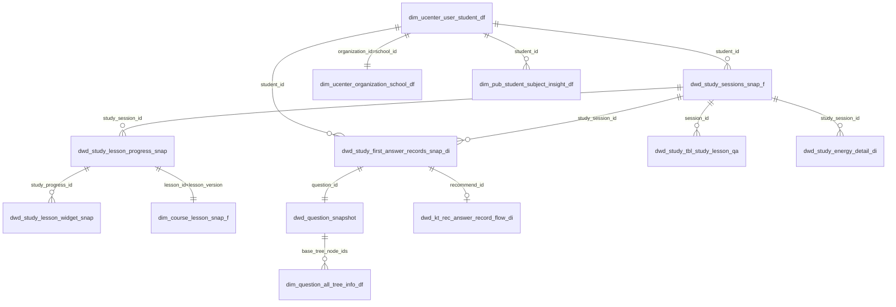

# 表关联关系

## 整体关系图



## 核心关联路径

### 学生 → 学习行为

```
学生维度表
    ↓ student_id
学习会话表
    ↓ study_session_id
├── AI课进度表 → 组件进度表
├── 答题记录表 → KT推题表
├── 问一问记录表
└── 能量发放表
```

### 学生 → 学校

```sql
-- 学生关联学校
SELECT s.*, sch.school_name
FROM dim_ucenter_user_student_df s
JOIN dim_ucenter_organization_school_df sch
    ON s.organization_id = sch.school_id
    AND sch.ds = MAX_PT('dim_ucenter_organization_school_df')
WHERE s.ds = MAX_PT('dim_ucenter_user_student_df')
```

### 答题记录 → 题目 → 知识点

```sql
-- 答题记录关联题目和知识点
SELECT 
    a.answer_record_id,
    a.question_id,
    q.content AS question_content,
    q.difficulty_level,
    k.node_name AS knowledge_name
FROM dwd_study_first_answer_records_snap_di a
JOIN dwd_question_snapshot q
    ON a.question_id = q.question_id
    AND q.ds = MAX_PT('dwd_question_snapshot')
LEFT JOIN dim_question_all_tree_info_df k
    ON a.knowledge_id = k.node_id
    AND k.ds = MAX_PT('dim_question_all_tree_info_df')
WHERE a.answer_date = '{date}'
```

### 学习会话 → AI课进度 → 课程

```sql
-- 学习会话关联AI课进度和课程
SELECT 
    ss.study_session_id,
    ss.student_name,
    lp.lesson_id,
    c.lesson_name,
    lp.completed_widget_count,
    lp.total_widget_count
FROM dwd_study_sessions_snap_f ss
JOIN dwd_study_lesson_progress_snap lp
    ON ss.study_session_id = lp.study_session_id
JOIN dim_course_lesson_snap_f c
    ON lp.lesson_id = c.lesson_id
WHERE lp.create_date = '{date}'
```

## 关联字段对照表

| 主表 | 关联表 | 主表字段 | 关联表字段 | 说明 |
|------|--------|----------|------------|------|
| dim_ucenter_user_student_df | dim_ucenter_organization_school_df | organization_id | school_id | 学生所属学校 |
| dim_ucenter_user_student_df | dim_pub_student_subject_insight_df | user_id | student_id | 学生学科能力 |
| dwd_study_sessions_snap_f | dim_ucenter_user_student_df | student_id | user_id | 会话关联学生 |
| dwd_study_sessions_snap_f | dim_ucenter_organization_school_df | school_id | school_id | 会话关联学校 |
| dwd_study_sessions_snap_f | dwd_study_lesson_progress_snap | study_session_id | study_session_id | 会话的AI课进度 |
| dwd_study_sessions_snap_f | dwd_study_first_answer_records_snap_di | study_session_id | study_session_id | 会话的答题记录 |
| dwd_study_lesson_progress_snap | dwd_study_lesson_widget_snap | study_progress_id | study_progress_id | 进度的组件明细 |
| dwd_study_lesson_progress_snap | dim_course_lesson_snap_f | lesson_id + lesson_version | lesson_id | 进度关联课程 |
| dwd_study_first_answer_records_snap_di | dwd_question_snapshot | question_id | question_id | 答题关联题目 |
| dwd_study_first_answer_records_snap_di | dwd_kt_rec_answer_record_flow_di | recommend_id | recommend_id | 答题关联推题 |
| dwd_question_snapshot | dim_question_all_tree_info_df | base_tree_node_ids | node_id | 题目关联知识点 |

## 注意事项

1. **分区字段**：关联时注意两表的分区字段，维度表通常使用 `MAX_PT()` 获取最新分区
2. **关联顺序**：建议从事实表出发，LEFT JOIN 维度表
3. **字段类型**：确保关联字段类型一致，避免隐式转换
