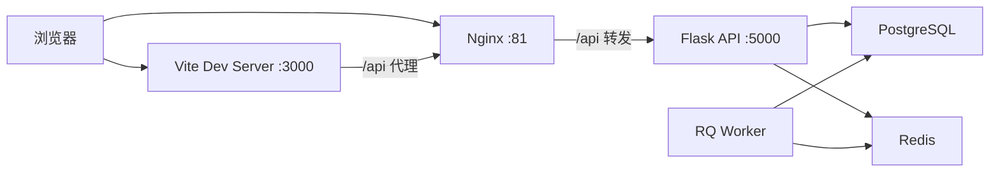

# 技术栈与架构说明

本文档描述 `cubic3-data-platform` 当前代码实现对应的技术栈、部署形态与模块分层，作为架构基线文档使用。

## 1. 当前架构结论

项目当前是标准的前后端分离实现：

- 前端是 `React SPA`
- 后端是 `Flask REST API`
- 前端开发期通过 `Vite` 提供页面
- Docker 部署时由 `Nginx` 镜像托管构建阶段内置的 `frontend/dist`
- 后端不再承担页面模板渲染职责

这意味着仓库中任何“Jinja 页面主导”或“混合 SSR/CSR 是现状”的说法，都不再是当前实现基线。

## 2. 部署拓扑



说明：

- 开发模式通常走 `Browser -> Vite -> /api 代理 -> Nginx/Flask`
- Docker 模式通常走 `Browser -> Nginx -> Flask`
- `frontend/dist` 是 Nginx 托管前端的静态产物，由 `docker/nginx.Dockerfile` 在镜像构建阶段生成
- `APScheduler` 注册在 Web 进程中，RQ Worker 只消费长耗时任务

## 3. 技术栈

### 3.1 前端

| 类别 | 当前实现 |
|---|---|
| 框架 | React 18 |
| 语言 | TypeScript 5 |
| 构建工具 | Vite 5 |
| 路由 | React Router DOM 6 |
| 服务端状态 | TanStack Query 5 |
| HTTP | Axios |
| UI 基础组件 | Radix UI primitives |
| 业务组件 | `frontend/src/components/business` 自定义封装 |
| 编辑器 | Monaco Editor |
| 图表 | Recharts |
| 关系建模画布 | `@xyflow/react` + ELK |
| 图标 | Lucide React |

当前代码中没有以下依赖作为主栈：

- `antd`
- `@ant-design/icons`
- `zustand`

因此，任何“前端基于 Ant Design 5 / Zustand / pnpm”的文档描述，都不是现行基线。

### 3.2 后端

| 类别 | 当前实现 |
|---|---|
| Web 框架 | Flask 3.0 |
| ORM 封装 | Flask-SQLAlchemy 3.1 |
| 数据迁移 | Flask-Migrate |
| 配置校验 | Pydantic 2 |
| 依赖注入 | dependency-injector |
| 认证 | PyJWT |
| 异步任务 | RQ |
| 定时任务 | APScheduler |
| SQL 解析 | sqlparse |
| LLM | OpenAI 兼容适配层 |

### 3.3 数据与外部集成

| 类别 | 当前实现 |
|---|---|
| 主库 | PostgreSQL |
| 缓存 / 队列 | Redis |
| 数据源适配 | PostgreSQL / MySQL / ClickHouse / MaxCompute |
| 消息协同 | 飞书 |
| 大文件交付 | OSS |
| BI 截图 | Superset |

## 4. 后端分层结构

```text
app/
├── application/          # 应用层
│   ├── datasource/
│   ├── dataset/
│   ├── extraction/
│   ├── query/
│   ├── query_execution/
│   ├── conversation/
│   ├── semantic/
│   └── services/
├── domain/               # 领域层
│   ├── entities/
│   ├── events/
│   ├── query_execution/
│   ├── ports/
│   ├── semantic/
│   └── services/
├── infrastructure/       # 基础设施层
│   ├── adapters/
│   ├── repositories/
│   ├── cache/
│   ├── tasks/
│   ├── query_execution/
│   ├── semantic/
│   └── events/
├── interfaces/api/       # API 层
└── di/                   # 依赖注入
```

对应关系：

- `interfaces/api/v1/*` 暴露 HTTP 接口
- `application/*` 承担命令、查询、处理器与编排服务
- `domain/*` 承担实体、端口和领域规则
- `infrastructure/*` 对接数据库、Redis、外部服务、生产 SQL Registry 与本地语义 YAML fixture 仓库

这是典型的 `Hexagonal Architecture + DDD + CQRS 风格拆分`。

### 4.1 双层语义架构补充

当前平台在原有 `Cube` 分析语义层之上，新增了收缩版业务语义层骨架（内部实现为 `Ontology`），以及三类最小中间能力：

- `业务语义层（内部实现为 Ontology Layer）`
  - `BusinessObject`
  - `BusinessProperty`
  - `BusinessMetric`
  - `Glossary / Alias`
- `对齐检查（内部实现为 Semantic Mapper）`
  - 只读投影
  - 一致性检测
  - stale / impact 告警
- `执行预览（内部实现为 Execution Compiler Preview）`
  - 伪 SQL 与执行计划预览
- `语义路由与执行规划（内部实现为 Semantic Router / Planner）`
  - 基于对象、关系、动作、业务指标和最小意图词的多意图路由
  - 输出 `cube / knowledge / hybrid / tool / blocked` 路由结果
  - 输出 `planning_mode`、多步 planning steps、`dependencies`、`expected_outputs` 与最小可回溯执行计划
  - 已补入最小真实执行入口：`/api/v1/semantic-router/execute-plan`
- `Metric Federation`
  - `BusinessMetric -> Measure / Cube` 双向追踪
  - `Measure -> BusinessMetric` 反向引用查询
  - `Cube -> Object / Metric` 反向引用查询
  - Measure 引用 stale 检测与一致性摘要
- `Relation / Action Projection Preview`
  - `BusinessRelation -> Join Path`
  - `BusinessAction -> Event Fact Cubes`
  - 关系/动作投影的最小 stale 校验
- `统一执行预览（内部实现为 Execution Compiler）`
  - 统一预览 `SQL / Retrieval / Tool Call`
  - 统一输出执行预览与计划预览结构
  - 已补入最小运行时入口：`/api/v1/execution-compiler/execute`
  - 当前支持 `SQL / Retrieval / Tool` 的最小真实执行，其中 `Tool` 仅开放只读工具链
  - `execute` 会附带统一 `governance_trace` 与 `audit_trace_id`，记录命中策略、角色、目标与执行状态
- `语义权限（内部实现为 Policy Metadata）`
  - 支持对象 / 动作 / 业务指标的最小语义权限声明
  - 语义路由与执行预览基于服务端解析出的 `PrincipalContext` 和 RoleBinding 返回 `allow / blocked`
  - `Policy Impact` 可汇总受影响分析实体、治理挂点状态与当前问题清单
- `Agent-ready Access Governance`
  - `/api/v1/agent/semantic/plan` 已固定为 Agent-first Runtime 入口，API 层和 `AgentPlanHandler` 统一注入 `runtime_mode=official`
  - official Runtime 只读取 active SQL runtime snapshot manifest 中的 published `Ontology` 与 published `Cube` `spec`：先做业务语义命中，再通过 Binding 编译到 Cube 执行目标；draft、Proposal 和 YAML 同名资产不得 fallback；诊断类 `/semantic-router/*` 仍保留 preview 能力
  - Bearer、API Key 和飞书委托入口统一归一为 `PrincipalContext`；正式 `/api/v1/agent/semantic/plan` 不信任请求体角色、JWT 角色声明和 `viewer_roles`，诊断类 preview API 仅可用 `viewer_roles` 做沙盒预演
  - `Semantic Mapper` 稳定输出 `projection_result / resolved_bindings / binding_status / binding_issues`，只做只读 Binding，不定义第三套 mapping 真相源
  - `Execution Compiler` 输出 `logical_sql / resource_set / sql_hash / data_level / ticket_material / bindings / traceability`；运行时 SQL 必须由 `QueryDSL -> QueryCompiler` 生成，基础维度分组与时间过滤不能绕开 DSL；stale measure、非 active Cube、策略阻断都会返回 blocked 的标准 `CompiledTarget`
  - `/api/v1/agent/semantic/plan` 只生成 `TicketPreview`，`enforcement=preview_only`，不作为 gateway 执行凭证
  - `/api/v1/agent/semantic/execute` 在 `allow` 决策下生成 `ExecutionTicketSnapshot` 并提交带 `QueryDSL v1` 治理快照的 `query_execution_jobs`；`approval_required / deny` 不创建 job
  - `Query Execution Worker` 只读取 job、ticket snapshot、`governance_snapshot.query_dsl`、DataSource 和已编译 SQL，不读取 Ontology / Cube YAML，也不做语义决策；执行态支持 lease 续租、过期恢复、取消下沉、可重试提交和续租失败停止处理
  - 查询结果写入 `query_result_objects` 与共享 spool 目录；Web API 通过 `/api/v1/query-execution/jobs/<query_id>` 提供状态、事件、结果和取消能力
  - SQL Lab 保留为数据开发人员使用的同步异构数据源查询工具面，不强制迁入 `ExecutionTicketSnapshot + async job` 协议
  - 权限职责边界固定为 data-platform 负责 `Principal / PermissionPackage / RoleBinding / DataPolicy / PolicyDecision / GatewayAccessContextPreview`，`dw-query-gateway` 负责接收可信 `GatewayAccessContext`、SQL guard 与 `CredentialBinding`，MaxCompute 负责 RAM / ACL 物理兜底；data-platform 不保存真实 RAM 凭据；gateway 到 MaxCompute 的落地方案见 `docs/architecture/access-gateway-maxcompute-ram.md`
  - `/semantic-router/execute-plan` 与 `/execution-compiler/execute` 已补 M3/raw/ODS 拦截，返回 `require_approval` 且不真实执行
  - 治理审计默认写入 PostgreSQL `governance_audit_traces`，支持按 `principal_id / semantic_plan_id / sql_hash / decision / policy` 查询
- `建模助手 Agent`
  - 新增 `/api/v1/semantic/modeling-agent/spec-draft`、`draft-from-spec`、`validate`、`agent-ready-check`、`apply`、`publish`，由应用层 `SemanticModelingAgent` 编排 Cube 草稿与 Ontology 草稿生成
  - `SemanticModelingAgentSpec` 只作为构建输入、用户确认材料和审计快照，不作为运行时语义源
  - `agent-ready-check` 用于构建页沙盒确认 Cube 已可执行、Ontology 已发布且业务指标能绑定真实 Cube Measure；它不替代正式 `/api/v1/agent/semantic/plan`
  - 默认只发布 Cube；Ontology 必须经业务语义确认后显式发布，正式 Agent 问数链路仍只消费已发布 Ontology
- `SQL Registry / Release / Runtime Snapshot`
  - 生产语义资产事实源为 PostgreSQL SQL Registry，覆盖 asset、revision、dependency、release、release asset 和 runtime snapshot
  - Publish Gate 采用生产 profile，覆盖 runtime schema、binding、policy、sensitivity 和 runtime compile；`confidential / restricted` 需要 approval
  - rollback 创建新的 release，并生成新的 active snapshot，不复活旧 snapshot
  - YAML 仅保留为本地 fixture、示例 seed 和调试导出，不作为生产双写或离线迁移输入
- `Domain 业务上下文`
  - `Domain` 收窄为业务主题、资产组织、默认上下文、候选范围和 Agent 提示的承载对象
  - 新增 `/api/v1/semantic/domains/<domain_id>/context-preview`，用于预览该业务上下文下候选 Cube、Ontology 引用和沙盒 Agent 上下文
  - `Domain` 不作为第三套语义真相源；指标、关系、动作和权限真相仍归属 `Ontology`，分析执行真相仍归属 `Cube`

当前前端已把这条主链收口到顶层构建任务流与两个工作台的最小联动：

- `建模助手 Agent` 位于 `/semantic/modeling-agent/new`，作为语义中心顶层任务流，不归属于 `/semantic/cubes/new`
- `业务语义工作台` 可从对象投影视图直接跳到 `语义工作台 / Cube 管理`
- `语义工作台` 可从 Cube 标题区回看来源业务对象
- stale / impact 告警已在 `业务语义工作台` 收口为可定位的实体提示
- `业务语义工作台` 的对象 / 关系 / 动作 / 业务指标页已接入运行时路由预演，可直接展示 `route_type`、`planning_mode`、多意图命中结果、planning steps 与 traceability
- `业务语义工作台` 的权限页已支持影响范围说明和真实治理挂点预演，可直接展示服务端 `PrincipalContext` 与 RoleBinding 在语义路由、执行预览上的 `allow / blocked` 结果与原因
- `业务语义工作台` 的权限页已接入 `Policy Impact` 治理影响总览，可集中查看受影响的 Cube / Measure / Event Cube、治理挂点状态与当前问题列表
- `业务语义工作台` 的业务指标页与权限页已接入统一执行预览，可直接查看编译产物、Bindings、Traceability 与执行计划
- `业务语义工作台` 的权限页已接入“最近治理执行结果”卡片，可直接查看真实执行下的 `governance_trace`、命中策略与执行状态
- `业务语义工作台` 已补入统一的“发布 / 影响 / 历史”面板，可直接消费 `/publish`、`/impact`、`/history` 结果
- `业务语义工作台` 的权限页已补入“最近审计记录”，可直接查看 `/api/v1/ontology/policies/<name>/audit` 返回的策略命中历史
- `业务语义工作台` 的治理链已可回看 `/api/v1/governance/audit-traces` 返回的最近审计记录列表，并支持按 `decision / route_type` 做最小筛选
- `业务语义工作台` 的“发布 / 影响 / 历史”面板已补入最近一次发布失败的内联反馈，发布阻断不再只通过 toast 呈现
- `业务语义工作台` 已补入订单域模板预览与一键应用入口，可直接消费 `/api/v1/ontology/templates/order-domain` 与 `/apply`，快速生成订单域对象、属性、业务指标、关系、动作、术语与权限基线
- `业务语义工作台` 总览页已补入 Agent 预演面板，可调用 `/api/v1/agent/semantic/plan` 查看 route、compiled SQL、policy decision 与 `preview_only` ticket
- `建模助手 Agent` 页面已补入 Agent-ready 检查，可在草稿发布前查看 Cube / Ontology 状态、指标绑定和真相源边界
- 智能问数后端消息主链已优先尝试走语义路由与统一执行运行时，仅在未命中或执行失败时回退 Agent / 传统 LLM
- 智能问数后端消息主链已开始生成并返回 `semantic_plan` 相关上下文；当前 v2 前端 `/data-chat` 仍是 Placeholder，完整聊天界面尚未恢复。
- `Cube` 激活时已补入最小业务语义优先准入校验：对 `certified=true` 的 Measure，必须存在至少一个 `BusinessMetric.measure_refs` 反向引用
- 业务语义资产发布链已收紧：业务指标、关系、动作、权限在发布前会额外校验依赖对象是否已激活、是否具备最小投影依据，校验失败会直接阻断发布

当前阶段明确不做：

- 独立 Mapping 工作台
- 完整 Policy 执行引擎

这意味着平台当前采用的是“业务语义真相源 + 分析执行真相源 + 只读投影与预览 + 最小路由骨架 + 最小统一执行编译层”的收缩版双层语义架构。
当前已进入 Phase 7/8 的最小落地区间：在保持对齐检查只读投影定位不变的前提下，平台已经具备 `Metric Federation`、`Relation / Action Projection Preview`、最小语义路由、统一执行预览与最小运行时执行，以及最小语义权限、`governance_trace`、PostgreSQL 审计、发布/影响/历史查询链、订单域模板基线和 Agent-ready 规划预演；但尚未进入 gateway 真实 ticket、防重放、RAM 身份切换、脱敏/血缘联动与最终产品化阶段。

## 5. 前端结构

```text
frontend/src/
├── main.tsx              # v2-only 挂载入口
└── v2/
    ├── App.tsx           # Provider 装配
    ├── routes.tsx        # v2 路由总表
    ├── api/              # 按业务域划分的接口封装
    ├── hooks/            # TanStack Query hooks
    ├── layout/           # AppShell / TopBar / Sidebar / Inspector
    ├── components/       # 通用组件与 ui primitives
    ├── pages/            # 页面级路由
    ├── styles/           # tokens.css + Tailwind 入口
    ├── i18n/             # zh/en 文案
    └── observability/    # 前端观测事件与 sink
```

当前页面主干：

- `/dashboard`
- `/data-center/*`
- `/extraction/*`
- `/queries`
- `/queries/*`
- `/data-chat`（当前 v2 占位）
- `/apps` / `/executions`
- `/config/*`
- `/settings`
- `/semantic/ontology`
- `/semantic/modeling-agent/new`（建模助手 Agent）
- `/semantic/workbench`（语义诊断）
- `/semantic/cubes`
- `/semantic/domains`
- `/login`

说明：

- 首页工作台不再由前端拼装多组统计请求，统一消费 `/api/v1/dashboard/overview`
- 查询中心旧入口 `/queries/editor`、`/queries/templates` 只保留兼容重定向；`/queries/history`、`/queries/visual`、`/queries/my`、`/queries/scheduled`、`/queries/exports` 是当前有效子路由
- 语义中心当前以 `/semantic/modeling-agent/new` 作为建模助手 Agent 顶层任务流，以 `/semantic/ontology` 作为业务语义主入口，覆盖对象、指标、关系、治理和工作台总览；`/semantic/workbench` 当前承接语义诊断 / DevTools
- `/semantic/cubes`、`/semantic/domains`、`/semantic/views/:name` 继续作为物理语义资产、业务上下文资产画布与 View 入口
- `/semantic/cubes/new`、`/semantic/cubes/:name/edit` 当前保留为真实 v2 页面；`/semantic/tools`、`/semantic/overview` 等旧别名会重定向到当前入口
- v2 路由/API 详细审计见 [quality/frontend-v2-route-api-audit.md](quality/frontend-v2-route-api-audit.md)

其中数据中心当前基线为：

- 数据源：`PostgreSQL`、`MaxCompute`
- 数据集注册：`physical / virtual / file`
- 文件数据集：`CSV / XLS / XLSX`

## 6. 当前接口分区

后端当前已注册的主 API 分组包括：

- `/health`
- `/api/docs`
- `/api/v1/auth`
- `/api/v1/data-center/datasources`
- `/api/v1/data-center/datasets`
- `/api/v1/dashboard`
- `/api/v1/extraction`
- `/api/v1/queries`
- `/api/v1/sql_lab`
- `/api/v1/conversations`
- `/api/v1/files`
- `/api/v1/semantic`
- `/api/v1/semantic/modeling-agent`
- `/api/v1/ontology`
- `/api/v1/semantic-mapper`
- `/api/v1/semantic-router`
- `/api/v1/execution-compiler`
- `/api/v1/agent`
- `/api/v1/query-execution`
- `/api/v1/apps`
- `/api/v1/app-instances`
- `/api/v1/app-executions`
- `/api/v1/channels`
- `/api/v1/subscriptions`
- `/api/v1/feishu`

需要特别注意：

- `/api/docs/openapi.json` 是当前唯一 OpenAPI 输出入口：由 Flask `url_map` 扫描生成路径，再通过轻量显式元数据补充核心接口的 request / response schema、Agent 风险字段和权限语义；不通过 FastAPI 或重新注册路由生成第二套契约。
- 第一阶段 Agent-ready 契约强制覆盖数据源元数据读取、语义路由预演、执行编译预览、治理审计查询和 `/api/v1/agent/semantic/plan` official Runtime 主入口。
- Agent 自动调用准入以 OpenAPI 扩展字段为准：只有 `x-side-effect=none`、`x-requires-confirmation=false` 且权限范围明确的接口可作为自动调用候选；预览、执行、发布、写入、删除类接口即使可读 schema，也必须由 Agent 按风险字段走确认或仅生成计划。
- 健康检查路径是 `/health`，不是 `/api/v1/health`
- 数据中心 API 使用 `/api/v1/data-center/*`
- 首页工作台聚合 API 使用 `/api/v1/dashboard/overview`
- 登录页通过 `/api/v1/auth/login` 和 `/api/v1/auth/feishu/*`
- 业务语义 / 对齐检查 / 执行预览相关接口当前分别承接：
  - `/api/v1/ontology/*`：业务对象、属性、业务指标、术语注册与读取
  - `/api/v1/ontology/policies`：最小语义权限定义与查询
  - `/api/v1/semantic-mapper/*`：只读投影预览、一致性报告、stale 检查、Measure 反向引用
  - `/api/v1/semantic-router/*`：最小语义路由、执行路径规划与回溯预览
  - `/api/v1/execution-compiler/*`：统一的 SQL / Retrieval / Tool 执行预览、计划预览与最小运行时执行
  - `/api/v1/agent/semantic/plan`：Agent-first official Runtime 主入口，返回 `runtime_mode / business_intent / projection_result / resolved_bindings / compiled_targets / policy_decision / semantic_trace` 与 preview-only ticket
  - `/api/v1/agent/semantic/execute`：Agent-first 查询执行入口，生成受治理的 async query execution job
  - `/api/v1/query-execution/*`：统一查询执行面，提供 job 状态、事件、结果和取消能力
- `/api/v1/semantic/modeling-agent/*`：建模助手 Agent 的构建期接口，负责从事实表和业务意图生成、校验、Agent-ready 检查、保存并按范围发布 Cube + Ontology 草稿；不被正式 Agent 运行时直接读取
- `/api/v1/semantic/domains/<domain_id>/context-preview`：Domain 业务上下文预览接口，只返回候选范围和 Agent 沙盒提示，不作为执行时 Join 或指标真相源
- `/semantic/ontology`：业务语义工作台前端首期版本，已覆盖对象、属性、关系、动作、业务指标、术语、语义权限的最小建模与投影预览

其中与 Phase 2 直接相关的已实现接口包括：

- `/api/v1/ontology/metrics/<name>/links`
- `/api/v1/semantic-mapper/measure-backlinks`

与 Phase 3 直接相关的已实现接口包括：

- `/api/v1/ontology/relations`
- `/api/v1/ontology/actions`

与 Phase 4 直接相关的已实现接口包括：

- `/api/v1/semantic-router/route`
- `/api/v1/semantic-router/plan`
- `/api/v1/semantic-router/execute-plan-preview`
- `/api/v1/semantic-router/execute-plan`
- 其中 `plan` 结构已稳定化，补齐 `dependencies / expected_outputs / execution_targets / step_key`

与 Phase 5 直接相关的已实现接口包括：

- `/api/v1/execution-compiler/compile-preview`
- `/api/v1/execution-compiler/plan-preview`
- `/api/v1/execution-compiler/execute`
- `业务语义工作台` 运行时面板已接入 `execute-plan`，可查看最近执行结果、审计记录与执行回溯
- `/api/v1/ontology/<entity>/<name>/publish`
- `/api/v1/ontology/<entity>/<name>/impact`
- `/api/v1/ontology/<entity>/<name>/history`
- `/api/v1/ontology/policies/<name>/audit`
- `/api/v1/governance/audit-traces`
- `/api/v1/governance/audit-traces/<id>`

与 Phase 6 直接相关的已实现接口包括：

- `/api/v1/ontology/policies`
- `/api/v1/semantic-router/route`：支持按 `PrincipalContext` 做对象 / 动作 / 业务指标的最小权限阻断
- `/api/v1/execution-compiler/compile-preview`：支持按 `PrincipalContext` 返回 `allow / blocked`

与 Agent-ready Phase 1 直接相关的已实现接口包括：

- `/api/v1/agent/semantic/plan`
- `/api/v1/agent/semantic/execute`
- `/api/v1/query-execution/jobs/<query_id>`
- `/api/v1/semantic-router/execute-plan`：命中 `M3/raw/ods` 时返回 `require_approval`，不真实执行
- `/api/v1/execution-compiler/execute`：命中 `M3/raw/ods` 时返回 `require_approval`，不真实执行
- `/api/v1/governance/audit-traces`：支持按 `principal_id / semantic_plan_id / sql_hash / decision / route_type / policy` 查询

## 7. 语义层落地方式

语义层不只是一组接口，还包含仓库内的 YAML 定义、SQL 构建期状态与运行时服务：

- `app/infrastructure/semantic/catalogs/`
- `app/infrastructure/semantic/cubes/`
- `app/infrastructure/semantic/domains/`
- `app/infrastructure/semantic/views/`
- `app/infrastructure/semantic/recipes/`

建模 Copilot 的 session 与 Proposal 是构建期协作状态，生产默认写入 PostgreSQL，而不是写入本地 YAML：

- `semantic_modeling_agent_sessions`
- `semantic_modeling_proposals`
- `SEMANTIC_MODELING_COPILOT_STORE=sql` 为默认生产路径
- `SEMANTIC_MODELING_COPILOT_STORE=yaml` 仅用于本地开发、fixture 或迁移前诊断

当前内置语义内容偏教育/学习分析场景，例如：

- `student`
- `question`
- `knowledge`
- `answer_records`
- `study_sessions`

当前语义对象边界同时固定为：

- `Cube` 是分析执行真相源，`Ontology` 是业务语义真相源；正式 Agent 问数链路只消费已发布 Ontology，并通过投影绑定到 Cube 执行。
- `Domain` 是收窄后的业务上下文和资产组织对象，用于承载业务主题、候选 Cube、本体引用、默认上下文和 Agent 提示；它不是第三套真相源。
- v2 当前由 `Cube 创建 / 编辑` 页面与语义诊断工作台共同承接 `选数据源 -> 生成草稿 -> 微调 -> 调试 -> 发布` 的开发流；`Cube 管理` 负责正式资产浏览与修订入口。
- `Domain.cubes[]` 与业务上下文资产画布只作为 `Cube <-> Domain` 资产归属 / 候选范围的事实；同一个 Cube 可以被多个业务上下文引用。
- Domain 画布只展示业务上下文中的 Cube 资产组织和候选范围，不再维护 Join / 关系边；执行 Join 只存在于 `Cube.joins`，业务关系只存在于 `Ontology BusinessRelation`。
- `Cube.domain_id` 仅保留为兼容投影字段，用于列表和详情摘要，不反向驱动领域关系持久化。
- 已发布 Cube 不直接在资产页裸改；前端通过 `POST /api/v1/semantic/cubes/<cube_name>/revisions` 创建修订草稿，再回流工作台继续开发。
- `View` 在工作台和摘要接口层按“特殊 Cube”收敛，继续走详情、编译与物化链路，但不升格为一级导航。
- `Recipe` 保持轻量消费对象，主要通过详情和 `DevTools` 提供示例与上下文，不进入正式建模工作流。
- 当前不支持“同一领域内重复实例化同一个 Cube 且使用不同 Join 条件”的高级建模能力。

所以它既是一个通用数据平台，也是一个带有教育分析语义资产沉淀的业务平台。

## 8. 启动与交付方式

### 8.1 Docker

`docker-compose.yml` 当前同时构建后端镜像和 Nginx 镜像；`docker/nginx.Dockerfile` 会在镜像构建阶段执行前端打包，并把 `frontend/dist` 内置到 Nginx 镜像中。

这意味着：

- `docker compose up --build -d` 会刷新后端与前端静态资源
- 若只复用旧 Nginx 镜像，可能继续拿到过期前端，需要单独执行 `docker compose build nginx`
- Nginx 仅对 `/assets/*` 这类带 hash 的静态资源使用长期缓存；业务路由 fallback 到 `index.html` 时必须 `no-store`，避免浏览器用旧 HTML 加载不存在的动态 chunk
- `deploy.sh` 已包含前端构建步骤，适合部署场景

### 8.2 本地开发

典型方式：

1. `flask --app wsgi.py run`
2. `cd frontend && npm run dev`
3. `python run_worker.py`

职责分工：

- Web 进程：提供 API，初始化 `APScheduler`，注册固定周期目录同步等调度入口
- RQ Worker：消费目录同步、数据集同步、提取执行等长耗时任务
- Docker / 本地环境的目标都是“支撑联调与验证”，不是一键部署收口

默认 Vite 端口是 `3000`，不是 `5173`。

## 9. 架构与文档对齐结论

本仓库已完成以下方向的演进：

- 从“可能存在的混合页面模式”收敛到 React SPA
- 从“前端 UI 方案摇摆”收敛到 Radix primitives + 自定义业务组件
- 从“脚本和端口不统一”收敛到 `npm`、`3000`、`/health`、`/api/docs`
- 从“概念式架构描述”收敛到与代码目录一致的分层结构

若需要追溯历史迁移过程，请查看历史文档；若需要理解当前实现，请以本文档和代码为准。
