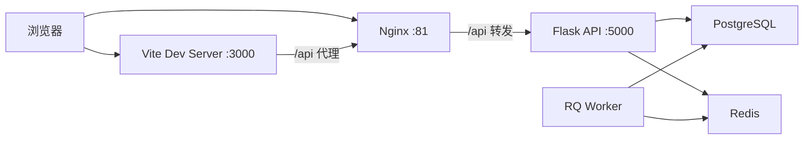

# 技术栈与架构说明

本文档描述 `cubic3-data-platform` 当前代码实现对应的技术栈、部署形态与模块分层，作为架构基线文档使用。

## 1. 当前架构结论

项目当前是标准的前后端分离实现：

- 前端是 `React SPA`
- 后端是 `Flask REST API`
- 前端开发期通过 `Vite` 提供页面
- Docker 部署时由 `Nginx` 直接托管 `frontend/dist`
- 后端不再承担页面模板渲染职责

这意味着仓库中任何“Jinja 页面主导”或“混合 SSR/CSR 是现状”的说法，都不再是当前实现基线。

## 2. 部署拓扑



说明：

- 开发模式通常走 `Browser -> Vite -> /api 代理 -> Nginx/Flask`
- Docker 模式通常走 `Browser -> Nginx -> Flask`
- `frontend/dist` 是 Nginx 托管前端的静态产物，需先执行 `npm run build`

## 3. 技术栈

### 3.1 前端

| 类别 | 当前实现 |
|---|---|
| 框架 | React 18 |
| 语言 | TypeScript 5 |
| 构建工具 | Vite 5 |
| 路由 | React Router DOM 6 |
| 服务端状态 | TanStack Query 5 |
| HTTP | Axios |
| UI 基础组件 | Radix UI primitives |
| 业务组件 | `frontend/src/components/business` 自定义封装 |
| 编辑器 | Monaco Editor |
| 图表 | Recharts |
| 关系建模画布 | `@xyflow/react` + ELK |
| 图标 | Lucide React |

当前代码中没有以下依赖作为主栈：

- `antd`
- `@ant-design/icons`
- `zustand`

因此，任何“前端基于 Ant Design 5 / Zustand / pnpm”的文档描述，都不是现行基线。

### 3.2 后端

| 类别 | 当前实现 |
|---|---|
| Web 框架 | Flask 3.0 |
| ORM 封装 | Flask-SQLAlchemy 3.1 |
| 数据迁移 | Flask-Migrate |
| 配置校验 | Pydantic 2 |
| 依赖注入 | dependency-injector |
| 认证 | PyJWT |
| 异步任务 | RQ |
| 定时任务 | APScheduler |
| SQL 解析 | sqlparse |
| LLM | OpenAI 兼容适配层 |

### 3.3 数据与外部集成

| 类别 | 当前实现 |
|---|---|
| 主库 | PostgreSQL |
| 缓存 / 队列 | Redis |
| 数据源适配 | PostgreSQL / MySQL / ClickHouse / MaxCompute |
| 消息协同 | 飞书 |
| 大文件交付 | OSS |
| BI 截图 | Superset |

## 4. 后端分层结构

```text
app/
├── application/          # 应用层
│   ├── datasource/
│   ├── dataset/
│   ├── extraction/
│   ├── query/
│   ├── conversation/
│   ├── semantic/
│   └── services/
├── domain/               # 领域层
│   ├── entities/
│   ├── events/
│   ├── ports/
│   ├── semantic/
│   └── services/
├── infrastructure/       # 基础设施层
│   ├── adapters/
│   ├── repositories/
│   ├── cache/
│   ├── tasks/
│   ├── semantic/
│   └── events/
├── interfaces/api/       # API 层
└── di/                   # 依赖注入
```

对应关系：

- `interfaces/api/v1/*` 暴露 HTTP 接口
- `application/*` 承担命令、查询、处理器与编排服务
- `domain/*` 承担实体、端口和领域规则
- `infrastructure/*` 对接数据库、Redis、外部服务和语义 YAML 仓库

这是典型的 `Hexagonal Architecture + DDD + CQRS 风格拆分`。

## 5. 前端结构

```text
frontend/src/
├── api/                  # 按业务域划分的接口封装
├── components/
│   ├── ui/               # 通用 UI primitives
│   ├── business/         # 表格、弹窗、表单等业务组件
│   ├── Layout/           # 应用级布局
│   ├── Semantic/         # 语义建模组件
│   └── Chat/             # 智能问数组件
├── pages/                # 页面级路由
├── hooks/                # 自定义 Hook
├── lib/                  # 前端领域工具
├── types/                # 类型定义
└── App.tsx               # 总路由
```

当前页面主干：

- `/dashboard`
- `/data-center/*`
- `/queries/*`
- `/data-chat`
- `/apps` / `/executions`
- `/config/*`
- `/semantic/*`
- `/login`

## 6. 当前接口分区

后端当前已注册的主 API 分组包括：

- `/health`
- `/api/docs`
- `/api/v1/auth`
- `/api/v1/data-center/datasources`
- `/api/v1/data-center/datasets`
- `/api/v1/extraction`
- `/api/v1/queries`
- `/api/v1/sql_lab`
- `/api/v1/conversations`
- `/api/v1/files`
- `/api/v1/semantic`
- `/api/v1/apps`
- `/api/v1/app-instances`
- `/api/v1/app-executions`
- `/api/v1/channels`
- `/api/v1/subscriptions`
- `/api/v1/feishu`

需要特别注意：

- 健康检查路径是 `/health`，不是 `/api/v1/health`
- 数据中心 API 使用 `/api/v1/data-center/*`
- 登录页通过 `/api/v1/auth/login` 和 `/api/v1/auth/feishu/*`

## 7. 语义层落地方式

语义层不只是一组接口，还包含仓库内的 YAML 定义与运行时服务：

- `app/infrastructure/semantic/catalogs/`
- `app/infrastructure/semantic/cubes/`
- `app/infrastructure/semantic/domains/`
- `app/infrastructure/semantic/views/`
- `app/infrastructure/semantic/recipes/`

当前内置语义内容偏教育/学习分析场景，例如：

- `student`
- `question`
- `knowledge`
- `answer_records`
- `study_sessions`

所以它既是一个通用数据平台，也是一个带有教育分析语义资产沉淀的业务平台。

## 8. 启动与交付方式

### 8.1 Docker

`docker-compose.yml` 当前只构建后端镜像，前端由宿主机上的 `frontend/dist` 提供给 Nginx。

这意味着：

- `docker compose up --build -d` 之前，若 `frontend/dist` 不存在或过期，需要先在本地执行 `cd frontend && npm run build`
- `deploy.sh` 已包含前端构建步骤，适合部署场景

### 8.2 本地开发

典型方式：

1. `flask --app wsgi.py run`
2. `cd frontend && npm run dev`
3. `python run_worker.py`

默认 Vite 端口是 `3000`，不是 `5173`。

## 9. 架构与文档对齐结论

本仓库已完成以下方向的演进：

- 从“可能存在的混合页面模式”收敛到 React SPA
- 从“前端 UI 方案摇摆”收敛到 Radix primitives + 自定义业务组件
- 从“脚本和端口不统一”收敛到 `npm`、`3000`、`/health`、`/api/docs`
- 从“概念式架构描述”收敛到与代码目录一致的分层结构

若需要追溯历史迁移过程，请查看历史文档；若需要理解当前实现，请以本文档和代码为准。
