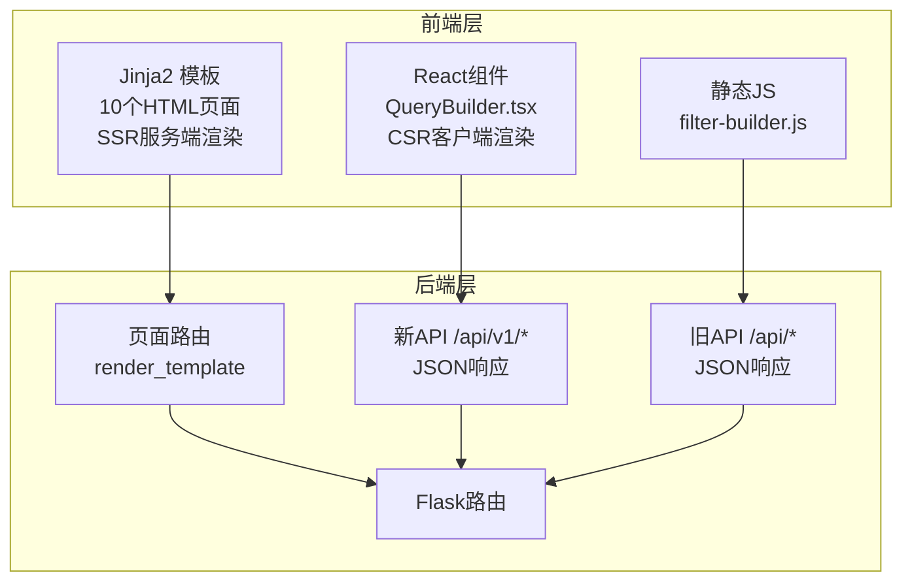
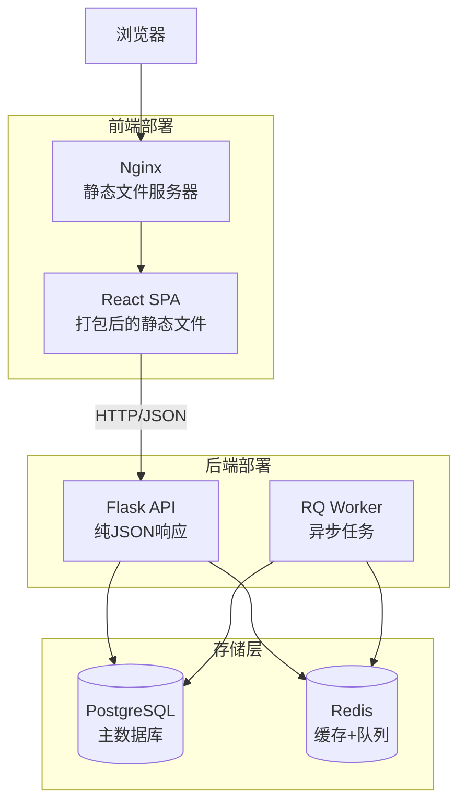

# 技术栈与架构说明

## 一、当前基础组件构成

### 后端技术栈

| 组件类型 | 技术选型 | 版本 | 用途 |
|---------|---------|------|------|
| **Web 框架** | Flask | 3.0.3 | RESTful API |
| **ORM** | SQLAlchemy | 3.1.1 | ORM（写）+ Core（读）|
| **主数据库** | PostgreSQL | 15+ | 元数据存储 |
| **缓存** | Redis | 7 | 查询缓存 + 任务队列 |
| **任务队列** | RQ | 1.15.1 | 异步任务执行 |
| **定时调度** | APScheduler | 3.10.4 | BI 看板定时推送 |
| **数据验证** | Pydantic | 2.5.0 | Schema 验证 |
| **依赖注入** | dependency-injector | 4.41.0 | DI 容器 |
| **认证** | PyJWT | 2.8.0 | JWT 认证 |
| **SQL 解析** | sqlparse | 0.5.0 | SQL 语法校验 |
| **WSGI 服务器** | Gunicorn | 23.0.0 | 生产环境 |

### 数据源驱动

| 数据源 | Python 驱动 | 用途 |
|-------|------------|------|
| MaxCompute | pyodps | 阿里云大数据计算 |
| ClickHouse | clickhouse-driver | OLAP 数据库 |
| MySQL | pymysql | 关系型数据库 |
| PostgreSQL | psycopg2 | 关系型数据库 |

### 外部集成

| 服务 | 集成方式 | 用途 |
|------|---------|------|
| 飞书开放平台 | REST API (requests) | 消息推送、文件上传 |
| 阿里云 OSS | oss2 SDK | 大文件存储 |
| Superset | REST API | 看板截图 |

---

## 二、前后端架构现状

### 当前状态：**混合架构（非纯粹前后端分离）**



### 具体情况

**前端部分**：
1. **Jinja2 模板**（10 个页面）
   - `dashboard.html` - BI 看板管理
   - `datasets_list.html` - 数据集列表
   - `datasources.html` - 数据源管理
   - `extraction_tasks.html` - 任务列表
   - `extract_new.html` - 新建提取任务
   - 等...

2. **React 组件**（1 个）
   - `frontend/QueryBuilder.tsx` - 数据查询构造器
   - 技术栈：React 18 + TypeScript + Tailwind CSS

3. **静态资源**
   - `static/css/common.css`
   - `static/js/filter-builder.js`

**后端部分**：
- Flask API（RESTful）
- 页面路由（render_template）
- 混合架构（API + 模板渲染）

### 是否前后端分离？

**答案**：**部分分离，但不完全**

- ❌ **不是纯粹的前后端分离**：
  - 大部分页面使用服务端渲染（Jinja2）
  - 前端资源由 Flask 管理和提供
  - 无独立的前端构建流程
  - 无前端路由（依赖后端路由）

- ✅ **有前后端分离的雏形**：
  - QueryBuilder.tsx 是独立的 React 组件
  - API 已按 RESTful 设计
  - 响应格式为 JSON（非 HTML）

---

## 三、推荐：完全前后端分离

### 方案：React SPA + Flask API



### 前端技术栈（推荐）

```json
{
  "框架": "React 18 + TypeScript",
  "构建工具": "Vite 5",
  "包管理": "pnpm",
  "路由": "React Router 6",
  "状态管理": "Zustand / TanStack Query",
  "UI 组件": "Ant Design 5 或 shadcn/ui",
  "样式": "Tailwind CSS",
  "HTTP": "axios 或 fetch",
  "表单": "React Hook Form + Zod",
  "图标": "Lucide React"
}
```

### 后端技术栈（已实现）

```json
{
  "Web 框架": "Flask 3.0",
  "ORM": "SQLAlchemy 3.1（ORM + Core）",
  "数据库": "PostgreSQL 15",
  "缓存": "Redis 7",
  "任务队列": "RQ 1.15",
  "数据验证": "Pydantic 2.5",
  "依赖注入": "dependency-injector 4.41",
  "认证": "JWT (PyJWT 2.8)"
}
```

### 部署架构（前后端分离）

```
用户请求
    ↓
Nginx (80/443)
    ├─ /*.js, /*.css, /*.html → 静态文件（React 构建产物）
    └─ /api/* → Flask API (5000)
         ├─ Web (Gunicorn)
         ├─ RQ Worker (×2)
         └─ Redis + PostgreSQL
```

### 迁移成本估算

| 工作项 | 工作量 | 风险 |
|-------|--------|------|
| 搭建 React 脚手架 | 1-2 天 | 低 |
| 迁移核心页面（4个） | 2-3 周 | 中 |
| 删除 Jinja2 模板 | 1 周 | 低 |
| 前端构建流程 | 2-3 天 | 低 |
| **总计** | **4-6 周** | **中等** |

---

## 四、不前后端分离的方案

### 优化现有混合架构

如果暂时不进行前后端分离，可以进行以下优化：

1. **统一前端技术栈**
   - 将所有 Jinja2 页面改为 React 组件
   - 使用 Webpack/Vite 打包静态资源
   - 但仍由 Flask 提供静态文件服务

2. **API 与页面分离**
   - `/api/*` 路由只返回 JSON
   - `/pages/*` 路由负责渲染 HTML

3. **引入前端构建工具**
   - 使用 npm/pnpm 管理前端依赖
   - 使用 TypeScript 提升类型安全

**不推荐理由**：
- 架构混乱，长期维护成本高
- 无法享受现代前端工具链（热更新、代码分割）
- 前端性能受限（无客户端路由）

---

## 五、建议

### 对于当前项目

**推荐方案**：**渐进式前后端分离**

**理由**：
1. ✅ 后端架构已重构为纯 API（六边形架构）
2. ✅ 已有 React 组件（QueryBuilder.tsx），说明团队有前端能力
3. ✅ 项目处于重构期，是引入前后端分离的最佳时机
4. ✅ 前后端分离是行业标准，便于未来扩展

**实施建议**：
- **第1阶段**（1-2周）：搭建 React SPA 脚手架
- **第2阶段**（2-3周）：迁移数据提取模块（复用 QueryBuilder）
- **第3阶段**（2-3周）：迁移其他页面
- **第4阶段**（1周）：删除 Jinja2 模板

### 如果团队前端能力有限

**备选方案**：**保持混合架构，局部优化**

- 保留 Jinja2 模板
- 引入前端构建工具（Webpack）
- 将核心交互页面改为 React 组件
- 旧页面保持 SSR

---

## 六、总结

### 当前架构特点

**类型**：混合架构（SSR + CSR）

**组成**：
- **后端**：Flask API + 页面路由
- **前端**：Jinja2 模板（主要）+ React 组件（少量）
- **部署**：单体应用（Docker）

**优点**：
- ✅ 快速开发（Jinja2 模板）
- ✅ SEO 友好（服务端渲染）
- ✅ 部分现代化（React 组件）

**缺点**：
- ❌ 架构不统一
- ❌ 前端技术栈割裂
- ❌ 难以维护
- ❌ 无法享受现代前端工具链

### 推荐的演进路径

```
当前：混合架构（SSR + CSR）
    ↓
中期：完全前后端分离（React SPA + Flask API）
    ↓
长期：微服务架构（前端 + 多个后端服务）
```

### 架构重构亮点

1. ✅ **六边形架构** - 清晰的分层，解耦依赖
2. ✅ **CQRS** - 读写分离，性能优化
3. ✅ **Entity = ORM** - 减少 42% 维护成本
4. ✅ **RQ 队列** - 轻量化，减少 96% 包大小
5. ✅ **依赖注入** - 提升可测试性
6. ✅ **Redis 缓存** - 读性能提升 3-5 倍

---

---

## 七、SQL 校验机制

### 技术选型：sqlparse

**库名称**: sqlparse  
**版本**: 0.5.0  
**用途**: SQL 语法解析和校验

### 支持的 SQL 语法

| SQL 类型 | 示例 | 支持状态 |
|---------|------|---------|
| **SELECT 查询** | `SELECT * FROM users` | ✅ 支持 |
| **WITH (CTE)** | `WITH temp AS (...) SELECT * FROM temp` | ✅ 支持 |
| **多个 CTE** | `WITH a AS (...), b AS (...) SELECT ...` | ✅ 支持 |
| **递归 CTE** | `WITH RECURSIVE cte AS (...) SELECT ...` | ✅ 支持 |
| **DDL 操作** | `DROP TABLE`, `CREATE TABLE` | ❌ 禁止 |
| **DML 操作** | `INSERT`, `UPDATE`, `DELETE` | ❌ 禁止 |

### 校验规则

1. **允许的查询类型**
   - SELECT 查询（包括子查询）
   - WITH (CTE) 查询（Common Table Expression）

2. **禁止的操作**
   - DDL: `DROP`, `CREATE`, `ALTER`, `TRUNCATE`, `RENAME`
   - DML: `INSERT`, `UPDATE`, `DELETE`, `MERGE`
   - 权限: `GRANT`, `REVOKE`

3. **安全检查**
   - 自动移除注释后进行检查
   - 使用 sqlparse 进行专业的 SQL 解析
   - 避免字符串字面量中的误判

### 实现位置

- **校验工具**: `app/shared/utils/sql_validator.py`
- **调用点1**: `app/interfaces/api/v1/sql_lab.py` (SQL Lab API)
- **调用点2**: `app/application/query/handlers/execute_query_handler.py` (查询执行)

### 使用示例

```python
from app.shared.utils.sql_validator import validate_sql_query

# 校验 CTE 查询
sql = """
WITH temp AS (
    SELECT id, name FROM users WHERE age > 18
)
SELECT * FROM temp
"""

is_valid, errors = validate_sql_query(sql)
if is_valid:
    print("✅ SQL 校验通过")
else:
    print(f"❌ SQL 校验失败: {'; '.join(errors)}")
```

### 为什么选择 sqlparse？

| 对比项 | 自定义正则 | sqlparse |
|-------|----------|----------|
| **准确性** | ❌ 容易误判 | ✅ 专业解析 |
| **维护成本** | ❌ 高 | ✅ 低 |
| **CTE 支持** | ❌ 需手动添加 | ✅ 原生支持 |
| **错误提示** | ❌ 模糊 | ✅ 精确 |
| **扩展性** | ❌ 困难 | ✅ 易扩展 |

---

**文档更新日期**: 2026-01-28
