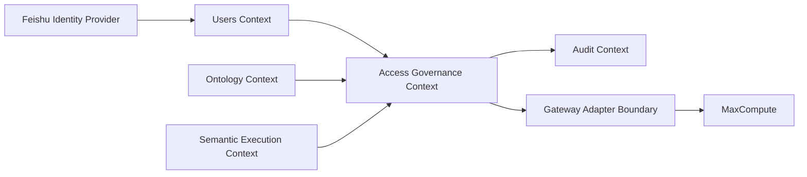
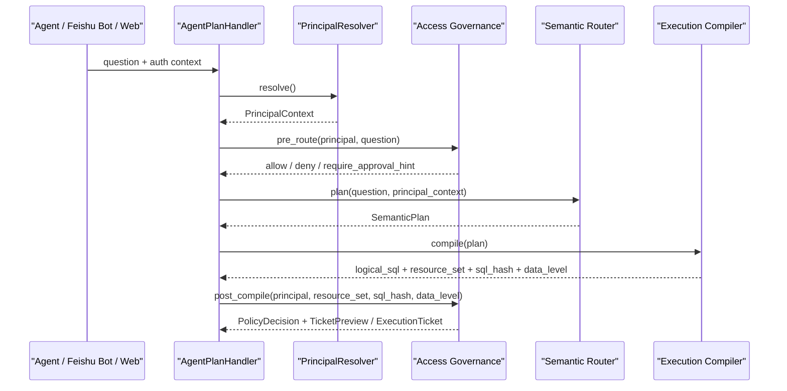

# Agent-Ready 语义与权限架构

本文档记录 `data-platform` 面向 Agent、飞书 SSO、语义层、`dw-query-gateway` 与 MaxCompute RAM 的权限体系设计。

设计原则：

- 不建设复杂本地用户中心，飞书 SSO 是身份事实来源。
- 不重做语义层，继续复用 `Semantic Router / Planner` 与 `Execution Compiler`。
- 不让 gateway 承担业务授权判断，gateway 只校验执行票据并选择 MaxCompute 执行身份。
- 不要求每个用户注册 RAM，MaxCompute 侧通过少量 RAM Role 或专用 RAM 用户做物理隔离底线。

## 1. 总体结论

推荐架构：

```text
飞书 SSO / 飞书 Bot / data-chat / dw-query skill
  -> PrincipalResolver
  -> PrincipalContext
  -> Pre-route Policy Check
  -> Semantic Router / Planner
  -> Execution Compiler
  -> Post-compile Policy Check
  -> TicketPreview / ExecutionTicket
  -> dw-query-gateway
  -> MaxCompute RAM Role / RAM User
  -> MaxCompute
```

核心分工：

| 模块 | 职责 | 不负责 |
| --- | --- | --- |
| 飞书 SSO | 认证用户、返回 open_id / union_id / 部门 / 用户组 | 表级、字段级、raw data 权限 |
| data-platform | Principal 投影、平台 RBAC、DataPolicy、PolicyDecision、审批、审计 | 直接保存 MaxCompute 密钥、直接执行生产 SQL |
| Semantic Router / Planner | 将自然语言问题映射到语义资产与执行目标 | 最终数据授权 |
| Execution Compiler | 生成 `logical_sql / resource_set / sql_hash / data_level` | 真实 MaxCompute 凭据选择 |
| dw-query-gateway | 校验 `ExecutionTicket`、防重放、SQL 安全校验、注入行列约束、选择 RAM 身份 | 飞书身份解析、业务角色判断 |
| MaxCompute | 物理执行与底层资源隔离 | Agent 上下文、审批流、业务解释 |

## 2. DDD 边界



### 2.1 Ontology Context

维护业务语义资产：

- `BusinessObject`
- `BusinessMetric`
- `BusinessRelation`
- `BusinessAction`
- `Glossary`
- `PolicyMetadata`

约束：

- `PolicyMetadata` 只表达语义资产可见性，例如某个对象或指标在工作台是否可见。
- `PolicyMetadata` 不作为真实数据访问权限。
- 真实数据访问必须进入 `Access Governance Context` 的 `DataPolicy`。

### 2.2 Semantic Execution Context

维护 Agent-ready 语义执行能力：

- `SemanticPlan`
- `ExecutionTarget`
- `Traceability`
- `resource_set`
- `logical_sql`
- `compiler_sql_hash`
- `executed_sql_hash`
- `data_level`

核心实现继续使用：

- `Semantic Router / Planner`
- `Execution Compiler`

不新增重复的 `agent-router` 或 `agent-compiler`。

### 2.3 Users Context

继续承载平台操作层面的用户与角色能力，但后续身份事实来源收敛为飞书 SSO。

当前本地 `users / roles / user_roles` 可继续服务平台管理后台；面向 Agent 与飞书用户时，新增轻量 `Principal` 投影，不强制创建完整本地用户。

### 2.4 Access Governance Context

新增或强化以下对象：

- `Principal`
- `RoleBinding`
- `DataPolicy`
- `ExecutionProfile`
- `PolicyDecision`
- `TicketPreview`
- `ExecutionTicket`

这是单体内的治理策略上下文，不拆独立服务。

实现上保持分层：

- 领域层表达 `DataPolicy / ExecutionProfile / PolicyDecision` 等规则对象。
- 应用层通过 `PrincipalResolver / AccessPolicyDecisionService` 编排策略评估。
- 基础设施层负责 PostgreSQL 仓储、飞书身份同步、后续 gateway ticket 签名适配。
- enforcement 发生在 application use case 与 gateway adapter boundary，避免领域对象直接依赖 Flask、SQLAlchemy 或 gateway 实现。
- gateway 的 SQL guard 必须基于成熟 SQL Parser / AST 重写能力，禁止使用正则或字符串拼接实现行列约束注入。

### 2.5 Audit Context

审计写入 PostgreSQL，不继续依赖 YAML 承载高频 trace。

审计至少记录：

- `principal_id`
- `actor_type / actor_id`
- `policy_decision_id`
- `semantic_plan_id`
- `sql_hash`
- `resource_set`
- `gateway_query_id`
- `maxcompute_task_id`
- `decision`
- `reason_code`
- `policy_version`

## 3. 身份模型

### 3.1 飞书是身份事实来源

data-platform 不维护密码、不做注册、不做完整用户中心。

飞书提供：

- 用户身份：`open_id / union_id`
- 租户：`tenant_key`
- 展示信息：姓名、邮箱、工号
- 组织信息：部门、用户组

data-platform 只缓存授权和审计需要的最小身份投影。

### 3.2 Principal

`Principal` 是本系统的授权主体。

建议主键：

```text
principal_id = feishu:{tenant_key}:{union_id}
```

如果暂时拿不到 `union_id`：

```text
principal_id = feishu:{tenant_key}:{open_id}
```

建议字段：

```text
principal_id
idp
tenant_key
open_id
union_id
display_name
email
employee_no
department_ids
feishu_group_ids
status
last_seen_at
raw_profile
created_at
updated_at
```

为避免 `open_id -> union_id` 迁移导致主体换号和审计断链，建议新增外部身份别名表：

```text
access_principal_aliases
  id
  principal_id
  idp
  tenant_key
  external_id_type       open_id / union_id / employee_no
  external_id
  status
  created_at
```

唯一约束：

```text
unique(idp, tenant_key, external_id_type, external_id)
```

实现必须使用 upsert 语义，避免飞书 Bot 并发消息在首次登录时重复创建 Principal。

解析优先级：

```text
union_id 命中 alias -> principal_id
open_id 命中 alias -> principal_id
均未命中 -> 创建 Principal 和 alias
```

### 3.3 Actor 与 Principal 分离

Agent 场景必须区分调用方和授权主体。

```text
principal = 权限按谁计算
actor = 谁实际发起调用
```

示例：

| 场景 | actor | principal |
| --- | --- | --- |
| Web 用户直接操作 | user | 当前用户 |
| 飞书 Bot 单聊问数 | feishu_bot | 当前飞书用户 |
| dw-query skill 代表用户调用 | agent_skill | 当前用户 |
| 系统调度任务 | system | service principal |

审计中同时记录 `actor` 与 `principal`，但数据权限默认按 `principal` 判断。

## 4. 角色模型

权限分三层：

```text
Feishu Group / Department
  -> RoleBinding
  -> PlatformRole / DataRole
  -> DataPolicy
```

### 4.1 PlatformRole

`PlatformRole` 控制平台操作权限，不控制数据访问。

建议角色：

| 角色 | 说明 |
| --- | --- |
| `platform_admin` | 平台管理员 |
| `semantic_admin` | 语义中心管理员 |
| `semantic_modeler` | 语义建模人员 |
| `semantic_reviewer` | 语义发布审核人员 |
| `governance_admin` | 权限治理管理员 |
| `auditor` | 审计查看人员 |
| `viewer` | 普通查看人员 |

示例平台权限：

```text
semantic.view
semantic.model
semantic.publish
policy.manage
audit.view
```

### 4.2 DataRole

`DataRole` 控制数据访问等级和数据行为。

建议角色：

| 角色 | 说明 |
| --- | --- |
| `data_m0_reader` | 可看公开摘要 |
| `data_m1_reader` | 可查 DWS / ADS 聚合 |
| `data_m2_detail_reader` | 可查受控 DWD 明细 |
| `data_m3_requester` | 可发起 raw data 审批 |
| `data_m3_approved_reader` | 审批通过后临时可查 raw data |
| `data_exporter` | 可导出结果 |

### 4.3 RoleBinding

`RoleBinding` 将飞书部门、飞书用户组或单个 Principal 映射到平台角色和数据角色。

建议字段：

```text
id
subject_type       principal / feishu_department / feishu_group / manual_group
subject_key
role_code
role_type          platform / data
source             feishu_sync / manual
effective_from
effective_to
status
created_by
created_at
```

建议默认用飞书用户组做授权入口，飞书部门只用于较粗的人群映射。

## 5. DataPolicy 设计

`DataPolicy` 决定谁能在什么条件下访问什么数据。

### 5.1 数据结构

```text
policy_id
policy_code
name
effect              allow / deny / require_approval
priority
subjects
actions
resources
data_level
row_scope
column_scope
execution_profile
approval_rule
status
version
created_by
updated_by
created_at
updated_at
```

### 5.2 Subjects

优先绑定 `DataRole`，避免直接绑定个人。

```json
{
  "data_roles": ["data_m1_reader"],
  "platform_roles": [],
  "principals": [],
  "feishu_groups": []
}
```

`platform_roles` 只作为过渡兼容字段，不推荐作为数据授权入口；新增策略应优先绑定 `data_roles`。

### 5.3 Actions

`DataPolicy` 的 `actions` 只表达数据行为，不表达平台建模、发布、审计管理等操作。

建议数据动作：

```text
query.preview
query.execute
query.export
approval.request
```

Agent 查询至少需要：

- `query.preview`
- 命中执行时需要 `query.execute`

其中 `semantic.view / semantic.model / semantic.publish / policy.manage / audit.view` 继续由平台 RBAC 判断，不进入 `DataPolicy` 的数据动作集合。

### 5.4 Resources

资源选择器要同时支持语义资源和物理资源。

```json
{
  "domains": ["study"],
  "cubes": ["study_session_cube"],
  "metrics": ["active_student_count"],
  "tables": ["dws_study_session_df"],
  "columns": ["school_id", "student_id", "session_count"],
  "tags": ["student", "pii"]
}
```

`Execution Compiler` 必须输出可治理的 `resource_set`，不要让权限系统靠 SQL 字符串猜资源。

为支持多 MaxCompute project、跨数据源和 RAM 双模式，`resource_set` 的物理资源必须使用结构化数组，而不是裸表名字符串：

```json
{
  "logical": {
    "domains": ["study"],
    "cubes": ["study_session_cube"],
    "metrics": ["active_student_count"]
  },
  "physical": [
    {
      "data_source_id": "mc_prod",
      "engine": "maxcompute",
      "project": "dw_prod",
      "schema": "",
      "table": "dws_study_session_df",
      "columns": ["school_id", "student_id", "session_count"],
      "data_level": "M1",
      "tags": ["student"]
    }
  ]
}
```

gateway 校验资源时以 `data_source_id + project + schema + table + column` 为最小比较键，避免同名表误判。

### 5.5 数据等级

| 等级 | 范围 | 默认策略 |
| --- | --- | --- |
| `M0` | 公开摘要、知识检索，不查 MaxCompute | allow |
| `M1` | `dim / dws / ads` 聚合或维表 | `data_m1_reader` 可执行 |
| `M2` | `dwd` 受控明细 | `data_m2_detail_reader` 且强制行列范围 |
| `M3` | `ods / raw / high-sensitive` | 必须审批 |

### 5.6 Row Scope

行级范围使用结构化约束表达，不直接保存 SQL 片段。

```json
{
  "type": "organization_scope",
  "field": "school_id",
  "operator": "in",
  "source": "principal.data_scope.school_ids"
}
```

`Execution Compiler` 只负责 preview / simulation，展示将会追加的行级约束。

真实执行时，gateway 是唯一最终注入点：

```text
DataPolicy -> row_scope / column_scope
Execution Compiler -> preview 展示
ExecutionTicket -> 签名携带 scope
gateway -> 最终 SQL guard 与 scope 注入
```

这样可以避免 compiler 和 gateway 双写约束导致 `sql_hash` 口径漂移。

`row_scope` 在 `PolicyDecision` 生成时必须已经求值为具体值，不允许在 ticket 中携带运行时表达式。

例如策略模板可以引用：

```text
principal.data_scope.school_ids
```

但进入 ticket 前必须变成：

```json
{
  "field": "school_id",
  "operator": "in",
  "values": [101, 202]
}
```

求值责任在 `AccessPolicyDecisionService`，gateway 只消费具体约束值，不解析飞书部门、用户组或业务权限表达式。

### 5.7 Column Scope

字段级范围支持：

```text
allow
deny
mask
```

示例：

```json
{
  "deny": ["user_phone", "id_card_no"],
  "mask": [
    {
      "column": "student_name",
      "mask_type": "partial"
    }
  ]
}
```

### 5.8 策略冲突

多条策略命中时采用固定优先级：

```text
deny > require_approval > allow
```

同一 `effect` 内按 `priority` 数值小者优先。策略评估异常时必须 fail closed。

## 6. ExecutionProfile 设计

`ExecutionProfile` 是后续适配 gateway 和 MaxCompute RAM 的关键抽象。

`DataPolicy` 不直接绑定 RAM 账号，只选择 `execution_profile_code`。

```text
DataPolicy
  -> PolicyDecision
  -> execution_profile_code
  -> ExecutionTicket
  -> gateway
  -> RAM Role / RAM User
  -> MaxCompute
```

### 6.1 字段

```text
profile_code
name
data_level
credential_mode        ram_role / ram_user / gateway_default
credential_ref
max_rows
timeout_seconds
export_allowed
result_ttl_seconds
audit_level            normal / strong / strict
approval_required
status
```

### 6.2 建议 Profile

| Profile | 数据等级 | 执行约束 |
| --- | --- | --- |
| `mc_m1_agg_reader` | M1 | 聚合查询，允许较高行数，可按角色允许导出 |
| `mc_m2_controlled_reader` | M2 | 明细查询，强制行列范围，默认禁止导出 |
| `mc_m3_raw_approved` | M3 | raw data，必须审批，短 TTL，强审计，禁止导出 |
| `mc_admin_maintenance` | 运维 | 仅平台维护任务使用，不给 Agent 使用 |

### 6.3 RAM Role 与 RAM User 兼容

优先选择 RAM Role：

```json
{
  "profile_code": "mc_m2_controlled_reader",
  "credential_mode": "ram_role",
  "credential_ref": "acs:ram::123456789:role/mc-m2-controlled-reader"
}
```

如果 MaxCompute 或企业 RAM 集成限制导致 AssumeRole 不可行，则退化为专用 RAM 用户：

```json
{
  "profile_code": "mc_m2_controlled_reader",
  "credential_mode": "ram_user",
  "credential_ref": "mc_m2_controlled_reader_user"
}
```

data-platform 的 `DataPolicy` 不需要变化，只修改 `ExecutionProfile` 配置和 gateway 的凭据解析器。

约束：

- `gateway_default` 不对 Agent 暴露，只允许本地开发、运维 smoke 或明确受控的系统任务使用。
- Agent 查询必须使用显式 `ram_role` 或 `ram_user` profile。

## 7. 两阶段权限判断



### 7.1 Pre-route

检查：

- Actor 是否可信，例如飞书 Bot、data-chat 后端、dw-query skill 是否通过内部 JWT、API Key 或 mTLS 完成服务到服务鉴权。
- Principal 是否有效。
- 是否有 `query.preview` 入口权限。
- 是否能看到候选 Domain / Cube。
- 是否明显请求 raw data。

Actor 只能代表当前认证链路中已解析出的 Principal 发起请求，不能由客户端任意传入 `principal_id` 冒充用户。

Pre-route 可以粗粒度拒绝，但不做最终 SQL 级授权。

### 7.2 Post-compile

输入：

- `semantic_plan_id`
- `logical_sql`
- `sql_hash`
- `resource_set`
- `data_level`
- `columns`
- `tables`
- `traceability`

检查：

- 资源是否全部在授权范围内。
- 字段是否命中敏感标签。
- 是否需要 row scope。
- 是否需要 column scope。
- 是否允许导出。
- 是否需要审批。
- 选择哪个 `ExecutionProfile`。

## 8. PolicyDecision

标准响应：

```json
{
  "decision_id": "pd_xxx",
  "effect": "allow",
  "reason_code": "m1_reader_allowed",
  "message": "当前用户具备 M1 聚合查询权限。",
  "principal_id": "feishu:tenant:ou_xxx",
  "actor_type": "feishu_bot",
  "actor_id": "bot_xxx",
  "data_level": "M1",
  "matched_policies": ["policy_m1_reader"],
  "row_scope": {},
  "column_scope": {},
  "execution_profile": "mc_m1_agg_reader",
  "requires_approval": false,
  "approval_available": false,
  "required_roles": [],
  "suggestions": [],
  "safe_alternatives": []
}
```

M3 示例：

```json
{
  "decision_id": "pd_xxx",
  "effect": "require_approval",
  "reason_code": "m3_raw_requires_approval",
  "principal_id": "feishu:tenant:ou_xxx",
  "data_level": "M3",
  "matched_policies": ["policy_m3_approval_required"],
  "execution_profile": null,
  "requires_approval": true,
  "approval_available": true,
  "required_roles": ["data_m3_requester"],
  "suggestions": [
    {
      "type": "request_approval",
      "label": "发起 raw data 审批",
      "action": "approval.request"
    }
  ],
  "safe_alternatives": [
    {
      "type": "rewrite_query",
      "label": "改查 DWS 聚合指标",
      "target_data_level": "M1"
    }
  ]
}
```

Agent 友好要求：

- 不只返回 `403`。
- 必须返回 `reason_code`。
- 必须返回是否可申请审批。
- 尽量返回可替代建议，例如改查聚合指标、换用受控 Cube、缩小范围。
- 所有 `deny / require_approval / blocked` 路径同构返回 `PolicyDecision`，避免 Agent 为不同接口写多套错误解析。

建议 `reason_code` 枚举：

```text
principal_invalid
entry_permission_denied
semantic_asset_not_visible
resource_not_allowed
column_mask_required
export_not_allowed
m3_raw_requires_approval
approval_missing
approval_expired
execution_profile_not_allowed
policy_evaluation_failed
```

## 9. Ticket 设计

### 9.1 TicketPreview

Phase 1 只生成不可执行 preview。

```json
{
  "type": "ticket_preview",
  "enforcement": "preview_only"
}
```

规则：

- `TicketPreview` 不允许升级为真实 ticket。
- gateway 必须拒绝 `preview_only`。
- 真实执行前必须重新执行 Post-compile Policy Check。

### 9.2 ExecutionTicket

Phase 3 gateway 联动后生成真实 ticket。

必含字段：

```text
ticket_id
jti
principal_id
actor_type
actor_id
semantic_plan_id
policy_decision_id
policy_version
execution_profile
resource_set
sql_hash
logical_sql
logical_sql_ref
row_scope
column_scope
export_allowed
issued_at
expires_at
signature
signature_alg
approval_id
```

真实执行请求契约：

```json
{
  "ticket": "signed_execution_ticket",
  "request_options": {
    "limit": 1000
  }
}
```

信任边界：

- gateway 执行使用的 `logical_sql` 必须来自签名 ticket payload，或由 `logical_sql_ref` 指向的可信服务端 plan material 解析获得。
- 客户端请求中的 SQL 不进入信任边界；如果调试接口允许传入 SQL，也只能用于展示或辅助比对，不能作为执行依据。
- Phase 3 初期推荐 ticket 直接内嵌签名后的 `logical_sql`；`logical_sql_ref` 作为长 SQL 或对象存储优化路径。

签名覆盖：

```text
jti
principal_id
semantic_plan_id
policy_decision_id
policy_version
execution_profile
resource_set
sql_hash
logical_sql
row_scope
column_scope
export_allowed
approval_id
issued_at
expires_at
```

gateway 接收请求后：

```text
logical_sql = ticket.logical_sql 或 resolve(ticket.logical_sql_ref)
canonical_or_ast_hash(logical_sql) -> computed_sql_hash
computed_sql_hash == ticket.sql_hash
logical_sql 访问资源属于 ticket.resource_set 子集
gateway 注入 row_scope / column_scope
gateway 选择 execution_profile 对应 RAM 身份
gateway 按 ExecutionProfile.max_rows 重新裁剪 limit
```

客户端传入的 `request_options.limit` 不进入信任边界，gateway 不能信任客户端 limit。

`logical_sql_ref` 可选，用于记录 data-platform 内部 plan material 或对象存储引用；gateway 不依赖它做授权判断。

M3 要求：

- `approval_id` 必填。
- `execution_profile = mc_m3_raw_approved`。
- TTL 更短。
- `audit_level = strict`。
- M3 ticket 默认一次性使用，`jti` 使用后立即标记 consumed。
- `approval_id` 与 `ExecutionTicket` 默认 1:1 绑定，ticket 生成后审批结果标记 consumed，不允许反复生成 ticket。
- gateway 执行 M3 ticket 前，需要通过 Redis 或 data-platform 审批状态接口确认 `approval_id` 未被撤回、未过期且未消费。

Preview 与 execute 隔离：

- `TicketPreview` 只能用于展示，不产生执行凭证。
- 真实执行必须重新执行 Post-compile Policy Check。
- `PolicyDecision` 建议区分 `decision_type = preview / execute`；执行端只接受 `execute` 类型决策，不复用 preview 阶段的 `policy_decision_id`。

### 9.3 安全规则

- 短 TTL。
- HMAC-SHA256 或非对称签名。
- gateway 使用 Redis TTL 记录 `jti` 防重放。
- M2/M3 ticket 使用后应将 `jti` 标记为 consumed；M3 必须一次性使用。
- gateway 拒绝 `preview_only`。
- gateway 重新计算 canonical logical SQL hash。
- SQL 引用资源必须是 `resource_set` 子集。
- gateway 注入的行列过滤不参与原始 `sql_hash`。

## 10. SQL Hash Canonical 规则

`sql_hash` 只针对 compiler 输出的 `logical_sql` 或等价 logical plan，不包含 gateway 注入的行列过滤。

优先采用基于 SQL Parser 的 AST / Logical Plan hash，而不是纯文本 hash。文本归一只能作为辅助兼容路径。

AST / Logical Plan hash 规则：

- 使用成熟 SQL Parser 解析 compiler 输出 SQL。
- 将 AST 中的表、字段、谓词、聚合、Join、Limit 等关键节点做稳定序列化。
- 去除注释、空白、keyword 大小写等纯格式差异。
- 对语义等价的过滤条件顺序做规范化。
- 对无法稳定解析的 SQL fail closed，不进入真实执行。

gateway 校验时先从 ticket payload 或可信 `logical_sql_ref` 获取 compiler logical SQL，再计算 hash；gateway 自身注入的行列过滤不参与原始 hash。

真实执行 SQL 分层：

```text
compiler logical_sql            -> 参与 sql_hash
gateway scoped_sql              -> 真实执行，不重新定义原始 hash
gateway audit executed_sql_hash -> 可选，用于记录最终执行 SQL
```

## 11. Gateway 适配设计

### 11.1 gateway 不理解业务权限

gateway 只信任 `ExecutionTicket`，不直接解析飞书用户、平台角色或 DataPolicy。

gateway 校验：

```text
signature
jti
expires_at
policy_version
resource_set
sql_hash
execution_profile
approval_id
```

`policy_version` 使用全局单调递增版本号。gateway 维护 `min_accepted_policy_version`，低于该版本的 ticket 一律拒绝，不降级执行。策略撤销、降级或高敏策略变更后，应推进最小可接受版本，使存量 ticket 在下次请求自然失效。

为减少误伤：

- 常规新增 allow 策略不必推进全局最小版本。
- 高敏策略撤销、M3 审批策略变化、ExecutionProfile 降级或 RAM 凭据轮换时必须推进。
- 后续可将失效粒度细化到 `execution_profile`、Domain 或 Principal 级别；Phase 3 初期先用全局版本配合短 TTL 保持简单。

### 11.2 Credential Provider

gateway 内部新增：

```text
ExecutionProfileCredentialProvider
  -> resolve(profile_code)
  -> assume_role / load_ram_user
  -> build MaxCompute client
```

伪代码：

```python
profile = profile_repository.get(ticket.execution_profile)
credential = credential_provider.resolve(profile)
logical_sql = ticket.logical_sql or trusted_plan_store.resolve(ticket.logical_sql_ref)
sql = sql_guard.apply_scope(logical_sql, ticket.row_scope, ticket.column_scope)
sql = sql_guard.wrap_limit(sql, profile.max_rows)
result = maxcompute_client.execute(sql, credential)
```

`sql_guard.apply_scope` 必须基于 SQL AST 重写实现，在对应 table node 上注入行级过滤并处理字段投影、别名、子查询和 Join。禁止用字符串拼接或正则替换注入权限条件。

MaxCompute 方言解析失败、复杂 CTE / 子查询无法安全重写、字段血缘无法确认时，gateway 必须 fail closed。

`wrap_limit` 应优先使用外层包裹方式：

```sql
SELECT *
FROM (
  /* original scoped sql */
) limited_result
LIMIT <profile.max_rows>
```

避免直接改写原 SQL 的业务 `LIMIT / TOPN / 分页` 语义。

`logical_sql_ref` 生命周期必须不短于 ticket 最大 TTL；超过 TTL 后由后台任务自动 GC。若 ref 解析失败，gateway 必须拒绝执行并写入审计。

### 11.3 MaxCompute 物理隔离底线

建议 RAM 权限：

| RAM 身份 | 允许范围 |
| --- | --- |
| `mc_m1_agg_reader_role/user` | 只读 `dim / dws / ads` |
| `mc_m2_controlled_reader_role/user` | 只读受控 `dwd`，不含 `ods/raw` |
| `mc_m3_raw_approved_role/user` | 只读指定 `ods/raw`，只能由审批 ticket 激活 |
| `mc_admin_maintenance_role/user` | 运维专用，不对 Agent 暴露 |

MaxCompute RAM 是物理兜底，不替代 `DataPolicy`。

## 12. API 契约

### 12.1 Agent Plan

`POST /api/v1/agent/semantic/plan`

响应建议统一为：

```json
{
  "semantic_plan_id": "sp_xxx",
  "principal_context": {},
  "route": {},
  "compiled_targets": [],
  "policy_decision": {},
  "ticket_preview": {
    "type": "ticket_preview",
    "enforcement": "preview_only"
  },
  "traceability": {},
  "errors": []
}
```

### 12.2 Router / Compiler Preview

`semantic-router` 与 `execution-compiler` 被 Agent 调用时，需要返回同构治理字段：

```json
{
  "policy_decision": {},
  "ticket_preview": {},
  "resource_set": {
    "logical": {},
    "physical": []
  },
  "sql_hash": "sha256:xxx",
  "data_level": "M1"
}
```

即使命中阻断，也要返回结构化 `policy_decision`，便于 Agent 解释原因。

### 12.3 Runtime Execute

Phase 1：

- `/api/v1/semantic-router/execute-plan`
- `/api/v1/execution-compiler/execute`

命中 `M3 / raw / ods` 时必须返回 `require_approval`，不得真实执行。

这是过渡态。生产真实执行最终迁移到 gateway；data-platform 保留的执行端点只服务内部预览、回归验证和迁移期兼容。

Phase 3：

- 真实执行迁移到 gateway。
- data-platform 生成 `ExecutionTicket`。
- gateway 校验后执行。

## 13. 用户业务流

### 13.1 Web 语义工作台

```text
用户打开 data-platform
  -> 飞书 SSO 登录
  -> PrincipalResolver 同步 Principal
  -> 根据 PlatformRole 展示语义工作台能力
  -> 用户创建 / 修订 / 发布 Cube 或业务语义资产
  -> 发布前做语义校验与平台 RBAC 校验
```

### 13.2 Agent 问数

```text
用户在飞书 Bot / data-chat / dw-query skill 提问
  -> PrincipalResolver 解析飞书用户
  -> Pre-route 权限判断
  -> AgentPlanHandler 固定 runtime_mode=official
  -> Semantic Router 只命中已发布 Ontology（Object / Metric / Relation / Action / Glossary）
  -> Semantic Mapper 输出只读 Binding（projection_result / resolved_bindings）
  -> Execution Compiler 绑定已发布 Cube，生成 logical_sql / resource_set / sql_hash / ticket_material
  -> Post-compile 权限判断
  -> allow: 返回 SQL Preview 或执行结果
  -> require_approval: 引导审批或建议改查聚合口径
  -> deny: 返回原因和替代建议
```

### 13.3 M3 raw data

```text
用户请求 raw data
  -> Post-compile 命中 M3
  -> 返回 require_approval
  -> 用户发起审批
  -> 审批通过
  -> 重新执行 Post-compile
  -> 生成 ExecutionTicket
  -> gateway 校验 ticket
  -> gateway 选择 mc_m3_raw_approved
  -> MaxCompute 执行
  -> gateway 回写审计
```

## 14. 数据库表建议

### 14.1 目标模型

```text
access_principals
access_principal_aliases
access_role_bindings
access_data_policies
access_execution_profiles
access_policy_decisions
access_audit_events
```

这些是目标模型，不要求 Phase 1 一次性全部产品化落表。

Phase 1 优先：

- 复用现有 `governance_audit_traces`。
- 补齐 `PrincipalResolver` 与 `PrincipalContext` 的稳定 schema。
- 将 `PolicyDecision` 作为应用层结构化输出。
- `DataPolicy / ExecutionProfile` 可先以内置配置或轻量表承载。
- `access_policy_decisions / access_audit_events` 可在真实 gateway ticket 接入前再拆表。

### 14.2 access_principals

```text
principal_id PK
idp
tenant_key
open_id
union_id
display_name
email
employee_no
department_ids JSONB
feishu_group_ids JSONB
status
last_seen_at
raw_profile JSONB
created_at
updated_at
```

### 14.3 access_principal_aliases

```text
id
principal_id
idp
tenant_key
external_id_type
external_id
status
created_at
```

### 14.4 access_role_bindings

```text
id
subject_type
subject_key
role_code
role_type
source
effective_from
effective_to
status
created_by
created_at
```

### 14.5 access_data_policies

```text
id
policy_code
name
effect
priority
subjects JSONB
actions JSONB
resources JSONB
data_level
row_scope JSONB
column_scope JSONB
execution_profile_code
approval_rule JSONB
status
version
created_by
updated_by
created_at
updated_at
```

### 14.6 access_execution_profiles

```text
profile_code PK
name
data_level
credential_mode
credential_ref
max_rows
timeout_seconds
export_allowed
result_ttl_seconds
audit_level
approval_required
status
```

### 14.7 access_policy_decisions

```text
decision_id PK
principal_id
actor_type
actor_id
request_id
semantic_plan_id
sql_hash
resource_set JSONB
effect
reason_code
matched_policies JSONB
row_scope JSONB
column_scope JSONB
execution_profile_code
policy_version
created_at
```

### 14.8 access_audit_events

```text
audit_id PK
principal_id
actor_type
actor_id
event_type
decision_id
semantic_plan_id
gateway_query_id
maxcompute_task_id
resource_set JSONB
compiler_sql_hash
executed_sql_hash
result_summary JSONB
created_at
```

建议 `event_type` 枚举：

```text
plan_preview
execute_attempt
execute_success
execute_denied
approval_requested
approval_granted
approval_expired
approval_revoked
ticket_consumed
```

## 15. 默认策略

第一版内置策略：

| 策略 | 规则 |
| --- | --- |
| P0 | 未登录或 Principal 无效，一律 deny |
| P1 | `viewer` 可查看 M0 语义摘要 |
| P2 | `data_m1_reader` 可执行 M1 聚合查询 |
| P3 | `data_m2_detail_reader` 可执行 M2 明细查询，但必须注入 row scope / column scope |
| P4 | M3 一律 `require_approval` |
| P5 | 没有 `data_exporter` 不允许导出 |
| P6 | 命中 `pii / student_sensitive` 标签默认 mask 或 deny |
| P7 | policy evaluation 异常时 fail closed |
| P8 | `platform_admin` 如果没有对应 `DataRole`，数据查询一律 deny |
| P9 | 低于 `min_accepted_policy_version` 的 ticket 一律拒绝 |

## 16. 分阶段落地

### Phase 1：data-platform 内部闭环

目标：当前阶段只改 data-platform。

- `PrincipalResolver` 支持飞书 SSO principal。
- `viewer_roles` 只做兼容输入，统一归一为 `PrincipalContext`。
- 新增或强化 `DataPolicy / ExecutionProfile / PolicyDecision`。
- `Execution Compiler` 输出 `resource_set / logical_sql / sql_hash / data_level`。
- `/api/v1/agent/semantic/plan` 返回统一治理 envelope。
- 现有真实执行端点补 M3 拦截。
- 审计落 PostgreSQL。

### Phase 2：权限产品化

- 飞书用户组 / 部门到角色的映射页面。
- DataPolicy 配置页面。
- ExecutionProfile 配置页面。
- PolicyDecision 查询页面。
- Audit 查询页面。
- 做 MaxCompute RAM Role vs 专用 RAM 用户 PoC。

### Phase 3：gateway 联动

- data-platform 生成真实 `ExecutionTicket`。
- gateway 校验签名、jti、防重放、policy_version、resource_set、sql_hash、execution_profile。
- gateway 按 `credential_mode` 选择 Assume RAM Role 或专用 RAM 用户。
- gateway 回写审计。
- M3 必须绑定审批结果和专用 profile。

### Phase 4：skill 迁移

- `dw-query skill` 优先调用 `AgentPlanHandler`。
- 本地业务知识库逐步迁移到 `Ontology / Glossary / BusinessMetric / Cube`。
- `maxcompute-cli` 保持薄客户端，只做登录、会话、gateway 调用和结果获取。

## 17. 测试计划

- `PrincipalResolver`：飞书 SSO、JWT、旧 `viewer_roles` 都能归一到 `PrincipalContext`。
- `RoleBinding`：飞书用户组和部门能映射到 `PlatformRole / DataRole`。
- `PolicyDecision`：Pre-route 与 Post-compile 两阶段结果正确。
- M3 拦截：现有真实执行端点遇到 raw data 返回 `require_approval`。
- `TicketPreview`：永远带 `enforcement=preview_only`，gateway 不接受。
- `ExecutionProfile`：同一个 DataPolicy 可切换 `ram_role / ram_user`，不影响策略判断。
- `sql_hash`：compiler 和 gateway 对同一 logical SQL 生成一致 hash。
- SQL hash 契约样例：基于 SQL AST / Logical Plan 覆盖标识符引用、keyword 大小写、空白归一、过滤条件顺序、子查询格式化。
- Gateway SQL guard：验证复杂 Join、子查询、字段别名、字段裁剪、外层 limit 包裹和拒绝无法解析 SQL。
- Actor 鉴权：未通过内部 JWT、API Key 或 mTLS 的 actor 不能代入 Principal。
- M3 ticket：验证 `jti` 一次性、`approval_id` 1:1 consumed、审批撤回后拒绝执行。
- Audit：支持按 principal、decision、plan、policy、gateway query id 查询。
- RAM PoC：验证 AssumeRole 与专用 RAM 用户两条路径的权限隔离和审计差异。
- 回归入口：`make verify-semantic`；gateway 接入后增加 ticket E2E smoke。

## 18. 风险与取舍

### 18.1 风险

| 风险 | 影响 | 应对 |
| --- | --- | --- |
| 飞书用户组同步延迟 | 用户权限变化不能即时生效 | 登录时增量刷新，关键权限变更支持手动刷新 |
| 直接复用 `g.user_id` 数字模型 | 飞书 principal 可能触发类型错误 | 区分 `principal_id` 与 `platform_user_id` |
| gateway 误信 preview ticket | 可能绕过审批执行 | gateway 明确拒绝 `preview_only` |
| RAM 权限过宽 | gateway bug 时越权 | RAM 按 M1/M2/M3 做物理隔离 |
| SQL hash 不稳定 | 合法查询被拒或非法查询绕过 | 固化 canonical 规则并加契约测试 |
| platform_admin 默认看全量数据 | 管理权与数据权混淆 | RBAC 与 DataPolicy 强制分离 |

### 18.2 原则应用

- `KISS`：飞书做身份，本地只做最小 Principal 投影。
- `YAGNI`：当前不引入 OPA、不做复杂用户中心、不做每用户 RAM。
- `SOLID`：认证、角色映射、数据策略、执行票据、gateway 执行身份分离。
- `DRY`：旧 `viewer_roles` 只在 `PrincipalResolver` 兼容，不在各 API 重复解释。

## 19. 当前定案

当前推荐定案：

```text
身份源：飞书 SSO
本地用户：只做 Principal 投影，不做完整用户中心
平台权限：PlatformRole / RBAC
数据权限：DataPolicy
执行身份：ExecutionProfile
执行凭证：ExecutionTicket
物理隔离：MaxCompute RAM Role 或专用 RAM 用户
审计主键：principal_id + policy_decision_id + compiler_sql_hash
M3：必须审批
```

禁止项：

- 不要求每个用户注册 RAM。
- 不把飞书用户组直接等同于数据权限最终结果。
- 不让 `platform_admin` 默认拥有所有数据访问权。
- 不让 Agent 绕过语义层直接拼 raw SQL。
- 不把 `TicketPreview` 升级为真实 `ExecutionTicket`。
