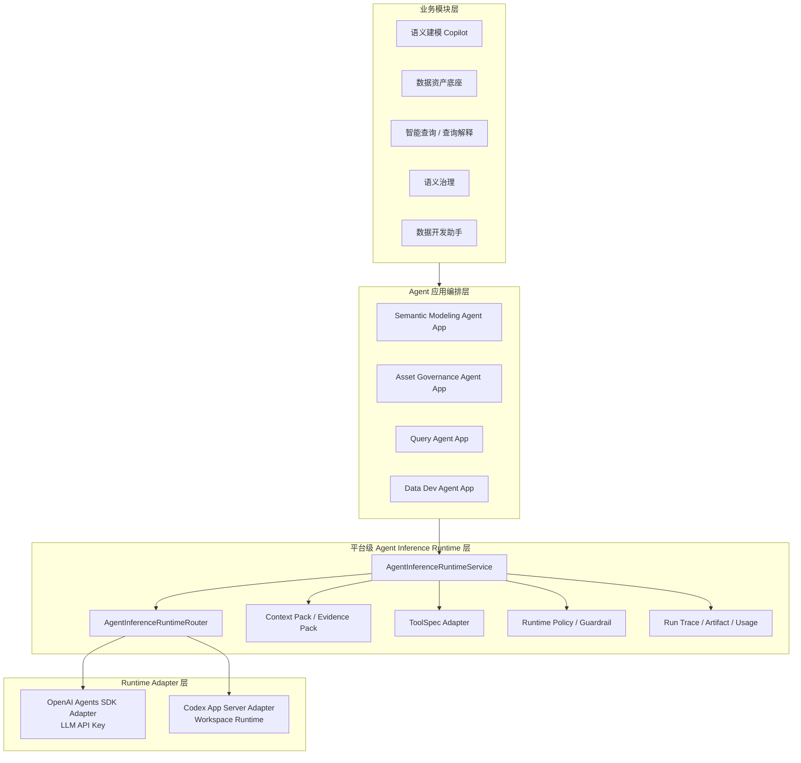
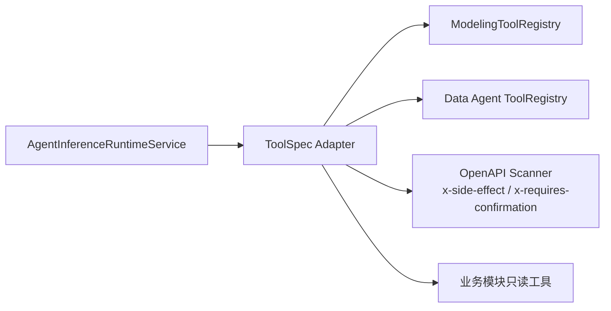
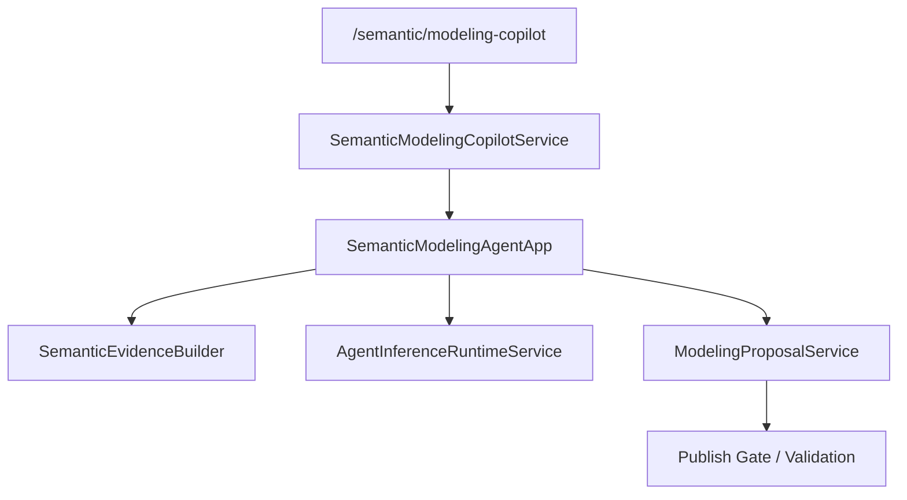

# 平台级 Agent 推理 Runtime 目标架构

本文定义 Cubic3 数据平台的统一 Agent 推理 Runtime 目标设计。它是跨业务模块复用的生成式推理与工作区任务能力层，不是语义中心或建模助手的私有实现。

当前实现仍以语义建模 Copilot 内部 runtime adapter 为主，本文描述的是已确认的目标架构和迁移方向。实现落地后，应再同步更新 [TECH_STACK_AND_ARCHITECTURE.md](../TECH_STACK_AND_ARCHITECTURE.md)、[backend.md](backend.md) 与相关 ADR。

## 1. 背景与问题

平台当前同时需要两类 Agent 形态：

1. 基于 OpenAI Agents SDK 或 OpenAI-compatible LLM API Key 的在线推理 runtime。
2. 基于 Codex app-server 的工作区型 agent runtime。

这两类能力不是同一个层次的模型供应商切换，而是不同 runtime：

- OpenAI Agents SDK / LLM API 负责低延迟推理、工具调用编排、对话和候选生成。
- Codex app-server 负责长上下文、工作区、文件 / 命令 / artifact、复杂修复和复审。

如果把它们直接塞进语义建模 Copilot，会带来三个问题：

- 语义模块承担了平台 runtime 生命周期、路由、trace、artifact、错误码和权限策略，职责过重。
- 数据资产、查询、治理、数据开发等模块后续会重复实现 runtime adapter，违背 DRY。
- 当前 `OpenAIAgentsSdkAdapter` 与 LLM adapter 命名容易混淆，业务服务也会被迫理解 runtime 细节，违背接口隔离。

因此目标架构应把生成式 Agent 推理能力上提为平台级能力层。语义建模 Copilot 只是第一个业务消费者。

## 2. 设计目标

### 2.1 功能目标

- 提供统一的 `AgentInferenceRuntimeService`，支持不同业务模块按 action 调用生成式 agent runtime。
- 同时支持 OpenAI Agents SDK runtime 与 Codex app-server runtime。
- 支持统一的 request / result contract、runtime router、context pack、tool spec adapter、policy guardrail、trace、artifact、usage 与错误码。
- 让语义建模、数据资产、智能查询、治理中心、数据开发助手都能复用同一层 runtime。
- 保持业务状态和副作用由业务模块自己的应用服务控制，runtime 只返回结构化建议和 artifact。

### 2.2 非目标

- 不在第一阶段建设通用 agent marketplace。
- 不把 Codex app-server 当成普通 LLM provider。
- 不让 runtime adapter 直接发布 Cube、修改 Ontology、写资产画像或执行生产查询。
- 不把 `cubic3-agent-gateway` 作为当前数据平台主链依赖；gateway 可作为未来跨产品 control-plane 参考。
- 不为每个业务模块设计一套独立 agent 协议。
- 不替代现有 `/api/v1/agent/semantic/plan` official Semantic Runtime、`QueryDSL v1`、`ExecutionTicketSnapshot` 与 QueryExecutionWorker 治理执行链。

### 2.3 与 official Semantic Runtime 的边界

项目里已经存在 Agent-first official Semantic Runtime，负责从已发布 `Ontology / Cube / Policy` 生成治理后的计划、编译 `QueryDSL v1`、签发执行票据并进入查询执行面。本文新增的是生成式推理 runtime，职责是解释、候选生成、复审、修复建议和工作区 artifact。

两者边界固定如下：

| 层 | 代表入口 / 服务 | 负责 | 不负责 |
|---|---|---|---|
| Official Semantic Runtime | `/api/v1/agent/semantic/plan`、`AgentPlanHandler`、`Execution Compiler`、`QueryExecutionWorker` | 正式查询规划、治理、票据、执行 | 调 LLM、Codex 工作区修复、长上下文复审 |
| Agent Inference Runtime | `AgentInferenceRuntimeService`、OpenAI / Codex adapter | 生成式推理、结构化建议、review / repair artifact | 发布语义资产、签发执行票据、绕过 QueryDSL 治理 |

查询类 action 可以调用 Agent Inference Runtime 做意图解释、结果解释或失败修复建议，但正式执行仍必须回到 official Semantic Runtime。

## 3. 总体架构



分层原则：

- 业务模块层面向用户和业务对象。
- Agent 应用编排层负责把业务意图转成 agent action、context pack、tool scope 和 output schema。
- 平台级 Agent Inference Runtime 层负责生成式 runtime 选择、生命周期、通用治理和可观测性。
- Runtime Adapter 层只负责连接具体 runtime，不携带业务状态写入逻辑。

## 4. 分层职责

| 层级 | 职责 | 不负责 |
|---|---|---|
| 业务模块层 | 产品入口、用户操作、业务状态展示 | runtime 生命周期、provider 差异 |
| Agent 应用编排层 | 业务 action、上下文构建、结果解释、业务校验 | 通用 runtime 路由、底层进程管理 |
| Agent Inference Runtime 层 | 统一 contract、router、policy、trace、artifact、usage、错误码 | Cube 发布、资产画像入库、查询执行、执行票据签发 |
| Runtime Adapter 层 | 调用 OpenAI Agents SDK、LLM API 或 Codex app-server | 业务决策、平台状态修改 |

## 5. 业务消费者

### 5.1 语义建模 Copilot

首个落地消费者。主要 action：

- `semantic.modeling.chat`
- `semantic.modeling.generate_candidate`
- `semantic.modeling.review_proposal`
- `semantic.modeling.repair_validation_failure`
- `semantic.modeling.explain_publish_blocker`

OpenAI runtime 承担低延迟主链，Codex runtime 承担复审、复杂修复和长上下文分析。

### 5.2 数据资产底座

主要 action：

- `asset.profile.explain`
- `asset.field.infer_semantics`
- `asset.quality.explain_issue`
- `asset.lineage.summarize_usage`

资产模块提供表画像、字段画像、血缘、SQL 使用记录和质量问题作为 context pack，runtime 返回解释、候选标签和治理建议。资产事实仍由资产服务写入。

### 5.3 智能查询

主要 action：

- `query.intent.classify`
- `query.plan.explain`
- `query.result.explain`
- `query.failure.repair_suggestion`

正式查询执行仍走已发布 Ontology、Cube、Policy、ExecutionTicket 和 QueryExecutionWorker。Agent Inference Runtime 只做推理和解释，不绕开治理执行面。

### 5.4 语义治理

主要 action：

- `governance.policy.explain`
- `governance.impact.summarize`
- `governance.audit.find_risk`
- `governance.release.review`

Codex runtime 适合处理大批量 release diff、复杂依赖和长上下文审计。治理结论必须进入平台审核和发布门禁。

### 5.5 数据开发助手

主要 action：

- `data_dev.sql.review`
- `data_dev.lineage.explain`
- `data_dev.task.failure_diagnose`
- `data_dev.schema_drift.suggest_fix`

它可以复用 Codex app-server 的工作区能力，但不能直接改 DataWorks 生产任务。修复产物应作为建议或 patch artifact 进入人工确认链路。

## 6. Runtime 类型定位

| Runtime | 本质 | 适合 | 不适合 |
|---|---|---|---|
| OpenAI Agents SDK Runtime | 在线 LLM agent runtime | 低延迟对话、候选生成、结构化输出、轻量工具调用 | 长时间任务、工作区文件操作、复杂批量修复 |
| OpenAI-compatible LLM Runtime | Chat Completions 协议兼容 fallback | 保留兼容、降低接入门槛 | 作为真实 Agents SDK 能力替代品 |
| Codex App Server Runtime | 工作区型 agent runtime | 长上下文、文件 / 命令 / artifact、复杂复审、修复建议 | 高频低延迟主对话、直接写生产状态 |

命名约束：

- `OpenAIAgentsSdkRuntimeAdapter` 必须表示真实 Agents SDK 接入。
- 仅使用 Chat Completions 协议的适配器应命名为 `OpenAICompatibleLLMRuntimeAdapter`。
- `CodexAppServerRuntimeAdapter` 表示接入 Codex app-server 的工作区 runtime。

真实 OpenAI Agents SDK 接入的验收条件：

- 依赖清单明确 SDK 包、版本范围和 import surface，不能仅依赖通用 `openai` 包后继续沿用 Chat Completions 协议。
- 若项目阶段性不引入真实 SDK，则 adapter 名称只能使用 `OpenAICompatibleLLMRuntimeAdapter`。
- fallback contract 必须显式声明：Agents SDK 不可用时是否允许降级到 compatible LLM，以及降级后哪些 tool / tracing 能力不可用。

## 7. 统一 Contract

### 7.1 AgentInferenceRuntimeRequest

```python
@dataclass(frozen=True)
class SemanticRuntimePin:
    snapshot_id: str
    release_id: str | None
    release_no: str | None


@dataclass(frozen=True)
class AssetRevisionRef:
    asset_type: str
    asset_id: str
    revision_id: str | None
    snapshot_id: str | None


@dataclass(frozen=True)
class AgentInferenceRuntimeRequest:
    run_id: str
    app_id: str
    action: str
    user_message: str | None
    context_pack: Mapping[str, Any]
    tools: Sequence["ToolSpec"]
    output_schema: Mapping[str, Any] | None
    runtime_policy: "RuntimePolicy"
    principal_context: Mapping[str, Any]
    semantic_runtime_pin: SemanticRuntimePin | None
    asset_revision_refs: Sequence[AssetRevisionRef]
    execution_mode: Literal["sync", "async"]
    idempotency_key: str
```

字段说明：

- `run_id`：平台生成的 runtime run 标识，用于审计、trace 和幂等。
- `app_id`：调用方，例如 `semantic_modeling`、`asset_governance`。
- `action`：业务 action，决定 runtime 路由和输出契约。
- `context_pack`：业务模块构建的上下文包，只读输入。
- `tools`：本次允许 runtime 使用的工具清单。
- `output_schema`：结构化输出约束。
- `runtime_policy`：超时、重试、preferred runtime、fallback、数据脱敏策略。
- `principal_context`：平台归一后的身份上下文，只用于授权和审计，不由用户请求体直接覆盖。
- `semantic_runtime_pin`：查询解释、发布复审和语义修复类 action 必须带上正式 runtime snapshot / release pin，避免基于旧 YAML、draft 或过期 release 生成不可复现建议。
- `asset_revision_refs`：数据资产、Cube、Ontology、Proposal 等输入证据的版本引用。
- `execution_mode`：低延迟 OpenAI action 可为 `sync`；Codex app-server、批量审计、长上下文复审默认必须为 `async`。
- `idempotency_key`：避免重复提交同一 runtime 任务。

### 7.2 AgentInferenceRuntimeResult

```python
@dataclass(frozen=True)
class AgentInferenceRuntimeResult:
    run_id: str
    runtime: str
    status: Literal["succeeded", "failed", "timeout", "blocked", "cancelled", "expired"]
    message: str | None
    structured_output: Mapping[str, Any] | None
    tool_calls: Sequence[Mapping[str, Any]]
    artifacts: Sequence[Mapping[str, Any]]
    semantic_runtime_pin: SemanticRuntimePin | None
    asset_revision_refs: Sequence[AssetRevisionRef]
    usage: Mapping[str, Any]
    trace: Mapping[str, Any]
    error: Mapping[str, Any] | None
```

约束：

- `structured_output` 必须通过 `output_schema` 校验后才能交给业务应用层。
- `artifacts` 只能引用平台可控存储或 app-server 返回的 artifact 元数据，不能包含密钥。
- `tool_calls` 只记录已授权工具调用意图和结果摘要，不暴露敏感原文。
- `semantic_runtime_pin` 与 `asset_revision_refs` 必须从 request 透传或由业务应用层显式补齐，便于复现输出依据。
- `error` 使用平台统一错误码。

### 7.3 AgentInferenceRuntimeRun 生命周期

低延迟 action 可以走同步调用，但平台 contract 必须同时支持异步 run。Codex app-server、批量审计、长上下文 review / repair 默认走异步，不允许阻塞 Flask Web 请求等待 600 秒级任务完成。

```python
@dataclass(frozen=True)
class AgentInferenceRuntimeRun:
    run_id: str
    app_id: str
    action: str
    runtime: str
    status: Literal[
        "queued",
        "running",
        "succeeded",
        "failed",
        "timeout",
        "cancelled",
        "expired",
    ]
    submitted_at: datetime
    started_at: datetime | None
    finished_at: datetime | None
    artifact_ready: bool
    result_ref: str | None
    error_code: str | None
```

生命周期操作：

| 操作 | 说明 |
|---|---|
| `submit` | 创建 run，写入 trace 摘要，必要时提交 RQ job 或受监管 sidecar |
| `poll` | 查询状态、进度、artifact_ready 和错误码 |
| `cancel` | 取消未完成 run，向 worker / app-server 发送取消信号 |
| `expire` | 超时或保留期结束后标记过期，清理临时 workspace |
| `read_result` | 读取已完成 run 的结构化结果和 artifact 引用 |

约束：

- OpenAI 低延迟 action 可以在 Web 请求中 `sync` 执行，但仍需写 run trace。
- Codex app-server action 默认 `async`，由 RQ worker 或受监管 sidecar 执行。
- `idempotency_key` 命中未完成 run 时返回既有 `run_id`，避免重复提交。
- 异步 run 的 artifact 权限检查必须发生在 `read_result` 阶段，而不是只在生成阶段。

## 8. Runtime 路由策略

### 8.1 默认路由

| Action 类型 | 默认 Runtime | 说明 |
|---|---|---|
| chat / explain / classify | OpenAI Agents SDK | 低延迟主链 |
| generate_candidate | OpenAI Agents SDK | 快速候选生成 |
| review / repair / audit | Codex app-server | 长上下文与复杂推理 |
| batch / workspace / file_artifact | Codex app-server | 需要工作区和 artifact |
| deterministic_state_action | 不走 runtime | 平台服务直接处理 |

### 8.2 降级策略

- OpenAI Agents SDK 不可用时，可按 action 降级到 OpenAI-compatible LLM runtime。
- Codex app-server 不可用时，不自动降级为 OpenAI 主链复审，除非 action 明确允许 `fallback_runtime=openai`。
- 发布、保存、执行查询、同步元数据等确定性动作不允许 runtime fallback。
- runtime 输出结构化校验失败时，不自动应用结果，只返回 `RUNTIME_INVALID_OUTPUT`。

### 8.3 强制策略

`RuntimePolicy` 支持：

- `preferred_runtime`
- `allowed_runtimes`
- `timeout_seconds`
- `max_runtime_seconds`
- `allow_fallback`
- `requires_workspace`
- `requires_human_confirmation`
- `redaction_profile`

## 9. Context Pack 与 Evidence Pack

Context Pack 是平台级上下文抽象，Evidence Pack 是业务证据包的一种。

| 概念 | 范围 | 示例 |
|---|---|---|
| Context Pack | runtime 的统一只读输入 | 用户意图、当前对象、历史消息、约束 |
| Evidence Pack | 业务事实证据 | 数据资产表画像、Cube、Ontology、SQL 使用记录、校验结果 |

原则：

- 业务模块负责构建业务 Evidence Pack。
- Agent Inference Runtime 层只负责统一封装、脱敏、hash、trace 和大小控制。
- runtime 不直接回查生产数据库，除非通过 ToolSpec 适配层中被授权的只读工具。
- Evidence Pack 应记录 `source_refs`、`snapshot_id`、`generated_at` 和 `input_hash`，便于复现。
- 查询解释、发布复审、语义修复等与正式执行结果相关的 action 必须携带 `semantic_runtime_pin`；资产画像和字段推断类 action 必须携带 `asset_revision_refs`。
- 当 context 来自 draft 或 Proposal 时，`semantic_runtime_pin` 可以为空，但 action schema 必须显式声明它不是正式执行依据，不能生成可执行票据。

## 10. ToolSpec 适配层

第一阶段不新增一套全局 Tool Registry。平台只定义 `ToolSpec` 端口和适配层，把现有工具注册体系投影成统一 runtime 可读的工具声明。



工具约束：

- 工具默认只读。
- 写操作必须拆成 proposal / patch / command preview，由业务服务二次确认。
- 工具声明必须包含 `tool_id`、`capability`、`input_schema`、`output_schema`、`side_effect_level`、`required_scopes`。
- Runtime Adapter 不能自行发明工具。
- 若现有工具已经通过 OpenAPI 扩展标注了 `x-side-effect`、`x-requires-confirmation` 或模块内 registry 权限，ToolSpec 适配层必须继承这些风险标注，不能降级为普通只读工具。
- Platform GA 前再评估是否需要真正的全局 Tool Registry；MVP 阶段以适配现有 registry 为准。

## 11. 状态与副作用边界

Runtime 可以产生：

- 文本解释。
- 结构化建议。
- proposal patch。
- review finding。
- repair suggestion。
- artifact。
- tool call trace。

Runtime 不能直接执行：

- 发布 Cube。
- 修改 Ontology。
- 写入资产画像正式表。
- 执行生产查询。
- 修改 DataWorks 任务。
- 绕过发布门禁。

所有副作用必须由业务应用服务基于校验后的 `AgentInferenceRuntimeResult` 发起。

## 12. 错误码

统一错误码建议：

| 错误码 | 含义 |
|---|---|
| `RUNTIME_NOT_CONFIGURED` | runtime 未配置 |
| `RUNTIME_UNAVAILABLE` | runtime 服务不可用 |
| `RUNTIME_TIMEOUT` | runtime 超时 |
| `RUNTIME_POLICY_BLOCKED` | 被 runtime policy 阻断 |
| `RUNTIME_INVALID_OUTPUT` | 结构化输出不符合 schema |
| `RUNTIME_TOOL_FORBIDDEN` | 工具未授权 |
| `RUNTIME_TOOL_FAILED` | 工具执行失败 |
| `RUNTIME_CONTEXT_TOO_LARGE` | context 超过限制 |
| `RUNTIME_SIDE_EFFECT_REJECTED` | runtime 尝试越权产生副作用 |
| `RUNTIME_ARTIFACT_UNAVAILABLE` | artifact 不可读取或过期 |

业务模块可以包装这些错误，但不能改变底层含义。

## 13. 可观测性与审计

每次 runtime 调用必须记录：

- `run_id`
- `app_id`
- `action`
- `runtime`
- `principal_id`
- `context_hash`
- `output_hash`
- `tool_call_count`
- `artifact_count`
- `latency_ms`
- `usage`
- `status`
- `error_code`

Trace 存储建议分两层：

- 热路径：PostgreSQL 表记录 run 摘要、状态、错误和 usage。
- 冷路径：artifact 存储保存大上下文、长输出、文件 patch 和复审报告。

最小持久化模型：

| 表 / 存储 | 关键字段 | 用途 |
|---|---|---|
| `agent_inference_runtime_runs` | `run_id`、`app_id`、`action`、`runtime`、`status`、`principal_id`、`semantic_snapshot_id`、`context_hash`、`output_hash`、`latency_ms`、`usage_json`、`error_code`、`created_at`、`finished_at` | run 摘要、审计、排障 |
| `agent_inference_runtime_artifacts` | `artifact_id`、`run_id`、`artifact_type`、`storage_uri`、`content_hash`、`expires_at`、`created_at` | 大上下文、复审报告、patch、工作区产物引用 |

保留策略：

- run 摘要默认随平台审计保留；artifact 默认短期保留，可按环境配置，例如本地 7 天、生产 30 天。
- artifact 不直接内嵌密钥、连接串或 AccessKey；读取 artifact 时必须重新校验 principal、app_id 和 run ownership。
- output hash 和 context hash 必须可用于复现输入输出一致性，但不要求在热表中保存完整 prompt。

## 14. 安全与权限

- Runtime Request 的身份事实只能来自平台归一后的 `PrincipalContext`。
- 用户请求体中的角色、scope、tenant 不参与授权事实。
- Context Pack 默认脱敏，密钥、AccessKey、连接串和 token 不进入 runtime。
- Codex app-server 使用项目级隔离工作区和独立 `AGENT_CODEX_RUNTIME_ROOT`。
- Runtime Adapter 不持有业务数据库写权限。
- 所有工具调用必须经过 `ToolSpec Adapter + RuntimePolicy` 校验。

## 15. 配置建议

平台级配置：

```text
AGENT_INFERENCE_RUNTIME_ENABLED=true
AGENT_INFERENCE_RUNTIME_DEFAULT=openai_agents
AGENT_INFERENCE_RUNTIME_TRACE_ENABLED=true
AGENT_INFERENCE_RUNTIME_ARTIFACT_STORE=local
```

OpenAI runtime：

```text
AGENT_OPENAI_ENABLED=true
AGENT_OPENAI_API_KEY=...
AGENT_OPENAI_BASE_URL=...
AGENT_OPENAI_MODEL=...
AGENT_OPENAI_TIMEOUT_SECONDS=30
```

Codex app-server runtime：

```text
AGENT_CODEX_ENABLED=false
AGENT_CODEX_PROJECT_ID=cubic3-data-platform
AGENT_CODEX_PROJECT_ROOT=/path/to/cubic3-data-platform
AGENT_CODEX_RUNTIME_ROOT=/path/to/cubic3-data-platform/.cubic3/agent-codex
AGENT_CODEX_TIMEOUT_SECONDS=120
AGENT_CODEX_MAX_RUNTIME_SECONDS=600
```

Codex app-server 验证通过后的运行态以本地目录为主。配置只暴露项目根和 runtime 根目录，session / thread / turn / artifact 目录由平台按 `project_id / session_id / thread_id / turn_id / run_id` 派生，避免用户手动配置多层路径。

### 15.1 Command Provider 与 Codex Runtime 的区别

普通 command provider 的抽象是“一次命令执行”，典型配置是 `command / args / cwd / timeout`，典型结果是 `exit_code / stdout / stderr`。它适合 `sqlfluff`、`pytest`、`odpscmd` 或一次性脚本，不适合承载 Codex app-server。

Codex app-server 的抽象是“agent 工作区会话”，核心对象是 `project / session / thread / turn / run / artifact`。平台需要管理长任务状态、事件流、artifact、权限和可恢复 trace，而不是只等待一个子进程输出。

| 维度 | 普通 command provider | Codex app-server runtime |
|---|---|---|
| 核心对象 | command、args、cwd、timeout | project、session、thread、turn、run、artifact |
| 调用形态 | 启动一次进程并等待结果 | 通过 app-server client 创建 / 续接 thread 和 run |
| 状态模型 | exit code、stdout、stderr | queued / running / succeeded / failed / timeout / cancelled / expired |
| 上下文 | stdin 或临时文件 | context pack、runtime policy、tool spec、events |
| 产物 | 命令输出文件 | artifact manifest、payload、事件流、trace |
| 适用场景 | 短任务、一次性工具 | 长上下文复审、修复建议、工作区任务 |

因此 `AGENT_CODEX_*` 不设计 `COMMAND / ARGS` 作为主配置。CLI 只能作为开发期 fallback，正式集成优先使用本地 app-server HTTP / WebSocket client。

Codex adapter 的映射关系：

| 平台对象 | Codex runtime 映射 |
|---|---|
| `AgentInferenceRuntimeRequest` | 一次 turn 的 `request.json`、`context_pack.json`、`runtime_policy.json` |
| `AgentInferenceRuntimeRun` | `runs/{run_id}/run.json` 与 app-server run 状态 |
| `session_id` | 业务产品会话，例如一次建模 Copilot session |
| `thread_id` | Codex app-server thread 或平台侧线程投影 |
| `turn_id` | 一次用户输入或系统触发 action |
| `AgentInferenceRuntimeResult` | `turns/{turn_id}/result.json` 与 artifact refs |
| `events.ndjson` | app-server 事件流的可审计镜像 |

推荐目录结构：

```text
${AGENT_CODEX_RUNTIME_ROOT}/
  projects/
    ${AGENT_CODEX_PROJECT_ID}/
      project.json
      sessions/
        ${session_id}/
          session.json
          threads/
            ${thread_id}/
              thread.json
              turns/
                ${turn_id}/
                  request.json
                  context_pack.json
                  runtime_policy.json
                  result.json
                  events.ndjson
                  artifacts/
                    ${artifact_id}/
                      manifest.json
                      payload.*
      runs/
        ${run_id}/
          run.json
          stdout.log
          stderr.log
```

粒度约束：

- `project`：绑定一个平台项目和本地 workspace，记录 `project_id`、`project_root`、runtime 版本和 app-server 能力摘要。
- `session`：对应业务产品会话，例如一次建模 Copilot session；保存调用方、principal、业务对象和默认 context pin。
- `thread`：对应同一 session 下的 agent 对话 / 推理线程；承接多轮上下文和 Codex app-server thread 标识。
- `turn`：对应一次用户输入或一次系统触发的 runtime action；保存 request、context pack、policy、结构化 result 和事件流。
- `run`：对应平台调度的一次执行，可被同步或异步消费；`run_id` 是 trace、artifact 和状态查询的主键。
- `artifact`：只保存引用、manifest 和可审计 payload；读取时必须重新校验 principal、app_id、session_id 和 run ownership。

配置收敛：

- 项目尚未上线，不引入长期双读或弃用窗口。
- LLM API 相关配置统一迁移为 `AGENT_OPENAI_*`，实现落地后不再读取 `LLM_API_KEY`、`OPENAI_API_KEY`、`LLM_API_BASE`、`LLM_MODEL`。
- Codex app-server 相关配置统一迁移为 `AGENT_CODEX_*`，实现落地后不再读取 `SEMANTIC_MODELING_CODEX_*`。
- `env.sample`、`QUICK_START.md`、`STARTUP_GUIDE.md` 和 `config_schema.py` 必须在同一任务中同步更新。
- 缺少必需 `AGENT_*` 配置时 fail fast，返回明确配置错误，而不是隐式回退到旧变量。

## 16. 建议目录结构

```text
app/domain/agent_inference_runtime/
  models.py
  ports.py
  errors.py

app/application/agent_inference_runtime/
  runtime_service.py
  runtime_router.py
  context_pack.py
  tool_spec_adapter.py
  runtime_policy.py
  trace_service.py

app/infrastructure/agent_inference_runtime/
  openai_agents_sdk_adapter.py
  openai_compatible_llm_adapter.py
  codex_app_server_adapter.py
  codex_app_server_client.py
  codex_process_manager.py

app/application/semantic/
  modeling_agent_app.py
  semantic_evidence_builder.py
  modeling_copilot_service.py
```

边界说明：

- `domain/agent_inference_runtime` 只放通用模型、端口和错误。
- `application/agent_inference_runtime` 只放平台 runtime 编排，不引用具体语义、资产、查询实现。
- `infrastructure/agent_inference_runtime` 放第三方 SDK、HTTP client、进程管理和本地工作区实现。
- 业务模块通过自己的 `Agent App` 适配平台 runtime。

## 17. 语义建模 Copilot 迁移设计

当前语义建模 Copilot 应迁移为第一个 consumer。

目标结构：



职责调整：

- `SemanticModelingCopilotService` 继续负责 session、chat、artifact 投影和用户动作。
- `SemanticModelingAgentApp` 负责把建模业务 action 转换成平台 runtime request。
- `SemanticEvidenceBuilder` 统一构建资产、Cube、Ontology、校验结果和发布门禁证据。
- `SemanticModelingAgentApp` 直接消费 `AgentInferenceRuntimeResult.structured_output`，并按 action schema 转成建模领域命令、review artifact 或 repair suggestion。
- 当前 `AgentRunResult` 兼容结构不再作为长期目标；实现时直接迁到 `AgentInferenceRuntimeResult` 和 action output schema，避免保留第二套运行时契约。
- 当前 `modeling_copilot_runtime.py` 中的 LLM 调用、工具编排、确定性 fast path 应拆入平台 runtime adapter、ToolSpec 适配层和确定性应用服务。

语义建模 action 级 schema：

| Action | Output schema | 领域输出 |
|---|---|---|
| `semantic.modeling.chat` | `semantic.modeling.chat.output.v1` | `message`、`state_updates`、`tool_traces` |
| `semantic.modeling.generate_candidate` | `semantic.modeling.candidate.output.v1` | `proposal_delta`、`evidence_refs`、`required_confirmations` |
| `semantic.modeling.review_proposal` | `semantic.modeling.review.output.v1` | `findings`、`blocking_issues`、`artifacts`、`required_confirmations` |
| `semantic.modeling.repair_validation_failure` | `semantic.modeling.repair.output.v1` | `proposal_delta`、`repair_steps`、`required_confirmations` |
| `semantic.modeling.explain_publish_blocker` | `semantic.modeling.blocker_explanation.output.v1` | `message`、`blocking_issues`、`next_actions` |

实现约束：

- 不新增 `SemanticModelingRuntimeShim`。当前项目未上线，直接以新 contract 重写建模 Copilot runtime 接入。
- `proposal_delta` 与 `state_updates` 必须经过 `SemanticModelingAgentApp` 的领域校验；runtime 输出不能绕过 `SemanticModelingCopilotService` 的状态保护。
- schema 校验失败时返回 `RUNTIME_INVALID_OUTPUT`，不写入 session 草稿态。

保留约束：

- Chat 内“使用推荐 / 接受 Cube 草稿 / 解释阻塞项”等确定性动作不调用 LLM。
- 保存 Proposal、发布 Cube、修改 Ontology 仍由平台业务服务执行。
- runtime 输出只能成为建议、解释或 patch，不自动发布。

## 18. 产品形态

用户不直接选择 runtime。产品上展示能力，不展示供应商。

建议展示：

- 主链生成：低延迟 AI 建议。
- Codex 复审：复杂方案复核、修复建议、长上下文分析。
- Runtime 状态：仅在不可用时展示清晰状态，例如“复审能力未启用”。
- Trace 面板：面向管理员和调试用户，展示 runtime、action、耗时、artifact 和错误。

不建议展示：

- “OpenAI / Codex 二选一”作为普通用户控件。
- 模型参数、API Key、workspace path。
- 未校验的 patch 直接应用按钮。

## 19. 迁移路线

### Phase 0：implementation-ready 架构修订

- 将服务命名固定为 `AgentInferenceRuntimeService`，避免与 official Semantic Runtime 混淆。
- 补齐 `AgentInferenceRuntimeRun` 异步生命周期、Codex app-server process contract 和 artifact 权限模型。
- 补齐 `AGENT_OPENAI_*`、`AGENT_CODEX_*` 配置收敛规则和文档同步清单，不引入旧变量双读。
- 补齐 Codex app-server 本地目录运行态，明确 project / session / thread / turn / run / artifact 粒度。
- 补齐 `semantic.modeling.*` action 级 output schema，直接替代旧 `AgentRunResult` 契约。
- 补齐最小 trace / artifact 持久化模型。

Phase 0 是进入 implementation plan 的前置基线；后续计划必须逐项映射这些验收口径，不能直接跳到 Codex app-server 或跨模块平台化实现。

### Phase 1：平台 contract 与 fake runtime

- 新增 `app/domain/agent_inference_runtime`。
- 定义 `AgentInferenceRuntimeRequest`、`AgentInferenceRuntimeResult`、`AgentInferenceRuntimeRun`、`RuntimePolicy`、`ToolSpec` 和错误码。
- 新增 `AgentInferenceRuntimeService`、`AgentInferenceRuntimeRouter`、fake adapter 和 trace stub。
- 补 unit tests，验证 contract、路由和错误码。

### Phase 2：迁移现有 LLM adapter

- 将当前语义私有 LLM adapter 迁移为 `OpenAICompatibleLLMRuntimeAdapter`。
- 如果采用真实 OpenAI Agents SDK，新增 `OpenAIAgentsSdkRuntimeAdapter`，不要复用误导性命名。
- 保持现有 Copilot 主链行为不变。
- 补回归测试，验证现有建模助手 session API 不变。

### Phase 3：语义建模 Agent App 化

- 新增 `SemanticModelingAgentApp`。
- 抽出 `SemanticEvidenceBuilder`。
- 让 Copilot service 通过平台 `AgentInferenceRuntimeService` 调用 runtime。
- 直接以 `AgentInferenceRuntimeResult` 和 action output schema 改造 Copilot session API、artifact 投影和 patch 校验逻辑，不保留 shim。
- 移除语义服务对具体 OpenAI adapter 的直接依赖。

### Phase 4：Codex app-server 接入

- 新增 `CodexAppServerRuntimeAdapter`、client、process manager。
- 支持 `AGENT_CODEX_PROJECT_ROOT`、`AGENT_CODEX_RUNTIME_ROOT`、timeout、artifact 和 run trace。
- 按 runtime 根目录派生 project / session / thread / turn / run / artifact 目录，不再把 Codex 配置设计成普通 command provider 配置。
- 先只接入 `review_proposal` 和 `repair_validation_failure`。
- Codex 不参与低延迟主对话默认链路。
- 明确 transport：优先使用本地 app-server HTTP / WebSocket client；CLI 进程只作为开发期 fallback，不能成为正式 runtime contract。
- 明确对象映射：`AgentInferenceRuntimeRequest -> turn`，`AgentInferenceRuntimeRun -> run`，`AgentInferenceRuntimeResult -> result / artifact refs`。
- 明确进程生命周期：`ensure_started`、`healthcheck`、`submit_run`、`cancel_run`、`collect_artifacts`、`cleanup_workspace`。
- 并发隔离：同一 project 内按 `run_id` 创建隔离工作区；并发上限由配置控制，超限返回 `RUNTIME_POLICY_BLOCKED` 或排队。
- Approval / command allowlist：默认不允许执行写入型命令；需要命令执行时必须由 ToolSpec / RuntimePolicy 显式授权。
- artifact 权限：artifact 只返回引用和摘要，读取时再次校验 principal、app_id 与 run ownership。
- 失败恢复：app-server 不可用返回 `RUNTIME_UNAVAILABLE`；进程超时返回 `RUNTIME_TIMEOUT`；workspace 清理失败记录 warning，不影响业务状态回滚。

### Phase 5：第二个业务消费者验证复用（Platform GA）

- 选择数据资产底座作为第二个 consumer。
- 接入 `asset.field.infer_semantics` 或 `asset.quality.explain_issue`。
- 验证 runtime contract 没有被语义建模私有概念污染。
- Phase 5 不属于 MVP 完成标准，避免为了证明平台化而提前给数据资产底座增加不必要 AI action。

### Phase 6：生产收口

- 补齐配置文档、runbook、OpenAPI 管理接口和可观测性。
- 增加 runtime run 列表、详情和 artifact 下载权限控制。
- 补充 live smoke 与 E2E。

## 20. 测试策略

### 单元测试

- Contract 序列化和 schema 校验。
- AgentInferenceRuntimeRouter action 路由。
- RuntimePolicy 降级和阻断。
- ToolSpec 适配层权限校验。
- Adapter 输出结构校验。
- `AGENT_OPENAI_*`、`AGENT_CODEX_*` 配置收敛和缺失 fail-fast。
- `semantic.modeling.*` action output schema 到 Copilot session 状态的直接映射。

### 集成测试

- 语义建模 Copilot 创建 session、生成候选、保存 Proposal 的现有链路不回归。
- OpenAI-compatible adapter 在无 API Key 时返回明确错误。
- Codex adapter 在未启用时返回 `RUNTIME_NOT_CONFIGURED`。
- fake runtime 可支撑本地 CI。
- 新增独立验证入口 `make test-platform-agent-runtime`，只覆盖本文定义的 Agent Inference Runtime；现有 `make test-agent-runtime` 继续表示 official Semantic Runtime / QueryDSL / Agent plan API，不复用名称。

### E2E / Live Smoke

- OpenAI runtime live smoke：配置 API Key 后验证一次结构化输出。
- Codex app-server live smoke：验证进程 / server 可用、能返回 artifact、timeout 生效。
- 语义建模复审 E2E：生成 Proposal 后触发 Codex 复审，返回只读 review artifact。
- 数据资产二号消费者 smoke：字段语义推断只生成候选，不写正式资产事实。
- Codex live smoke 默认 opt-in，不进入本地默认 `make verify`；CI 只跑 fake process manager 和 contract 测试。

## 21. 风险与应对

| 风险 | 应对 |
|---|---|
| 平台 runtime 抽象过大 | 第一阶段只实现 contract、router、trace、两个 adapter，不做 marketplace |
| 语义主链回归 | 先保持 Copilot session API 不变，迁移 adapter 后再抽 Agent App |
| Codex app-server 生命周期复杂 | 先 per-project local runtime，限定 review / repair 两类 action |
| Codex 长任务阻塞 Web 请求 | Codex action 默认走异步 run，经 RQ worker 或受监管 sidecar 执行 |
| 结构化输出不稳定 | 强制 output schema 校验，失败只返回错误，不应用 patch |
| 权限越界 | runtime 无写权限，所有副作用回到业务服务 |
| 配置混乱 | 统一使用 `AGENT_*`，同一任务同步配置 schema、env sample 和启动文档 |
| 与 official Semantic Runtime 混淆 | 服务命名固定为 `AgentInferenceRuntimeService`，正式查询执行继续走 QueryDSL / ExecutionTicket 链 |

## 22. 工程原则落实

- KISS：统一一个 `AgentInferenceRuntimeService` 和一套 contract，避免每个模块独立造生成式 runtime。
- YAGNI：第一阶段不建设 marketplace、复杂多租户 runtime 编排和跨产品 gateway 主链依赖。
- SOLID：runtime adapter 只负责 runtime 调用，业务 Agent App 负责业务语义，服务层负责状态和副作用。
- DRY：context、tool、policy、trace、错误码和 artifact 统一复用。

## 23. 完成判定

### 23.1 MVP 完成判定

1. 文档完成 Phase 0 修订，并明确 official Semantic Runtime 与 Agent Inference Runtime 边界。
2. 语义建模 Copilot 不再直接依赖具体 OpenAI adapter，而是通过 `AgentInferenceRuntimeService` 和 action output schema 调用。
3. OpenAI-compatible runtime 和 fake runtime 实现平台 `AgentInferenceRuntimePort`。
4. Runtime run 有可查询 trace、usage、错误码和最小 artifact 引用。
5. 所有 runtime 输出都经过 action schema 校验和业务服务二次确认。
6. `AGENT_OPENAI_*` 与 `AGENT_CODEX_*` 配置收敛完成，旧 LLM / Codex 变量不再作为运行时输入。
7. `make test-platform-agent-runtime` 与建模 Copilot 现有回归测试通过。

### 23.2 Platform GA 完成判定

1. Codex app-server runtime 实现平台 `AgentInferenceRuntimePort`，并支持异步 run 生命周期、artifact 权限和 opt-in live smoke。
2. 至少两个业务消费者复用平台 `AgentInferenceRuntimeService`，第二消费者建议从数据资产底座低风险解释类 action 开始。
3. Runtime run 列表、详情、artifact 下载权限控制和生产 runbook 完成。
4. 文档、配置样例、OpenAPI 管理接口、runbook 和 smoke 测试同步更新。
