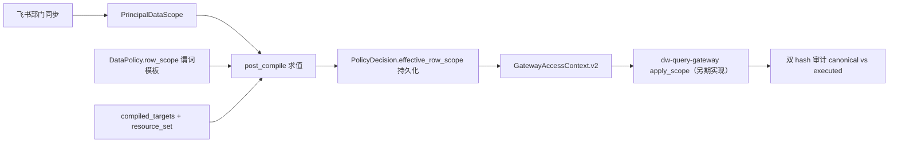
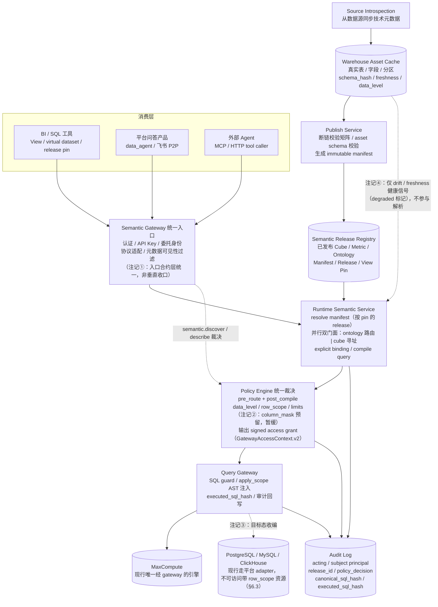

# 双层语义绑定规范与 RLS 演进设计

本文是 [ADR-014「并行双门面 + 单一编译脊柱」](decisions/ADR-014-dual-facade-single-spine-semantics.md) 的配套落地设计，覆盖六部分：

1. Cube ↔ Ontology 显式绑定规范（含发布期校验矩阵与运行时收口）
2. 建模助手（Modeling Copilot）按新架构的集成方式
3. 权限体系 RLS（行级安全）演进设计：平台侧全链路 + gateway 注入合约
4. 外部 Agent 对接合约（语义工具面）与 API Key 绑定 RLS 的双模式
5. 架构评审确认的已知缺口与收口清单（2026-06-12）
6. 六项硬化设计：release pin 语义、metadata visibility、free SQL 收口、row_scope 注入位置、Warehouse Asset 事实源、多身份链路一致性
7. 目标态组件视图与四条校准注记（统一入口语义 / column_mask 暂缓 / 引擎收编目标态 / asset cache 直连边界）

范围声明：本文为已定设计。绑定规范与运行时收口对应实施里程碑 M1/M2；RLS 平台侧五构件对应 M3；`dw-query-gateway` 仓库内的 `apply_scope` 注入实现另期推进，本文只定义其合约。

## 1. Cube ↔ Ontology 显式绑定规范

### 1.1 设计目标

- 运行时口径解析只走显式引用，不依赖名称模糊匹配；模糊匹配仅保留在建模态做推荐。
- 发布期完成断链校验：进入 published manifest 的 ontology 资产必须绑定可解析。
- RLS 谓词以语义维度引用为锚点（见 §3），绑定体系是行级策略落到物理列的解析基础。

### 1.2 绑定 Schema

#### BusinessObject 新增 `cube_bindings`

定义位置：`app/domain/ontology/entities.py`。

```yaml
# BusinessObject
name: student_comment
title: 学生评论
cube_bindings:
  - cube: comment_reports        # 必须存在于 published manifest
    role: primary                # primary | detail | event
    entity_key: comment_id       # 必须是该 cube 内的维度（建议为 primary_key 维度）
```

约束：

- `role=primary` 的绑定每个 object 至多一个，是对象画像、关系解析的默认入口。
- `detail` 用于明细扩展表，`event` 用于事件事实（与 `BusinessAction.event_cube_refs` 对齐）。
- 运行时 Object→Cube 投影只读 `cube_bindings`，不再做子串评分。

#### BusinessMetric 收紧 `measure_refs` 语义

```yaml
# BusinessMetric
name: student_comment_total_count
object_name: student_comment
semantic_formula: 按 Cube measure comment_reports.total_count 计算
measure_refs:
  - ref: comment_reports.total_count   # cube.measure 格式
    role: primary                      # 唯一编译入口
  # 同口径跨 cube 替代实现可声明 role: equivalent，编译仍只走 primary
```

约束：

- `role=primary` 必填且唯一；编译器只消费 primary ref，`equivalent` 仅用于口径联邦追踪与替代实现提示。
- `semantic_formula` 维持 [ADR-008](decisions/ADR-008-business-metric-semantic-formula.md) 口径：语义说明文本，不参与 SQL 编译。
- 兼容性：现存单元素字符串数组 `measure_refs: ["cube.measure"]` 在加载时归一化为 `[{ref, role: primary}]`，存量资产无需手工迁移。

### 1.3 发布期断链校验矩阵（Publish Gate 扩展）

校验位置：`app/application/semantic/semantic_release_service.py` 的 publish gate，与现有 gate 校验同事务执行；任一断链即 blocker，发布失败。

| 资产 | 校验项 | 失败码 |
| --- | --- | --- |
| BusinessMetric | `measure_refs` 存在且有唯一 `primary` | `metric_binding_missing` |
| BusinessMetric | primary ref 可解析到同批 manifest 或既有 active manifest 内的 `cube.measure` | `metric_binding_unresolved` |
| BusinessObject | `cube_bindings` 非空且 `primary` 至多一个 | `object_binding_missing` |
| BusinessObject | 每个 binding 的 `cube` 存在、`entity_key` 是该 cube 的维度 | `object_binding_unresolved` |
| BusinessRelation | 两端 object 均有 binding，join path 可经 `cube.joins` 解析 | `relation_join_unresolved` |
| BusinessAction | `event_cube_refs` 可解析 | `action_binding_unresolved` |

补充规则：

- 无 binding 的 ontology 资产不允许进入 published manifest；YAML 建模态草稿不受此限制。
- 解析范围 =「同批发布资产 ∪ 当前 active manifest」，允许 metric 与其 cube 分批发布，但被引用方必须先在线。
- 校验失败信息写入 release preview 的 `semantic_compile` 结果，供 Copilot ArtifactPanel 展示（见 §2）。

### 1.4 运行时解析收口

承接 [ADR-010](decisions/ADR-010-semantic-sql-registry-production-source.md) / ADR-014，运行时唯一 catalog 事实源是 active runtime snapshot manifest：

- **路由与编译只走显式 ref**：`SemanticRouterPreviewService` 与 `ExecutionCompiler` 的 metric→measure、object→cube 解析删除 fuzzy 回退分支；解析失败返回结构化失败码（如 `metric_binding_unresolved`），不静默降级。
- **mapper 降级为建模态推荐服务**：`app/application/semantic_mapper/preview_service.py` 的模糊匹配仅服务 Copilot 与本体工作台的绑定建议，不再被任何运行时路径调用。
- **catalog 统一**：semantic router、Agent 语义工具（`list_cubes / describe_cube / query`）、DevTools 回放、View 发布的运行时读取统一切到 `RuntimeSemanticCatalog`（published manifest）；YAML 仓储仅保留建模态 / preview 用途。
  - **M7（2026-06-26）落地状态**：DataChat 全局问数 `/conversations` 主链已落地 official（`send_message_handler._handle_via_semantic_router` 传 `runtime_mode="official"`，里程碑 M7 Phase 8），不再默认 preview/YAML；active manifest 已改为按 `asset_key` **累积** namespace 全部已发布资产（M7 Phase 7，`semantic_release_service.publish` + `rebuild_active_baseline`），不再每次发布整盘替换为单 cube。**未落地（独立 M3 RLS 待办）**：published cube 经 DataChat 消费出数仍被治理访问层默认拒绝（`governance/access.py` 无匹配访问策略→deny，且 handler `viewer_roles=[]` 写死、`observe` 模式在 router 路径仍阻断）——需给已发布 cube 配套访问授权策略 + handler 传真实角色，属 M3 RLS 范围。`GET /semantic/cubes` 仍为 registry（Cube 管理列表契约），DataChat discovery 同源留作独立 follow-up（应走专属 manifest 端点，不复用通用列表）。
- **信道对齐**：Agent 语义工具集对 feishu 与 datachat 信道一致暴露（`app/application/agent/services/tool_registry.py` 取消 channel 裁剪）。
- **生命周期一致**：资产状态以 registry / release 为准，逐步移除 manifest 加载期的 draft 强制提升补丁（`runtime_manifest_catalog._activate_*`）；过渡期保留补丁但记录告警。

## 2. 建模助手（Modeling Copilot）集成

冷启动产物从「Cube 为主、本体可选」升级为「绑定完整的语义包」：

- **草稿生成即绑定**：`_build_ontology_from_cube`（`app/application/semantic/modeling_draft_builder.py`）从 Cube 反推 object/metric 时，直接产出显式 `cube_bindings` 与 `measure_refs[primary]`；绑定在生成时确定，不依赖发布后的名称匹配。
- **发布原子性**：`publish_targets` 默认从 `{cube: true, ontology: false}` 改为 cube + ontology 同批发布（`app/application/semantic/copilot_publish_service.py`）；用户显式只发 cube 时，gate 校验保证不产生孤儿 metric（引用该 cube 的未发布 metric 不受影响，已发布 metric 的 ref 必须仍可解析）。
- **readiness 增项**：`release-preview` 校验矩阵加入 §1.3 的 binding 完整性检查，断链作为 blocking reason 在 ArtifactPanel 展示并阻断发布按钮。
- **建模态推荐**：单表/批量模式中，来源确认后由 mapper 推荐服务给出「该 cube 可绑定的已有 object」候选，建模工程师确认后写入 `cube_bindings`，避免多表同对象场景重复建对象。
- **范围外**：冷启动主干其余断点（批量扫描接真实 inspector、发布后自动创建 dataset / data_agent 实例、知识库随发布生长）维持 P1 清单，不在本设计展开。

## 3. 权限体系 RLS 演进设计

### 3.1 总体判断：扩展而非重构

现有体系（[ADR-013](decisions/ADR-013-lightweight-access-governance.md)：`Principal → RoleBinding → DataPolicy → PolicyDecision → ExecutionProfile → GatewayAccessContext`）骨架保留不动。RLS 是在该决策链上补五个增量构件；注入点选 **gateway 单点注入**，避免编译期注入导致 `sql_hash` 合约漂移（详见 [agent-ready-semantic-governance.md](agent-ready-semantic-governance.md) §5.6 / §10）。



与语义层既有原语的分工：

- `cube.default_filters`：全局业务规则（如 `deleted_flag = 0`），全员生效，编译期注入。
- `cube.segments`：可选业务切片，DSL 显式选用，编译期注入。
- **per-user 行级谓词**：走 DataPolicy → post_compile 求值 → gateway 注入，不进入编译期 SQL。

### 3.2 构件 1：DataPolicy 行级谓词模板

解除第一版 API 对 `row_scope` 的禁令（`app/interfaces/api/v1/governance.py`），`AccessDataPolicyORM` 增加 `row_scope` JSON 字段（migration）：

```yaml
row_scope:
  - dimension_ref: comment_reports.school_id   # 语义层维度引用（cube.dimension）
    operator: in                               # in | eq
    attribute: school_ids                      # PrincipalDataScope 属性名
    on_missing: deny                           # 属性为空时 deny | unrestricted
```

关键设计：**谓词引用语义层维度而非裸物理列**。这是 RLS 与双层绑定体系（§1）的接合点——策略作用在语义对象上，物理列在求值时经 manifest catalog 的 cube 定义解析（`dimension.sql`），策略不与物理表结构耦合。

### 3.3 构件 2：PrincipalDataScope（属性来源 = 飞书部门同步）

- 新表 `access_principal_scopes`：`principal_id, attribute, values(JSON), source, synced_at`。
- 同步链路：飞书通讯录部门 →「部门 → scope 值」映射规则（权限中心 UI 维护，如 部门「XX学校运营组」→ `school_ids: [123]`）→ 定时同步任务写入 scope。
- `PrincipalContext` 扩展 `data_scopes: dict[str, list]`，由 `RoleBindingResolver` 在解析角色时一并解析。
- 治理边界沿用 ADR-013：请求体 / JWT / feishu_context 中携带的 `data_scope` 一律不作为授权事实源；scope 只能来自平台内同步落库的数据。

### 3.4 构件 3：post_compile 求值

扩展 `app/application/governance/access.py` 的 `_post_compile_with_repository`：

- 命中 allow 策略后，对该策略 `row_scope` 模板逐条求值：`attribute` 从 principal `data_scopes` 取值；`dimension_ref` 经 manifest catalog 解析为物理列表达式。
- 求值结果为**具体值列表**（非运行时表达式），填入 `PolicyDecisionResult.effective_row_scope`（字段已预留）。
- `on_missing: deny` 且属性为空时直接 deny，`reason_code: row_scope_unresolved`。
- 多策略命中时按 `priority` 取最高优先级 allow 策略的 row_scope；deny 仍然优先于一切 allow。
- M2 策略升级：`m2_detail_read` 种子策略带 row_scope 模板，对齐 [agent-ready-semantic-governance.md](agent-ready-semantic-governance.md) §15「M2 必须注入行级范围」。

### 3.5 构件 4：GatewayAccessContext v2 合约

`app/application/governance/gateway_access_context.py` schema 升级为 `GatewayAccessContext.v2`：

```json
{
  "schema": "GatewayAccessContext.v2",
  "row_scope": [
    {
      "table": "df_cb_258187.dwd_interaction_comment_reports_df",
      "column": "school_id",
      "operator": "in",
      "values": [101, 202],
      "policy_code": "m2_detail_read",
      "dimension_ref": "comment_reports.school_id"
    }
  ]
}
```

gateway 侧职责（合约定义，另期实现）：

- `apply_scope(logical_sql, row_scope)`：对 row_scope 中每张目标表注入 WHERE 谓词；注入失败（表不在 SQL 中 / 列不存在）按 deny 处理。
- 注入后生成 `executed_sql_hash`，与平台侧 `canonical_sql_hash` 一并写入执行审计，形成双 hash 链。
- gateway 只消费已求值的具体约束值，不解析飞书部门、用户组或任何业务表达式。
- 向后兼容：v2 context 中 `row_scope` 为空数组或缺省时，gateway 行为与 v1 完全一致（本期实际运行态）。
- 合约硬化扩展（字段与校验规则见 §6）：v2 context 同时携带 `release_id`（6.1）、`scoped_table_refs` 注入锚点（6.4）、`acting_principal_id / subject_principal_id` 双主体（6.6）；`apply_scope` 必须 AST 级重写并做注入后 diff 校验。

### 3.6 构件 5：审计与解释

- `access_policy_decisions` 增加 `effective_row_scope` 列（migration），决策记录可解释「为何只看到学校 A 的数据」。
- semantic plan 的 evidence / ticket_preview 展示「将注入的行级范围」（Execution Compiler 仅 preview 展示，不修改 logical SQL）。
- 权限中心审计 UI 在决策详情中渲染 row_scope 命中策略、属性来源与求值结果。

## 4. 外部 Agent 对接合约与 Key 绑定 RLS

语义中心的目标消费者包含外部 Agent（自然语言驱动的 tool caller）。本节定义对接形态与 API Key 的 RLS 绑定模型。

### 4.1 对接形态：语义工具面，而非问答面

对外集成主合约是**结构化语义工具集**（MCP server 或等价 HTTP 工具集），不是 NL 问答端点：

```text
search_semantic_assets(nl_fragment)   # router 做 NL 片段 → object/metric 匹配，带证据返回
describe(metric | cube)               # 口径、维度、绑定、data_level —— 供消费方 LLM 阅读的语义说明书
plan(query_dsl)                       # 预览：logical_sql + resource_set + 将注入的 row_scope + 决策结果
execute(plan_ref)                     # 经 ticket 走 gateway 真实出数
```

分工：消费方 Agent 的 LLM 负责意图理解与工具编排；平台 router 只做语义资产匹配（不做完整问答）。问答面（data_agent / 飞书 P2P）是平台自有产品形态，不作为对外集成合约。

### 4.2 Agent 内部通道优先级合约

Agent 门面内有三条通道：本体路由（semantic plan）、cube 级工具（`list_cubes / describe_cube / query`）、`execute_sql` 降级。固化优先级纪律：

1. 本体命中走 plan；未命中降级 cube 工具。
2. `execute_sql` 降级**只允许在治理收口内执行**：同样产出 resource_set / sql_hash、穿过 post_compile 决策与 gateway，不存在绕开 choke point 的裸 SQL 路径（对齐 ADR-013「新查询路径不得绕过决策链」）。
3. 每次降级记入 evidence（降级原因 + 所用通道），口径一致性可审计。

### 4.3 Key 绑定 RLS：双模式

API Key 标识的是 Agent（服务身份），RLS 限定的是「看谁的数据」——两者不天然同主体，按场景分两种模式：

**模式 A：Agent 自持身份**（Agent 本身是数据消费者，如「XX学校运营 Agent」）

```text
API Key → Principal(service) → RoleBinding → DataPolicy
              ↓
      PrincipalDataScope: school_ids=[123]   ← 签发 key 时由管理员配置
```

scope 在签发时绑定到服务 Principal，复用 §3 五构件；`PrincipalDataScope.source` 扩展 `issuance`（人工配置）类型。

**模式 B：委托身份（on-behalf-of）**（一个 Agent 服务多个最终用户）

```text
API Key          → 认证 Agent 身份（信道）
请求携带 subject  → 平台解析为委托 Principal（如飞书 union_id → access_principals）
RLS 求值         → 取委托 Principal 自己的 PrincipalDataScope（平台侧落库数据）
```

安全规则沿用 ADR-013：Agent 只能传 subject **标识**，不能携带 scope 声明（请求体 data_scope 不是授权事实源）。

叠加求值规则：key 本身只承载**执行上限**（允许 action、最高 data_level、可达 resource 范围），row_scope 永远从「生效主体」的 PrincipalDataScope 求值；委托模式下生效边界 = Agent 上限 ∩ 用户 scope。

### 4.4 配套增量

- **Key 签发产品化**：签发时显式选择模式 A/B；模式 A 配 scope，模式 B 配**委托白名单**（该 key 允许代理的 subject 类型与范围，防 impersonation 提权）。
- **双主体审计**：PolicyDecision / 审计记录 `acting_principal`（Agent）+ `subject_principal`（被代理用户）；GatewayAccessContext.v2 同步携带双主体标识，gateway trace 双归因。
- **服务身份 fail closed**：模式 A 的 Agent 未配 scope 而命中 row_scope 策略时按 `deny` 兜底。

## 5. 架构评审：已知缺口与收口清单

2026-06-12 对语义层 as-built 架构做了一轮设计一致性评审，以下缺口已确认（按层归类），收口归属见表末。

### 5.1 概念模型层

- **A1 View 身份未定案**：`ViewDefinition` 是独立实体（未按 Phase 2 口径并入 Cube），发布元数据暂存于 `Dataset.file_metadata.semantic_publish`（代码自注释「暂存」）——发布关系是语义层一等事实，不应寄生在 Dataset 的 JSON 口袋字段；ADR-014 要求的 release pin 缺落点。定案方向：View 发布关系迁入 registry。
- **A2 Ontology 域越界概念**：`app/domain/ontology/entities.py` 中 `PolicyMetadata`（visibility + `allowed_roles`）与治理域 DataPolicy / RoleBinding 平行存在两套授权语义；`GovernanceAuditTrace`（含 `viewer_roles`）放在本体域，但审计属于治理域且 ADR-013 明确 viewer_roles 非授权事实源。定案方向：`PolicyMetadata` 降级为纯展示级可见性标注（不裁决），或并入 DataPolicy 的 `semantic.view` 动作策略，二选一；审计实体迁治理域。
- **A3 生命周期双轨**：实体内嵌 `status: draft/active/deprecated` 与 registry/release 生命周期并存，权威未定（6-11 验收的 draft 加载期提升补丁是症状）。定案：registry/release 为运行时权威，实体 status 收窄为建模态语义。

### 5.2 编译脊柱层

- **B1 catalog 双源 / 多脊柱实例**：「单一编译脊柱」当前只在类级别成立。`execution_compiler/preview_service.py` 从 YAML `cube_repository.list_all()` 现场建 JoinGraph，`semantic_query_service` 用自有 YAML repo + join graph 缓存，DI 中 router / compiler 同时持有 YAML repo 与 `runtime_snapshot_service` 双源。M1 catalog 收口必须落到 **DI 装配层**（运行时服务只注入 manifest catalog），并写进验收标准。
- **B2 治理组件绕 DI 自建**：`ExecutionCompilerRuntimeService` 构造器内默认 `PrincipalResolver()` / `AccessPolicyDecisionService()` 兜底自建，存在同进程双决策器配置漂移风险。M1 顺手清除兜底默认值。

### 5.3 治理接缝

- **C1 双（将成三）访问控制点未划界**：ontology `policy_guard_service`（可见性）作用于 router / compiler preview，governance DataPolicy（准入）作用于 plan / execute，RLS 落地后再加一个行级裁决点。三者边界必须在 M3 动工前定案（与 A2 同一决策），原则：**裁决只发生在 DataPolicy 决策链上，可见性过滤不做拒绝裁决**。

### 5.4 绑定语义层

- **E1 metric ≠ measure 的口径缺口**：`measure_refs` 只覆盖「指向哪个 measure」，不携带谓词变换（如「活跃学生评论数 = total_count + 附加过滤」）。此类 metric 当前只能退化为 measure 别名或把口径写进 `semantic_formula` 文本（不参与编译），双门面下同一业务问题可能出数不一致。演进方向：binding 支持 `filters` / grain 限定并进编译（绑定规范 v2）。
- **E2 `role: equivalent` 无口径等价校验**：仅声明、不验证，跨 cube 等价实现的口径一致性靠人工保证。
- **E3 程序化消费缺统一 query 协议**：第三方程序化消费者需自行判断调 plan API 还是 cube query API。演进方向：单一 `/semantic/query` 端点同时接受 metric 寻址与 cube 寻址 DSL（协议层统一，不改门面架构）。

### 5.5 模块组织层

- **D1 包划分标准不一致**：`app/application/semantic/` 约 40 个服务平铺，横跨建模态 / 发布态 / 运行时 / 资产底座，而 `semantic_router` / `execution_compiler` / `semantic_mapper` 又各自顶级分包——「按生命周期态」与「按构件」两种标准混用。重构方向：按建模态 / 发布态 / 运行时分包，与 M2 一起做。
- **D2 兼容门面变耦合点**：`SemanticLayerService` 依赖全标 `Any` 并以 `getattr` 读取下游私有属性，需标注退役口径并迁移存量调用方。

### 5.6 收口归属

| 缺口 | 性质 | 归属 |
| --- | --- | --- |
| B1 catalog 双源 | ADR-014 已定未兑现 | M1（核心工作量，DI 收口进验收标准） |
| A3 生命周期双轨 | 需补定案 | M1 一并收 |
| B2 / D2 绕 DI、门面耦合 | 实现纪律 | M1 顺手清 |
| D1 包结构 | 重构项，不阻塞 | M2 一起做 |
| 4.2 Agent 通道优先级合约 | 信道纪律 | M2（信道对齐范围内） |
| C1 控制点划界 + A2 本体越界概念 | **已定案（见 §5.7）** | M3 动工前置条件，已满足 |
| 4.3/4.4 Key 双模式 + 双主体审计 | RLS 增量 | M3（构件 2 / 4 扩展） |
| A1 View 发布契约迁 registry | 已知欠账 | P1（与 View release pin 同批） |
| E1 binding 谓词变换 / E2 等价校验 / E3 统一 query 协议 | 绑定规范 v2 | P1 |

### 5.7 C1/A2 划界定案（2026-06-12，M3 前置定案）

承接 §5.1 A2 与 §5.3 C1，定案如下，M3 实施以此为准：

**控制点边界表（C1）**——平台内只存在三类控制点，职责互斥：

| 控制点 | 职责 | 能否拒绝 | 落点 |
| --- | --- | --- | --- |
| 可见性过滤 | 元数据搜索/列举/描述的分层暴露与脱敏（§6.2） | 裁决经 DataPolicy `semantic.discover` / `semantic.describe` 动作；过滤本身不产生独立拒绝语义 | Semantic Gateway 入口 + Agent 工具门面 |
| 准入裁决 | 数据动作（query/extract/export）的 allow / deny / require_approval | 是（唯一准入拒绝点） | `AccessPolicyDecisionService.pre_route / post_compile` |
| 行级裁决 | row_scope 模板求值，产出 `effective_row_scope`；求值失败 fail closed | 是（`row_scope_unresolved` 等） | `post_compile` 内嵌（不新增第三个独立决策器） |

原则：**裁决只发生在 DataPolicy 决策链上**；任何路径不得在决策链之外实现拒绝逻辑。

**本体越界概念处置（A2）**：

- `PolicyMetadata.visibility` 降级为**展示偏好**（工作台默认折叠/标注），不参与任何裁决；`allowed_roles` 废除裁决语义，存量配置迁移为 `semantic.discover` DataPolicy 策略后删除消费方（`PolicyGuardService` 退役，router/compiler preview 的可见性判定切到决策链）。
- `GovernanceAuditTrace` 实体归属**治理域**：实体定义迁至 `app/domain/governance/`，本体域保留 import 别名过渡；`viewer_roles` 字段维持非授权事实源口径（仅审计记录）。
- 迁移期纪律：在 `PolicyGuardService` 退役前，其结果仅允许用于展示标注，不允许新增任何以其结果为依据的阻断分支。

## 6. 硬化设计：六项补强（2026-06-12 评审定案）

推荐方案继续推进的前置补强。每项对应一个明确的失效模式：

| 补强项 | 防住的失效模式 |
| --- | --- |
| 6.1 release pin 语义 | 审计不可复现、Cube 绑定过期资产 |
| 6.2 metadata visibility | 元数据越权（schema / 口径泄露） |
| 6.3 free SQL 收口 | RLS 旁路越权 |
| 6.4 row_scope 注入位置 | SQL 语义被 WHERE 注入改坏 |
| 6.5 Warehouse Asset 事实源 | Cube 绑定过期物理资产 |
| 6.6 多身份链路一致性 | 委托链越权、审计归因断裂 |

### 6.1 Release pin 语义

- pin 的对象是**不可变 `release_id`**，不是 "active" 浮动引用。消费方（virtual dataset、data_agent 实例、外部 Agent key 配置）声明 `pin_policy: pinned | track_active`；`track_active` 在每次发布后自动跟随，`pinned` 锁定口径直至显式升级。
- **求值与编译同 release**：一次查询中，DSL 编译、`dimension_ref` 解析（row_scope 求值）、resource_set 推导必须使用同一个 `release_id`；禁止「编译用 release N、策略求值用 release N+1」的混读。
- `release_id` 进入决策链全程：`PolicyDecision`、ticket、`GatewayAccessContext.v2`、gateway trace、审计记录全部携带。审计可复现的定义：给定 `release_id + canonical_sql_hash + row_scope`，可在历史 release 上重放出当时的编译与裁决结果。
- release 状态机：`active`（当前发布）→ `superseded`（被新版本替代，已 pin 消费方继续可用）→ `deprecated`（查询时返回告警标头）→ `revoked`（阻断，`reason_code: release_revoked`，用于口径错误召回）。
- publish gate 增项：新 release 须声明对上一 release 的兼容性（`compatible | breaking`）；breaking 发布时列出受影响的已 pin 消费方清单。

### 6.2 Metadata visibility（元数据可见性裁决）

元数据可见性**也是裁决**，但收口在统一决策链，不再由 ontology 私有 `allowed_roles` 承担（承接 §5 C1/A2 定案）：

- 新增数据动作 `semantic.discover`（搜索/列举）与 `semantic.describe`（读取口径与物理细节），由 DataPolicy 裁决，与 `query.*` 同链。
- 分层暴露：`search_semantic_assets` 只返回业务摘要（title / description / 资产类型）；`describe` 返回的物理细节（表名、`dimension.sql`、join 拓扑）按资产 `data_level` × 主体数据角色过滤——M2+ 资产的物理细节对无对应角色的主体脱敏（返回口径说明、隐藏物理引用）。
- 默认策略：登录主体可发现 active 资产的 M0/M1 摘要；服务身份（API Key）的可发现范围由 key 的资源范围限定，不继承全量 catalog。
- ontology `PolicyMetadata` 的 `visibility` 字段保留为**展示偏好**（如工作台默认折叠），`allowed_roles` 字段废除裁决语义，存量配置迁移为 `semantic.discover` 策略。

### 6.3 Free SQL 收口

free SQL（Agent `execute_sql` 降级、SQL 工具直查）与语义路径同链裁决，且不承担 RLS 注入：

- 统一前置：free SQL 必须经 AST 解析提取 `resource_set`（表清单）→ 表打标推导 `data_level` → 走同一 post_compile 决策。解析失败或 resource_set 不可确定时一律 deny（fail closed，`reason_code: sql_unparseable`）。
- **硬规则：携带 row_scope 策略的资源不可经 free SQL 访问**（`reason_code: row_scope_requires_semantic_path`）。RLS 注入只发生在语义层编译产出的受控 SQL 上——免去对任意用户 SQL 做注入改写，从机制上消灭「free SQL 绕过行级过滤」和「注入改坏任意 SQL」两类风险。
- 推论：M2 明细且带行级策略的表，唯一访问路径是语义层（cube DSL 或 ontology plan）；free SQL 的合法范围收窄为 M0/M1 与无行级策略资源。
- **执行引擎边界**：row_scope 的注入能力当前仅存在于 dw-query-gateway（MaxCompute 执行面）。不经 gateway 的执行路径（平台 adapter 直查 PostgreSQL / MySQL / ClickHouse 等）视同无注入能力，不可访问带 row_scope 策略的资源（`reason_code: row_scope_engine_unsupported`）。把全部引擎收编到 Query Gateway 之后是目标态；收编前，行级策略的有效作用域 = 经 gateway 执行的资源。
- Agent 三通道（§4.2）裁决完全一致，free SQL 不再是治理弱区。

### 6.4 row_scope 注入位置语义

注入位置固化为**基表扫描层（table scan level）**，语义等价「聚合前过滤」；禁止外层 `WHERE` 追加（聚合后过滤会改变结果语义）：

- 编译器随 `logical_sql` 输出结构化注入锚点：`scoped_table_refs: [{table, alias, scan_anchor}]`，作为编译产物元数据进入 ticket 与 `GatewayAccessContext.v2`（不修改 SQL 文本，`canonical_sql_hash` 口径不变）。
- gateway `apply_scope` 必须 **AST 级重写**（禁止字符串拼接）：按锚点在目标表的 scan 节点上新增谓词；重写后做 AST diff 校验——除新增谓词外任何节点变化即失败，按 deny 处理（`reason_code: scope_injection_failed`）。
- `executed_sql_hash` 在重写校验通过后生成；审计记录「锚点 + 注入谓词 + 双 hash」，注入过程可复现。
- 同一基表多次出现（self join / 多别名）时，每个 scan 锚点独立注入；锚点缺失但 row_scope 要求该表时 deny。

### 6.5 Warehouse Asset 事实源

引用链 **Ontology → Cube → Warehouse Asset** 三层全部显式、全部发布期校验：

- Cube 的物理表引用必须解析到数据资产底座登记的 Warehouse Asset（`data_asset_tables`），裸表名字符串不再是事实源；asset 缺失即发布 blocker（`cube_asset_unresolved`）。
- publish gate 增项：cube 引用的 dimension / measure / partition 列必须存在于 asset 当前 snapshot 且类型兼容（`cube_asset_schema_mismatch`）。
- release 记录所引用的 asset snapshot 版本；schema drift 检测（现有 `schema_drift_check` 链路）命中 asset 变更时，反向标记受影响 cube / release 为 `degraded`，在 DevTools、消费方与审计中可见；是否阻断按 drift 类型分级（列删除/类型变更 → 阻断，新增列 → 告警）。
- 该机制与 6.1 联动：pin 锁定的是「cube 定义 + asset snapshot」的组合，物理层漂移不会被静默吸收。

### 6.6 多身份链路一致性

- 统一身份模型：`PrincipalContext` 一律携带 `acting_principal`（执行者：用户本人 / 服务身份）与 `subject_principal`（数据主体；无委托时两者相同）。委托深度固定为 1，不允许 Agent 替 Agent 替用户的嵌套链。
- **全链路同字段**：pre_route、post_compile、`PolicyDecision`、ticket、`GatewayAccessContext.v2`、gateway trace、审计——任一环节缺双主体即合约违例；不存在「部分环节只记 acting」的中间态。
- 求值矩阵固定：row_scope 主体 = `subject`；执行上限 = `acting`（key cap）∩ `subject` 策略允许范围；任一侧 deny 即 deny。
- 内外信道同构：平台自有问答（飞书 P2P bot、DataChat）与外部 Agent 使用同一模型——bot 服务身份为 acting、提问用户为 subject。不存在两套身份语义。
- ticket 绑定「双主体 + `release_id` + `canonical_sql_hash`」三元组，gateway 校验三者与 context 一致，防止跨主体/跨版本重放。

## 7. 目标态组件视图

整合本文全部定案的组件级蓝图（2026-06-12 评审采纳）：



校准注记（图中标号的约束语义）：

1. **统一入口 ≠ 垂直收口**：Semantic Gateway 统一的是认证、Key / 委托身份、协议适配与元数据可见性过滤（§4.1 / §6.2 / E3）；Ontology 路由与 Cube 寻址在 Runtime Semantic Service 内仍是并行双门面（ADR-014），不强制一切消费经本体。
2. **column_mask 预留暂缓**：列级脱敏维持 ADR-013 暂缓决策，仅作为 Policy Engine 合约预留字段，不是已承诺能力。
3. **全引擎过 Query Gateway 是目标态**：现行只有 MaxCompute 生产执行经 gateway（ADR-011/012 边界）；收编前，非 gateway 引擎不可访问带 row_scope 策略的资源（§6.3 执行引擎边界）。
4. **Asset Cache 与运行时的直连仅限健康信号**：运行时解析必须读 manifest（pin 住的 asset snapshot，§6.1「求值与编译同 release」）；asset cache 直连只用于 drift / freshness 信号给资产打 degraded 标记（§6.5）。

## 8. 实施里程碑

状态（2026-06-12 深夜，M3 平台侧已落地）：RLS 平台侧五构件、身份硬化与 metadata visibility 完成实施。① 数据链路（迁移 `0012`）：`DataPolicy.row_scope` 谓词模板（governance API 解禁 + schema 校验）、`access_principal_scopes` 表（manual/issuance 来源）与 scope 管理 API、决策表 `effective_row_scope` 持久化；② 求值链路：`post_compile` 逐条求值 row_scope 模板（attribute 取 subject 主体 `data_scopes`，`dimension_ref` 经与编译同源的 manifest catalog 解析为物理表+列，`on_missing: deny` 即 fail closed）、双主体模型（acting/subject，模式 B 委托链取 subject scope）；③ 执行边界（§6.3 三类硬规则全部 fail closed）：free SQL 命中 row_scope 资源 deny、非 gateway 引擎 deny `row_scope_engine_unsupported`、gateway 注入未就绪过渡 deny `scope_injection_unsupported`；④ v2 合约与锚点（§6.4 平台侧）：`GatewayAccessContext.v2`（row_scope[] / release_id / scoped_table_refs / 双主体，row_scope 为空时维持 v1 兼容）、编译器 `CompileResult.scoped_table_refs` 注入锚点随 ticket_material 进入决策（ticket 绑定双主体 + release_id + canonical_sql_hash 三元组）；⑤ metadata visibility（§6.2）：`semantic.discover` / `semantic.describe` 进 DataPolicy 裁决链，Agent `list_cubes`/`describe_cube` 与全局 search 接入过滤与脱敏（服务身份 deny-first，人类主体默认可见 M0/M1 摘要，M2+ 物理细节需数据角色），存量 `PolicyMetadata.allowed_roles` 经迁移端点转为 discover 策略并废除裁决语义；⑥ Key 签发产品化（§4.3/4.4）：显式模式 A（签发配 scope，source=issuance）/ 模式 B（要求委托白名单，自动附委托 scope），权限中心 UI 同步；⑦ release pin 消费方接入（§6.1 余项，迁移 `0013`）：`RuntimeSemanticToolService`（data_agent 实例 config `semantic_pin`）与 `ExecutionCompilerPreviewService`（`pinned_release_id` 参数）支持按不可变 release_id 解析 manifest，API Key 新增 `semantic_pin` 配置（pinned 必须带 release_id，轮换保留）。**裁剪项**：飞书部门同步（部门→scope 映射 + 定时同步）按规划顺延，当前以 manual/issuance 来源跑通全链。**过渡决策修订（2026-06-14）**：因 `dw-query-gateway` 仍有存量用户、直接注入影响生产可用，§6.3 执行边界的 fail closed 改由统一开关 `RLS_ENFORCEMENT_MODE`（`off`/`observe`/`deny`/`enforce`）控制——由 `AccessPolicyDecisionService` 单点读取并随 `PolicyDecisionResult.rls_enforcement_mode` 透传到所有 fail-closed 落点与 `build_gateway_access_context`。**默认 `observe`**：求值 `effective_row_scope` 写审计但**不阻断**、`GatewayAccessContext` 维持 v1 不下发 row_scope（网关零感知）；`deny`/`enforce` 才触发上述三类 fail closed 并升 v2（free SQL 落点为 `row_scope_requires_semantic_path`）。未配 row_scope 的策略任何模式下零影响。配套修复 execute 路径维度解析（`runtime_mode` 缺省时回落 registry cube_repository，与编译同源）。意图：先用 observe 闭环语义评估、积累求值证据，gateway 注入能力就绪后再切 `enforce`（仍为另期）。

状态（2026-06-12，M1/M2 已收敛）：应用层闭环主体经真实环境 E2E 验收（绑定 Schema、gate 断链矩阵、运行时 catalog 收口、Copilot 草稿即绑定、信道对齐；证据见 `docs/runbooks/production-acceptance.md` 2026-06-12 复跑记录）。收敛批次补齐三项硬合约：① release 完整状态机（published→superseded 显式落库，deprecate/revoke API + 审计，revoked 对 active 与 pinned 消费一律 fail closed，发布期产出 compatible/breaking 兼容性声明，迁移 `0011`）；② Agent 通道优先级合约（4.2：AgentLoop 硬约束 `semantic_first_required`，降级原因与 `tool_trace` 记入 `agent_query_log` evidence）；③ free SQL 收口前置（6.3：`execute_sql` 经 FreeSqlGuard 提取 resource_set + sql_hash 走 `post_compile` 同链裁决，SQL 不可解析 fail closed）。语义包结构重整（D1）评估后另期：44 个服务可按建模态（copilot/modeling/source 约 22 个）/ 发布态（publish/release/readiness 约 8 个）/ 运行时（runtime/query/binding 约 6 个）/ 资产底座分包，但纯物理移动涉及全仓 import 与 DI 改写、无行为收益，安排独立重构窗口执行，过渡期以命名前缀维持边界。

| 里程碑 | 范围 | 依赖 |
| --- | --- | --- |
| M1 | 绑定 Schema + publish gate 校验矩阵（含 6.5 Warehouse Asset 校验）+ 运行时 catalog 收口（落到 DI 装配层）+ release pin 语义与状态机（6.1）+ 生命周期单轨定案 + 清理绕 DI 兜底 | 无 |
| M2 | Copilot 草稿即绑定 + 发布原子性 + readiness 增项 + 信道工具集对齐 + Agent 通道优先级合约 + free SQL 收口前置（6.3 的 resource_set 同链裁决）+ 语义包结构重整 | M1 |
| M3 | RLS 平台侧五构件 + Key 双模式绑定 + 多身份链路一致性（6.6）+ metadata visibility 裁决（6.2）+ 注入锚点编译产物（6.4 平台侧）+ free SQL row_scope 硬规则（6.3）；前置：C1 控制点划界与 A2 本体越界概念定案 | M1（dimension_ref 解析依赖绑定体系） |
| 另期 | dw-query-gateway `apply_scope` AST 级注入与 diff 校验（6.4 gateway 侧）+ 双 hash 审计 | M3 合约 |
| P1 | View 发布契约迁 registry + release pin、绑定规范 v2（谓词变换 / 等价校验 / 统一 query 协议）、发布后消费配置自动化、知识库随发布生长 | M1-M3 |

## 9. 相关文档

- [decisions/ADR-014-dual-facade-single-spine-semantics.md](decisions/ADR-014-dual-facade-single-spine-semantics.md)：双门面 + 单脊柱决策与三条纪律
- [decisions/ADR-013-lightweight-access-governance.md](decisions/ADR-013-lightweight-access-governance.md)：轻量权限中心基线（本文解除其「暂不做行列级」边界）
- [decisions/ADR-010-semantic-sql-registry-production-source.md](decisions/ADR-010-semantic-sql-registry-production-source.md)：SQL Registry 事实源
- [decisions/ADR-008-business-metric-semantic-formula.md](decisions/ADR-008-business-metric-semantic-formula.md)：semantic_formula 口径
- [agent-ready-semantic-governance.md](agent-ready-semantic-governance.md)：治理目标设计全集（row_scope / ticket / gateway 注入）
- [access-gateway-maxcompute-ram.md](access-gateway-maxcompute-ram.md)：gateway 到 MaxCompute 的物理执行边界
