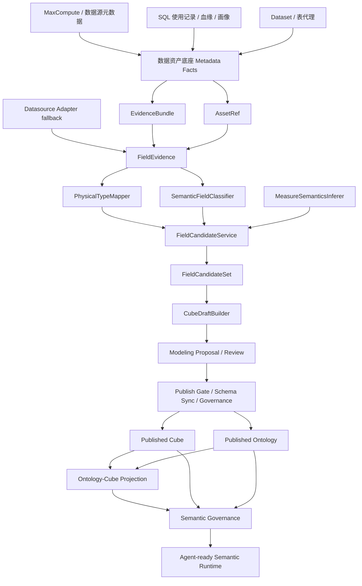

# 语义字段候选层与建模生成架构

本文定义“物理表 / Dataset / 数据资产证据”进入 Cube 与本体建模之前的中间抽象。核心结论是：不能让物理字段或 Dataset 字段直接变成 Cube 维度、指标或 Ontology 绑定；应先进入可解释、可复用、可治理的 `FieldCandidate` 候选层，再由 Cube 工作台与 Modeling Copilot 生成草案，最后通过发布门禁进入正式语义运行时。

## 0. 实施状态

截至 2026-05-25，字段候选层已从设计草案进入首期实现状态，本文作为架构二级真相源记录实现边界：

- `PhysicalTypeMapper` 与 `TypeCompatibilityPolicy` 已沉淀为共享能力，`SchemaSyncService`、字段候选分类和 Cube 草案生成不再各自维护独立物理类型族判断。
- `draft-from-source` 已收敛为 compatibility facade：外部兼容旧入口，内部先构建字段候选，再基于候选生成 Cube 草案，并在 trace 中保留候选证据。
- `FieldCandidateSet` 首期不落独立 SQL 表，不引入发布态或长期 override 生命周期；候选快照只进入 session artifact、Proposal evidence 或草案 trace。
- Agent-ready runtime、SQL runtime snapshot 与执行编译器不读取候选层；正式运行时只读取已发布 Cube、Ontology、Binding、Policy 和 runtime snapshot。

这组取舍继续遵守 KISS / YAGNI / SOLID / DRY：共享类型与候选规则减少重复实现，但不把候选层提前扩展成第三套语义资产系统。

## 1. 背景与问题

当前语义中心已经明确了三层事实边界：

- 数据资产底座：只记录表、字段、画像、血缘、使用、Schema 快照等元数据事实。
- Cube：分析执行语义真相，承载 measure、dimension、join、time dimension 和执行相关 spec。
- Ontology：业务语义真相，承载业务对象、属性、关系、动作、业务指标、术语和语义权限。

这次暴露的问题集中在字段进入 Cube 的生成路径：

1. `p75_difficulty`、`avg_*`、`*_rate` 这类明显是统计指标的字段，被启发式错误归入维度。
2. `DECIMAL(10,4)`、`FLOAT`、`DOUBLE`、`NUMERIC` 等物理数值类型没有统一映射到平台语义类型，导致 `type=number` 与物理类型对齐校验误报。
3. 物理表、Dataset 和数据资产证据都可以作为草案来源，但当前抽象不够清晰，容易让人误解为“扫描元数据直接生成 Cube”。
4. 建模 Copilot、Cube 工作台、Schema drift 校验各自需要字段类型和字段角色判断，如果继续散落在不同服务里，会违反 DRY，并放大后续治理成本。

因此需要补一个中间层：`FieldCandidate` 不是新的语义真相源，而是从元数据事实到语义草案之间的“可解释候选层”。

## 2. 目标与非目标

### 2.1 目标

- 阻断“物理字段直接成为正式 Cube / Ontology 真相”的路径。
- 统一数值、时间、布尔、字符串等物理类型到平台语义类型的映射。
- 统一字段角色判断：维度、指标、时间字段、标识符、退化维度、派生字段、未知字段。
- 对指标字段补齐默认聚合、可加性、单位、格式、置信度和证据说明。
- 让 Cube 工作台、Modeling Copilot 和 Schema drift 校验复用同一套类型与角色判断能力。
- 把低置信度、类型冲突、疑似指标误归维度等问题沉淀为可展示、可治理的候选告警。
- 保持数据资产底座的职责简单：只提供 `AssetRef + EvidenceBundle`，不承担语义生成和发布。

### 2.2 非目标

- 不建设新的通用元数据仓库。数据资产底座仍是语义中心内的元数据事实产品化呈现。
- 不替代 Cube 和 Ontology。`FieldCandidate` 只能生成草案建议，不能成为运行时查询输入。
- 不自动发布 Cube 或本体资产。所有自动生成结果必须进入 Proposal / Review / Publish Gate。
- 不追求首期 100% 识别所有业务字段。低置信度字段应暴露给用户确认，而不是被静默误判。
- 不把 LLM 输出作为唯一依据。LLM 可以参与解释和辅助分类，但最终草案由后端确定性工具生成。

## 3. 当前实现链路

当前实现里，数据资产同步和 Cube 草案生成已经不是同一条链路：

```text
MaxCompute / Dataset / 手工 payload
  -> DataAssetService.sync_from_payload
  -> AssetTable / AssetField / AssetSnapshot / usage / lineage / sync_run
```

Cube 草案生成是显式建模动作：

```text
/api/v1/semantic/cubes/draft-from-source
  -> CubeModelingSourceService.generate_cube_draft_from_source
  -> CubeModelingService.generate_cube_draft
  -> Cube draft payload
```

Modeling Copilot 的草案构建优先使用数据资产证据：

```text
Modeling Copilot session
  -> SourceCandidateRecall
  -> EvidenceBundle.schema_snapshot 优先
  -> CubeModelingSourceService.generate_cube_draft_from_asset_evidence
  -> SemanticModelDraftBuilder.create_spec_draft
  -> Proposal Review / Publish Gate
```

问题不在“数据资产同步自动生成 Cube”，而在“草案生成时缺少一个正式的字段候选抽象”。当前启发式规则直接嵌在 `CubeModelingService` 里，类型族映射又在 `SchemaSyncService` 内部补丁式存在，后续会难以治理。

## 4. 推荐架构



### 4.1 分层职责

| 层 | 负责 | 不负责 |
| --- | --- | --- |
| 数据资产底座 | 表、字段、快照、画像、使用、血缘、同步批次 | 推断最终语义、发布 Cube、发布 Ontology |
| `FieldEvidence` | 把快照、字段注释、profile、使用证据整理成字段级输入 | 保存用户最终选择 |
| `PhysicalTypeMapper` | 解析物理类型并归一到平台基础语义类型 | 判断字段是维度还是指标 |
| `SemanticFieldClassifier` | 基于名称、注释、profile、使用证据给出字段角色候选 | 生成 Cube spec |
| `MeasureSemanticsInferer` | 对指标候选给出聚合、可加性、格式和风险 | 替代发布门禁 |
| `FieldCandidateService` | 汇总类型、角色、置信度、原因和告警，产出候选集 | 作为运行时真相源 |
| `CubeDraftBuilder` | 基于候选集生成 Cube 草案 | 直接连接外部库做无边界扫描 |
| Modeling Copilot / Cube 工作台 | 让用户确认候选、编辑草案、保存 Proposal | 静默自动发布 |
| 语义治理 | 统一展示 drift、stale、policy、candidate warning | 复制字段分类规则 |

### 4.2 核心原则

- 数据资产底座是证据层，不是生成层。
- `FieldCandidate` 是建模建议，不是资产真相。
- Cube 草案必须来自 `FieldCandidateSet`，不能直接由字段数组拼 spec。
- Ontology 与 Cube 的映射仍由 Projection / Mapper 负责，不能由数据资产底座直连 Ontology。
- Ontology 草案只是业务语义建议，业务对象、业务指标、关系、动作仍必须经本体 Review / Publish Gate；不能因为 Cube 草案生成而自动成立。
- 正式运行时只读取已发布 Cube、Ontology、Binding、Policy 和 SQL runtime snapshot。

## 5. 核心领域模型

### 5.1 `PhysicalTypeDescriptor`

用于承载物理类型解析结果，避免各服务重复用字符串判断。

```json
{
  "raw_type": "DECIMAL(10,4)",
  "normalized_type": "decimal",
  "family": "number",
  "precision": 10,
  "scale": 4,
  "nullable": true,
  "source_dialect": "maxcompute"
}
```

建议首期支持的 `family`：

| family | 物理类型示例 | 平台基础类型 |
| --- | --- | --- |
| `number` | `TINYINT`、`INT`、`BIGINT`、`DECIMAL`、`NUMERIC`、`FLOAT`、`DOUBLE` | `number` |
| `string` | `STRING`、`VARCHAR`、`CHAR`、`TEXT` | `string` |
| `time` | `DATE`、`DATETIME`、`TIMESTAMP` | `time` |
| `boolean` | `BOOLEAN`、`BOOL` | `boolean` |
| `json` | `JSON`、`MAP`、`ARRAY`、`STRUCT` | `json` / `unknown` |
| `binary` | `BINARY`、`VARBINARY` | `unknown` |
| `unknown` | 未识别类型 | `unknown` |

### 5.2 `SemanticFieldRole`

字段角色不能由物理类型单独决定。数值字段可能是金额、次数、比例，也可能是年级、排序、等级或枚举编码。

```text
dimension.identifier      主键、外键、业务 ID
dimension.categorical     枚举、状态、类型、分组
dimension.numeric         年级、排序、难度等级、分桶编码等数值维度
dimension.time            日期、时间、分区时间
measure.additive          金额、次数、时长、数量
measure.semi_additive     余额、库存、累计快照
measure.non_additive      均值、比例、分位数、通过率、难度
measure.derived           公式或派生指标
technical.partition       分区字段
technical.audit           create_time、update_time、etl_time 等技术字段
unknown                   需要确认
```

### 5.3 `MeasureSemantics`

指标候选需要补齐最小分析语义：

```json
{
  "aggregation": "avg",
  "additivity": "non_additive",
  "default_format": "decimal",
  "unit": null,
  "is_ratio": false,
  "recommended_name": "avg_p75_difficulty",
  "warnings": ["字段名包含 p75，默认按非可加指标处理"]
}
```

聚合建议首期规则：

| 字段线索 | 默认聚合 | 可加性 | 说明 |
| --- | --- | --- | --- |
| `*_cnt`、`*_count`、`num_*`、`*_pv`、`*_uv` | `sum` / `count_distinct` | additive / non_additive | `uv` 默认非可加 |
| `avg_*`、`*_avg`、`mean_*` | `avg` | non_additive | 均值不能跨粒度直接 sum |
| `p50_*`、`p75_*`、`p90_*`、`median_*` | `avg` 或 `max` 待确认 | non_additive | 必须展示低置信度或确认项 |
| `*_rate`、`*_ratio`、`*_pct`、`pass_rate` | `avg` | non_additive | 比例类默认不允许 sum |
| `amount`、`price`、`cost`、`duration`、`score` | `sum` / `avg` 视命名 | additive / non_additive | 需要结合注释和 profile |
| `balance`、`stock`、`snapshot_*` | `max` / `last_value` 待确认 | semi_additive | 首期可先要求人工确认 |

### 5.4 `FieldCandidate`

`FieldCandidate` 是 UI 和建模服务共同消费的候选实体：

```json
{
  "field": "p75_difficulty",
  "source": {
    "asset_ref": "maxcompute:df_cb_258187.ads_bi_question_base_stats_df.p75_difficulty",
    "snapshot_id": "schema-sync-2026-05-25T10:00:00Z"
  },
  "physical_type": {
    "raw_type": "DECIMAL(10,4)",
    "family": "number",
    "precision": 10,
    "scale": 4
  },
  "semantic_type": "number",
  "role_candidates": [
    {
      "role": "measure.non_additive",
      "confidence": 0.86,
      "reasons": ["字段名前缀 p75 表示分位数", "物理类型为 decimal"]
    }
  ],
  "selected_role": "measure.non_additive",
  "measure_semantics": {
    "aggregation": "avg",
    "additivity": "non_additive"
  },
  "warnings": ["分位数跨粒度聚合可能失真，发布前需确认口径"],
  "decision": "auto_suggested"
}
```

### 5.5 `FieldCandidateSet` 生命周期约束

`FieldCandidateSet` 的生命周期必须比 Cube / Ontology 短，且没有发布态：

| 约束 | 说明 |
| --- | --- |
| 无发布态 | 不存在 active / published candidate set，不能作为正式语义资产 |
| 无运行时读取 | Agent-ready runtime、SQL runtime snapshot、执行编译器都不能读取候选层 |
| 可重算 | 首期 `candidate_set_id` 可以是内容哈希或 session artifact id，由 `source_ref + evidence_snapshot_id + ruleset_version + selected_overrides` 派生 |
| 可追踪 | 必须记录 `ruleset_version`、`evidence_snapshot_id`、`generated_at`、`override_scope` |
| 有范围 | `override_scope` 首期限定为 `proposal` 或 `session`，不默认写回资产层长期生效 |
| 可内联 | `draft-from-candidates` 必须支持 inline `candidate_set`，避免 preview cache 变成隐形状态仓库 |

首期允许在 Copilot artifact / Proposal evidence 中保存候选快照，用于 Review、审计和发布前复核；但这个快照只解释草案来源，不影响已发布语义资产。

### 5.6 `TypeCompatibilityPolicy`

类型兼容策略需要从 `SchemaSyncService` 和 Cube 草案生成规则中抽出，形成共享入口：

```text
physical raw type
  -> PhysicalTypeDescriptor.family
  -> semantic primitive type
  -> cube dimension / measure type compatibility
```

首期策略表：

| physical family | semantic primitive | dimension type | measure type | 说明 |
| --- | --- | --- | --- | --- |
| `number` | `number` | `number` 或 `string` | `number` | 是否为指标由字段角色决定，不由数值类型决定 |
| `string` | `string` | `string` | 不默认支持 | 可通过 count / count_distinct 派生指标 |
| `time` | `time` | `time` | 不默认支持 | 可作为 time dimension 或分区字段 |
| `boolean` | `boolean` | `boolean` | 不默认支持 | 可经派生规则形成计数指标 |
| `json` | `json` / `unknown` | `unknown` | `unknown` | 首期默认需人工处理 |
| `unknown` | `unknown` | `unknown` | `unknown` | 发布阻断 |

`SchemaSyncService` 只判断“Cube 声明类型与物理类型是否兼容”，`SemanticFieldClassifier` 才判断“字段角色是维度还是指标”。这条边界是解决 `DECIMAL(10,4)` 与 `number` 误报，同时避免“数值字段天然是指标”的关键。

## 6. 建模生成流程

### 6.1 冷启动建模

```text
用户输入业务问题
  -> 召回已有 Ontology / Cube / Binding / Dataset / Asset
  -> 用户确认候选源
  -> 构建 EvidenceBundle
  -> 生成 FieldCandidateSet
  -> 用户确认字段角色和关键指标口径
  -> CubeDraftBuilder 生成 Cube 草案
  -> Ontology proposal 生成业务对象 / 指标 / 关系建议
  -> Proposal Review
  -> Publish Gate
  -> Published Cube + Published Ontology
```

冷启动的关键变化：

- 召回阶段只找“可能相关的源”，不判断最终字段角色。
- 生成草案前必须有 `FieldCandidateSet`。
- Copilot 可以推荐“哪些字段进入指标 / 维度 / 时间”，但需要把原因和置信度展示出来。
- 低置信度指标、分位数、比例、快照类字段应进入 Review 阻塞项或确认项。
- 缺少数据资产快照时可以走 `datasource adapter fallback`，但必须记录 `fallback_reason / collected_at / adapter_source`；发布前仍要重新执行 schema sync，生产环境可配置为“无资产快照不允许发布”。

### 6.2 Cube 工作台手工建模

```text
选择数据资产 / Dataset / 物理表
  -> 预览字段候选
  -> 调整字段角色
  -> 生成 Cube 草稿
  -> 编辑 spec
  -> 校验 / 发布
```

产品上应把按钮从“从物理表直接生成 Cube”调整为“从字段候选生成 Cube 草稿”，减少用户对链路的误解。

### 6.3 数据资产底座预计算

资产同步后可以异步预计算字段候选，但预计算结果仍是建议，不是语义资产：

```text
metadata sync_run success
  -> optional candidate precompute job
  -> candidate snapshot / cache
  -> 资产页展示建议
```

首期推荐按需生成，不强制落库。等字段覆盖、人工 override 和审计需求变强后，再持久化候选结果。

## 7. 产品设计

### 7.1 数据资产底座

数据资产底座页面继续围绕资产事实，不升级为语义工作台。

建议补充：

- 物理表详情：展示字段候选摘要，如“推荐指标 12、推荐维度 8、需确认 3”。
- 字段画像：增加“推荐语义角色”“置信度”“原因”“最近使用证据”。
- 表画像：展示候选主时间字段、候选主键、候选指标组、字段质量风险。
- 血缘使用：辅助解释字段角色，如某字段经常出现在 `GROUP BY`，则提升维度置信度；经常出现在 `SUM/AVG`，则提升指标置信度。
- 元数据同步：同步完成后显示是否完成候选预计算，以及失败原因。

不建议在资产底座里直接提供“发布 Cube / 发布 Ontology”。资产页最多提供“进入 Cube 工作台建模”或“交给 Copilot 建模”。

### 7.2 Cube 工作台

Cube 工作台是技术语义建模入口，建议形成三个区块：

1. 来源与证据：表、Dataset、快照时间、profile、使用证据。
2. 字段候选 Review：维度、指标、时间字段、技术字段、未知字段的可编辑列表。
3. Cube 草案：基于确认后的候选生成 spec，继续执行 schema sync、binding、发布校验。

字段候选 Review 必须支持：

- 指标 / 维度互相切换。
- 指标聚合函数调整。
- 非可加、半可加字段确认。
- 忽略技术字段。
- 对低置信度候选展示原因，不只显示分数。

Review 不应该把所有字段都摊给用户处理，而要按风险分层：

| 分层 | 处理方式 | 示例 | 发布影响 |
| --- | --- | --- | --- |
| 低风险 | 默认折叠自动接受，只在摘要中展示 | 高置信 `school_id`、`subject`、`dt` | 不阻塞 |
| 中风险 | 展示在“建议确认”区，用户可批量接受 | `score` 这类可能是指标也可能是维度的数值字段 | 未确认可生成草案，但发布前保留提示 |
| 高风险 | 展示在“必须处理”区，需要确认或修正 | `p75_difficulty`、`pass_rate`、未知物理类型、比例字段使用 `sum` | 阻塞发布，必要时阻塞生成草案 |

资产页可以展示候选摘要，但文案必须强调“建模建议，不影响已发布语义”。资产页只提供“进入 Cube 工作台建模”和“交给 Copilot 建模”两类入口，不提供“应用建议 / 直接发布”动作。

### 7.3 Modeling Copilot

Copilot 的主流程应从“直接生成 spec”改成“生成可审查的建模提案”：

```text
Source Review
  -> Field Candidate Review
  -> Cube Draft Artifact
  -> Ontology Draft Artifact
  -> Publish Gate
```

Chat 里可以继续自然语言交互，但确定性状态动作由后端工具执行：

- “使用这个源表”触发 EvidenceBundle 构建。
- “接受字段候选”触发 Cube 草案生成。
- “解释为什么 p75_difficulty 是指标”读取 candidate reasons。
- “发布前检查”触发 SchemaSyncService 与治理门禁。

### 7.4 语义治理

候选层的治理输出分两类：

- 阻塞项：字段类型无法映射、指标缺少聚合、低置信度关键字段未确认、字段已漂移但候选仍基于旧快照。
- 提示项：字段命名疑似指标但被设为维度、比例类指标使用 sum、分位数字段未说明聚合口径。

治理中心展示这些问题时，应回溯到 `candidate_set_id / asset_ref / evidence_snapshot_id`，避免只给不可追踪的文案。

首期固定 issue code 与阻断等级：

| issue code | 触发条件 | 阻断等级 | 默认 owner |
| --- | --- | --- | --- |
| `field_type_unknown` | 物理类型无法映射到平台基础类型 | Publish Gate 阻断 | 数据建模人 |
| `metric_aggregation_missing` | measure 候选缺少聚合函数 | Publish Gate 阻断 | 数据建模人 |
| `non_additive_unconfirmed` | 分位数、比例、均值、快照类指标未确认可加性 | Publish Gate 阻断 | 指标 owner |
| `candidate_snapshot_stale` | 候选基于旧快照且 schema drift 已发生 | Review / Publish Gate 阻断 | 数据资产 owner |
| `dimension_metric_conflict` | 命名、使用记录明显指向指标但被设为维度，或反之 | Review 阻断 | 数据建模人 |
| `ratio_sum_risk` | 比例 / 分位数 / 均值字段被配置为 `sum` | Publish Gate 阻断 | 指标 owner |
| `low_confidence_dimension` | 普通维度低置信但无明显执行风险 | 提示 | 数据建模人 |

issue 生命周期：

```text
detected
  -> acknowledged
  -> fixed_in_candidate / waived_with_reason
  -> validated
  -> resolved
```

`waived_with_reason` 只能用于提示项或具备显式白名单的阻断项；发布态审计需要记录豁免人、理由和候选规则版本。

## 8. 模块设计

### 8.1 新增或收敛模块

| 模块 | 建议位置 | 说明 |
| --- | --- | --- |
| `PhysicalTypeMapper` | `app/application/semantic/field_candidates/` 或 `app/domain/semantic/` | 统一物理类型解析和语义基础类型映射 |
| `SemanticFieldClassifier` | 同上 | 根据字段名、注释、profile、SQL 使用给出角色候选 |
| `MeasureSemanticsInferer` | 同上 | 给指标候选补聚合、可加性、格式、告警 |
| `FieldCandidateService` | `app/application/semantic/` | 编排 evidence、mapper、classifier、inferer |
| `CubeDraftBuilder` | 复用并收敛现有 `CubeModelingService` | 从 `FieldCandidateSet` 生成 Cube draft |
| `FieldCandidateArtifact` | Modeling Copilot artifact | 在 Review 面板展示候选和确认状态 |

首期可以不新增大量文件，但必须把可复用规则从 `CubeModelingService` 与 `SchemaSyncService` 中抽出来，避免类型映射和字段角色判断分裂。

### 8.2 现有服务调整

| 现有服务 | 调整建议 |
| --- | --- |
| `DataAssetService` | 保持元数据事实职责，只增加构建字段证据的读取接口，不生成 Cube |
| `CubeModelingSourceService` | 入口保留，但内部先构建 `FieldCandidateSet`，再调用 Cube draft builder |
| `CubeModelingService` | 从“字段启发式 + draft 生成”拆为“draft 生成器”，启发式下沉到候选层 |
| `SchemaSyncService` | 复用 `PhysicalTypeMapper` 的 type family 判断，避免独立维护数值类型白名单 |
| `SemanticModelDraftBuilder` | 生成 spec 前要求 source evidence 或 live fallback 转成 candidate set |
| `SourceCandidateRecallService` | 只负责候选源召回和打分，不负责字段级语义角色判断 |

## 9. 存储策略

### 9.1 推荐首期：按需生成 + Proposal 内保存快照

首期不单独建 `semantic_field_candidates` 表，避免过度设计。

推荐存储方式：

- 资产页：按需调用 preview API，短期可缓存。
- Copilot session：把 `candidate_set` 存入 session artifact 或 Proposal `raw_spec` 的 evidence 区。
- 发布 trace：保存 `candidate_set_id`、关键 `asset_ref`、`ruleset_version`、`evidence_snapshot_id` 和候选摘要，便于审计。

优点：

- 改动小，符合 YAGNI。
- 不引入候选资产生命周期管理。
- 可以快速验证字段候选对 Cube 草案质量的提升。

风险：

- 跨会话复用较弱。
- 用户手工 override 不易长期复用。

### 9.2 二期：候选快照持久化

当出现以下任一情况，再引入持久化候选表或资产快照类型：

- 用户需要在资产页保存字段角色 override。
- 多个 Copilot session 需要复用同一套确认结果。
- 治理中心需要按候选版本追踪问题闭环。
- 批量同步后需要提前计算候选质量覆盖率。

二期可选两种方式：

| 方式 | 优点 | 风险 | 建议 |
| --- | --- | --- | --- |
| 复用 `AssetSnapshot.snapshot_type=semantic_field_candidates` | 不新增表，符合当前资产快照模型 | 查询和 override 能力有限 | 优先用于候选快照 |
| 新增 `semantic_field_candidates` / `semantic_field_candidate_overrides` | 适合长期治理和人工维护 | 表模型更重，首期 YAGNI | 等 override 成为强需求再做 |

## 10. API 契约草案

### 10.1 预览字段候选

```http
POST /api/v1/semantic/field-candidates/preview
```

请求：

```json
{
  "source_kind": "asset",
  "asset_ref": {
    "source_id": "maxcompute-prod",
    "database": "df_cb_258187",
    "name": "ads_bi_question_base_stats_df"
  },
  "snapshot_id": "schema-sync-2026-05-25T10:00:00Z",
  "include_profile": true,
  "include_usage": true
}
```

响应：

```json
{
  "candidate_set_id": "fcand_...",
  "ruleset_version": "field-candidate-rules-v1",
  "expires_at": "2026-05-25T12:30:00Z",
  "source": {
    "source_kind": "asset",
    "snapshot_id": "schema-sync-2026-05-25T10:00:00Z"
  },
  "summary": {
    "dimensions": 8,
    "measures": 12,
    "time_fields": 1,
    "unknown": 2,
    "warnings": 4
  },
  "fields": []
}
```

### 10.2 基于候选生成 Cube 草案

```http
POST /api/v1/semantic/cubes/draft-from-candidates
```

请求：

```json
{
  "candidate_set_id": "fcand_...",
  "candidate_set": null,
  "selected_fields": {
    "dimensions": ["school_id", "subject"],
    "measures": [
      {
        "field": "p75_difficulty",
        "aggregation": "avg",
        "additivity": "non_additive"
      }
    ],
    "time_dimension": "dt"
  }
}
```

`candidate_set_id` 只作为 session / preview cache 引用；调用方也可以直接提交 inline `candidate_set`。服务端生成草案时必须把最终使用的候选内容写入 trace，不能只记录一个不可复现的缓存 id。

### 10.3 兼容旧入口

旧的 `draft-from-source` 不应立即删除，但要标记为 compatibility facade。它不能再作为独立生成语义路径，内部必须降级为：

```text
draft-from-source
  -> build FieldEvidence
  -> FieldCandidateService.preview
  -> draft-from-candidates
```

对前端文案来说，不再强调“物理表直接生成 Cube”，而是展示“已基于字段候选生成草稿”。返回 trace 必须包含 `candidate_set_id` 或 inline candidate evidence，并标记 `draft_source_mode=compatibility_facade`。

## 11. 执行计划

### Phase 0：止血与事实澄清

已完成或正在完成：

- 数值物理类型族归一，避免 `DECIMAL(10,4)` 与 `number` 误报。
- 指标类命名规则补齐，避免 `p75_difficulty`、`avg_*`、`*_rate` 误入维度。
- 现有 YAML seed 中统计字段从 dimensions 移到 measures。
- 补充单元测试，覆盖数值类型族、measure-only 字段引用、统计字段归类。

### Phase 1：抽取候选层最小内核

- 新增 `PhysicalTypeMapper`，迁移 `SchemaSyncService` 内部类型归一规则。
- 新增 `SemanticFieldClassifier`，迁移 `CubeModelingService` 内部字段角色规则。
- 新增 `MeasureSemanticsInferer`，统一聚合、可加性和告警。
- 新增 `FieldCandidateService.preview_from_evidence`。
- 保持现有外部 API 不破坏，先内部复用候选层。

验收：

- `CubeModelingService` 不再直接维护一份独立字段角色规则。
- `SchemaSyncService` 和候选层使用同一套物理类型映射。
- 统计字段、比例字段、分位数字段默认进入 measure 或需确认状态。
- 除测试 fixture 外，Cube 草案生成不能从 raw columns 直接推断维度 / 指标，只能从 `FieldCandidateSet` 或等价 inline candidate set 生成。
- `SchemaSyncService` 不再维护独立 type family 白名单，而是复用 `TypeCompatibilityPolicy`。

### Phase 2：接入 Cube 工作台与 Copilot

- `draft-from-source` 内部改为先生成候选集，再生成 Cube 草案。
- Copilot Review artifact 增加 `Field Candidate Review`。
- Cube 工作台增加字段候选确认 UI。
- 对低置信度候选、非可加指标、比例类指标生成 Review warning。

验收：

- 用户能看到为什么字段被推荐为维度或指标。
- 用户可以在生成 Cube 草案前修正字段角色。
- Copilot 不再表现为“直接从物理表生成 Cube”。
- 旧 `draft-from-source` API 仍兼容返回旧结构，但 trace 必须包含候选层证据，且产品主链路不再把它展示为直接生成入口。
- Publish Gate 能根据候选 issue code 阻断未知类型、缺少聚合、比例 / 分位数字段使用 `sum`、旧快照候选等高风险问题。

### Phase 3：治理与持久化增强

- 将候选告警接入语义治理 issue payload。
- 对 Proposal / publish trace 记录 candidate evidence。
- 视使用情况决定是否持久化 `semantic_field_candidates` 快照。
- 增加批量候选质量覆盖率，用于数据资产底座的资产雷达。

验收：

- 发布前可阻断明显危险的候选配置。
- 治理问题能回溯到字段、证据、快照和候选原因。
- 资产页可以展示候选覆盖率，但仍不承载发布动作。

## 12. 测试与 E2E

### 12.1 单元测试

- `PhysicalTypeMapper`：覆盖 MaxCompute 常见类型、带精度类型、未知类型。
- `SemanticFieldClassifier`：覆盖 ID、枚举、时间、技术字段、统计指标、比例、分位数。
- `MeasureSemanticsInferer`：覆盖 sum、avg、count distinct、非可加、半可加提示。
- `SchemaSyncService`：验证 `number` 接受 decimal / float / double / numeric。
- `CubeDraftBuilder`：验证统计字段不进入 dimensions，且 measure 有合理聚合。

### 12.2 API 测试

- `field-candidates/preview` 对资产证据返回候选摘要。
- `draft-from-candidates` 使用确认后的候选生成 Cube 草案。
- 旧 `draft-from-source` 兼容入口仍返回相同结构，但 trace 中标记 `candidate_set_id`。
- 覆盖 `asset evidence -> candidates -> cube draft`、`physical_table fallback -> candidates -> cube draft`、`dataset virtual fields -> candidates -> cube draft` 三类来源路径。
- 验证 `draft-from-candidates` 同时支持 `candidate_set_id` 和 inline `candidate_set`。

### 12.3 E2E 测试

最小真实路径：

```text
同步 MaxCompute 元数据
  -> 进入数据资产底座物理表页
  -> 查看字段候选
  -> 进入 Cube 工作台
  -> 修改 p75_difficulty 为非可加指标
  -> 生成 Cube 草案
  -> Copilot Review 展示候选证据
  -> Publish Gate 通过 schema sync
  -> Ontology Projection 可看到 Measure 绑定
```

需要验证的关键断言：

- `p75_difficulty` 不出现在 dimensions。
- `DECIMAL(10,4)` 不触发 `number` 类型误报。
- 草案 trace 能显示候选原因和证据快照。
- 正式运行时只读取发布后的 Cube / Ontology，不读取候选层。

负向 E2E：

- 低置信关键指标未确认时，Publish Gate 阻断。
- 候选基于旧快照且 schema drift 已发生时，必须阻断或要求重新生成候选。
- `rate / ratio / p75 / avg` 字段被配置为 `sum` 时，必须生成 `ratio_sum_risk` 或 `non_additive_unconfirmed`。
- 缺少数据资产快照且生产配置禁止 fallback 时，不能发布，只能保留草案。

## 13. 风险与取舍

| 风险 | 表现 | 缓解 |
| --- | --- | --- |
| 过度设计 | 候选层变成第三套资产系统 | 首期不单独建表，不做发布态，只做 preview / artifact |
| 误分类 | 字段仍被错误推荐 | 展示置信度和原因，低置信度进入 Review |
| 规则分裂 | Schema sync 与 Cube draft 类型判断不同 | 抽 `PhysicalTypeMapper` 作为唯一入口 |
| LLM 不稳定 | 同一字段多次建议不同 | LLM 只做解释和辅助，确定性工具输出候选 |
| UI 复杂 | 建模前多一步 Review 降低效率 | 只对风险字段强提示，高置信字段默认折叠 |
| 老入口兼容 | 旧 API 语义误导用户 | 外部结构兼容，内部 trace 和前端文案改为候选生成 |

## 14. 工程原则检查

- KISS：不把数据资产底座升级成新语义层，只新增从证据到草案的最小候选抽象。
- YAGNI：首期不建独立候选仓库，不做长期 override 生命周期，只在 Proposal / artifact 中保留候选快照。
- SOLID：类型解析、字段分类、指标语义推断、Cube 草案生成分离，服务职责更单一。
- DRY：`PhysicalTypeMapper` 与 `SemanticFieldClassifier` 作为共享能力，避免 Schema sync、Cube draft、Copilot 各写一套规则。

这里的 KISS 不是追求“少一个类”，而是避免三个服务维护三套不一致规则；这里的 YAGNI 不是不做候选层，而是不把候选层提前建设成新的资产仓库。

## 15. 需要评审确认的问题

1. 什么时候把 Proposal 级 override 提升为资产层长期 override？
2. `p75`、`rate`、`ratio` 等非可加指标是否允许通过白名单自动确认，还是必须人工确认？
3. 旧 `draft-from-source` API 的下线时间点，是否需要版本化 deprecation 策略？
4. 候选规则版本升级后，历史 Proposal 是否需要自动提示重新生成候选？

## 16. 交叉评审结论

本方案已交给两个独立评审角色交叉评审：

- Claude 架构评审：结论为方向可接受，`FieldCandidate` 不是过度设计；前提是候选层无发布态、不进入运行时、不长期替代 Cube / Ontology。主要反馈已合入：补充 `FieldCandidateSet` 生命周期、inline candidate API、旧入口迁移门禁、`TypeCompatibilityPolicy`、Publish Gate 阻断等级和来源路径 E2E。
- AGY 产品与治理评审：结论为产品方向可推进；数据资产底座没有被抬成语义层之上，而是被限定为证据来源。主要反馈已合入：补齐数据流一致性、Review 风险分层、治理 issue 生命周期、旧入口去歧义、负向 E2E 和资产页文案约束。

评审后仍保留的可接受风险：

- 首期字段分类启发式不保证 100% 准确，但高风险字段必须显性化并进入 Review / Publish Gate。
- 首期不建独立 `semantic_field_candidates` 表，候选快照保存在 session artifact / Proposal evidence 中。
- 旧 `draft-from-source` 短期保留为兼容 facade，但产品主路径和 trace 必须体现候选层。
