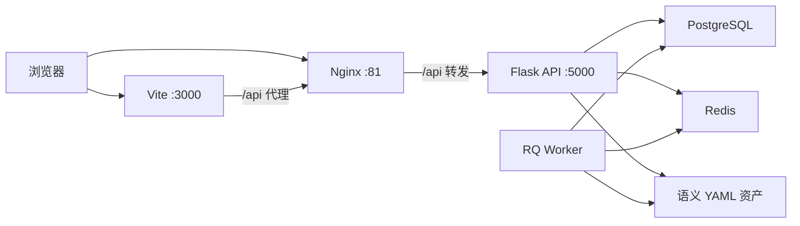

# 系统总览

本文档描述当前系统的全局结构，重点回答三个问题：

- 系统负责什么，不负责什么
- 主能力域如何分布
- 请求、任务和语义资产如何流转

## 1. 系统职责与边界

`cubic3-data-platform` 当前是一个面向企业数据场景的数据应用平台，主线职责包括：

- 数据源和数据集管理
- SQL 查询与查询资产管理
- 智能问数与多轮对话
- 语义建模、领域建模和语义查询
- 应用编排、执行监控和消息推送

当前不以服务端页面渲染为主，也不把所有分析能力做成单体 BI 页面。前端负责工作台体验，后端负责 API、任务编排、集成适配和持久化。

## 2. 运行拓扑

说明：

- 开发模式下，浏览器通常通过 Vite 访问前端，再经 `/api` 代理访问后端
- Docker 模式下，Nginx 同时承担静态资源托管和反向代理
- 语义建模资产并非全部落数据库，而是由后端以 YAML 仓储形式管理

## 3. 主能力域

当前主能力域可以按前后端共同的业务边界理解：

- 数据中心：数据源、数据集、表结构、预览与统计
- 查询中心：SQL 编辑、模板、历史、异步查询、可视化构建
- 智能问数：交互型问答能力，会话、消息、LLM 适配与 Web / 飞书信道复用
- 语义中心：Ontology、Catalog、Cube、Domain、View、Recipe、编译与查询；其中 `/semantic/ontology` 是业务语义工作台主入口，`/semantic/workbench` 当前承接语义诊断，旧路径只保留兼容跳转
- 应用中心：运行型应用定义、实例、执行记录
- 配置中心：信道、订阅、投递规则

这些能力域在后端映射为 `app/application/*` 和 `app/interfaces/api/v1/*` 的模块边界，在前端映射为 `frontend/src/v2/pages/*` 下的路由域。

## 4. 三条关键路径

### 4.1 同步请求路径

典型路径是：

`Browser -> React Route -> API Client -> Flask Blueprint -> Application Service / Handler -> Repository / Adapter -> PostgreSQL`

适用场景：

- 数据源和数据集管理
- 查询资产读取
- 语义资产浏览
- 配置和应用元数据维护

### 4.2 异步任务路径

典型路径是：

`API 请求 -> Application Handler -> TaskQueue / EventBus -> Redis -> RQ Worker -> 外部执行器 / 交付适配器 -> 状态回写`

适用场景：

- 数据提取执行
- 应用实例执行
- 通知和外部投递
- 部分事件驱动的后处理逻辑

### 4.3 语义资产路径

典型路径是：

`Semantic API -> Semantic Application Services -> YAML Repositories -> catalogs / cubes / domains / views / recipes`

说明：

- 语义资产当前采用“数据库元数据 + 文件资产”混合持久化
- 数据集、数据源等事实仍以数据库为准
- Cube、Domain、View、Recipe、Catalog 等语义对象由文件仓储承载

## 5. 当前稳定边界

当前系统有几条明确边界，改动时应尽量维持：

- 前端是独立 SPA，不再回到 Jinja 主导页面
- 后端通过 Flask App Factory 统一初始化，并按 `web` / `worker` 两种角色运行
- 后端核心代码按 `application / domain / infrastructure / interfaces` 分层
- 语义中心不是零散 CRUD 页，而是以工作台任务链组织
- 历史实现与当前主线冲突时，以当前代码、运行结果和基线文档为准

## 6. 参考来源

- [../TECH_STACK_AND_ARCHITECTURE.md](../TECH_STACK_AND_ARCHITECTURE.md)
- [backend.md](backend.md)
- [frontend.md](frontend.md)
- [../archive/legacy/MIGRATION_GUIDE.md](../archive/legacy/MIGRATION_GUIDE.md)
