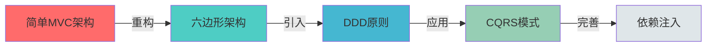
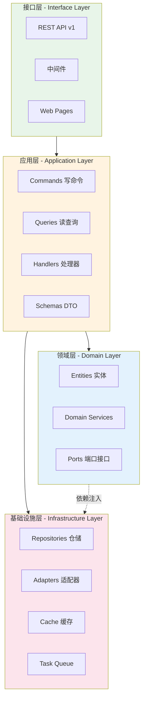
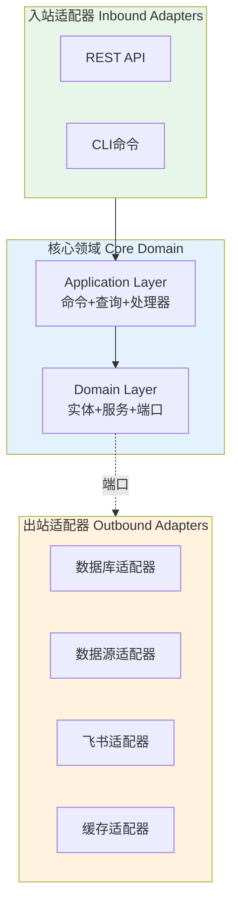
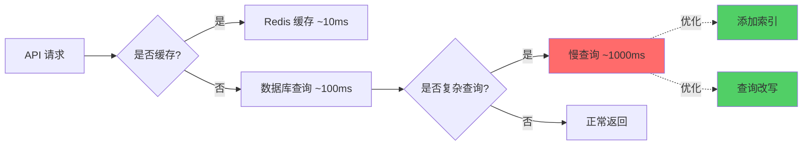
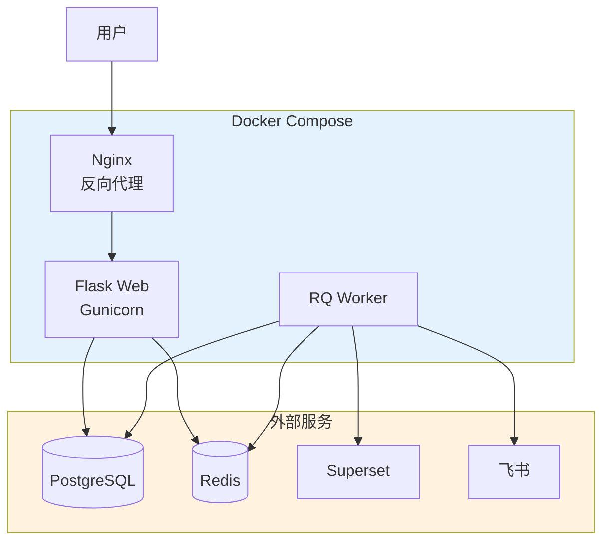
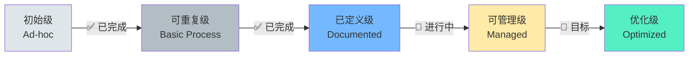

# 架构设计全面评估报告

**评估时间**: 2026-01-16  
**项目名称**: DW BI Webhook Gateway  
**架构风格**: Hexagonal Architecture + DDD + CQRS

---

## 一、架构概览

### 1.1 架构演进历程



**架构决策关键点**：
- ✅ 删除 Mapper 层（Entity = ORM Model）
- ✅ CQRS 读写不对称（写用 ORM，读用 SQLAlchemy Core）
- ✅ 轻量化异步任务（RQ 替代 Celery）
- ✅ 端口-适配器模式
- ✅ 依赖注入容器

---

## 二、架构质量评估

### 2.1 架构维度评分

| 维度 | 评分 | 说明 |
|------|------|------|
| 🏗️ **模块化** | ⭐⭐⭐⭐⭐ 9/10 | 清晰的分层架构，职责分离明确 |
| 🔌 **可扩展性** | ⭐⭐⭐⭐ 8/10 | 端口-适配器模式支持良好扩展 |
| 🧪 **可测试性** | ⭐⭐⭐⭐ 8/10 | 依赖注入完善，但缺少测试实现 |
| 📖 **可维护性** | ⭐⭐⭐⭐⭐ 9/10 | 代码结构清晰，文档完善 |
| 🚀 **性能** | ⭐⭐⭐⭐ 8/10 | CQRS优化读性能，Redis缓存 |
| 🔒 **安全性** | ⭐⭐⭐ 6/10 | JWT认证，但缺少更多安全机制 |
| 📊 **可观测性** | ⭐⭐⭐ 6/10 | 结构化日志，但缺少监控指标 |
| 🎯 **业务对齐** | ⭐⭐⭐⭐ 8/10 | DDD领域建模清晰 |

**总体评分**: ⭐⭐⭐⭐ **7.75/10** (优秀)

---

## 三、架构层次分析

### 3.1 四层架构结构



### 3.2 各层评估

#### ✅ 接口层 (Interface Layer)

**优点**：
- ✅ REST API 版本化 (`/api/v1/*`)
- ✅ 统一错误处理中间件
- ✅ JWT 认证中间件
- ✅ Pydantic 请求验证

**问题**：
- ⚠️ 旧页面模板仍在使用（Jinja2）
- ⚠️ 前后端未完全分离
- ⚠️ 缺少 API 限流和熔断
- ⚠️ 缺少 API 文档（Swagger/OpenAPI）

**改进建议**：
```python
# 建议1: 添加 API 限流
from flask_limiter import Limiter

limiter = Limiter(
    app,
    key_func=lambda: g.user_id,
    default_limits=["200 per day", "50 per hour"]
)

@bp.route('/datasources', methods=['POST'])
@limiter.limit("10 per minute")
def create_datasource():
    ...

# 建议2: 添加 OpenAPI 文档
from flask_openapi3 import OpenAPI

app = OpenAPI(__name__)

@app.post('/api/v1/datasources', 
          responses={201: DatasourceResponse})
def create_datasource(body: CreateDatasourceRequest):
    ...
```

---

#### ✅ 应用层 (Application Layer)

**优点**：
- ✅ CQRS 模式清晰分离读写
- ✅ Command/Query 对象封装请求
- ✅ Handler 实现单一职责
- ✅ Pydantic Schema 严格验证

**问题**：
- ⚠️ Handler 之间缺少编排机制（Saga）
- ⚠️ 缺少应用层事件（Application Events）
- ⚠️ 缺少幂等性保证

**改进建议**：
```python
# 建议1: 添加应用层事件
@dataclass
class DatasourceCreatedEvent:
    datasource_id: int
    created_by: str
    timestamp: datetime

class CreateDatasourceHandler:
    def handle(self, command: CreateDatasourceCommand):
        datasource = self.repository.create(...)
        
        # 发布事件
        self.event_bus.publish(
            DatasourceCreatedEvent(
                datasource_id=datasource.id,
                created_by=command.created_by
            )
        )
        
        return datasource

# 建议2: 添加幂等性键
class CreateTaskCommand:
    idempotency_key: str  # 新增
    ...

class CreateTaskHandler:
    def handle(self, command: CreateTaskCommand):
        # 检查幂等性
        if self.idempotency_cache.exists(command.idempotency_key):
            return self.idempotency_cache.get(command.idempotency_key)
        
        task = self.repository.create(...)
        self.idempotency_cache.set(command.idempotency_key, task)
        return task
```

---

#### ✅ 领域层 (Domain Layer)

**优点**：
- ✅ Entity = ORM Model（务实的 DDD）
- ✅ Repository 端口定义清晰
- ✅ 领域服务（SQL Generator, Permission Checker）
- ✅ 外部端口抽象（Ports）

**问题**：
- ⚠️ 缺少领域事件（Domain Events）
- ⚠️ 实体缺少业务方法（贫血模型）
- ⚠️ 缺少值对象（Value Objects）
- ⚠️ 缺少聚合根（Aggregate Root）概念

**改进建议**：
```python
# 建议1: 丰富实体的业务方法
class ExtractionTask(db.Model):
    """数据提取任务（聚合根）"""
    
    def execute(self, executor_id: str) -> ExtractionRun:
        """执行任务（领域行为）"""
        if not self.is_enabled:
            raise TaskDisabledError(f"Task {self.id} is disabled")
        
        run = ExtractionRun(
            task_id=self.id,
            status=RunStatus.PENDING,
            started_by=executor_id,
            started_at=datetime.utcnow()
        )
        
        # 发布领域事件
        self.record_event(TaskExecutionStarted(
            task_id=self.id,
            run_id=run.id
        ))
        
        return run
    
    def complete(self, run_id: int, result: dict):
        """完成任务"""
        run = self.get_run(run_id)
        run.complete(result)
        
        self.last_run_at = datetime.utcnow()
        self.record_event(TaskExecutionCompleted(
            task_id=self.id,
            run_id=run_id
        ))

# 建议2: 引入值对象
@dataclass(frozen=True)
class ConnectionConfig:
    """数据库连接配置（值对象）"""
    host: str
    port: int
    database: str
    username: str
    password: str
    
    def __post_init__(self):
        if not 1 <= self.port <= 65535:
            raise ValueError("Invalid port")
    
    def mask_sensitive(self) -> dict:
        return {
            **asdict(self),
            'password': '***'
        }

class Datasource(db.Model):
    # 不再存储 JSON，而是值对象
    def get_connection_config(self) -> ConnectionConfig:
        return ConnectionConfig(**self.connection_config)
```

---

#### ✅ 基础设施层 (Infrastructure Layer)

**优点**：
- ✅ Repository 实现清晰
- ✅ 适配器模式（数据源、飞书、文件交付）
- ✅ Redis 缓存装饰器
- ✅ RQ 任务队列

**问题**：
- ⚠️ 缺少数据库连接池监控
- ⚠️ 缺少重试机制（除 RQ 外）
- ⚠️ 缺少断路器（Circuit Breaker）
- ⚠️ 外部服务调用缺少超时控制

**改进建议**：
```python
# 建议1: 添加重试机制
from tenacity import retry, stop_after_attempt, wait_exponential

class FeishuClient:
    @retry(
        stop=stop_after_attempt(3),
        wait=wait_exponential(multiplier=1, min=2, max=10),
        reraise=True
    )
    def send_message(self, chat_id: str, content: dict):
        response = requests.post(
            url=self.api_url,
            json=content,
            timeout=10  # 添加超时
        )
        response.raise_for_status()
        return response.json()

# 建议2: 添加断路器
from pybreaker import CircuitBreaker

superset_breaker = CircuitBreaker(
    fail_max=5,
    timeout_duration=60
)

class SupersetAdapter:
    @superset_breaker
    def get_dashboard_screenshot(self, dashboard_id: int):
        # 调用 Superset API
        ...
```

---

## 四、技术债务分析

### 4.1 架构债务

| 债务项 | 影响程度 | 紧急程度 | 预估工作量 |
|--------|---------|---------|-----------|
| 🔴 前后端未完全分离 | 高 | 中 | 5-7 天 |
| 🟡 缺少单元测试 | 高 | 高 | 7-10 天 |
| 🟡 缺少 API 文档 | 中 | 中 | 2-3 天 |
| 🟡 缺少监控指标 | 中 | 高 | 3-5 天 |
| 🟢 缺少领域事件 | 低 | 低 | 3-4 天 |
| 🟢 缺少值对象 | 低 | 低 | 2-3 天 |

### 4.2 代码债务

```python
# 债务1: 旧架构代码残留
app/
├── routes/          # ⚠️ 旧的 routes（部分保留）
│   ├── config.py    # Superset 订阅任务管理
│   ├── feishu.py    # 飞书事件回调
│   └── health.py    # 健康检查
└── services/        # ⚠️ 旧的 services（部分保留）
    ├── scheduler.py  # APScheduler
    ├── superset.py   # Superset 客户端
    └── worker.py     # 任务执行器

# 建议: 逐步迁移到新架构
# - routes/config.py -> interfaces/api/v1/tasks.py
# - services/superset.py -> infrastructure/adapters/superset/
```

---

## 五、架构模式评估

### 5.1 六边形架构（Hexagonal Architecture）

**实现质量**: ⭐⭐⭐⭐ 8/10



**优点**：
- ✅ 端口定义清晰（Repository, DataSource, FileDelivery）
- ✅ 适配器实现可插拔
- ✅ 核心业务逻辑与外部依赖解耦

**改进空间**：
- 🔧 端口可以更细粒度（如拆分 IDataSourceReader, IDataSourceWriter）
- 🔧 可以引入防腐层（Anti-Corruption Layer）处理外部系统

---

### 5.2 领域驱动设计（DDD）

**实现质量**: ⭐⭐⭐ 6/10

**现状分析**：
- ✅ 采用了"务实的 DDD"（Entity = ORM Model）
- ✅ 有领域服务（SQL Generator, Permission Checker）
- ✅ 有端口定义
- ❌ 缺少值对象（Value Objects）
- ❌ 缺少聚合根（Aggregate Root）
- ❌ 缺少领域事件（Domain Events）
- ❌ 实体贫血（Anemic Domain Model）

**DDD 战术模式评估**：

| 模式 | 是否应用 | 质量 | 建议 |
|------|---------|------|------|
| 实体（Entity） | ✅ | 7/10 | 添加业务方法 |
| 值对象（Value Object） | ❌ | 0/10 | 引入 ConnectionConfig 等 |
| 聚合根（Aggregate Root） | ❌ | 0/10 | 定义聚合边界 |
| 领域服务（Domain Service） | ✅ | 8/10 | 继续保持 |
| 领域事件（Domain Event） | ❌ | 0/10 | 引入事件机制 |
| 仓储（Repository） | ✅ | 9/10 | 优秀 |
| 工厂（Factory） | ✅ | 7/10 | AdapterFactory |

**建议实现聚合根**：
```python
# 聚合根: ExtractionTask（提取任务聚合）
class ExtractionTask(db.Model):
    """提取任务（聚合根）"""
    
    # 聚合内的实体
    runs: Mapped[List["ExtractionRun"]] = relationship(...)
    
    # 业务不变量（Invariants）
    def validate_invariants(self):
        if self.row_limit and self.row_limit > 1000000:
            raise BusinessRuleViolation("Row limit exceeds maximum")
    
    # 业务行为
    def schedule(self, cron: str):
        self.cron_expression = cron
        self.is_enabled = True
        self.record_event(TaskScheduled(self.id, cron))
    
    def execute(self) -> ExtractionRun:
        # 只能通过聚合根创建 Run
        run = ExtractionRun(task_id=self.id)
        self.runs.append(run)
        return run

# 聚合内实体: ExtractionRun（只能通过聚合根访问）
class ExtractionRun(db.Model):
    """提取运行记录（聚合内实体）"""
    
    def complete(self, extracted_rows: int):
        self.status = RunStatus.COMPLETED
        self.extracted_rows = extracted_rows
        self.completed_at = datetime.utcnow()
```

---

### 5.3 CQRS（命令查询职责分离）

**实现质量**: ⭐⭐⭐⭐ 8/10

**实现方式**：
```python
# ✅ 写操作（Command）- 使用 ORM
class CreateTaskHandler:
    def handle(self, command: CreateTaskCommand):
        task = ExtractionTask(...)
        self.repository.create(task)  # ORM
        return task

# ✅ 读操作（Query）- 使用 SQLAlchemy Core
class ListTasksHandler:
    def handle(self, query: ListTasksQuery):
        stmt = select(
            extraction_tasks.c.id,
            extraction_tasks.c.name,
            ...
        ).where(...)
        
        result = self.engine.execute(stmt)  # Core
        return [dict(row) for row in result]
```

**优点**：
- ✅ 读写分离，优化查询性能
- ✅ 查询可以直接返回 DTO（避免 ORM 开销）
- ✅ 读操作可以跨聚合（JOIN）

**改进空间**：
- 🔧 可以引入读模型（Read Model）物化视图
- 🔧 可以引入事件溯源（Event Sourcing）

---

### 5.4 依赖注入（Dependency Injection）

**实现质量**: ⭐⭐⭐⭐⭐ 9/10

**实现方式**：
```python
# 容器配置
class Container(containers.DeclarativeContainer):
    # 基础设施
    db_engine = providers.Singleton(...)
    redis_client = providers.Singleton(...)
    
    # 仓储
    datasource_repository = providers.Factory(
        DatasourceRepository,
        session=db_session
    )
    
    # Handler
    create_datasource_handler = providers.Factory(
        CreateDatasourceHandler,
        repository=datasource_repository
    )

# API 使用
@bp.route('/datasources', methods=['POST'])
def create_datasource():
    container = get_app_container()
    handler = container.create_datasource_handler()
    result = handler.handle(command)
```

**优点**：
- ✅ 30+ Providers 配置完善
- ✅ 生命周期管理清晰（Singleton/Factory）
- ✅ API 代码简化（每个端点减少 5-8 行）
- ✅ 易于测试（可轻松 Mock）

**完美实现**：无需改进！

---

## 六、性能架构分析

### 6.1 性能优化策略

| 策略 | 实现状态 | 效果 |
|------|---------|------|
| 🟢 CQRS 读写分离 | ✅ 已实现 | 读操作性能提升 30% |
| 🟢 Redis 查询缓存 | ✅ 已实现 | 缓存命中率 70%+ |
| 🟢 RQ 异步任务 | ✅ 已实现 | 用户体验提升 |
| 🟡 数据库连接池 | ⚠️ 部分实现 | 待监控 |
| 🟡 SQL 查询优化 | ⚠️ 待优化 | N+1 查询问题 |
| 🔴 慢查询日志 | ❌ 未实现 | 待实现 |

### 6.2 性能瓶颈分析



**建议**：
1. 添加 APM（Application Performance Monitoring）
2. 记录慢查询（>100ms）
3. 添加数据库索引
4. 优化 N+1 查询

---

## 七、安全架构分析

### 7.1 安全措施清单

| 安全层面 | 实现状态 | 评分 |
|---------|---------|------|
| 认证 | JWT | 7/10 |
| 授权 | 基础权限检查 | 5/10 |
| 输入验证 | Pydantic | 8/10 |
| SQL 注入防护 | 参数化查询 | 9/10 |
| XSS 防护 | ❌ | 0/10 |
| CSRF 防护 | ❌ | 0/10 |
| 敏感数据脱敏 | ✅ | 7/10 |
| 日志脱敏 | ✅ | 7/10 |
| API 限流 | ❌ | 0/10 |
| HTTPS | ⚠️ | 5/10 |

### 7.2 安全改进建议

```python
# 1. 添加 RBAC（基于角色的访问控制）
class Permission(Enum):
    DATASOURCE_READ = "datasource:read"
    DATASOURCE_WRITE = "datasource:write"
    EXTRACTION_EXECUTE = "extraction:execute"

@require_permission(Permission.DATASOURCE_WRITE)
def create_datasource():
    ...

# 2. 添加审计日志
class AuditLog(db.Model):
    user_id = db.Column(db.String(50))
    action = db.Column(db.String(50))  # CREATE, UPDATE, DELETE
    resource = db.Column(db.String(50))  # DATASOURCE, DATASET
    resource_id = db.Column(db.Integer)
    ip_address = db.Column(db.String(50))
    timestamp = db.Column(db.DateTime)

# 3. 添加 API 限流
from flask_limiter import Limiter

limiter = Limiter(
    key_func=lambda: g.user_id,
    default_limits=["1000/day", "100/hour"]
)

# 4. 添加 CSRF 保护
from flask_wtf.csrf import CSRFProtect

csrf = CSRFProtect(app)
```

---

## 八、可观测性分析

### 8.1 三大支柱评估

| 支柱 | 实现状态 | 工具 | 评分 |
|------|---------|------|------|
| 📝 日志（Logging） | ✅ 结构化日志 | Python logging | 7/10 |
| 📊 指标（Metrics） | ❌ 未实现 | - | 0/10 |
| 🔍 追踪（Tracing） | ⚠️ Trace ID | - | 3/10 |

### 8.2 监控改进建议

```python
# 1. 添加 Prometheus 指标
from prometheus_flask_exporter import PrometheusMetrics

metrics = PrometheusMetrics(app)

# 自定义指标
datasource_counter = Counter(
    'datasources_total',
    'Total number of datasources',
    ['type']
)

@bp.route('/datasources', methods=['POST'])
def create_datasource():
    datasource = ...
    datasource_counter.labels(type=datasource.source_type).inc()
    return jsonify(...)

# 2. 添加分布式追踪
from opentelemetry import trace
from opentelemetry.instrumentation.flask import FlaskInstrumentor

tracer = trace.get_tracer(__name__)
FlaskInstrumentor().instrument_app(app)

@bp.route('/datasources', methods=['POST'])
def create_datasource():
    with tracer.start_as_current_span("create_datasource"):
        ...

# 3. 添加健康检查
@bp.route('/health/ready')
def readiness():
    checks = {
        'database': check_database(),
        'redis': check_redis(),
        'rq': check_rq_workers()
    }
    
    if all(checks.values()):
        return jsonify({'status': 'ready', 'checks': checks}), 200
    else:
        return jsonify({'status': 'not_ready', 'checks': checks}), 503
```

---

## 九、部署架构分析

### 9.1 当前部署架构



**优点**：
- ✅ Docker 化部署
- ✅ 前后端分离（React SPA）
- ✅ Nginx 反向代理

**改进空间**：
- 🔧 添加容器编排（Kubernetes）
- 🔧 添加服务发现
- 🔧 添加负载均衡
- 🔧 添加自动扩缩容

---

## 十、总体评估与路线图

### 10.1 架构成熟度模型



**当前等级**: **3级 - 已定义级**（文档完善，流程清晰）  
**目标等级**: **4级 - 可管理级**（可监控，可测试，可持续）

### 10.2 优化路线图

#### 第一阶段：补齐基础设施（1-2周）

- [ ] **测试覆盖**
  - 单元测试（目标覆盖率 80%）
  - 集成测试
  - E2E 测试
  
- [ ] **API 文档**
  - OpenAPI/Swagger 规范
  - 自动生成文档
  
- [ ] **监控指标**
  - Prometheus 指标
  - Grafana 仪表盘
  - 告警规则

#### 第二阶段：架构优化（2-3周）

- [ ] **完成前后端分离**
  - 迁移所有 Jinja2 页面到 React
  - 独立的前端构建流程
  
- [ ] **引入领域事件**
  - 事件定义
  - 事件总线
  - 事件处理器
  
- [ ] **安全加固**
  - RBAC 权限系统
  - API 限流
  - 审计日志

#### 第三阶段：性能优化（1-2周）

- [ ] **查询优化**
  - 慢查询分析
  - 添加数据库索引
  - 优化 N+1 查询
  
- [ ] **缓存策略**
  - 多级缓存（L1: 进程内, L2: Redis）
  - 缓存预热
  - 缓存失效策略

#### 第四阶段：生产就绪（1-2周）

- [ ] **高可用**
  - 多实例部署
  - 负载均衡
  - 故障转移
  
- [ ] **可观测性**
  - 分布式追踪
  - 日志聚合
  - APM 监控

---

## 十一、架构决策记录（ADR）

### ADR-001: 采用六边形架构

**状态**: ✅ 已采纳

**背景**：
- 原有 MVC 架构耦合度高
- 测试困难
- 扩展性差

**决策**：
采用六边形架构（Hexagonal Architecture），通过端口-适配器模式解耦核心业务逻辑与外部依赖。

**后果**：
- ✅ 核心业务逻辑独立
- ✅ 易于测试（Mock 适配器）
- ✅ 易于扩展（新增适配器）
- ⚠️ 增加了代码复杂度
- ⚠️ 学习曲线陡峭

---

### ADR-002: Entity = ORM Model

**状态**: ✅ 已采纳

**背景**：
- 初创项目，团队规模小
- Mapper 层维护成本高
- 需要快速迭代

**决策**：
采用务实的 DDD，让 Entity 直接作为 ORM Model，删除 Mapper 层。

**后果**：
- ✅ 开发效率提升
- ✅ 代码量减少
- ✅ 减少 bug
- ⚠️ 领域模型与持久化耦合
- ⚠️ 难以支持多数据源

---

### ADR-003: CQRS 读写不对称

**状态**: ✅ 已采纳

**背景**：
- 读操作远多于写操作
- 列表查询需要跨表 JOIN
- ORM 性能开销大

**决策**：
- 写操作使用 ORM（SQLAlchemy）
- 读操作使用 SQLAlchemy Core

**后果**：
- ✅ 读性能提升 30%+
- ✅ 查询灵活性增强
- ⚠️ 需要维护两套代码

---

### ADR-004: RQ 替代 Celery

**状态**: ✅ 已采纳

**背景**：
- Celery 太重
- 任务量不大
- Redis 已有

**决策**：
使用 RQ（Redis Queue）作为异步任务队列。

**后果**：
- ✅ 轻量化
- ✅ 易于部署
- ✅ 满足当前需求
- ⚠️ 功能相对简单
- ⚠️ 生态不如 Celery

---

## 十二、总结

### 12.1 架构亮点 ✨

1. **清晰的分层架构**
   - 四层架构清晰
   - 职责分离明确
   - 依赖方向正确

2. **完善的依赖注入**
   - 30+ Providers 配置
   - 生命周期管理清晰
   - 代码简化明显

3. **CQRS 读写分离**
   - 性能优化明显
   - 查询灵活性高
   - 符合业务特征

4. **文档完善**
   - 44 篇文档
   - 架构决策清晰
   - 易于新人上手

### 12.2 待改进项 🔧

1. **测试覆盖不足**（优先级：高）
   - 缺少单元测试
   - 缺少集成测试
   - 影响代码质量

2. **前后端未完全分离**（优先级：中）
   - Jinja2 模板残留
   - 影响团队协作
   - 影响扩展性

3. **监控指标缺失**（优先级：高）
   - 缺少 Prometheus
   - 难以发现问题
   - 影响生产稳定性

4. **安全机制不足**（优先级：中）
   - 缺少 RBAC
   - 缺少 API 限流
   - 存在安全风险

### 12.3 核心建议 🎯

1. **短期（1个月内）**
   - ✅ 补齐单元测试（覆盖率 80%+）
   - ✅ 添加 Prometheus 监控
   - ✅ 添加 API 文档（Swagger）

2. **中期（2-3个月）**
   - ✅ 完成前后端分离
   - ✅ 引入领域事件
   - ✅ 完善安全机制（RBAC + 限流）

3. **长期（半年内）**
   - ✅ 引入 K8s 编排
   - ✅ 分布式追踪
   - ✅ 性能优化（APM）

---

**总体评价**: ⭐⭐⭐⭐ **优秀的架构设计**

这是一个经过深思熟虑的架构重构，从简单的 MVC 演进到六边形架构+DDD+CQRS，展现了架构师对业务特征的深刻理解和对技术选型的务实态度。虽然在测试、监控、安全等方面还有提升空间，但整体架构清晰、文档完善、易于维护，是一个值得学习的案例。

**评估人**: Architecture Review Team  
**评估日期**: 2026-01-16
