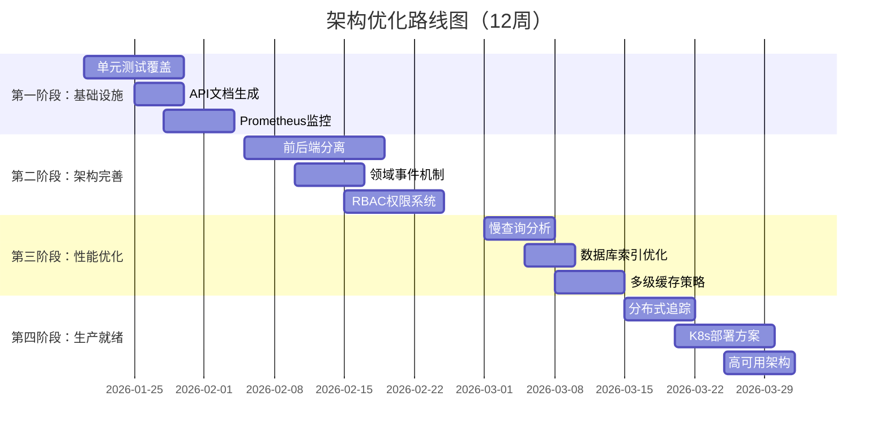
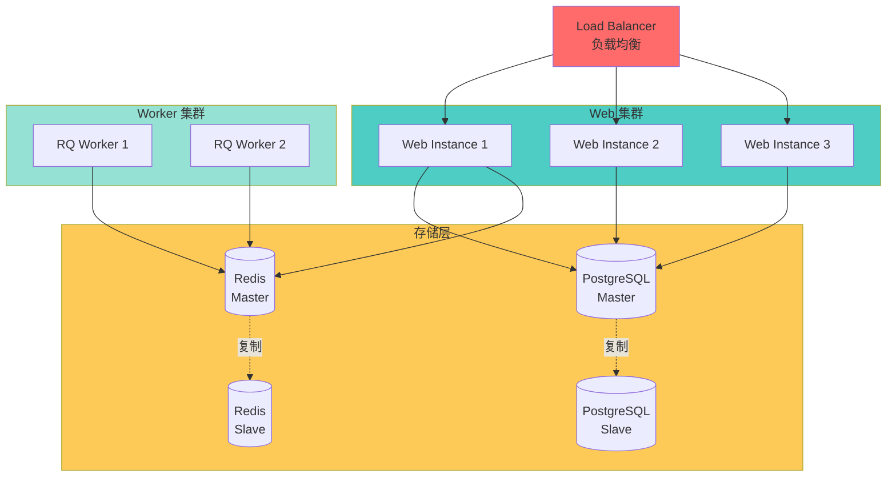

# 架构优化路线图

**制定时间**: 2026-01-16  
**当前架构评分**: ⭐⭐⭐⭐ 7.75/10  
**目标架构评分**: ⭐⭐⭐⭐⭐ 9.0/10

---

## 路线图概览



---

## 第一阶段：补齐基础设施（1-2周）

### 🎯 目标
完善测试、文档、监控等基础设施，提升代码质量和可维护性。

### 📋 任务清单

#### 1.1 单元测试覆盖

**优先级**: 🔴 高  
**工作量**: 7-10 天  
**目标覆盖率**: 80%+

```bash
# 测试框架
pip install pytest pytest-cov pytest-asyncio pytest-flask

# 目录结构
tests/
├── unit/
│   ├── domain/
│   │   ├── test_entities.py
│   │   └── test_domain_services.py
│   ├── application/
│   │   ├── test_commands.py
│   │   ├── test_queries.py
│   │   └── test_handlers.py
│   └── infrastructure/
│       └── test_repositories.py
├── integration/
│   ├── test_datasource_api.py
│   ├── test_dataset_api.py
│   └── test_extraction_api.py
└── conftest.py
```

**测试示例**：
```python
# tests/unit/domain/test_entities.py
def test_extraction_task_execute():
    """测试任务执行逻辑"""
    task = ExtractionTask(
        task_name="test",
        dataset_id=1,
        is_enabled=True
    )
    
    run = task.execute(executor_id="admin")
    
    assert run.task_id == task.id
    assert run.status == RunStatus.PENDING

# tests/integration/test_datasource_api.py
def test_create_datasource_flow(client):
    """测试创建数据源完整流程"""
    response = client.post('/api/v1/datasources', json={
        'name': 'Test DB',
        'source_type': 'postgresql',
        'connection_config': {...}
    }, headers={'X-User-Id': 'test'})
    
    assert response.status_code == 201
    assert response.json['code'] == 0
```

**验收标准**：
- ✅ 总覆盖率达到 80%
- ✅ Domain 层覆盖率 90%+
- ✅ Application 层覆盖率 85%+
- ✅ CI/CD 自动运行测试

---

#### 1.2 API 文档生成

**优先级**: 🟡 中  
**工作量**: 2-3 天

**技术方案**：
```python
# 方案1: Flask-RESTX
from flask_restx import Api, Resource, fields

api = Api(
    title='DW BI Gateway API',
    version='1.0',
    description='数据服务平台 API 文档'
)

datasource_model = api.model('Datasource', {
    'id': fields.Integer(required=True),
    'name': fields.String(required=True),
    'source_type': fields.String(required=True)
})

@api.route('/api/v1/datasources')
class DatasourceList(Resource):
    @api.doc('list_datasources')
    @api.marshal_list_with(datasource_model)
    def get(self):
        """获取数据源列表"""
        pass
```

**产出物**：
- ✅ Swagger UI：http://localhost:5000/docs
- ✅ OpenAPI JSON：http://localhost:5000/openapi.json
- ✅ ReDoc 文档：http://localhost:5000/redoc

---

#### 1.3 Prometheus 监控

**优先级**: 🔴 高  
**工作量**: 3-5 天

**指标设计**：
```python
from prometheus_flask_exporter import PrometheusMetrics

metrics = PrometheusMetrics(app)

# 自定义指标
api_requests = Counter(
    'api_requests_total',
    'Total API requests',
    ['method', 'endpoint', 'status']
)

datasource_count = Gauge(
    'datasources_total',
    'Total number of datasources',
    ['type', 'status']
)

extraction_duration = Histogram(
    'extraction_duration_seconds',
    'Extraction task duration',
    ['dataset_name']
)
```

**Grafana 仪表盘**：
- API 请求率、错误率、延迟
- 数据源统计（按类型、状态）
- 任务执行情况（成功率、耗时）
- 系统资源使用率

**告警规则**：
```yaml
# prometheus-rules.yml
groups:
  - name: api_alerts
    rules:
      - alert: HighErrorRate
        expr: rate(api_requests_total{status="5xx"}[5m]) > 0.05
        for: 5m
        labels:
          severity: critical
        annotations:
          summary: "API error rate > 5%"
```

---

## 第二阶段：架构完善（2-3周）

### 🎯 目标
完成前后端分离，引入领域事件，完善安全机制。

### 📋 任务清单

#### 2.1 前后端完全分离

**优先级**: 🔴 高  
**工作量**: 10-14 天

**迁移计划**：
```
旧的 Jinja2 模板 -> React 组件

✅ datasources.html      -> src/pages/Datasources.tsx
✅ datasets_list.html    -> src/pages/Datasets.tsx
✅ extraction_tasks.html -> src/pages/ExtractionTasks.tsx
🔄 dashboard.html        -> src/pages/Dashboard.tsx
🔄 superset_new.html     -> src/pages/SupersetSubscription.tsx
🔄 extract_new.html      -> src/pages/CreateTask.tsx
```

**技术栈**：
- ✅ React 18 + TypeScript
- ✅ Vite（构建工具）
- ✅ Ant Design（UI 组件）
- ✅ TanStack Query（数据获取）
- ✅ Zustand（状态管理）
- ✅ React Router（路由）

**产出物**：
- ✅ 完整的 React SPA
- ✅ 独立的前端构建流程
- ✅ Nginx 反向代理配置
- ✅ Docker 多阶段构建

---

#### 2.2 领域事件机制

**优先级**: 🟡 中  
**工作量**: 5-7 天

**架构设计**：
```python
# 1. 定义领域事件
@dataclass
class DomainEvent:
    event_id: str = field(default_factory=lambda: str(uuid4()))
    occurred_at: datetime = field(default_factory=datetime.utcnow)

@dataclass
class DatasourceCreated(DomainEvent):
    datasource_id: int
    created_by: str

# 2. 事件总线
class EventBus:
    def __init__(self):
        self._handlers: Dict[Type[DomainEvent], List[Callable]] = {}
    
    def subscribe(self, event_type: Type[DomainEvent], handler: Callable):
        if event_type not in self._handlers:
            self._handlers[event_type] = []
        self._handlers[event_type].append(handler)
    
    def publish(self, event: DomainEvent):
        handlers = self._handlers.get(type(event), [])
        for handler in handlers:
            handler(event)

# 3. 实体记录事件
class Datasource(db.Model):
    def __init__(self, *args, **kwargs):
        super().__init__(*args, **kwargs)
        self._domain_events: List[DomainEvent] = []
    
    def record_event(self, event: DomainEvent):
        self._domain_events.append(event)
    
    @staticmethod
    def create(name: str, source_type: str, created_by: str):
        datasource = Datasource(name=name, source_type=source_type)
        datasource.record_event(
            DatasourceCreated(
                datasource_id=datasource.id,
                created_by=created_by
            )
        )
        return datasource

# 4. Handler 发布事件
class CreateDatasourceHandler:
    def handle(self, command: CreateDatasourceCommand):
        datasource = Datasource.create(...)
        self.repository.save(datasource)
        
        # 发布事件
        for event in datasource._domain_events:
            self.event_bus.publish(event)
        
        return datasource

# 5. 事件处理器
class DatasourceCreatedHandler:
    def handle(self, event: DatasourceCreated):
        # 发送通知
        self.notification_service.notify(
            f"数据源 {event.datasource_id} 已创建"
        )
        
        # 记录审计日志
        self.audit_log.record(event)
```

**应用场景**：
- ✅ 审计日志
- ✅ 消息通知
- ✅ 数据同步
- ✅ 统计更新

---

#### 2.3 RBAC 权限系统

**优先级**: 🟡 中  
**工作量**: 7-10 天

**权限模型**：
```python
# 1. 定义权限枚举
class Permission(str, Enum):
    # 数据源权限
    DATASOURCE_READ = "datasource:read"
    DATASOURCE_WRITE = "datasource:write"
    DATASOURCE_DELETE = "datasource:delete"
    
    # 数据集权限
    DATASET_READ = "dataset:read"
    DATASET_WRITE = "dataset:write"
    DATASET_DELETE = "dataset:delete"
    
    # 提取任务权限
    EXTRACTION_READ = "extraction:read"
    EXTRACTION_WRITE = "extraction:write"
    EXTRACTION_EXECUTE = "extraction:execute"

# 2. 角色定义
class Role(db.Model):
    id = db.Column(db.Integer, primary_key=True)
    name = db.Column(db.String(50), unique=True)
    permissions = db.Column(JSONB)  # List[Permission]

# 预定义角色
ROLES = {
    'admin': [Permission.DATASOURCE_WRITE, ...],
    'analyst': [Permission.DATASOURCE_READ, ...],
    'viewer': [Permission.DATASOURCE_READ, ...]
}

# 3. 权限装饰器
from functools import wraps

def require_permission(permission: Permission):
    def decorator(f):
        @wraps(f)
        def decorated_function(*args, **kwargs):
            if not has_permission(g.user_id, permission):
                return jsonify({
                    'code': -1,
                    'message': 'Permission denied'
                }), 403
            return f(*args, **kwargs)
        return decorated_function
    return decorator

# 4. API 使用
@bp.route('/datasources', methods=['POST'])
@require_auth
@require_permission(Permission.DATASOURCE_WRITE)
def create_datasource():
    ...
```

**审计日志**：
```python
class AuditLog(db.Model):
    id = db.Column(db.Integer, primary_key=True)
    user_id = db.Column(db.String(50), index=True)
    action = db.Column(db.String(50))  # CREATE, UPDATE, DELETE, EXECUTE
    resource_type = db.Column(db.String(50))  # DATASOURCE, DATASET, TASK
    resource_id = db.Column(db.Integer)
    ip_address = db.Column(db.String(50))
    user_agent = db.Column(db.String(200))
    request_id = db.Column(db.String(50))
    timestamp = db.Column(db.DateTime, default=datetime.utcnow, index=True)
    
    # 变更详情
    before_value = db.Column(JSONB)
    after_value = db.Column(JSONB)
```

---

## 第三阶段：性能优化（1-2周）

### 🎯 目标
优化查询性能，提升系统响应速度。

### 📋 任务清单

#### 3.1 慢查询分析

**优先级**: 🔴 高  
**工作量**: 5-7 天

**分析工具**：
```python
# 1. 慢查询日志记录
from sqlalchemy import event
from sqlalchemy.engine import Engine

@event.listens_for(Engine, "before_cursor_execute")
def before_cursor_execute(conn, cursor, statement, parameters, context, executemany):
    conn.info.setdefault('query_start_time', []).append(time.time())

@event.listens_for(Engine, "after_cursor_execute")
def after_cursor_execute(conn, cursor, statement, parameters, context, executemany):
    total = time.time() - conn.info['query_start_time'].pop()
    
    if total > 0.1:  # 超过 100ms
        logger.warning(
            f"Slow query: {total:.2f}s",
            extra={
                'sql': statement,
                'params': parameters,
                'duration_ms': total * 1000
            }
        )

# 2. 查询分析
EXPLAIN ANALYZE
SELECT d.id, d.name, COUNT(ds.id) as dataset_count
FROM datasources d
LEFT JOIN datasets ds ON ds.source_id = d.id
GROUP BY d.id, d.name;
```

**优化示例**：
```python
# ❌ N+1 查询问题
datasources = Datasource.query.all()
for ds in datasources:
    dataset_count = Dataset.query.filter_by(source_id=ds.id).count()

# ✅ 优化：使用 JOIN + GROUP BY
from sqlalchemy import func

result = db.session.query(
    Datasource.id,
    Datasource.name,
    func.count(Dataset.id).label('dataset_count')
).outerjoin(Dataset).group_by(Datasource.id).all()
```

---

#### 3.2 数据库索引优化

**优先级**: 🔴 高  
**工作量**: 3-5 天

**索引策略**：
```sql
-- 1. 查询频率高的字段
CREATE INDEX idx_datasources_source_type ON datasources(source_type);
CREATE INDEX idx_datasources_is_active ON datasources(is_active);

-- 2. 外键字段
CREATE INDEX idx_datasets_source_id ON datasets(source_id);
CREATE INDEX idx_extraction_runs_task_id ON extraction_runs(task_id);

-- 3. 时间范围查询
CREATE INDEX idx_extraction_runs_created_at ON extraction_runs(created_at);
CREATE INDEX idx_audit_logs_timestamp ON audit_logs(timestamp);

-- 4. 组合索引
CREATE INDEX idx_datasources_type_active 
ON datasources(source_type, is_active);

-- 5. 部分索引
CREATE INDEX idx_active_datasources 
ON datasources(id) 
WHERE is_active = true;
```

**索引监控**：
```sql
-- 检查未使用的索引
SELECT
    schemaname,
    tablename,
    indexname,
    idx_scan as index_scans
FROM pg_stat_user_indexes
WHERE idx_scan = 0
ORDER BY schemaname, tablename;

-- 检查表膨胀
SELECT
    schemaname,
    tablename,
    pg_size_pretty(pg_total_relation_size(schemaname||'.'||tablename))
FROM pg_tables
ORDER BY pg_total_relation_size(schemaname||'.'||tablename) DESC;
```

---

#### 3.3 多级缓存策略

**优先级**: 🟡 中  
**工作量**: 5-7 天

**缓存架构**：
```python
# L1 缓存: 进程内缓存（快速，但不共享）
from cachetools import TTLCache

l1_cache = TTLCache(maxsize=1000, ttl=60)

# L2 缓存: Redis（共享，持久化）
from app.infrastructure.cache.redis_client import get_redis_client

redis = get_redis_client()

# 多级缓存装饰器
def multi_level_cache(key_prefix: str, ttl: int = 300):
    def decorator(func):
        @wraps(func)
        def wrapper(*args, **kwargs):
            cache_key = f"{key_prefix}:{args}:{kwargs}"
            
            # 1. 尝试 L1 缓存
            if cache_key in l1_cache:
                return l1_cache[cache_key]
            
            # 2. 尝试 L2 缓存（Redis）
            l2_value = redis.get(cache_key)
            if l2_value:
                result = json.loads(l2_value)
                l1_cache[cache_key] = result
                return result
            
            # 3. 执行查询
            result = func(*args, **kwargs)
            
            # 4. 写入缓存
            l1_cache[cache_key] = result
            redis.setex(cache_key, ttl, json.dumps(result))
            
            return result
        return wrapper
    return decorator

# 使用示例
@multi_level_cache('datasource_list', ttl=300)
def list_datasources(source_type: str = None):
    query = Datasource.query
    if source_type:
        query = query.filter_by(source_type=source_type)
    return query.all()
```

**缓存预热**：
```python
# 应用启动时预热热点数据
def warmup_cache():
    """缓存预热"""
    with app.app_context():
        # 预热数据源列表
        list_datasources()
        
        # 预热数据集列表
        list_datasets()
        
        # 预热统计数据
        get_statistics()
```

---

## 第四阶段：生产就绪（1-2周）

### 🎯 目标
提升系统可靠性，实现高可用架构。

### 📋 任务清单

#### 4.1 分布式追踪

**优先级**: 🟡 中  
**工作量**: 5-7 天

**技术方案**: OpenTelemetry + Jaeger

```python
from opentelemetry import trace
from opentelemetry.instrumentation.flask import FlaskInstrumentor
from opentelemetry.instrumentation.sqlalchemy import SQLAlchemyInstrumentor
from opentelemetry.exporter.jaeger.thrift import JaegerExporter
from opentelemetry.sdk.trace import TracerProvider
from opentelemetry.sdk.trace.export import BatchSpanProcessor

# 配置追踪
trace.set_tracer_provider(TracerProvider())
jaeger_exporter = JaegerExporter(
    agent_host_name="localhost",
    agent_port=6831,
)
trace.get_tracer_provider().add_span_processor(
    BatchSpanProcessor(jaeger_exporter)
)

# 自动注入
FlaskInstrumentor().instrument_app(app)
SQLAlchemyInstrumentor().instrument(engine=engine)

# 手动埋点
tracer = trace.get_tracer(__name__)

@bp.route('/datasources', methods=['POST'])
def create_datasource():
    with tracer.start_as_current_span("create_datasource"):
        # 业务逻辑
        with tracer.start_as_current_span("validate_request"):
            schema = CreateDatasourceRequest(**data)
        
        with tracer.start_as_current_span("create_in_db"):
            datasource = handler.handle(command)
        
        return jsonify(...)
```

**追踪链示例**：
```
API Request → create_datasource
  ├─ validate_request (5ms)
  ├─ create_in_db (50ms)
  │  ├─ CreateDatasourceHandler.handle (45ms)
  │  │  ├─ DatasourceRepository.create (40ms)
  │  │  │  └─ SQL INSERT (35ms)
  │  │  └─ EventBus.publish (5ms)
  │  └─ transaction_commit (5ms)
  └─ serialize_response (3ms)
Total: 58ms
```

---

#### 4.2 Kubernetes 部署

**优先级**: 🟡 中  
**工作量**: 7-10 天

**K8s 架构**：
```yaml
# deployment.yaml
apiVersion: apps/v1
kind: Deployment
metadata:
  name: dw-bi-gateway
spec:
  replicas: 3  # 3个实例
  selector:
    matchLabels:
      app: dw-bi-gateway
  template:
    metadata:
      labels:
        app: dw-bi-gateway
    spec:
      containers:
      - name: web
        image: dw-bi-gateway:latest
        ports:
        - containerPort: 5000
        env:
        - name: DATABASE_URL
          valueFrom:
            secretKeyRef:
              name: db-secret
              key: url
        resources:
          requests:
            memory: "256Mi"
            cpu: "250m"
          limits:
            memory: "512Mi"
            cpu: "500m"
        livenessProbe:
          httpGet:
            path: /health
            port: 5000
          initialDelaySeconds: 30
          periodSeconds: 10
        readinessProbe:
          httpGet:
            path: /health/ready
            port: 5000
          initialDelaySeconds: 5
          periodSeconds: 5

---
# service.yaml
apiVersion: v1
kind: Service
metadata:
  name: dw-bi-gateway
spec:
  selector:
    app: dw-bi-gateway
  ports:
  - protocol: TCP
    port: 80
    targetPort: 5000
  type: LoadBalancer

---
# hpa.yaml (自动扩缩容)
apiVersion: autoscaling/v2
kind: HorizontalPodAutoscaler
metadata:
  name: dw-bi-gateway-hpa
spec:
  scaleTargetRef:
    apiVersion: apps/v1
    kind: Deployment
    name: dw-bi-gateway
  minReplicas: 2
  maxReplicas: 10
  metrics:
  - type: Resource
    resource:
      name: cpu
      target:
        type: Utilization
        averageUtilization: 70
```

---

#### 4.3 高可用架构

**优先级**: 🔴 高  
**工作量**: 5-7 天

**高可用组件**：


**故障转移**：
- ✅ Web 实例故障：负载均衡器自动摘除
- ✅ Worker 故障：RQ 自动重试
- ✅ PostgreSQL 主库故障：Patroni 自动切换
- ✅ Redis 主库故障：Sentinel 自动切换

---

## 评估指标

### 架构质量指标

| 指标 | 当前值 | 第一阶段 | 第二阶段 | 第三阶段 | 第四阶段 |
|------|--------|---------|---------|---------|---------|
| 测试覆盖率 | 0% | 80% | 85% | 90% | 90% |
| API 文档完整度 | 0% | 100% | 100% | 100% | 100% |
| 代码重复率 | 15% | 12% | 10% | 8% | 5% |
| 技术债务 | 高 | 中 | 低 | 低 | 极低 |

### 性能指标

| 指标 | 当前值 | 第一阶段 | 第二阶段 | 第三阶段 | 第四阶段 |
|------|--------|---------|---------|---------|---------|
| API 响应时间 (P95) | 500ms | 500ms | 450ms | 200ms | 150ms |
| 缓存命中率 | 70% | 70% | 75% | 85% | 90% |
| 并发处理能力 | 100 req/s | 150 req/s | 200 req/s | 500 req/s | 1000 req/s |

### 可用性指标

| 指标 | 当前值 | 第一阶段 | 第二阶段 | 第三阶段 | 第四阶段 |
|------|--------|---------|---------|---------|---------|
| 系统可用性 | 99% | 99.5% | 99.5% | 99.9% | 99.95% |
| MTTR（平均修复时间） | 60min | 45min | 30min | 15min | 10min |
| 故障恢复时间 | 手动 | 半自动 | 半自动 | 自动 | 自动 |

---

## 资源需求

### 人力资源

| 角色 | 第一阶段 | 第二阶段 | 第三阶段 | 第四阶段 |
|------|---------|---------|---------|---------|
| 后端开发 | 1-2人 | 2人 | 1-2人 | 2人 |
| 前端开发 | - | 2人 | - | - |
| 测试工程师 | 1人 | 1人 | 1人 | 1人 |
| DevOps | - | - | 1人 | 1人 |

### 基础设施

| 资源 | 当前 | 第一阶段 | 第二阶段 | 第三阶段 | 第四阶段 |
|------|------|---------|---------|---------|---------|
| Web 实例 | 1 | 2 | 2 | 3 | 3+ (自动扩缩) |
| Worker 实例 | 1 | 2 | 2 | 2 | 2+ (自动扩缩) |
| PostgreSQL | 单机 | 主从 | 主从 | 主从 | 主从 + 只读副本 |
| Redis | 单机 | 主从 | 主从 | 主从 | 主从 + Sentinel |

---

## 风险评估

### 高风险项

| 风险项 | 影响 | 概率 | 缓解措施 |
|--------|------|------|---------|
| 前后端分离影响业务 | 高 | 中 | 渐进式迁移，保留旧页面作为备份 |
| 测试覆盖不足导致回归 | 高 | 中 | 先写测试，再重构代码 |
| K8s 部署复杂度高 | 中 | 高 | 先使用 Docker Compose，逐步迁移 |

### 中风险项

| 风险项 | 影响 | 概率 | 缓解措施 |
|--------|------|------|---------|
| 领域事件引入复杂度 | 中 | 中 | 从简单场景开始，逐步推广 |
| 性能优化效果不明显 | 中 | 低 | 提前做性能基准测试 |
| 监控告警过多 | 低 | 中 | 合理设置告警阈值 |

---

## 验收标准

### 第一阶段验收

- [ ] 单元测试覆盖率 ≥ 80%
- [ ] Swagger API 文档可访问
- [ ] Grafana 仪表盘正常显示
- [ ] CI/CD 流程自动运行测试

### 第二阶段验收

- [ ] 所有页面迁移到 React
- [ ] 领域事件机制正常工作
- [ ] RBAC 权限系统生效
- [ ] 审计日志完整记录

### 第三阶段验收

- [ ] API P95 响应时间 < 200ms
- [ ] 缓存命中率 ≥ 85%
- [ ] 数据库慢查询 < 5%
- [ ] 并发处理能力 ≥ 500 req/s

### 第四阶段验收

- [ ] 分布式追踪链路完整
- [ ] K8s 部署成功
- [ ] 自动扩缩容正常工作
- [ ] 系统可用性 ≥ 99.9%

---

**制定人**: Architecture Team  
**审核人**: Tech Lead  
**批准人**: CTO
