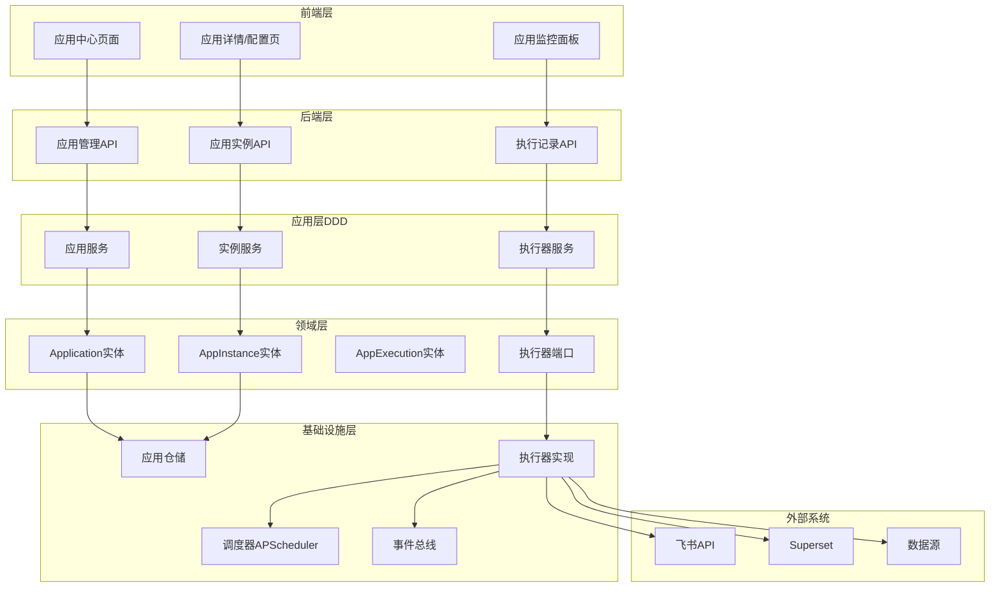

# 应用中心产品需求文档（PRD）

**版本**: v1.0  
**创建日期**: 2026-01-21  
**负责人**: 产品团队  
**状态**: 设计阶段

---

## 文档概述

本文档定义了 BI 数据平台"应用中心"模块的完整产品需求，包括产品定位、功能设计、技术架构、实施计划等。

### ⚠️ 重要设计原则

**应用中心是轻量级的调度和监控平台**，核心职责是：
- ✅ 应用实例的配置管理
- ✅ 定时任务的调度执行
- ✅ 执行记录的监控查询
- ❌ **不引入浏览器自动化**（Selenium、Puppeteer 等）
- ❌ **不实现重型数据处理**（大规模计算、图表渲染等）

所有重型操作应依赖专业平台：
- **看板截图** → Superset 内置 API
- **图表生成** → BI 平台或前端渲染
- **数据处理** → 数据源或数据仓库

---

## 1. 产品定位与目标

### 1.1 产品定位

应用中心是 BI 数据平台的**统一运行型应用管理入口**，为数据分析师、业务人员和开发者提供一站式的应用安装、配置、监控和管理能力。核心价值是将数据推送、通知提醒、固定 prompt + tool workflow 等**单次执行型能力**整合到统一平台，降低使用门槛。

当前边界明确如下：

- 应用中心承载“应用定义 → 应用实例 → 执行记录”的运行域
- `DataAgent` 归入应用中心，因为它是固定 prompt + tool 的一次执行 workflow，支持调度、推送和执行审计
- 智能问数不归入应用中心主 IA，它属于交互型能力域
- 平台内置 chatbot 与飞书问数 Bot 视为同一交互型能力的两个接入信道
- 本 PRD 不定义对话式智能问数入口，对话式能力由智能问数域单独承载

### 1.2 用户画像与价值

| 用户角色 | 核心需求 | 价值主张 |
|---------|---------|---------|
| 业务人员 | 无需技术背景即可配置看板推送、报表订阅 | 表单化配置，零代码上手 |
| 数据分析师 | 快速创建查询结果推送、异常监控 | 灵活配置，支持SQL和模板 |
| 管理员 | 集中管理所有应用的状态和执行记录 | 统一监控面板，权限管控 |

### 1.3 核心设计原则

1. **轻量级架构**：应用中心只负责调度和监控，不引入重型依赖（如浏览器、Selenium）
2. **依赖专业平台**：截图等重操作交给 BI 平台（Superset）内置功能，数据平台专注编排
3. **简单优先**：表单化配置，降低技术门槛
4. **灵活可控**：支持高级用户切换到代码模式（JSON/YAML）
5. **即时反馈**：仪表盘实时展示应用运行状态
6. **可观测性**：所有执行记录可追溯，便于排查问题
7. **架构解耦**：执行器抽象允许灵活扩展新应用类型

补充边界原则：

8. **运行与交互分域**：运行型能力进入应用中心，交互型问答能力进入智能问数
9. **信道不是产品分类**：飞书 Bot 与 Web chatbot 只是交互能力的不同接入信道，不单独作为应用分类

---

## 2. 业务场景

### 2.1 典型场景描述

#### 场景 1：每日销售看板自动推送
**角色**: 销售总监（非技术背景）  
**痛点**: 每天需要手动打开 Superset 查看销售数据看板  
**解决方案**: 配置"BI看板推送"应用，每天早上 9 点自动截图并推送到管理层飞书群

**操作流程**:
1. 进入应用中心，点击"BI看板推送"应用
2. 填写表单：看板 URL、飞书群 ID、推送时间（Cron: `0 9 * * *`）
3. 点击"启用"，应用开始定时执行
4. 每天早上 9 点，飞书群自动收到看板截图

#### 场景 2：数据异常实时告警
**角色**: 数据分析师  
**痛点**: 订单量突然异常下降时无法及时发现  
**解决方案**: 配置"异常数据监控"应用，每 10 分钟检查订单量，低于阈值时告警

**操作流程**:
1. 创建"异常数据监控"实例
2. 配置监控 SQL: `SELECT COUNT(*) FROM orders WHERE date = CURRENT_DATE`
3. 设置阈值范围: 最小 100，最大 10000
4. 选择告警渠道：飞书群
5. 当订单量超出范围时，飞书群实时收到告警消息

#### 场景 3：数据提取完成通知
**角色**: 业务分析师  
**痛点**: 不知道数据提取任务何时完成，需要反复刷新页面  
**解决方案**: 配置"提取完成通知"应用，任务完成后自动推送飞书消息

**操作流程**:
1. 创建"提取完成通知"实例
2. 配置筛选条件：仅通知包含"销售"关键词的任务
3. 配置飞书群 ID
4. 提取任务完成后，自动收到飞书通知（包含下载链接）

---

## 3. 功能需求

### 3.1 应用市场（首页）

#### 功能描述
以仪表盘风格展示所有可用应用，支持快速启用、查看状态和访问配置。

#### 页面布局

```
┌─────────────────────────────────────────────────────┐
│  应用中心                           [+ 我的应用实例]  │
├─────────────────────────────────────────────────────┤
│  🔍 搜索应用...        [全部] [消息通知] [数据报表]  │
├─────────────────────────────────────────────────────┤
│  ┌──────────┐  ┌──────────┐  ┌──────────┐         │
│  │ 📊       │  │ 📋       │  │ 📅       │         │
│  │ BI看板   │  │ 数据集   │  │ 周报日报 │         │
│  │ 推送     │  │ 卡片推送 │  │ 推送     │         │
│  │          │  │          │  │          │         │
│  │ 3个实例  │  │ 1个实例  │  │ 2个实例  │         │
│  │ 运行正常 │  │ 未启用   │  │ 1个失败  │         │
│  └─[配置]──┘  └─[启用]──┘  └─[查看]──┘         │
│                                                     │
│  ┌──────────┐  ┌──────────┐  ┌──────────┐         │
│  │ 🚨       │  │ 📤       │  │ 📬       │         │
│  │ 异常数据 │  │ 查询结果 │  │ 提取完成 │         │
│  │ 监控     │  │ 推送     │  │ 通知     │         │
│  └──────────┘  └──────────┘  └──────────┘         │
└─────────────────────────────────────────────────────┘
```

#### 功能清单

| 功能项 | 描述 | 优先级 |
|-------|------|--------|
| 应用卡片展示 | 显示应用图标、名称、描述、实例数量、运行状态 | P0 |
| 分类筛选 | 按应用分类筛选（全部/消息通知/数据报表/监控告警） | P1 |
| 搜索功能 | 按应用名称搜索 | P1 |
| 快捷操作 | 卡片上提供"配置"、"启用"、"查看详情"按钮 | P0 |
| 运行状态标识 | 显示应用实例运行状态（正常/失败/未启用） | P0 |

#### 交互细节

- 鼠标悬停卡片时，显示悬浮效果（Glass Morphism 风格）
- 点击卡片跳转到应用详情页
- 右上角"+ 我的应用实例"按钮打开实例列表页

---

### 3.2 应用详情与配置

#### 功能描述
展示应用的详细说明、配置示例、使用场景，并提供创建/编辑实例的表单。

#### Tab 页结构

| Tab 名称 | 内容 | 优先级 |
|---------|------|--------|
| 概览 | 应用描述、使用场景、执行方式说明 | P0 |
| 我的实例 | 当前用户创建的实例列表，支持编辑/执行/查看日志 | P0 |
| 配置说明 | 配置项详细说明、示例代码、常见问题 | P1 |
| 执行日志 | 所有实例的执行历史记录 | P1 |

#### 配置表单（混合模式）

**模式 1：表单向导**（默认模式）
- 分步骤表单，每步聚焦一组配置项
- 提供下拉框、日期选择器、Cron 表达式生成器等组件
- 实时表单验证和错误提示
- 支持保存草稿

**模式 2：代码编辑器**（高级模式）
- Monaco Editor 支持 JSON/YAML 编辑
- 自动补全（基于 JSON Schema）
- 实时语法检查和格式化
- 支持从表单模式切换到代码模式

#### 表单验证规则

| 字段 | 验证规则 | 错误提示 |
|------|---------|---------|
| 实例名称 | 必填，2-100字符 | "实例名称不能为空且不超过100字符" |
| Cron 表达式 | 必填，符合 Cron 语法 | "Cron 表达式格式错误，示例：0 9 * * *" |
| 飞书群 ID | 必填，以 `oc_` 开头 | "飞书群 ID 格式错误，应以 oc_ 开头" |
| Superset URL | 必填，有效 URL | "请输入有效的 Superset 地址" |
| SQL 查询 | 必填，仅允许 SELECT | "仅支持 SELECT 查询，禁止 DDL/DML" |

---

### 3.3 执行监控与日志

#### 功能描述
实时展示所有应用实例的执行状态、历史记录和错误详情。

#### 页面布局

```
┌─────────────────────────────────────────────────────┐
│  应用执行监控                                        │
├─────────────────────────────────────────────────────┤
│  【概览】                                            │
│  ┌─────────┬─────────┬─────────┬─────────┐        │
│  │ 总实例  │ 运行中  │ 成功率  │ 失败数  │        │
│  │   12    │   3     │  95.2%  │   2     │        │
│  └─────────┴─────────┴─────────┴─────────┘        │
│                                                     │
│  【最近执行】                          [刷新] [筛选] │
│  ┌───────────────────────────────────────────┐     │
│  │ ✅ 每日销售看板推送                        │     │
│  │    2分钟前 | 耗时 3.2s | 推送成功           │     │
│  │    [查看详情]                              │     │
│  ├───────────────────────────────────────────┤     │
│  │ ⏳ 运营周报推送                            │     │
│  │    正在执行... | 已耗时 15s                 │     │
│  ├───────────────────────────────────────────┤     │
│  │ ❌ 异常数据监控-订单量                      │     │
│  │    10分钟前 | 失败：连接数据源超时          │     │
│  │    [重试] [查看详情]                       │     │
│  └───────────────────────────────────────────┘     │
└─────────────────────────────────────────────────────┘
```

#### 执行详情弹窗

```
┌─────────────────────────────────────────────────────┐
│  执行详情 #12345              [关闭] [重新执行]     │
├─────────────────────────────────────────────────────┤
│  实例：每日销售看板推送                              │
│  状态：✅ 成功                                       │
│  触发方式：定时任务（Cron: 0 9 * * *）              │
│  开始时间：2026-01-21 09:00:00                      │
│  结束时间：2026-01-21 09:00:03                      │
│  耗时：3.2秒                                         │
│                                                     │
│  【执行输出】                                        │
│  {                                                  │
│    "screenshot_url": "https://oss.../screenshot.png",│
│    "feishu_message_id": "om_xxxxx",                 │
│    "dashboard_name": "销售数据看板"                 │
│  }                                                  │
│                                                     │
│  【执行日志】                                        │
│  09:00:00.123 - INFO - 开始执行                      │
│  09:00:00.456 - INFO - 连接 Superset                │
│  09:00:01.234 - INFO - 截图成功                      │
│  09:00:02.678 - INFO - 上传到 OSS                    │
│  09:00:03.012 - INFO - 推送到飞书群 oc_xxxxx         │
│  09:00:03.234 - INFO - 执行完成                      │
└─────────────────────────────────────────────────────┘
```

#### 功能清单

| 功能项 | 描述 | 优先级 |
|-------|------|--------|
| 概览统计 | 显示总实例数、运行中、成功率、失败数 | P0 |
| 执行列表 | 显示最近执行记录，支持分页 | P0 |
| 状态筛选 | 按执行状态筛选（全部/成功/失败/运行中） | P1 |
| 时间筛选 | 按时间范围筛选执行记录 | P1 |
| 执行详情 | 查看单次执行的完整日志和输出 | P0 |
| 手动重试 | 对失败的执行进行重试 | P1 |
| 自动刷新 | 每 30 秒自动刷新执行列表 | P1 |

---

## 4. 内置应用规格

### 4.1 BI看板推送（bi_dashboard_push）

#### 应用描述
调用 Superset 内置的截图 API 获取看板截图并推送至飞书群聊，解决业务人员无法实时接收数据更新的痛点。

#### 配置项

| 配置项 | 类型 | 必填 | 说明 | 示例 |
|-------|------|------|------|------|
| `superset.base_url` | String (URL) | 是 | Superset 基础 URL | `http://superset:8088` |
| `superset.dashboard_id` | Integer | 是 | 看板 ID | `123` |
| `superset.username` | String | 是 | Superset API 用户名 | `admin` |
| `superset.password` | String | 是 | Superset API 密码 | `admin` |
| `superset.screenshot_width` | Integer | 否 | 截图宽度（像素），默认 1920 | `1920` |
| `feishu.chat_id` | String | 是 | 飞书群 ID | `oc_xxxxx` |
| `feishu.message_template` | String | 否 | 消息模板 | `📊 {{dashboard_name}}\n时间：{{date}}` |

#### 执行逻辑

1. 使用 Superset API 进行身份认证（获取 access token）
2. 调用 Superset 截图 API：`POST /api/v1/dashboard/{id}/screenshot`
3. 等待截图任务完成（轮询或回调）
4. 下载截图文件（或直接获取 base64 数据）
5. 将截图上传到 OSS（或直接使用 base64）
6. 使用模板引擎替换变量（如 `{{dashboard_name}}`、`{{date}}`）
7. 调用飞书 API 发送图片消息到指定群聊
8. 记录执行结果（截图 URL、飞书消息 ID）

#### 技术依赖

- `requests` / `aiohttp` - HTTP 客户端
- `oss2` - 阿里云 OSS（可选）
- Superset API - 看板截图接口

#### 配置示例

```json
{
  "name": "每日销售看板推送",
  "application_id": "bi_dashboard_push",
  "execution_mode": "scheduled",
  "schedule_cron": "0 9 * * *",
  "config": {
    "superset": {
      "base_url": "http://superset:8088",
      "dashboard_id": 10,
      "username": "admin",
      "password": "admin",
      "screenshot_width": 1920
    },
    "feishu": {
      "chat_id": "oc_xxxxx",
      "message_template": "📊 昨日销售数据\n时间：{{date}}"
    }
  }
}
```

---

### 4.2 数据集卡片推送（dataset_card_push）

#### 应用描述
将数据集信息以飞书交互式卡片形式发送到群聊，方便团队成员快速了解数据集详情。

#### 配置项

| 配置项 | 类型 | 必填 | 说明 | 示例 |
|-------|------|------|------|------|
| `dataset_id` | Integer | 是 | 数据集 ID | `123` |
| `feishu.chat_id` | String | 是 | 飞书群 ID | `oc_xxxxx` |
| `feishu.card_template` | String | 否 | 卡片模板类型 | `interactive_card` 或 `simple_text` |

#### 执行逻辑

1. 查询数据集元数据（名称、描述、字段列表、更新时间、数据源信息）
2. 构造飞书交互式卡片 JSON（包含标题、内容、操作按钮）
3. 调用飞书 API 发送卡片消息
4. 记录执行结果（飞书消息 ID）

#### 飞书卡片示例

```json
{
  "msg_type": "interactive",
  "card": {
    "header": {
      "title": { "content": "📋 数据集：订单明细表", "tag": "plain_text" },
      "template": "blue"
    },
    "elements": [
      {
        "tag": "div",
        "text": {
          "content": "**描述**: 电商订单明细数据，包含订单ID、用户ID、金额等字段",
          "tag": "lark_md"
        }
      },
      {
        "tag": "div",
        "fields": [
          {"is_short": true, "text": {"content": "**字段数**: 15", "tag": "lark_md"}},
          {"is_short": true, "text": {"content": "**数据源**: PostgreSQL", "tag": "lark_md"}},
          {"is_short": true, "text": {"content": "**更新时间**: 2026-01-21 10:00", "tag": "lark_md"}},
          {"is_short": true, "text": {"content": "**负责人**: 数据团队", "tag": "lark_md"}}
        ]
      },
      {
        "tag": "action",
        "actions": [
          {
            "tag": "button",
            "text": { "content": "查看详情", "tag": "plain_text" },
            "url": "http://bi-platform/data-center/datasets/123",
            "type": "primary"
          }
        ]
      }
    ]
  }
}
```

---

### 4.3 周报日报推送（daily_weekly_report）

#### 应用描述
定时执行 SQL 查询并将结果格式化为报表推送到飞书群，支持日报、周报等定期数据汇报场景。

#### 配置项

| 配置项 | 类型 | 必填 | 说明 | 示例 |
|-------|------|------|------|------|
| `report_type` | String | 是 | 报表类型 | `daily` 或 `weekly` |
| `datasource_id` | Integer | 是 | 数据源 ID | `5` |
| `query_sql` | String | 是 | SQL 查询语句 | `SELECT ...` |
| `feishu.chat_id` | String | 是 | 飞书群 ID | `oc_xxxxx` |
| `feishu.message_template` | String | 是 | 消息模板 | `📅 {{report_type}}报表...` |

#### 执行逻辑

1. 连接指定数据源
2. 执行配置的 SQL 查询
3. 将查询结果格式化为文本或 Markdown 表格
4. 使用模板引擎替换变量（如 `{{total_revenue}}`、`{{active_users}}`）
5. 发送到飞书群
6. 记录执行结果（查询行数、推送消息 ID）

#### 配置示例

```yaml
report_type: daily
datasource_id: 5
query_sql: |
  SELECT 
    CURRENT_DATE - INTERVAL '1 day' as date,
    SUM(revenue) as total_revenue,
    COUNT(DISTINCT user_id) as active_users,
    COUNT(*) as order_count
  FROM orders
  WHERE date = CURRENT_DATE - INTERVAL '1 day'
  GROUP BY date

feishu:
  chat_id: oc_xxxxx
  message_template: |
    📅 每日数据报表 - {{date}}
    
    📊 关键指标：
    • 总收入：¥{{total_revenue}}
    • 活跃用户：{{active_users}}人
    • 订单数：{{order_count}}笔
```

---

### 4.4 异常数据监控（anomaly_monitoring）

#### 应用描述
定时执行 SQL 查询并与阈值比较，超出范围时发送告警消息到飞书群，用于数据异常监控和及时响应。

#### 配置项

| 配置项 | 类型 | 必填 | 说明 | 示例 |
|-------|------|------|------|------|
| `monitor_name` | String | 是 | 监控项名称 | `订单量异常监控` |
| `datasource_id` | Integer | 是 | 数据源 ID | `5` |
| `query_sql` | String | 是 | 监控 SQL（返回单个数值） | `SELECT COUNT(*) FROM orders...` |
| `threshold.type` | String | 是 | 阈值类型 | `range`/`greater_than`/`less_than` |
| `threshold.min` | Number | 否 | 最小值（type=range 时必填） | `100` |
| `threshold.max` | Number | 否 | 最大值（type=range 时必填） | `10000` |
| `threshold.value` | Number | 否 | 阈值（type=greater_than/less_than 时必填） | `500` |
| `alert.feishu.chat_id` | String | 是 | 飞书群 ID | `oc_xxxxx` |
| `alert.feishu.severity` | String | 否 | 告警级别 | `warning`/`error`/`critical` |

#### 执行逻辑

1. 执行监控 SQL
2. 提取结果值（第一行第一列）
3. 根据阈值类型进行比较：
   - `range`: 检查是否在 [min, max] 范围内
   - `greater_than`: 检查是否大于阈值
   - `less_than`: 检查是否小于阈值
4. 如果超出阈值，构造告警消息并发送到飞书
5. 记录告警历史（当前值、阈值、告警时间）

#### 配置示例

```yaml
monitor_name: 订单量异常监控
datasource_id: 5
query_sql: |
  SELECT COUNT(*) as order_count
  FROM orders
  WHERE date = CURRENT_DATE

threshold:
  type: range
  min: 100
  max: 10000

alert:
  feishu:
    chat_id: oc_xxxxx
    severity: warning
    message_template: |
      🚨 异常数据告警
      
      监控项：{{monitor_name}}
      当前值：{{current_value}}
      阈值范围：[{{threshold.min}}, {{threshold.max}}]
      时间：{{timestamp}}
```

---

### 4.5 查询结果推送（query_result_push）

#### 应用描述
定时执行 SQL 查询并将结果推送到飞书群，支持表格、CSV、JSON 等多种格式。

#### 配置项

| 配置项 | 类型 | 必填 | 说明 | 示例 |
|-------|------|------|------|------|
| `datasource_id` | Integer | 是 | 数据源 ID | `5` |
| `query_sql` | String | 是 | SQL 查询语句 | `SELECT * FROM users...` |
| `output_format` | String | 否 | 输出格式 | `table`/`csv`/`json`，默认 `table` |
| `feishu.chat_id` | String | 是 | 飞书群 ID | `oc_xxxxx` |
| `feishu.max_rows` | Integer | 否 | 最多展示行数 | `50`，默认 `50` |

#### 执行逻辑

1. 执行 SQL 查询
2. 根据 `output_format` 格式化结果：
   - `table`: 转换为 Markdown 表格（超过 max_rows 时截断）
   - `csv`: 生成 CSV 文件并上传到飞书
   - `json`: 格式化为 JSON 代码块
3. 发送到飞书群
4. 记录执行结果（查询行数、推送消息 ID）

#### 示例输出（Markdown 表格）

```
📤 查询结果 - 新增用户

| user_id | username | email | created_at |
|---------|----------|-------|------------|
| 1001    | alice    | alice@example.com | 2026-01-21 |
| 1002    | bob      | bob@example.com | 2026-01-21 |

共 2 条记录
```

---

### 4.6 数据提取完成通知（extraction_notify）

#### 应用描述
监听数据提取完成事件，根据筛选条件自动发送通知到飞书群，用于提醒用户提取任务已完成。

#### 配置项

| 配置项 | 类型 | 必填 | 说明 | 示例 |
|-------|------|------|------|------|
| `notify_on` | Array | 是 | 通知触发条件 | `["success", "failed"]` |
| `filter.created_by` | String | 否 | 筛选创建人 | `admin` |
| `filter.task_name_pattern` | String | 否 | 任务名称正则匹配 | `.*销售.*` |
| `feishu.chat_id` | String | 是 | 飞书群 ID | `oc_xxxxx` |
| `feishu.message_template_success` | String | 否 | 成功消息模板 | `✅ 数据提取完成...` |
| `feishu.message_template_failed` | String | 否 | 失败消息模板 | `❌ 数据提取失败...` |

#### 执行逻辑

1. 监听 `ExtractionRunCompleted` 事件（Event Bus）
2. 根据 `filter` 配置筛选目标任务：
   - 检查 `created_by` 是否匹配
   - 检查 `task_name_pattern` 正则是否匹配
3. 提取任务元数据（名称、状态、文件 URL、行数、错误信息）
4. 根据状态选择模板（成功/失败）并替换变量
5. 发送飞书消息
6. 记录执行结果

#### 技术实现

- **触发方式**: 事件驱动（非定时任务）
- **事件来源**: `ExtractionRunCompleted` 事件
- **执行时机**: 数据提取任务完成时实时触发

#### 配置示例

```yaml
notify_on:
  - success
  - failed

filter:
  created_by: admin
  task_name_pattern: ".*销售.*"

feishu:
  chat_id: oc_xxxxx
  message_template_success: |
    ✅ 数据提取完成
    
    任务：{{task_name}}
    文件：{{file_url}}
    行数：{{row_count}}
    完成时间：{{completed_at}}
  
  message_template_failed: |
    ❌ 数据提取失败
    
    任务：{{task_name}}
    错误：{{error_message}}
    失败时间：{{failed_at}}
```

---

## 5. 技术架构

### 5.1 整体架构



### 5.2 核心领域模型

#### Application（应用定义）

应用的元数据和规范，类似"应用模板"。

```python
# app/domain/entities/application.py
class Application:
    id: str  # 应用唯一标识，如 "bi_dashboard_push"
    name: str  # 应用名称，如 "BI看板推送"
    category: str  # 应用分类：notification, report, monitoring
    icon: str  # 应用图标
    description: str  # 应用描述
    config_schema: dict  # JSON Schema 定义配置结构
    execution_modes: list  # 支持的执行模式：scheduled, event, manual
    status: str  # 应用状态：active, deprecated
```

#### AppInstance（应用实例）

用户创建的具体应用配置，可以有多个实例。

```python
# app/domain/entities/app_instance.py
class AppInstance:
    id: int
    application_id: str  # 关联的应用定义
    name: str  # 实例名称，如 "每日销售看板推送"
    description: str
    config: dict  # 实例的具体配置（JSON）
    execution_mode: str  # scheduled, event, manual
    schedule_cron: str  # 定时任务表达式
    is_enabled: bool  # 是否启用
    created_by: str
    created_at: datetime
    updated_at: datetime
    last_executed_at: datetime
```

#### AppExecution（执行记录）

每次应用实例执行的日志记录。

```python
# app/domain/entities/app_execution.py
class AppExecution:
    id: int
    instance_id: int
    trigger_type: str  # scheduled, manual, event
    status: str  # running, success, failed
    start_time: datetime
    end_time: datetime
    duration_ms: int
    output: dict  # 执行输出（如推送消息ID、截图URL）
    error_message: str
    context: dict  # 执行上下文（如触发事件、用户）
```

### 5.3 执行器架构

每个应用类型对应一个执行器（Executor）实现：

```python
# app/domain/ports/app_executor.py
class AppExecutor(ABC):
    @abstractmethod
    async def execute(self, instance: AppInstance, context: dict) -> ExecutionResult:
        """执行应用实例"""
        pass
    
    @abstractmethod
    def validate_config(self, config: dict) -> bool:
        """验证配置合法性"""
        pass
```

#### 执行器类型

| 应用 | 执行器类 | 核心逻辑 |
|------|---------|---------|
| BI看板推送 | `BiDashboardPushExecutor` | 调用 Superset 截图 API + 飞书群消息 |
| 数据集卡片 | `DatasetCardPushExecutor` | 查询数据集元数据 + 飞书卡片 |
| 周报日报 | `ReportPushExecutor` | SQL查询 + 格式化 + 飞书消息 |
| 异常监控 | `AnomalyMonitorExecutor` | SQL查询 + 阈值判断 + 飞书告警 |
| 查询结果推送 | `QueryResultPushExecutor` | 执行SQL + 结果格式化 + 飞书消息 |
| 提取通知 | `ExtractionNotifyExecutor` | 监听提取完成事件 + 飞书消息 |

---

## 6. 数据库设计

### 6.1 表结构

#### applications（应用定义表）

```sql
CREATE TABLE applications (
    id VARCHAR(50) PRIMARY KEY,  -- 如 'bi_dashboard_push'
    name VARCHAR(100) NOT NULL,
    category VARCHAR(50) NOT NULL,  -- notification, report, monitoring
    icon VARCHAR(200),
    description TEXT,
    config_schema JSONB NOT NULL,  -- JSON Schema
    execution_modes VARCHAR(100)[],  -- ['scheduled', 'manual']
    status VARCHAR(20) DEFAULT 'active',  -- active, deprecated
    created_at TIMESTAMP DEFAULT NOW(),
    updated_at TIMESTAMP DEFAULT NOW()
);

-- 索引
CREATE INDEX idx_applications_category ON applications(category);
CREATE INDEX idx_applications_status ON applications(status);
```

#### app_instances（应用实例表）

```sql
CREATE TABLE app_instances (
    id SERIAL PRIMARY KEY,
    application_id VARCHAR(50) REFERENCES applications(id),
    name VARCHAR(200) NOT NULL,
    description TEXT,
    config JSONB NOT NULL,
    execution_mode VARCHAR(20) NOT NULL,  -- scheduled, event, manual
    schedule_cron VARCHAR(100),
    is_enabled BOOLEAN DEFAULT true,
    created_by VARCHAR(100) NOT NULL,
    created_at TIMESTAMP DEFAULT NOW(),
    updated_at TIMESTAMP DEFAULT NOW(),
    last_executed_at TIMESTAMP
);

-- 索引
CREATE INDEX idx_app_instances_app_id ON app_instances(application_id);
CREATE INDEX idx_app_instances_enabled ON app_instances(is_enabled);
CREATE INDEX idx_app_instances_created_by ON app_instances(created_by);
CREATE INDEX idx_app_instances_execution_mode ON app_instances(execution_mode);
```

#### app_executions（执行记录表）

```sql
CREATE TABLE app_executions (
    id SERIAL PRIMARY KEY,
    instance_id INTEGER REFERENCES app_instances(id),
    trigger_type VARCHAR(20) NOT NULL,  -- scheduled, manual, event
    status VARCHAR(20) NOT NULL,  -- running, success, failed
    start_time TIMESTAMP NOT NULL,
    end_time TIMESTAMP,
    duration_ms INTEGER,
    output JSONB,
    error_message TEXT,
    context JSONB
);

-- 索引
CREATE INDEX idx_app_executions_instance ON app_executions(instance_id);
CREATE INDEX idx_app_executions_status ON app_executions(status);
CREATE INDEX idx_app_executions_start_time ON app_executions(start_time DESC);
CREATE INDEX idx_app_executions_trigger ON app_executions(trigger_type);
```

### 6.2 数据初始化

系统启动时需要初始化 6 个内置应用定义（插入 `applications` 表）。

---

## 7. API 设计

### 7.1 应用管理 API

#### GET /api/v1/app-center/applications

获取所有可用应用列表。

**Query Parameters**:
- `category` (可选): 按分类筛选（notification, report, monitoring）
- `status` (可选): 按状态筛选（active, deprecated）

**Response**:
```json
{
  "code": 0,
  "data": [
    {
      "id": "bi_dashboard_push",
      "name": "BI看板推送",
      "category": "notification",
      "icon": "dashboard",
      "description": "定时截取 Superset 看板并推送至飞书群",
      "execution_modes": ["scheduled", "manual"],
      "status": "active",
      "instance_count": 3,
      "active_instance_count": 2
    }
  ]
}
```

#### GET /api/v1/app-center/applications/{app_id}

获取应用详情和配置 Schema。

**Response**:
```json
{
  "code": 0,
  "data": {
    "id": "bi_dashboard_push",
    "name": "BI看板推送",
    "category": "notification",
    "icon": "dashboard",
    "description": "定时截取 Superset 看板截图并推送至飞书群聊",
    "config_schema": {
      "type": "object",
      "required": ["superset", "feishu"],
      "properties": {
        "superset": {
          "type": "object",
          "properties": {
            "base_url": {"type": "string", "format": "uri"},
            "dashboard_id": {"type": "integer", "minimum": 1}
          }
        }
      }
    },
    "usage_guide": "# 使用指南\n\n...",
    "examples": [
      {
        "name": "每日销售看板",
        "config": { /* 示例配置 */ }
      }
    ]
  }
}
```

### 7.2 应用实例 API

#### POST /api/v1/app-center/instances

创建应用实例。

**Request**:
```json
{
  "application_id": "bi_dashboard_push",
  "name": "每日销售看板推送",
  "description": "推送销售数据到管理层群",
  "execution_mode": "scheduled",
  "schedule_cron": "0 9 * * *",
  "config": {
    "superset": {
      "base_url": "http://superset:8088",
      "dashboard_id": 10
    },
    "feishu": {
      "chat_id": "oc_xxxxx"
    }
  },
  "is_enabled": true
}
```

**Response**:
```json
{
  "code": 0,
  "data": {
    "id": 123,
    "application_id": "bi_dashboard_push",
    "name": "每日销售看板推送",
    "is_enabled": true,
    "created_at": "2026-01-21T10:00:00Z"
  }
}
```

#### GET /api/v1/app-center/instances

查询应用实例列表（分页）。

**Query Parameters**:
- `application_id` (可选): 筛选特定应用
- `is_enabled` (可选): 筛选启用状态
- `created_by` (可选): 筛选创建人
- `page` (可选): 页码，默认 1
- `page_size` (可选): 每页数量，默认 20

**Response**:
```json
{
  "code": 0,
  "data": {
    "items": [
      {
        "id": 123,
        "application_id": "bi_dashboard_push",
        "name": "每日销售看板推送",
        "is_enabled": true,
        "last_executed_at": "2026-01-21T09:00:00Z",
        "created_by": "admin"
      }
    ],
    "total": 10,
    "page": 1,
    "page_size": 20
  }
}
```

#### GET /api/v1/app-center/instances/{id}

获取实例详情。

#### PUT /api/v1/app-center/instances/{id}

更新应用实例。

#### DELETE /api/v1/app-center/instances/{id}

删除应用实例（软删除，保留执行历史）。

#### POST /api/v1/app-center/instances/{id}/execute

手动触发执行。

**Response**:
```json
{
  "code": 0,
  "data": {
    "execution_id": 12345,
    "status": "running"
  }
}
```

#### PATCH /api/v1/app-center/instances/{id}/toggle

启用/禁用应用实例。

**Request**:
```json
{
  "is_enabled": true
}
```

### 7.3 执行记录 API

#### GET /api/v1/app-center/executions

查询执行记录（分页、筛选）。

**Query Parameters**:
- `instance_id` (可选): 筛选特定实例
- `status` (可选): 筛选执行状态（running, success, failed）
- `trigger_type` (可选): 筛选触发方式（scheduled, manual, event）
- `start_date` (可选): 开始日期
- `end_date` (可选): 结束日期
- `page` (可选): 页码
- `page_size` (可选): 每页数量

**Response**:
```json
{
  "code": 0,
  "data": {
    "items": [
      {
        "id": 12345,
        "instance_id": 123,
        "instance_name": "每日销售看板推送",
        "status": "success",
        "trigger_type": "scheduled",
        "start_time": "2026-01-21T09:00:00Z",
        "end_time": "2026-01-21T09:00:03Z",
        "duration_ms": 3200
      }
    ],
    "total": 100,
    "page": 1,
    "page_size": 20
  }
}
```

#### GET /api/v1/app-center/executions/{id}

获取执行详情。

**Response**:
```json
{
  "code": 0,
  "data": {
    "id": 12345,
    "instance_id": 123,
    "instance_name": "每日销售看板推送",
    "status": "success",
    "trigger_type": "scheduled",
    "start_time": "2026-01-21T09:00:00Z",
    "end_time": "2026-01-21T09:00:03Z",
    "duration_ms": 3200,
    "output": {
      "screenshot_url": "https://oss.../screenshot.png",
      "feishu_message_id": "om_xxxxx"
    },
    "logs": [
      {"time": "09:00:00.123", "level": "INFO", "message": "开始执行"},
      {"time": "09:00:03.234", "level": "INFO", "message": "执行完成"}
    ]
  }
}
```

#### GET /api/v1/app-center/executions/statistics

获取执行统计数据。

**Response**:
```json
{
  "code": 0,
  "data": {
    "total_instances": 12,
    "running_count": 3,
    "success_rate": 95.2,
    "failed_count": 2,
    "avg_duration_ms": 5600
  }
}
```

---

## 8. 前端实现

### 8.1 页面结构

```
frontend/src/pages/AppCenter/
├── Dashboard.tsx         # 应用市场首页
├── AppDetail.tsx         # 应用详情页
├── InstanceConfig.tsx    # 实例配置页（表单+代码编辑器）
├── InstanceList.tsx      # 实例列表（某应用的所有实例）
├── ExecutionMonitor.tsx  # 执行监控面板
├── ExecutionDetail.tsx   # 执行详情弹窗
└── components/
    ├── AppCard.tsx       # 应用卡片组件
    ├── ConfigForm.tsx    # 动态表单生成器（基于JSON Schema）
    ├── CodeEditor.tsx    # JSON/YAML编辑器（Monaco Editor）
    └── StatusBadge.tsx   # 状态标签组件
```

### 8.2 路由配置

```typescript
// frontend/src/App.tsx
<Route path="app-center" element={<AppCenterLayout />}>
  <Route index element={<Dashboard />} />
  <Route path="apps/:appId" element={<AppDetail />} />
  <Route path="instances" element={<InstanceList />} />
  <Route path="instances/:id/config" element={<InstanceConfig />} />
  <Route path="monitor" element={<ExecutionMonitor />} />
</Route>
```

### 8.3 关键组件

#### 动态配置表单（ConfigForm）

基于 JSON Schema 动态生成表单，需要集成 `react-jsonschema-form`。

**依赖安装**:
```bash
npm install @rjsf/core @rjsf/validator-ajv8 @rjsf/utils
```

**实现要点**:
- 自定义表单组件（与 Glass Morphism 风格一致）
- 支持 Cron 表达式生成器
- 实时表单验证
- 支持切换到代码模式

#### 代码编辑器（CodeEditor）

基于 Monaco Editor 实现 JSON/YAML 编辑。

**实现要点**:
- 语法高亮
- 自动补全（基于 JSON Schema）
- 格式化快捷键（Shift+Alt+F）
- 错误提示

---

## 9. 后端实现

### 9.1 关键文件结构

```
app/
├── domain/
│   ├── entities/
│   │   ├── application.py          # 应用定义实体
│   │   ├── app_instance.py         # 应用实例实体
│   │   └── app_execution.py        # 执行记录实体
│   ├── ports/
│   │   └── app_executor.py         # 执行器接口
│   └── services/
│       └── app_execution_service.py # 执行编排服务
│
├── application/
│   ├── app_center/
│   │   ├── commands/
│   │   │   ├── create_instance.py
│   │   │   ├── update_instance.py
│   │   │   └── execute_instance.py
│   │   ├── queries/
│   │   │   ├── list_applications.py
│   │   │   ├── get_app_detail.py
│   │   │   └── list_executions.py
│   │   └── schemas/
│   │       └── app_center_schemas.py
│
├── infrastructure/
│   ├── executors/
│   │   ├── bi_dashboard_push_executor.py
│   │   ├── dataset_card_push_executor.py
│   │   ├── report_push_executor.py
│   │   ├── anomaly_monitor_executor.py
│   │   ├── query_result_push_executor.py
│   │   └── extraction_notify_executor.py
│   ├── repositories/
│   │   ├── application_repository.py
│   │   ├── app_instance_repository.py
│   │   └── app_execution_repository.py
│   └── tasks/
│       └── app_scheduler.py  # APScheduler 集成
│
└── interfaces/
    └── api/
        └── v1/
            ├── app_center.py      # 应用中心 API Blueprint
            ├── app_instances.py   # 实例管理 API
            └── app_executions.py  # 执行记录 API
```

### 9.2 执行器实现要点

#### BI 看板推送执行器

**技术要点**:
- 调用 Superset API 进行截图（轻量级实现）
- 无需浏览器，性能高效
- 截图质量由 Superset 控制

**解决方案**:
```python
import aiohttp
import base64
from typing import Optional

class BiDashboardPushExecutor(AppExecutor):
    async def execute(self, instance: AppInstance, context: dict):
        config = instance.config
        
        # 1. 获取 Superset access token
        access_token = await self._get_superset_token(
            base_url=config['superset']['base_url'],
            username=config['superset']['username'],
            password=config['superset']['password']
        )
        
        # 2. 调用 Superset 截图 API
        screenshot_data = await self._request_screenshot(
            base_url=config['superset']['base_url'],
            dashboard_id=config['superset']['dashboard_id'],
            access_token=access_token,
            width=config['superset'].get('screenshot_width', 1920)
        )
        
        # 3. 上传到 OSS（或使用 base64）
        oss_url = await self.upload_to_oss(screenshot_data)
        
        # 4. 获取看板名称（用于模板）
        dashboard_info = await self._get_dashboard_info(
            base_url=config['superset']['base_url'],
            dashboard_id=config['superset']['dashboard_id'],
            access_token=access_token
        )
        
        # 5. 发送到飞书
        feishu_message_id = await self.send_to_feishu(
            chat_id=config['feishu']['chat_id'],
            image_url=oss_url,
            template=config['feishu'].get('message_template', ''),
            template_vars={
                'dashboard_name': dashboard_info['dashboard_title'],
                'date': datetime.now().strftime('%Y-%m-%d')
            }
        )
        
        return ExecutionResult(
            status='success',
            output={
                'screenshot_url': oss_url,
                'feishu_message_id': feishu_message_id,
                'dashboard_name': dashboard_info['dashboard_title']
            }
        )
    
    async def _get_superset_token(self, base_url: str, username: str, password: str) -> str:
        """获取 Superset API token"""
        async with aiohttp.ClientSession() as session:
            async with session.post(
                f"{base_url}/api/v1/security/login",
                json={
                    "username": username,
                    "password": password,
                    "provider": "db",
                    "refresh": True
                }
            ) as resp:
                data = await resp.json()
                return data['access_token']
    
    async def _request_screenshot(
        self, 
        base_url: str, 
        dashboard_id: int, 
        access_token: str,
        width: int
    ) -> bytes:
        """请求 Superset 生成截图"""
        async with aiohttp.ClientSession() as session:
            # 请求生成截图
            async with session.post(
                f"{base_url}/api/v1/dashboard/{dashboard_id}/screenshot",
                headers={"Authorization": f"Bearer {access_token}"},
                json={"width": width}
            ) as resp:
                task_id = (await resp.json())['task_id']
            
            # 轮询获取截图结果（最多等待30秒）
            for _ in range(30):
                async with session.get(
                    f"{base_url}/api/v1/dashboard/{dashboard_id}/screenshot/{task_id}",
                    headers={"Authorization": f"Bearer {access_token}"}
                ) as resp:
                    result = await resp.json()
                    if result['status'] == 'success':
                        # 返回 base64 解码后的图片数据
                        return base64.b64decode(result['image'])
                    elif result['status'] == 'failed':
                        raise Exception(f"Screenshot failed: {result['error']}")
                
                await asyncio.sleep(1)
            
            raise Exception("Screenshot timeout")
    
    async def _get_dashboard_info(
        self, 
        base_url: str, 
        dashboard_id: int, 
        access_token: str
    ) -> dict:
        """获取看板信息"""
        async with aiohttp.ClientSession() as session:
            async with session.get(
                f"{base_url}/api/v1/dashboard/{dashboard_id}",
                headers={"Authorization": f"Bearer {access_token}"}
            ) as resp:
                return await resp.json()
```

#### 异常监控执行器

**实现要点**:
```python
class AnomalyMonitorExecutor(AppExecutor):
    async def execute(self, instance: AppInstance, context: dict):
        config = instance.config
        
        # 1. 执行监控 SQL
        datasource = await self.get_datasource(config['datasource_id'])
        result = await datasource.execute(config['query_sql'])
        current_value = result[0][0]  # 提取第一行第一列
        
        # 2. 阈值判断
        threshold = config['threshold']
        is_anomaly = False
        
        if threshold['type'] == 'range':
            is_anomaly = not (threshold['min'] <= current_value <= threshold['max'])
        elif threshold['type'] == 'greater_than':
            is_anomaly = current_value > threshold['value']
        elif threshold['type'] == 'less_than':
            is_anomaly = current_value < threshold['value']
        
        # 3. 如果异常，发送告警
        if is_anomaly:
            await self.send_alert(
                chat_id=config['alert']['feishu']['chat_id'],
                severity=config['alert']['feishu']['severity'],
                monitor_name=config['monitor_name'],
                current_value=current_value,
                threshold=threshold
            )
        
        return ExecutionResult(
            status='success',
            output={
                'current_value': current_value,
                'is_anomaly': is_anomaly,
                'threshold': threshold
            }
        )
```

### 9.3 调度器集成

**APScheduler 集成**:
```python
from apscheduler.schedulers.background import BackgroundScheduler
from apscheduler.triggers.cron import CronTrigger

class AppScheduler:
    def __init__(self):
        self.scheduler = BackgroundScheduler()
    
    def start(self):
        """启动调度器"""
        self.scheduler.start()
        self.load_scheduled_instances()
    
    def load_scheduled_instances(self):
        """加载所有定时任务实例"""
        instances = app_instance_repo.find_by_execution_mode('scheduled', is_enabled=True)
        
        for instance in instances:
            self.add_job(instance)
    
    def add_job(self, instance: AppInstance):
        """添加定时任务"""
        job_id = f'app_instance_{instance.id}'
        
        self.scheduler.add_job(
            func=execute_app_instance,
            trigger=CronTrigger.from_crontab(instance.schedule_cron),
            id=job_id,
            args=[instance.id, {'trigger_type': 'scheduled'}],
            replace_existing=True
        )
    
    def remove_job(self, instance_id: int):
        """移除定时任务"""
        job_id = f'app_instance_{instance_id}'
        if self.scheduler.get_job(job_id):
            self.scheduler.remove_job(job_id)
```

---

## 10. 技术难点与解决方案

### 10.1 Superset 看板截图（轻量级实现）

**设计原则**:
- **轻量化**: 不引入浏览器和 Selenium，仅使用 HTTP API
- **依赖 BI 平台**: 截图由 Superset 内置功能完成
- **高性能**: API 调用比浏览器自动化快 10 倍以上

**技术方案**:
1. 使用 Superset REST API 进行身份认证
2. 调用 Superset 截图 API（`POST /api/v1/dashboard/{id}/screenshot`）
3. 轮询获取截图结果（异步任务）
4. 下载截图数据（base64 或 URL）
5. 上传到 OSS 或直接推送到飞书

**依赖**:
```txt
aiohttp==3.9.1  # 已有依赖，无需新增
oss2==2.18.4    # 已有依赖
```

**优势**:
- ✅ 无需安装 Chrome/Selenium，Docker 镜像更小
- ✅ 截图质量由 Superset 保证，无需调参
- ✅ 并发执行无资源瓶颈
- ✅ 故障率更低，维护成本低

### 10.2 动态配置表单生成

**挑战**:
- 每个应用的配置项不同
- 需要根据 JSON Schema 动态生成表单
- 表单样式需与 Glass Morphism 风格一致

**解决方案**:
1. 使用 `react-jsonschema-form` 库
2. 自定义表单组件（Widget）替换默认样式
3. 支持特殊组件（如 Cron 表达式生成器）
4. 实时表单验证和错误提示

**示例代码**:
```tsx
import Form from '@rjsf/core'
import validator from '@rjsf/validator-ajv8'

const customWidgets = {
  TextWidget: GlassTextInput,
  SelectWidget: GlassSelect,
  TextareaWidget: GlassTextarea
}

function ConfigForm({ schema, formData, onChange }) {
  return (
    <Form
      schema={schema}
      validator={validator}
      formData={formData}
      onChange={onChange}
      widgets={customWidgets}
      uiSchema={customUiSchema}
    />
  )
}
```

### 10.3 执行并发控制

**挑战**:
- 多个应用实例可能同时执行
- 需要合理分配执行资源
- 避免任务积压影响实时性

**解决方案**:
1. 使用 RQ（Redis Queue）异步任务队列
2. 配置 Worker 并发数（轻量级应用可配置 10-20 个）
3. 为不同优先级的应用分配不同队列（如告警类应用优先级更高）
4. 监控队列长度，超过阈值时告警

**配置示例**:
```python
from rq import Queue
from redis import Redis

redis_conn = Redis.from_url('redis://redis:6379')
app_queue = Queue('app_center', connection=redis_conn)

# 提交执行任务
job = app_queue.enqueue(
    execute_app_instance,
    instance_id=123,
    context={'trigger_type': 'scheduled'},
    job_timeout='10m'
)
```

### 10.4 事件驱动执行

**挑战**:
- 某些应用（如数据提取通知）需要响应系统事件
- 事件监听器需要异步处理，不阻塞主流程
- 需要根据配置筛选事件

**解决方案**:
1. 在现有 Event Bus 中注册应用中心监听器
2. 监听 `ExtractionRunCompleted` 等事件
3. 根据应用实例的 `filter` 配置筛选事件
4. 异步提交执行任务到 RQ

**示例代码**:
```python
# app/infrastructure/events/app_center_listener.py
class AppCenterEventListener:
    def __init__(self, event_bus: EventBus):
        event_bus.subscribe('ExtractionRunCompleted', self.handle_extraction_completed)
    
    async def handle_extraction_completed(self, event: ExtractionRunCompleted):
        # 查询所有启用的 extraction_notify 实例
        instances = await app_instance_repo.find_by_app_and_enabled('extraction_notify')
        
        for instance in instances:
            # 检查 filter 配置
            if self._match_filter(event, instance.config.get('filter', {})):
                # 异步执行
                app_queue.enqueue(
                    execute_app_instance,
                    instance_id=instance.id,
                    context={
                        'trigger_type': 'event',
                        'event_data': event.to_dict()
                    }
                )
    
    def _match_filter(self, event: ExtractionRunCompleted, filter_config: dict) -> bool:
        # 检查 created_by
        if 'created_by' in filter_config:
            if event.task.created_by != filter_config['created_by']:
                return False
        
        # 检查 task_name_pattern
        if 'task_name_pattern' in filter_config:
            import re
            pattern = filter_config['task_name_pattern']
            if not re.match(pattern, event.task.name):
                return False
        
        return True
```

---

## 11. 实施计划

### Phase 1: 基础架构（2天）

**任务**:
- [ ] 创建领域模型（Application, AppInstance, AppExecution）
- [ ] 创建数据库表和迁移脚本
- [ ] 实现执行器抽象接口（AppExecutor）
- [ ] 搭建应用中心 API 基础结构
- [ ] 初始化 6 个内置应用定义数据

**交付物**:
- 数据库迁移脚本
- 领域模型和仓储实现
- API Blueprint 框架

---

### Phase 2: 应用市场前端（1.5天）

**任务**:
- [ ] 实现应用市场首页（Dashboard）
- [ ] 实现应用详情页（AppDetail）
- [ ] 实现动态配置表单生成器（基于 JSON Schema）
- [ ] 集成 Monaco Editor 支持代码模式

**交付物**:
- 应用中心前端页面
- 配置表单组件
- 代码编辑器集成

---

### Phase 3: 执行引擎（2天）

**任务**:
- [ ] 实现 APScheduler 集成，支持定时任务
- [ ] 实现手动执行接口
- [ ] 实现事件驱动执行（Event Bus 集成）
- [ ] 实现执行日志记录和查询

**交付物**:
- 调度器服务
- 执行编排服务
- RQ 任务队列集成

---

### Phase 4: 内置应用（3天）

**任务**:
- [ ] 实现 BI看板推送执行器（调用 Superset 截图 API + 飞书推送）
- [ ] 实现数据集卡片推送执行器（元数据查询 + 飞书卡片）
- [ ] 实现周报日报推送执行器（SQL查询 + 文本格式化 + 飞书推送）
- [ ] 实现异常数据监控执行器（SQL查询 + 阈值判断 + 飞书告警）
- [ ] 实现查询结果推送执行器（SQL查询 + 结果格式化 + 飞书推送）
- [ ] 实现数据提取通知执行器（事件监听 + 飞书通知）

**交付物**:
- 6 个执行器实现
- 配置 Schema 定义
- 使用文档

---

### Phase 5: 监控与管理（1.5天）

**任务**:
- [ ] 实现执行监控面板
- [ ] 实现执行详情查看
- [ ] 实现应用实例启用/禁用
- [ ] 实现权限控制（应用级）

**交付物**:
- 监控面板页面
- 执行详情弹窗
- 权限控制中间件

---

### Phase 6: 测试与文档（1天）

**任务**:
- [ ] 编写单元测试和集成测试
- [ ] 编写应用使用文档
- [ ] 进行端到端测试
- [ ] 性能优化（执行并发控制）

**交付物**:
- 测试用例
- 使用文档
- 性能测试报告

---

**总计**: 约 11 天

---

## 12. 未来扩展方向

### 12.1 短期（v2.0）

- 支持飞书机器人交互（用户回复卡片可触发操作）
- 应用版本管理和回滚
- 应用配置模板库（预设常用配置）
- 执行失败自动重试机制
- 更丰富的消息模板（支持富文本、按钮）

### 12.2 中期（v3.0）

- 支持企业微信、钉钉等多 IM 平台
- 应用插件化架构（允许开发者自定义应用）
- 更丰富的监控指标（执行成功率、平均耗时、告警统计）
- Webhook 集成（支持外部系统触发应用）
- 应用依赖管理（应用间数据传递）

### 12.3 长期（v4.0）

- 低代码应用构建器（拖拽式配置应用）
- AI 智能推荐（根据用户行为推荐应用配置）
- 应用市场（社区共享应用模板）
- SaaS 化部署（多租户隔离）
- 数据血缘集成（追踪应用对数据的使用）

---

## 13. 风险与应对

| 风险项 | 影响 | 概率 | 应对措施 |
|-------|------|------|---------|
| Superset 截图 API 超时 | 中 | 低 | 增加重试机制，配置超时参数 |
| 飞书 API 限流 | 中 | 中 | 实现请求限流，错峰发送 |
| 并发执行资源耗尽 | 低 | 低 | RQ 队列控制并发，轻量级执行器无压力 |
| JSON Schema 表单复杂度 | 中 | 高 | 提供代码模式，支持高级用户 |
| 事件监听器性能 | 中 | 低 | 异步处理，避免阻塞主流程 |

---

## 14. 附录

### 14.1 配置示例

#### 示例 1: 每日销售看板推送

```json
{
  "name": "每日销售看板推送",
  "application_id": "bi_dashboard_push",
  "execution_mode": "scheduled",
  "schedule_cron": "0 9 * * *",
  "config": {
    "superset": {
      "base_url": "http://superset:8088",
      "dashboard_id": 10,
      "username": "admin",
      "password": "admin",
      "screenshot_width": 1920
    },
    "feishu": {
      "chat_id": "oc_xxxxx",
      "message_template": "📊 昨日销售数据\n时间：{{date}}"
    }
  }
}
```

#### 示例 2: 订单量异常监控

```json
{
  "name": "订单量异常监控",
  "application_id": "anomaly_monitoring",
  "execution_mode": "scheduled",
  "schedule_cron": "*/10 * * * *",
  "config": {
    "monitor_name": "订单量监控",
    "datasource_id": 5,
    "query_sql": "SELECT COUNT(*) FROM orders WHERE date = CURRENT_DATE",
    "threshold": {
      "type": "range",
      "min": 100,
      "max": 10000
    },
    "alert": {
      "feishu": {
        "chat_id": "oc_xxxxx",
        "severity": "warning",
        "message_template": "🚨 订单量异常\n当前值：{{current_value}}\n阈值范围：[{{threshold.min}}, {{threshold.max}}]"
      }
    }
  }
}
```

### 14.2 Cron 表达式参考

| 表达式 | 说明 |
|-------|------|
| `0 9 * * *` | 每天早上 9:00 |
| `0 */2 * * *` | 每 2 小时执行一次 |
| `*/10 * * * *` | 每 10 分钟执行一次 |
| `0 9 * * 1` | 每周一早上 9:00 |
| `0 0 1 * *` | 每月 1 号凌晨 0:00 |

### 14.3 Superset API 参考

#### 身份认证
```bash
POST /api/v1/security/login
Content-Type: application/json

{
  "username": "admin",
  "password": "admin",
  "provider": "db",
  "refresh": true
}

# Response
{
  "access_token": "eyJhbGc...",
  "refresh_token": "eyJhbGc..."
}
```

#### 请求截图
```bash
POST /api/v1/dashboard/{dashboard_id}/screenshot
Authorization: Bearer {access_token}
Content-Type: application/json

{
  "width": 1920
}

# Response
{
  "task_id": "abc-123-def"
}
```

#### 获取截图结果
```bash
GET /api/v1/dashboard/{dashboard_id}/screenshot/{task_id}
Authorization: Bearer {access_token}

# Response (成功)
{
  "status": "success",
  "image": "base64_encoded_image_data..."
}

# Response (进行中)
{
  "status": "pending"
}

# Response (失败)
{
  "status": "failed",
  "error": "错误信息"
}
```

#### 获取看板信息
```bash
GET /api/v1/dashboard/{dashboard_id}
Authorization: Bearer {access_token}

# Response
{
  "id": 10,
  "dashboard_title": "销售数据看板",
  "published": true,
  "owners": [...]
}
```

---

### 14.4 飞书 API 参考

- 发送文本消息: `POST https://open.feishu.cn/open-apis/im/v1/messages`
- 发送图片消息: `POST https://open.feishu.cn/open-apis/im/v1/messages` (msg_type=image)
- 发送交互式卡片: `POST https://open.feishu.cn/open-apis/im/v1/messages` (msg_type=interactive)
- 上传图片: `POST https://open.feishu.cn/open-apis/im/v1/images`

---

## 15. 总结

应用中心通过统一的应用管理入口，将数据推送、监控告警等场景化应用整合到一个平台，降低了使用门槛，提升了数据驱动决策的效率。

**核心价值**:
- **简单易用**: 表单化配置，非技术人员也能上手
- **灵活扩展**: 执行器抽象，支持快速开发新应用
- **可观测性**: 执行记录可追溯，问题快速定位
- **集成性**: 与现有数据源、数据集、飞书无缝集成

**技术亮点**:
- **轻量级架构**: 无浏览器依赖，纯 API 调用，资源占用低
- **DDD 分层**: 领域模型清晰，执行器抽象支持多种应用
- **混合配置**: 表单 + 代码，兼顾易用性和灵活性
- **多触发方式**: 定时 + 事件 + 手动，满足不同场景
- **依赖 BI 平台**: 截图等重操作交给专业平台，数据平台专注调度

---

**文档版本历史**:
- v1.0 (2026-01-21): 初始版本，完整 PRD 设计
