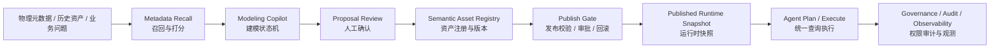
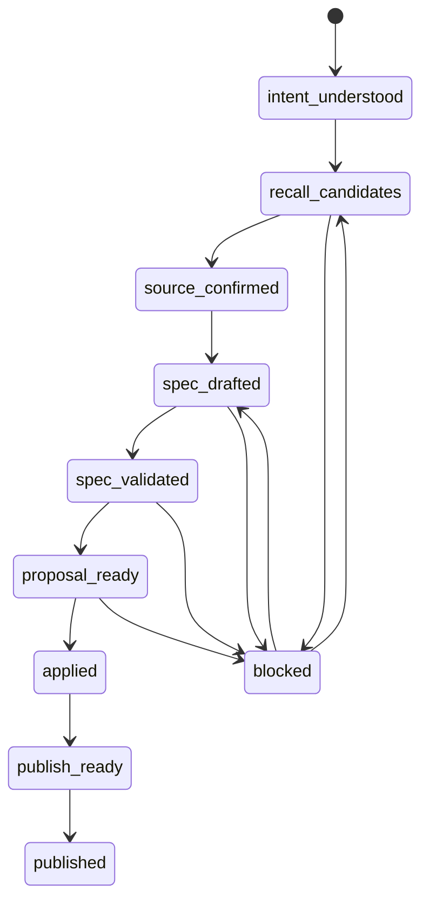

# 语义平台生产级重构 Spec

## 1. 背景

当前语义平台已经具备可受控试用的核心能力：语义资产建模、Modeling Copilot 对话闭环、Agent-first Runtime、统一查询执行面、SQL 持久化 Copilot session / Proposal，以及 P34 Modeling Copilot smoke。

但从生产上线口径看，仍存在几类系统性缺口：

- 语义资产事实源尚未完全统一，生产 SQL 仓储、本地 YAML fixture、测试生成资产之间边界需要收紧。
- Modeling Copilot 已有 session / proposal，但还不是完整可恢复、可审计、可人工确认的状态机。
- 发布链路需要明确 release record、影响面、回滚和发布前 gate。
- Runtime 必须硬隔离 draft / proposal，只读取 published + active 快照。
- 语义 smoke 有状态，需隔离命名空间和清理策略，避免污染人工资产。
- Alembic squash 后空库初始化路径清晰，但存量库 baseline 对齐需要 runbook 和演练。

本 Spec 用于追踪方案 B 的大重构级别实施进度。

## 2. 总目标

将语义平台从“功能闭环可试用”升级为“可发布、可回滚、可审计、可诊断、可持续维护”的生产级平台。

生产级定义：

- 资产有统一事实源、版本、状态、依赖、发布记录和回滚能力。
- Copilot 建模过程可恢复、可解释、可人工确认、可审计。
- Runtime 只消费已发布资产快照，不受 draft、测试资产和本地 YAML 写入污染。
- 权限、发布、执行、审计、观测和测试形成闭环。
- 每期任务都有自动化验收入口和可追踪证据。

## 3. 非目标

- 不重写 Flask / React / PostgreSQL 技术栈。
- 不一次性做完整多租户平台。
- 本地 YAML 只按测试 fixture / 示例 seed 管理；生产路径不做 SQL / YAML 双写，YAML 仅保留为测试 fixture、示例 seed 和调试导出格式。
- 不让 LLM 直接修改 published 资产；AI 输出必须先进入 draft / proposal。
- 不把应用中心、SQL Lab、智能问数的非语义重构纳入本 Spec。

## 4. 工程原则

- KISS：先统一资产生命周期、发布治理和 Runtime 边界，不重做全站。
- YAGNI：复杂多租户、完整审批流、完整血缘平台后置。
- SOLID：Registry、Copilot、Recall、Runtime、Governance 分职责演进。
- DRY：迁移、发布、smoke、cleanup、验收统一到 Make / scripts，避免手工流程散落。

## 5. 目标架构



## 6. 核心设计域

### 6.1 Semantic Asset Registry

生产事实源统一为 PostgreSQL Registry。当前本地 YAML 资产按测试 fixture / 示例 seed 处理，不进入生产迁移或发布链路。

存储决策：

- 生产环境只允许 SQL Registry 写入，不做 SQL / YAML 双写。
- 生产不保留 YAML 兼容写入层；如需示例资产，使用 seed 脚本显式写入 SQL Registry。
- 新增或发布语义资产时，只写 SQL Registry；不得继续生成生产 YAML 文件。
- Runtime 读取 SQL runtime snapshot，不 fallback 到 YAML。
- 本地 fixture 可显式使用 YAML adapter，但需要通过环境变量或测试配置隔离，不能成为生产默认。
- YAML 导出仅用于人工调试、审阅或备份快照，不参与生产写入链路。

不采用双写的原因：

- 双写会引入口径漂移、checksum 不一致和冲突解决复杂度。
- SQL Registry 已能承接版本、发布、审计和回滚，生产不需要第二事实源。
- YAML 更适合做测试 fixture、示例 seed 和导出快照，不参与生产状态存储、迁移或发布。

建议统一资产抽象：

- `semantic_assets`：资产主表，记录 `asset_id / asset_type / asset_key / status / owner / current_revision_id`
- `semantic_asset_revisions`：不可变版本，记录 canonical JSON spec snapshot、`sha256` checksum、变更说明和创建者
- `semantic_asset_dependencies`：资产依赖，记录 Cube、Ontology、Domain、Glossary、Binding、View、Recipe 之间关系
- `semantic_releases`：发布记录，记录发布范围、版本集合、发布人、发布时间、发布 gate 结果
- `semantic_runtime_snapshots`：Runtime 读取快照，绑定 release 与资产版本集合

资产类型范围：

- `cube`
- `ontology`
- `domain`
- `glossary`
- `binding`
- `view`
- `recipe`
- `policy`

### 6.2 Publish Gate

发布不再只是修改状态或写文件，而是一次可审计 release。

发布前检查：

- schema 存在且字段可解析
- 指标口径完整
- 依赖资产 active
- 依赖图是 DAG，不允许循环依赖
- Binding 可编译
- 权限策略存在
- Runtime 可生成 QueryDSL
- 高风险数据级别命中审批或阻断策略

数据敏感级别初始枚举：

- `public`：可公开或演示数据，默认允许 preview。
- `internal`：内部经营数据，允许受控 plan，execute 需要标准权限。
- `confidential`：敏感业务数据，execute 需要强审计或审批。
- `restricted`：M3/raw/ODS、明细隐私或未治理底表，默认 `approval_required` 或 `deny`。

敏感级别来源优先级：

1. Registry / Binding 明确标注。
2. 数据源元数据标注。
3. 表名、schema、catalog 规则推断。
4. 无法判断时按更高风险处理。

发布后能力：

- release record
- runtime snapshot
- rollback 到上一 release
- impact analysis，用于识别受影响的 Agent、Domain、Query、Dashboard

### 6.3 Modeling Copilot 状态机

Copilot 状态机：



状态机要求：

- 每一步写 event log。
- 用户确认点结构化保存。
- 失败可重试、可恢复、可回退。
- LLM 输出只能进入 draft / proposal。
- apply / publish 必须经过服务端 gate。
- session 状态转移使用 `state_version` 或等价乐观锁，避免并发请求覆盖。
- `apply` / `publish` 必须幂等：同一 proposal revision 重试不会产生重复资产或重复 release。
- `blocked` 回退必须记录阻塞类型和回退目标；初版只实现最小必要回退，复杂 badcase 在 B2 后段补齐。
- 初版状态集可以先落 `intent_understood -> spec_drafted -> proposal_ready -> applied -> published`，召回细分、blocked 分支和复杂回退在 B2 增量补齐。

### 6.4 Metadata Recall 与 Scoring

抽出独立 `MetadataRecallService`，替代在 Copilot 流程里散落业务召回逻辑。

输入：

- 业务问题
- 当前 Domain / Ontology / Cube 上下文
- 表与字段元数据
- 历史成功绑定记录
- 权限上下文

输出：

- 候选事实表
- 候选维表
- 候选 Cube
- 候选 Ontology
- 候选字段映射
- explain reason

打分维度：

- 名称相似度
- 字段覆盖度
- 业务术语命中
- 历史绑定成功率
- 数据新鲜度
- 权限可用性
- 生产可信等级
- 相邻域误召回惩罚

scoring profile 要求：

- `MetadataRecallService` 保持无状态输入输出，不依赖 Copilot session 内部状态。
- 权重配置支持按 Domain / 业务域覆盖，默认 profile 作为兜底。
- profile 需要有版本号、启用状态和变更记录。
- 配置加载必须可测试，避免把业务 if 写回通用召回服务。
- explainability 输出至少包含 TopN 分数、命中字段、扣分原因和权限可用性。

### 6.5 Runtime 边界

Build-time：

- Copilot
- draft
- proposal
- validation
- publish gate

Runtime：

- 只读取 published + active snapshot
- 不读取 draft / proposal / YAML local write path
- 固定 `QueryDSL -> Binding -> Compiled SQL -> GatewayAccessContext / TicketPreview -> dw-query-gateway QueryRun`
- `/api/v1/agent/semantic/plan` 只返回 preview
- `/api/v1/agent/semantic/execute` 只在 `allow` 决策下生成受治理执行材料并提交 gateway；本仓不再维护内部 query execution job

实现约束：

- 新增或收敛为 `SemanticRuntimeSnapshotRepository`，Runtime 只依赖该只读接口。
- Runtime repository 不暴露 draft、proposal、YAML adapter 查询方法。
- API 层、应用层和测试都以 published snapshot 为断言对象。
- B1 末尾必须先落最小 published-only gate，B3 再补 trace、观测和治理强化。

### 6.6 Governance / Audit

统一 `PrincipalContext`，贯穿建模、发布、执行和导出。

权限拆分：

- semantic model read
- semantic model draft
- semantic proposal apply
- semantic publish
- semantic runtime plan
- semantic runtime execute
- semantic export

审计字段：

- `principal_id`
- `asset_id`
- `release_id`
- `semantic_plan_id`
- `gateway_query_id`
- `sql_hash`
- `decision`
- `policy`
- `trace_id`

### 6.7 测试体系

五层测试：

- 单测：状态机、打分、编译、权限、发布 gate。
- 集成测试：SQL Registry、Alembic、API 契约。
- Mock E2E：P34 Modeling Copilot 前端闭环。
- Live E2E：真实 session / proposal / apply / publish。
- Golden Case：真实业务资产端到端验收。

测试要求：

- 所有 smoke 使用隔离命名空间。
- 测试资产可清理、可查询、可追踪。
- 默认 CI 不污染人工资产。
- 发布前补跑 live smoke 和 golden case。

### 6.8 Observability

语义 ready 检查：

- DB ready
- Alembic current
- Registry ready
- Copilot store ready
- Runtime snapshot ready
- dw-query-gateway telemetry / readyz ready
- Governance ready

关键指标：

- Copilot 各阶段耗时
- 召回 Top1 / Top3 命中率
- Proposal 人工修改率
- 发布成功率 / 失败原因
- Runtime plan 成功率
- execute 成功率
- deny / approval_required 比例
- rollback 次数

初版 SLO / 告警基线：

- semantic ready 检查失败：阻断发布。
- publish gate 成功率低于 95%：预警，低于 90%：阻断生产候选。
- Modeling Copilot live smoke 失败：阻断生产候选。
- Runtime plan 成功率低于 95%：预警。
- Runtime execute allow 路径成功率低于 95%：预警。
- restricted 数据绕过审批执行：零容忍，阻断发布。

## 6.9 跨期依赖

B1 是 B2 / B3 的前置基础：

- B2 的 Copilot 状态机可以先使用现有 proposal 服务演进，但正式 `apply / publish` 必须依赖 B1 的 release record 和 publish gate。
- B3 的 Runtime 治理依赖 B1 的 runtime snapshot；published-only 最小 gate 需要提前在 B1 末尾完成。
- B2 的 golden case 需要 B1 的测试资产 namespace / cleanup，避免污染人工资产。
- B3 的审计和观测可以复用现有治理审计表，但必须能追溯到 B1 release / snapshot。

阻断矩阵：

| 被阻断任务 | 前置任务 | 阻断原因 |
| --- | --- | --- |
| B2 apply / publish 状态 | B1 release record + publish gate | 否则状态机无法绑定真实发布结果 |
| B2 golden case | B1 namespace + cleanup | 否则真实业务验收会污染资产 |
| B3 published-only hardening | B1 runtime snapshot | 否则 Runtime 没有稳定读取对象 |
| B3 audit trace 追溯 | B1 release / snapshot | 否则无法从执行追到资产版本 |

## 6.10 实施就绪设计

本节补齐一次性全量实施前的工程设计。后续可以按 B1 / B2 / B3 拆任务并行，但代码实现必须遵守本节约束。

### 6.10.1 文件边界

建议按下表拆分实现，避免把 Registry、Copilot、Runtime 和测试治理混在一个服务里。

| 模块 | 建议文件 | 职责 |
| --- | --- | --- |
| Registry 领域模型 | `app/domain/semantic/asset_registry.py` | 定义 Asset、Revision、Dependency、Release、RuntimeSnapshot 的领域对象和值对象 |
| Registry 端口 | `app/domain/semantic/ports/asset_registry_repository.py` | 定义 SQL Registry 仓储接口 |
| Registry ORM | `app/infrastructure/semantic/models.py` | 扩展 SQLAlchemy ORM，和现有 Copilot SQL 模型保持同一基础设施边界 |
| Registry SQL 仓储 | `app/infrastructure/semantic/sql_asset_registry_repository.py` | 生产唯一 Registry 写入路径 |
| Registry 应用服务 | `app/application/semantic/asset_registry_service.py` | 资产创建、revision 生成、checksum、依赖写入 |
| Publish Gate | `app/application/semantic/publish_gate_service.py` | schema、依赖 DAG、binding、policy、sensitivity、runtime compile 校验 |
| Release 服务 | `app/application/semantic/semantic_release_service.py` | release record、release assets、rollback、snapshot 激活 |
| Runtime Snapshot | `app/application/semantic/runtime_snapshot_service.py` | 构建 active snapshot，提供 Runtime 只读 manifest |
| Runtime 仓储端口 | `app/domain/semantic/ports/runtime_snapshot_repository.py` | Runtime 只读接口，禁止 draft / YAML fallback |
| Copilot 状态 | `app/domain/semantic/copilot_state.py` | 状态枚举、转移表、幂等键、乐观锁错误 |
| Copilot event log | `app/infrastructure/semantic/sql_modeling_agent_session_repository.py` | 扩展现有 SQL session 仓储，追加 payload 内 event log 和 state_version；后续如审计查询压力上升，再拆独立事件表 |
| 召回配置 | `app/application/semantic/source_candidate_scoring.py` | 从硬编码 default 逐步演进到 profile 结构，不依赖 session 状态 |
| 测试夹具 | `tests/support/semantic_fixture_manager.py` | 统一 namespace、创建、追踪、清理测试资产 |
| 迁移演练 | `scripts/checks/semantic_alembic_baseline.py` | 校验空库 / 存量库 baseline，必要时执行受保护 stamp |

### 6.10.2 SQL Registry Schema

所有主键沿用当前项目的字符串 ID 风格，时间统一使用 UTC。JSON 字段使用现有 `JsonType`。

#### `semantic_assets`

| 字段 | 类型 | 约束 | 说明 |
| --- | --- | --- | --- |
| `id` | `String(128)` | PK | 资产 ID，例如 `asset_<uuid>` |
| `namespace` | `String(64)` | not null, default `default` | 测试资产使用独立 namespace |
| `asset_type` | `String(32)` | not null | `cube / ontology / domain / glossary / binding / view / recipe / policy` |
| `asset_key` | `String(255)` | not null | 稳定业务键，例如 cube name |
| `title` | `String(255)` | nullable | 展示名 |
| `status` | `String(32)` | not null | `draft / active / archived / deleted` |
| `current_revision_id` | `String(128)` | nullable FK | 当前工作 revision |
| `current_release_id` | `String(128)` | nullable FK | 当前发布 release |
| `owner_principal_id` | `String(128)` | nullable | 负责人 |
| `source_kind` | `String(32)` | not null | `human / copilot / seed / test_fixture` |
| `created_at` | `DateTime` | not null | 创建时间 |
| `updated_at` | `DateTime` | not null | 更新时间 |

索引与约束：

- unique：`(namespace, asset_type, asset_key)`
- index：`(asset_type, status)`
- index：`(namespace, status, updated_at)`

指针更新语义：

- `current_revision_id` 在 `append_revision` 成功后更新为最新工作 revision。
- `current_release_id` 只在 release 成功 published 后更新，失败 release 不更新。
- `namespace / asset_type / asset_key` 创建后不可修改；需要改 key 时创建新资产并保留依赖迁移记录。
- `create_or_update_asset` 只允许更新 `title / status / owner_principal_id / source_kind / updated_at`。

#### `semantic_asset_revisions`

| 字段 | 类型 | 约束 | 说明 |
| --- | --- | --- | --- |
| `id` | `String(128)` | PK | revision ID |
| `asset_id` | `String(128)` | not null FK | 所属资产 |
| `revision_no` | `Integer` | not null | 单资产递增版本 |
| `revision_status` | `String(32)` | not null | `draft / validated / published / archived` |
| `spec_json` | `JsonType` | not null | canonical spec |
| `spec_checksum` | `String(64)` | not null | canonical JSON 的 SHA-256 |
| `change_summary` | `String(512)` | nullable | 变更说明 |
| `proposal_id` | `String(128)` | nullable | 来源 Proposal |
| `created_by` | `String(128)` | nullable | 创建人 |
| `created_at` | `DateTime` | not null | 创建时间 |

索引与约束：

- unique：`(asset_id, revision_no)`
- index：`(asset_id, spec_checksum)`
- index：`(revision_status, created_at)`

去重语义：

- `spec_checksum` 用于应用层幂等和审计，不做全量数据库唯一约束。
- 同一资产同一 checksum 可在 archived 后重新形成新的 draft revision，避免合法回滚 / 重建被数据库阻断。
- `append_revision` 默认复用同一资产下最新非 archived 的相同 checksum revision；显式 `force_new_revision=true` 时可创建新 revision。

checksum 算法：

```text
sha256(json.dumps(spec, sort_keys=True, ensure_ascii=False, separators=(",", ":")).encode("utf-8"))
```

#### `semantic_asset_dependencies`

| 字段 | 类型 | 约束 | 说明 |
| --- | --- | --- | --- |
| `id` | `String(128)` | PK | dependency ID |
| `asset_revision_id` | `String(128)` | not null FK | 当前 revision |
| `depends_on_asset_id` | `String(128)` | not null FK | 依赖资产 |
| `depends_on_revision_id` | `String(128)` | nullable FK | 依赖指定 revision；为空表示依赖当前 active |
| `dependency_type` | `String(64)` | not null | `binding / policy / source / metric / relation / runtime` |
| `required` | `Boolean` | not null | 是否发布必需 |
| `created_at` | `DateTime` | not null | 创建时间 |

发布前必须对 `asset_revision_id -> depends_on_asset_id` 做 DAG 校验，检测到环时返回 `dependency_cycle_detected`。

依赖固化语义：

- authoring 阶段允许 `depends_on_revision_id` 为空，用于表达“依赖当前 active”。
- 发布时必须把空依赖解析为具体 `revision_id`，并写入 `semantic_release_assets` 与 runtime manifest。
- runtime snapshot 中不允许存在未解析 revision 依赖，避免发布后漂移。

#### `semantic_releases`

| 字段 | 类型 | 约束 | 说明 |
| --- | --- | --- | --- |
| `id` | `String(128)` | PK | release ID |
| `release_no` | `Integer` | not null | namespace 内递增版本 |
| `namespace` | `String(64)` | not null | 发布命名空间 |
| `status` | `String(32)` | not null | `created / published / failed / rolled_back` |
| `scope_json` | `JsonType` | not null | 发布范围 |
| `gate_result_json` | `JsonType` | not null | gate 结果 |
| `previous_release_id` | `String(128)` | nullable FK | 上一 active release |
| `rollback_of_release_id` | `String(128)` | nullable FK | 若是回滚，指向被回滚 release |
| `idempotency_key` | `String(128)` | nullable | 发布请求幂等键 |
| `published_by` | `String(128)` | nullable | 发布人 |
| `published_at` | `DateTime` | nullable | 发布时间 |
| `created_at` | `DateTime` | not null | 创建时间 |

索引与约束：

- unique：`(namespace, release_no)`
- unique：`(namespace, idempotency_key)` where `idempotency_key is not null`
- index：`(namespace, status, created_at)`

`release_no` 生成机制：

- 在发布事务内先执行 `pg_advisory_xact_lock(hashtext('semantic_release:' || namespace))`。
- 然后以 `coalesce(max(release_no), 0) + 1` 生成 namespace 内下一个版本号。
- 不允许在无锁条件下由应用层自行计算 release_no。

#### `semantic_release_assets`

| 字段 | 类型 | 约束 | 说明 |
| --- | --- | --- | --- |
| `release_id` | `String(128)` | PK, FK | release |
| `asset_id` | `String(128)` | PK, FK | asset |
| `revision_id` | `String(128)` | not null FK | 发布 revision |
| `asset_type` | `String(32)` | not null | 冗余便于查询 |
| `asset_key` | `String(255)` | not null | 冗余便于查询 |

#### `semantic_runtime_snapshots`

| 字段 | 类型 | 约束 | 说明 |
| --- | --- | --- | --- |
| `id` | `String(128)` | PK | snapshot ID |
| `release_id` | `String(128)` | not null FK | 对应 release |
| `namespace` | `String(64)` | not null | 命名空间 |
| `status` | `String(32)` | not null | `active / superseded / failed` |
| `asset_manifest_json` | `JsonType` | not null | asset -> revision manifest |
| `binding_manifest_json` | `JsonType` | not null | Runtime binding manifest |
| `policy_manifest_json` | `JsonType` | not null | Runtime policy manifest |
| `created_at` | `DateTime` | not null | 创建时间 |
| `activated_at` | `DateTime` | nullable | 激活时间 |
| `superseded_at` | `DateTime` | nullable | 被替代时间 |

约束：

- 每个 namespace 同一时间最多一个 `active` snapshot，必须使用数据库 partial unique index 保证：

```sql
CREATE UNIQUE INDEX uq_semantic_runtime_snapshots_active_namespace
ON semantic_runtime_snapshots (namespace)
WHERE status = 'active';
```

- Runtime plan / execute 必须记录 `snapshot_id` 和 `release_id`。

manifest 最小结构：

```json
{
  "asset_manifest_json": {
    "schema_version": "semantic-runtime-manifest/v1",
    "assets": [
      {
        "asset_id": "asset_student_comment",
        "asset_type": "cube",
        "asset_key": "student_comment",
        "revision_id": "rev_student_comment_3",
        "spec_checksum": "sha256...",
        "status": "published",
        "spec": {
          "cube": {
            "name": "student_comment",
            "table": "dwd_interaction_comment_reports_df",
            "dimensions": {},
            "measures": {}
          }
        }
      }
    ]
  },
  "binding_manifest_json": {
    "schema_version": "semantic-runtime-manifest/v1",
    "bindings": [
      {
        "binding_id": "binding_student_comment_total_count",
        "business_metric_key": "student_comment.total_count",
        "cube_key": "student_comment",
        "measure_key": "total_count",
        "revision_id": "rev_binding_2"
      }
    ]
  },
  "policy_manifest_json": {
    "schema_version": "semantic-runtime-manifest/v1",
    "policies": [
      {
        "policy_id": "policy_student_comment_restricted",
        "asset_key": "student_comment",
        "data_level": "restricted",
        "decision": "approval_required"
      }
    ]
  }
}
```

`resolve_asset` 必须只从 `asset_manifest_json.assets` 中按 `asset_type + asset_key` 解析，不允许重新查 draft 表或 YAML。

manifest 兼容规则：

- `schema_version` 必填；初版固定为 `semantic-runtime-manifest/v1`。
- `assets[].asset_id / asset_type / asset_key / revision_id / spec_checksum / status / spec` 必填；`spec` 是 Runtime 只读编译的唯一资产内容来源。
- `binding_manifest_json.bindings[]` 与 `policy_manifest_json.policies[]` 可为空数组，但字段本身不能为空。
- Runtime 遇到未知 `schema_version` 时返回 `semantic_runtime_manifest_unsupported`，不得猜测解析。

### 6.10.3 Repository Contract

生产写入只通过 SQL repository。YAML repository 仅允许在测试配置下被直接注入。

Registry repository 必须提供：

```python
class IAssetRegistryRepository(Protocol):
    def get_asset(self, namespace: str, asset_type: str, asset_key: str) -> SemanticAsset | None: ...
    def create_or_update_asset(self, asset: SemanticAsset, *, allowed_update_fields: set[str] | None = None) -> SemanticAsset: ...
    def append_revision(self, asset_id: str, spec: dict, *, proposal_id: str | None, actor: str | None) -> SemanticAssetRevision: ...
    def get_revision(self, revision_id: str) -> SemanticAssetRevision | None: ...
    def list_revisions(self, asset_id: str) -> list[SemanticAssetRevision]: ...
    def replace_dependencies(self, revision_id: str, dependencies: list[SemanticAssetDependency]) -> None: ...
```

`create_or_update_asset` 约束：

- 查找键固定为 `(namespace, asset_type, asset_key)`。
- 不允许 update `namespace / asset_type / asset_key`。
- 默认只允许 update `title / status / owner_principal_id / source_kind / updated_at`。
- 如果 status 从 `active` 改为 `deleted`，必须先确认没有 active snapshot 仍引用该资产。

删除前 active snapshot 引用检查属于 application service 职责：

- `AssetRegistryService.delete_asset` 先调用 Runtime snapshot 只读接口确认无 active snapshot 引用。
- repository 只执行带条件的持久化更新，不主动跨服务查询 Runtime。
- 如果发现 active snapshot 引用，返回 `asset_referenced_by_active_snapshot`。

Release repository 必须提供：

```python
class ISemanticReleaseRepository(Protocol):
    def create_release(self, release: SemanticRelease, assets: list[SemanticReleaseAsset]) -> SemanticRelease: ...
    def publish_with_snapshot(self, release: SemanticRelease, assets: list[SemanticReleaseAsset], snapshot: RuntimeSnapshot) -> SemanticRelease: ...
    def mark_published(self, release_id: str, *, gate_result: dict, actor: str | None) -> None: ...
    def mark_failed(self, release_id: str, *, gate_result: dict) -> None: ...
    def get_active_release(self, namespace: str) -> SemanticRelease | None: ...
    def rollback_to(self, namespace: str, release_id: str, *, actor: str | None) -> SemanticRelease: ...
```

`publish_with_snapshot` 必须在一个数据库事务内完成：

1. 锁定 namespace release 序列。
2. 创建 release record。
3. 写入 release assets。
4. 将旧 active snapshot 标记为 `superseded`。
5. 创建并激活新 snapshot。
6. 将 release 标记为 `published`。
7. 更新涉及资产的 `current_release_id`。
8. 写入治理审计记录。

任一步失败时事务回滚；如需要保留失败证据，由应用层在新事务中写入 `failed` release attempt 或失败审计记录。

并发冲突处理：

- 若 active snapshot partial unique index 冲突，repository 捕获数据库唯一约束错误并返回 `concurrent_publish_conflict`。
- 调用方必须重新读取 active release / snapshot 后重新执行 publish gate，不允许盲目重试原事务。
- 同一 `idempotency_key` 的已发布结果可直接返回；冲突失败的 key 不复用。

失败 release 记录策略：

- 发布事务失败时不能留下 `published` release。
- 如果 release record 也随事务回滚，应用层可在新事务中写一条 `status=failed` 的 release attempt，复用原 `idempotency_key` 并记录 `failure_reason`。
- 同一 `idempotency_key` 查询到 `failed` 时，API 返回 `failed_retry_with_new_idempotency_key`，调用方需要生成新 key。
- failed release attempt 保留 30 天，之后可由清理任务归档或删除。

rollback 语义：

- rollback 不直接重新激活旧 snapshot。
- rollback 创建一个新的 release，`rollback_of_release_id` 指向被回滚 release。
- 新 release 的 assets 复用目标历史 release 的 revision 集合，并生成新的 active snapshot。
- rollback release 仍分配新的 `release_no`，旧 active snapshot 变为 `superseded`。

Runtime snapshot repository 只能提供只读查询：

```python
class IRuntimeSnapshotRepository(Protocol):
    def get_active_snapshot(self, namespace: str = "default") -> RuntimeSnapshot | None: ...
    def resolve_asset(self, snapshot_id: str, asset_type: str, asset_key: str) -> RuntimeAsset | None: ...
    def list_assets(self, snapshot_id: str, asset_type: str | None = None) -> list[RuntimeAsset]: ...
```

禁止事项：

- Runtime repository 不得依赖 YAML repository。
- Runtime repository 不得接收 `include_draft`、`status` 这类可绕过 published-only 的参数。
- 应用服务不得在 Runtime plan / execute 中直接调用 `ICubeRepository.save` 或 YAML adapter。

### 6.10.4 Alembic Baseline Runbook 设计

空库初始化：

1. 创建空数据库。
2. 执行 `flask --app wsgi.py db upgrade`。
3. 校验 `alembic_version.version_num = '0001_initial_schema'`。
4. 校验关键表存在：Copilot SQL 表、Agent Runtime 表、治理审计表、Registry 表。
5. 执行 `make smoke-backend`。

存量库 baseline 对齐：

1. 使用 `pg_dump` 生成备份，备份路径记录到 runbook 输出。
2. 查询当前 `alembic_version`。
3. 运行 schema fingerprint 校验，确认存量库已经具备 `0001_initial_schema` 覆盖的表和关键字段。
4. fingerprint 通过后，脚本在事务中更新 `alembic_version` 为 `0001_initial_schema`。
5. 执行应用启动和 `make smoke-backend`。
6. fingerprint 不通过时停止，不允许自动 stamp。

默认不允许直接人工 SQL 更新版本戳。若需要 break-glass，必须满足：

- 已有备份。
- fingerprint 通过。
- 操作记录写入发布记录或运维记录。
- 由负责人确认。

fingerprint 规范：

- 输入：目标数据库当前 schema。
- 输出：canonical JSON 和 SHA-256。
- 内容至少包含关键表的表名、列名、数据类型、nullable、primary key、unique/index 名称。
- 关键表包括：`alembic_version`、`semantic_modeling_agent_sessions`、`semantic_modeling_proposals`、`agent_inference_runtime_runs`、`agent_inference_runtime_artifacts`、`agent_runtime_provider_configs`、`governance_audit_traces`，以及 B1 新增的 Registry / Release / Snapshot 表。
- fingerprint 脚本必须输出缺失表、缺失列、类型不一致和索引缺失四类问题。

### 6.10.5 Publish Gate Flow

发布流程必须按固定顺序执行：

1. 读取待发布 asset revision。
2. 校验 spec checksum 与 proposal approved checksum 一致。
3. 校验 schema 和字段存在。
4. 校验依赖图是 DAG，并把所有空 revision 依赖固化为具体 revision。
5. 校验 Binding 可编译。
6. 校验 policy 和 sensitivity。
7. 生成 runtime compile preview。
8. 进入发布事务。
9. 创建 release record。
10. 写入 release assets。
11. 创建 runtime snapshot。
12. 激活 snapshot，替换旧 active snapshot。
13. 将 release 标记为 `published`。
14. 写 audit trace。

事务边界：

- 步骤 8-14 必须在同一个数据库事务内完成。
- 审计写入属于发布事务的一部分；如果审计不可用，发布失败并整体回滚，避免出现无审计 release。
- 如果事务失败，不能留下 `published` release 或 `active` snapshot 半成品。
- 相同 `idempotency_key` 重试时，若已有 `published` release，直接返回已有 release；若已有 `failed` release，需要创建新的 idempotency key。

approved checksum 生命周期：

- Proposal 每次 spec 修改都会生成新的 `proposal_revision_no` 和 `spec_checksum`。
- `approve` 动作针对某个 `proposal_revision_no` 写入 `approved_spec_hash`，同时记录 `approved_proposal_revision_no`。
- 用户在 approve 后再次修改 spec 时，必须递增 `proposal_revision_no`，并清空 `approved_spec_hash / approved_proposal_revision_no`。
- `apply` 只能使用 `approved_proposal_revision_no` 对应的 spec；如果当前 spec revision 与 approved revision 不一致，返回 `approved_spec_stale`。
- Publish Gate 步骤 2 对比待发布 `semantic_asset_revisions.spec_checksum` 与该 revision 来源 Proposal 的 `approved_spec_hash`。
- 如果 revision 来源不是 Proposal，例如 seed 或人工直接创建，必须走等价的人工确认记录：`approval_record.approved_spec_hash`；没有确认记录时拒绝发布。

Gate 决策矩阵：

| 条件 | 决策 | 是否创建 release | 说明 |
| --- | --- | --- | --- |
| schema / 字段缺失 | `deny` | 否 | 资产不可执行 |
| dependency cycle | `deny` | 否 | 防止 Runtime 编译死循环 |
| binding 不可编译 | `deny` | 否 | 不发布不可绑定资产 |
| `restricted` 且无审批 | `approval_required` | 否 | 需要人工审批 |
| policy 缺失 | `deny` | 否 | 生产资产必须有治理策略 |
| compile preview 成功且 policy allow | `allow` | 是 | 可发布 |

### 6.10.6 Runtime Published-only Flow

Runtime plan / execute 读取路径：

```text
Agent request
  -> PrincipalContext
  -> get_active_snapshot(namespace)
  -> resolve published assets from snapshot manifest
  -> Semantic Mapper / Binding
  -> QueryDSL v1
  -> PolicyDecision
  -> TicketPreview 或 ExecutionTicketSnapshot
```

负向要求：

- draft revision 存在但未进入 active snapshot 时，Runtime 必须返回 no match 或 blocked。
- YAML fixture 中存在同名资产时，Runtime 不读取、不 fallback。
- 已 archived / deleted 资产不进入 snapshot。
- snapshot 缺失时，`plan` 返回 `semantic_runtime_not_ready`，`execute` 不创建 job。

### 6.10.7 Copilot 状态机转移表

| 当前状态 | 动作 | 下一个状态 | 幂等键 | 阻断条件 |
| --- | --- | --- | --- | --- |
| `intent_understood` | `draft_spec` | `spec_drafted` | `session_id + state_version + intent_hash` | 缺少业务问题 |
| `spec_drafted` | `save_proposal` | `proposal_ready` | `session_id + spec_checksum` | spec 不可 review |
| `proposal_ready` | `approve` | `proposal_ready` | `proposal_id + proposal_revision_no + spec_checksum` | spec checksum 为空 |
| `proposal_ready` | `apply` | `applied` | `proposal_id + proposal_revision_no + approved_spec_hash` | checksum 与 approved 不一致 |
| `applied` | `publish` | `published` | `proposal_id + release_scope_checksum` | publish gate deny / approval_required |
| 任意非终态 | `block` | `blocked` | `session_id + state_version + reason_code` | 无 |
| `blocked` | `repair_spec` | `spec_drafted` | `session_id + state_version + repair_hash` | 缺少可修复 spec |
| 任意非终态 | `abandon` | `abandoned` | `session_id + state_version + abandon_reason` | 无 |
| `published` | `archive` | `archived` | `session_id + state_version + archive_reason` | 对应资产仍被 active snapshot 引用 |

幂等键说明：

- `proposal_revision_no` 指 Proposal 内部版本，不是 `semantic_asset_revisions.revision_no`。
- `approved_spec_hash` 由 `approve` 动作按 Proposal revision 写入；`apply` 只接受当前 `proposal_revision_no == approved_proposal_revision_no` 的已批准 hash。
- 任何 spec 编辑都会生成新的 `proposal_revision_no` 并清空批准字段，防止旧批准覆盖新内容。
- `release_scope_checksum` 使用待发布 asset revision 集合的 canonical JSON 计算。

并发控制：

- 所有状态更新都必须携带 `expected_state_version`。
- repository 使用 compare-and-swap 更新；版本不一致返回 `state_conflict`。
- 前端收到 `state_conflict` 后重新拉取 session，不自动覆盖本地编辑。
- `state_version` 类型为 integer，初始值为 1，每次成功转移递增 1。
- CAS 更新形式：`UPDATE ... SET state = :next, state_version = state_version + 1 WHERE id = :id AND state_version = :expected_state_version`。

`state_conflict` 处理：

- 服务端返回当前 `state / state_version / proposal_revision_no / spec_checksum`。
- 前端必须重新拉取 session，并展示“内容已更新，需要重新确认”状态。
- 如果本地存在未提交 spec 编辑，前端只允许保存为新 draft revision，不允许用新 `state_version` 自动重试 apply / publish。
- 用户重新确认后才能再次触发 `approve / apply / publish`。

终态：

- `published`
- `abandoned`
- `archived`

终态不可再 apply / publish，只能创建新 session 或新 proposal revision。

### 6.10.8 Scoring Profile 结构

scoring profile 建议先用 Python dataclass / JSON config 表达，后续再决定是否入库。

最小结构：

```json
{
  "profile_id": "student_comment_v1",
  "domain": "student_comment",
  "enabled": true,
  "weights": {
    "name_similarity": 0.25,
    "field_coverage": 0.2,
    "term_match": 0.2,
    "historical_success": 0.1,
    "freshness": 0.05,
    "permission_available": 0.1,
    "production_trust": 0.1,
    "adjacent_domain_penalty": -0.2
  },
  "canonical_sources": [
    "df_cb_258187.dwd_interaction_comment_reports_df"
  ],
  "negative_sources": [
    "view_student_answer_analysis"
  ]
}
```

约束：

- 权重总和不强制等于 1，但最终 score 必须归一化到 `0..1`。
- 初版归一化算法固定为 `score = clamp(sum(weight_i * signal_i) / sum(abs(weight_i)), 0, 1)`；penalty 权重允许为负数。
- 每个 `signal_i` 进入计算前必须归一化到 `0..1`。
- profile 命中结果必须进入 explainability。
- 新领域优先加 profile，不改通用召回算法。

### 6.10.9 SemanticTestFixtureManager

统一测试资产管理，避免 domain smoke、live smoke、golden case 各自写清理逻辑。

接口要求：

```python
class SemanticTestFixtureManager:
    def namespace(self, prefix: str) -> str: ...
    def register_asset(self, namespace: str, asset_id: str, asset_type: str) -> None: ...
    def cleanup_namespace(self, namespace: str) -> dict: ...
    def assert_no_manual_asset_pollution(self, namespace: str) -> None: ...
```

命名规则：

- mock E2E：`qa_mock_<timestamp>`
- live smoke：`qa_live_<timestamp>`
- golden case：`qa_golden_<case_name>_<timestamp>`

清理规则：

- cleanup 必须同时清理 Registry、Release、Snapshot、Copilot session、Proposal 和 YAML fixture 输出。
- 清理顺序按外键逆序执行：`governance_audit_traces(test namespace) -> runtime_snapshots -> release_assets -> releases -> dependencies -> revisions -> assets -> proposals -> sessions -> YAML fixture 输出`。
- cleanup 失败不吞错，返回未清理资产清单。
- `verify-semantic-prod` 最后一步必须执行 cleanup，并输出清理摘要。

### 6.10.10 一次性全量实施准入

在进入代码实现前，必须满足：

- SQL-only Registry 决策已确认，不做 YAML 兼容写入层 / 双写。
- Alembic baseline runbook 有明确 fingerprint、备份和回滚设计。
- Registry schema 字段、约束、索引和 checksum 算法已锁定。
- Runtime published-only 的 repository 边界已锁定。
- Copilot 状态机有转移表、乐观锁和幂等键。
- Publish Gate 有决策矩阵。
- 测试夹具 namespace / cleanup 有统一接口。
- `verify-semantic-prod` 的执行顺序已确定。

## 7. 三期实施规划

### Phase B1：生产资产底座与发布安全

目标：先解决“可维护、可发布、可回滚”。

| ID | 任务 | 状态 | 验收证据 |
| --- | --- | --- | --- |
| B1-01 | 补 Alembic 空库初始化和存量 baseline runbook | DONE | `test_alembic_initial_schema_contract`、`test_semantic_alembic_baseline`、`make verify-alembic` 通过；真实存量库 fingerprint 作为 B4 上线前环境补证跟踪 |
| B1-02 | 设计 SQL Registry schema：assets、revisions、dependencies、releases、runtime snapshots，锁定 checksum、release_no 和 active snapshot 唯一约束 | DONE | `0001_initial_schema.py` 已补 Registry / Release / Snapshot 表与 active snapshot partial unique index；schema contract 通过 |
| B1-03 | 实现 Registry repository 与 service，生产写入路径切到 SQL | DONE | `SqlAssetRegistryRepository`、`AssetRegistryService`、repository / service 单测通过；`make test-semantic-prod-registry` 纳入生产候选闸门 |
| B1-04 | 收紧 YAML 边界：仅保留测试 fixture、示例 seed 和调试导出，生产不做 YAML 兼容写入层 / 双写 / 新写入 | DONE | official router / mapper / compiler 从 SQL runtime snapshot manifest 的 `spec` 还原 catalog；`test_official_runtime_routes_and_compiles_from_snapshot_manifest_without_yaml` 覆盖 YAML 同名资产不得 fallback |
| B1-05 | 重构 publish 为事务化 release record + immutable revision + runtime snapshot 激活 | DONE | `SemanticReleaseService.publish` 单测与集成流通过；发布事务内 `release_no` lock、`previous_release_id` 锁内重算、failed attempt 幂等键、真实 governance audit repository 同事务写入和失败回滚测试通过 |
| B1-06 | 实现 rollback API / service：创建新 rollback release，不直接复活旧 snapshot | DONE | `rollback_to` 服务单测通过；`POST /api/v1/semantic/releases/<release_id>/rollback` 已接入 DI / app 注册；API 测试覆盖成功、缺少 idempotency_key、release not found 和空 release 错误映射 |
| B1-07 | 增加 publish gate：schema、依赖 DAG、binding、policy、sensitivity、runtime compile | DONE | `PublishGateService.production()` 已接入 runtime schema、binding、policy、runtime checker；sensitivity profile 锁定 `public/internal/confidential/restricted`，confidential/restricted 需要 approval；单测覆盖 unsupported sensitivity、confidential approval、binding target missing 和 invalid runtime schema |
| B1-08 | 增加测试资产 namespace 和 cleanup，沉淀 `SemanticTestFixtureManager` | DONE | `tests/support/semantic_fixture_manager.py`、`scripts/checks/semantic_fixture_cleanup.py` 与连续发布/清理集成流通过 |
| B1-09 | 修复前端生产 build 污染：本地临时 test 文件不得进入 nginx production build context | DONE | `nginx.Dockerfile` 改为 `build:v2`，`frontend/.dockerignore` 排除测试；`npm run build:v2` 与 `docker compose build nginx` 通过 |
| B1-10 | Runtime published-only 最小 gate：Runtime 只读 SQL snapshot，draft / YAML 负向命中失败 | DONE | `RuntimeSnapshotService` 已拒绝缺失 snapshot 和未知 manifest；Agent official router、mapper、compiler、AgentPlanHandler 已接入 runtime manifest catalog；`make test-agent-runtime` 通过 |
| B1-11 | 新增 `make verify-semantic-prod` 初版 | DONE | `verify-semantic-prod` 已串起 `verify-alembic -> test-semantic-prod-registry -> semantic-baseline-dry-run -> nginx build -> verify-semantic -> live opt-in -> cleanup`；`verify-semantic-prod-strict` 增加 env fail-fast 和真实 PostgreSQL concurrency 目标；本地已通过 registry / rollback / gate 聚焦验证，完整 strict 仍需预生产库与 live 凭据补跑 |
| B1-12 | 增加上线前严格补证：预生产 baseline、live smoke、fixture cleanup、PostgreSQL 并发 | DONE | `scripts/checks/semantic_prod_env_guard.py`、`make semantic-prod-env-required`、`make test-semantic-postgres-concurrency`、`make verify-semantic-prod-strict` 已落地；本地无真实 PG URL 时 concurrency 目标按设计 skip，strict 入口会 fail-fast |

B1 完成标准：

- 空库 `flask db upgrade` 成功。
- 存量库 baseline 演练成功。
- 发布后有 release record。
- 可回滚到上一版本。
- Runtime 只从 active snapshot manifest 的 `spec` 还原 catalog，无法命中 draft / YAML 写入资产。
- nginx 最新镜像可干净构建。
- 测试资产可清理。

### Phase B2：Copilot 状态机与召回质量

目标：解决“建模过程可控、可解释、可恢复”。

| ID | 任务 | 状态 | 验收证据 |
| --- | --- | --- | --- |
| B2-01 | 重构 Copilot session 为最小状态机，加入 `state_version` 乐观锁 | DONE | `tests/unit/domain/semantic/test_copilot_state.py`、`make test-modeling-agent` |
| B2-02 | 增加 Copilot event log | DONE | `tests/unit/infrastructure/semantic/test_sql_modeling_copilot_repositories.py`、`make test-modeling-agent` |
| B2-03 | 增加 proposal action model：确认来源、修改 spec、apply、publish，并定义 apply / publish 幂等语义 | DONE | `tests/unit/application/semantic/test_modeling_proposal_service.py` 覆盖 confirm_source / update_spec revision 串联，以及 approve / apply / publish 幂等 |
| B2-04 | 抽象 metadata-backed 来源召回服务（实现名 `SourceCandidateRecallService`） | DONE | `tests/unit/application/semantic/test_source_candidate_recall_service.py` 覆盖语义资产 / Dataset / datasource 表缓存召回与无候选状态 |
| B2-05 | 配置化 scoring profile | DONE | `test_recall_uses_metadata_scoring_rule_for_new_domain_without_service_code_change` 覆盖新增退款订单领域无需改召回服务代码 |
| B2-06 | 增加 recall explainability | DONE | 召回响应返回 `rank`、`score_breakdown`、`why_selected` / `why_not_selected` 与顶层 `explainability`；单测覆盖选中与无候选解释 |
| B2-07 | 建立学生评论 golden case | DONE | `test_student_comment_golden_case_confirm_source_save_and_publish` 覆盖业务问题 -> 确认评论 DWD -> spec -> Proposal -> publish |
| B2-08 | 前端任务卡与后端状态机对齐 | DONE | `ModelingAgent.test.tsx` 覆盖后端 `state/state_version` 展示、候选来源解释与评分明细、确认来源主链路 |
| B2-09 | 增加 badcase 回放：错表、缺字段、权限不足、spec 不完整 | DONE | 错表修复、无候选解释、`need_source_table`、`SPEC_REQUIRED`、权限不足前端友好错误、发布校验阻断均已有回归；后续新增真实样本时纳入同一 suite |
| B2-10 | LLM 输出仅进入 proposal，禁止绕过服务端 gate | DONE | `test_llm_patch_cannot_forge_saved_or_published_state` 覆盖 LLM 返回 `publish_result/save_result/advanced_refs.proposal_id` 时被服务端过滤 |

B2 阶段收敛状态（2026-05-20）：

- B2 已完成本地生产契约收敛：状态机、event log、proposal action、metadata 召回、scoring profile、explainability、前端状态展示、golden case、badcase 和 LLM gate 均有单测或前端 unit 覆盖。
- 召回策略采用 KISS / YAGNI：当前使用本地元数据缓存 + 配置化 scoring rule，不引入独立向量库或离线 YAML 桥；新增领域优先加 scoring profile 和 golden/badcase，而不是改主服务逻辑。
- 前端按 SOLID / DRY 收敛为后端状态驱动：任务卡只展示 `state/state_version/readiness/source_candidates`，不再用固定流程推断真实状态；并保留 `state_version` 给后续冲突刷新与乐观锁提示。
- 剩余风险不再阻塞 B2 本地收敛，但阻塞生产上线签核：需要在预生产库执行 `verify-semantic-prod-strict`，并用真实 datasource metadata / live P34 smoke 补一次端到端证据。

B2 完成标准：

- 学生评论能完成“业务问题 -> 召回事实表 -> Spec -> Proposal -> Publish”。
- 召回结果可解释。
- 中途失败可继续或重试。
- 人工确认点不会被跳过。
- 历史坏样本有回归测试。

### Phase B3：Runtime 治理、执行与观测平台化

目标：解决“上线后可审计、可诊断、可持续运行”。

| ID | 任务 | 状态 | 验收证据 |
| --- | --- | --- | --- |
| B3-01 | 强化 Runtime snapshot 版本钉住、trace 和发布版本回溯 | DONE | `tests/unit/application/semantic/test_runtime_snapshot_service.py::test_runtime_snapshot_service_returns_version_pin_and_asset_trace` |
| B3-02 | 固化 `/agent/semantic/plan` preview-only 契约 | DONE | `tests/integration/test_agent_semantic_api.py::test_agent_semantic_plan_api_returns_preview_only_ticket` 断言无 `query_id/poll_url/result_url` |
| B3-03 | 固化 `/agent/semantic/execute` allow 才生成 gateway 执行材料 | DONE / ADR-011 UPDATED | 内部 query execution 已下线；当前执行面统一由 `dw-query-gateway` 承载，data-platform 只保留治理控制面、观测 BFF 和 GatewayAccessContext / TicketPreview |
| B3-04 | 增加 runtime trace：资产、binding、SQL、policy、gateway ticket | DONE / ADR-011 UPDATED | Runtime manifest 暴露 `version_pin/asset_trace`；compiler 写入 `ticket_material.runtime_version_pin`；trace 与 gateway query id / sql_hash 关联，运行态队列和结果以 `dw-query-gateway` 为准 |
| B3-05 | 完整覆盖 deny / approval_required / allow | DONE | `test_agent_execute_service_returns_blocked_without_job_for_deny`、`test_agent_execute_service_returns_approval_material_without_job`、`test_agent_execute_service_submits_first_ready_sql_target` |
| B3-06 | 增加 semantic health endpoint | DONE | `GET /api/v1/semantic/health`；`tests/integration/test_semantic_api.py::test_semantic_health_returns_runtime_snapshot_version_pin` 与 OpenAPI contract 覆盖 |
| B3-07 | 增加 audit trace 查询 API 或页面 | DONE | 复用 `GET /api/v1/governance/audit-traces` / `<trace_id>`，支持 `semantic_plan_id/sql_hash/route_type/principal_id` 过滤；已有 governance API 与 OpenAPI contract 覆盖 |
| B3-08 | 增加运行时指标与结构化日志 | DONE | Agent execute 输出 `agent_semantic_execute.submitted/blocked` 结构化 `metric_event`；semantic health 暴露 runtime asset / binding / policy 计数 |
| B3-09 | 将 live smoke 和 golden case 纳入生产候选验证 | DONE | `verify-semantic-prod` 串联 `verify-semantic`（含学生评论 golden case / P34 mock）与 `smoke-semantic-live` opt-in；strict gate 要求 `SEMANTIC_PROD_LIVE=1` |
| B3-10 | 更新上线 checklist、回滚手册和运维 runbook | DONE | `docs/semantic_verification.md` 补充 Runtime health、trace、audit、结构化日志与生产候选验证说明 |

B3 阶段收敛状态（2026-05-20）：

- Runtime snapshot 已形成发布版本钉住：`version_pin` 记录 namespace、snapshot、release、release_no、rollback 指向和 asset revision 列表；`asset_trace` 去掉完整 spec，仅保留运行时诊断所需元数据。
- Agent execute 现在要求 `policy_decision=allow`、QueryDSL v1、Runtime version pin 三者同时成立才会生成 gateway 执行材料；deny / approval_required 均只返回治理材料，不创建查询任务。
- 内部 QueryExecution 已由 ADR-011 下线；`dw-query-gateway` 负责 query run / Worker / lease / result / export / telemetry，data-platform 不再维护第二套执行 job。
- 运维观测入口收敛为三层：`/api/v1/semantic/health` 看 Runtime 就绪和版本，`/api/v1/governance/audit-traces` 查治理 / SQL / semantic_plan 回溯，`/api/v1/governance/gateway/*` 透出 gateway telemetry / alerts。
- 剩余上线签核风险仍是环境型：需要在预生产库执行 `make verify-semantic-prod-strict`，并提供真实 PostgreSQL concurrency、真实 datasource metadata、live P34 smoke 的运行证据。

B3 完成标准：

- draft 资产无法被 Runtime 命中。
- M3/raw/ODS 不会绕过审批执行。
- 每次执行都能从 trace 追到 asset release。
- allow / deny / approval_required 都有自动化测试。
- 生产问题能通过 trace id 定位。

### Phase B4：生产候选签核与上线前补证

目标：解决“本地已收敛后，生产上线前还缺哪些真实环境证据、如何显式阻断未补证发布”。

| ID | 任务 | 状态 | 验收证据 |
| --- | --- | --- | --- |
| B4-01 | 增加上线前 readiness 报告，汇总 DATABASE_URL、live smoke、fixture cleanup、PostgreSQL 并发补证状态 | DONE | `scripts/checks/semantic_prod_readiness_report.py`、`make semantic-prod-readiness-report`；单测覆盖 URL 脱敏、单一 `DATABASE_URL` strict 输入和缺项输出 |
| B4-02 | 对齐 strict guard、Makefile 和文档里的单一 PostgreSQL 验证库语义 | DONE | strict gate 使用同一个 `DATABASE_URL` 完成 baseline fingerprint、fixture cleanup 和 PostgreSQL 并发验证 |
| B4-03 | 在预生产库执行存量库 fingerprint、fixture cleanup 和真实 PostgreSQL 并发验证 | DONE | 按“本地 Docker 主库作为模拟预生产”执行 `make verify-semantic-prod-strict` 通过；覆盖 baseline fingerprint、fixture cleanup、真实 PostgreSQL 并发 |
| B4-04 | 执行真实 Modeling Copilot live smoke 和真实 datasource metadata / P34 业务链路补证 | DONE | 本地真实 backend / frontend + PostgreSQL datasource metadata 闭环通过；P34 live smoke 断言发布来源为 SQL Registry，并产出 release / runtime snapshot |
| B4-05 | 产出上线签核记录：版本、补证命令、trace / release_no、cleanup summary、剩余风险确认 | DONE | 已记录模拟预生产 strict 命令、fingerprint、release_no、snapshot_id、audit trace 和 cleanup summary；本地模拟预生产即本次上线前验收环境 |

B4 模拟预生产签核记录（2026-05-20）：

- 环境假设：按用户确认，本地 Docker 主库作为模拟预生产；namespace 为 `sim_preprod_20260520`，临时 datasource / table cache / physical table 仅用于本地 live smoke，结束后清理。
- readiness：`SEMANTIC_PROD_LIVE=1 make semantic-prod-readiness-report` 输出 `ready_for_strict`，DB URL 已脱敏。
- 严格入口：`make verify-semantic-prod-strict` 通过，覆盖 Alembic 拓扑、Registry、baseline dry-run、nginx 生产构建、后端/前端/Playwright smoke、P34 mock smoke、P34 live smoke、fixture cleanup 和真实 PostgreSQL concurrency。
- baseline fingerprint：`4bb3356ace2d3da1e870ede6dcfa56c7ae38ab805347898499782b50af0eb130`。
- P34 live smoke：真实 backend / frontend + PostgreSQL datasource metadata 闭环通过；发布来源断言为 `sql_registry`。
- release 证据：`release_id=rel_48462d56e34249139a893d4a43cf96d6`，`release_no=1`，`snapshot_id=snap_fb7836dceec1407889506ef55de10cd8`，`asset_key=dwd_interaction_comment_reports_df`，`audit_trace=gat_7404d8d657dd49f09bcc4c650641a4db`。
- cleanup summary：`assets=1`、`releases=1`、`runtime_snapshots=1`、`proposals=1`、`sessions=1`、`audit_traces=3` 均已删除；复查后该 namespace 在 Registry / Copilot / audit trace 中残留为 0。
- 环境清理：临时 datasource `900001`、table cache `900001`、物理表 `public.dwd_interaction_comment_reports_df` 和本地 PG 代理容器 `cubic3-sim-preprod-pg-proxy` 已清理。

B4 验收边界：

- 当前签核以本地 Docker 主库 / 模拟预生产为准；不再要求额外环境补证。
- 真实 LLM provider 已完成最小连通性验证；P34 live smoke 的业务链路使用 deterministic draft，不覆盖大模型生成质量波动。

B4 完成标准：

- `make semantic-prod-readiness-report` 能在不泄露 DB 密钥的前提下说明 strict gate 是否具备输入。
- `make verify-semantic-prod-strict` 不允许静默跳过预生产 baseline、live smoke、fixture cleanup 或 PostgreSQL 并发验证。
- 真实环境补证完成后，签核记录能追到 Runtime `release_no`、`snapshot_id`、audit trace 和 cleanup summary。

## 8. 总体验收入口

当前总体验收入口：

```bash
make verify-semantic-prod
```

当前包含：

1. 串行：`make verify-alembic`
2. 串行：空库初始化演练
3. 串行：存量库 baseline 演练脚本
4. 串行：`docker compose build nginx`
5. 串行：`make verify-semantic`
6. 串行：`make smoke-semantic-live`
7. 串行：学生评论 golden case
8. 串行：测试资产 cleanup

执行顺序说明：

- 迁移演练必须先于语义验证，避免测试跑在错误 schema 上。
- 前端生产 build 必须先于浏览器 smoke，避免复用旧 nginx 镜像误判。
- live smoke 和 golden case 必须在测试资产 namespace 生效后运行。
- cleanup 放在最后，即使中间失败也应可单独补跑。
- 上线前先运行 `make semantic-prod-readiness-report` 判断 strict 输入是否齐备，再运行 `make verify-semantic-prod-strict`。

## 9. 进度维护规则

本文件是方案 B 的总 Spec 和进度跟踪入口。

实施计划索引：

- B1 详细拆分与 B2 / B3 后续入口：[Semantic Platform Production Refactor Implementation Plan](../superpowers/plans/2026-05-19-semantic-platform-production-refactor.md)

维护方式：

- 每个任务使用 `TODO / IN_PROGRESS / DONE / BLOCKED` 四种状态。
- 每次合并实现后，回填对应任务的验收证据。
- 如果任务拆出更细设计，新增到 `docs/architecture/` 或 ADR，并在本文件对应任务引用。
- 如果任务范围改变，先更新本 Spec 的目标、非目标和验收标准，再改代码。
- 如果某任务被后续决策取消，状态标记为 `CANCELED` 并说明原因。

状态定义：

- `TODO`：尚未开始。
- `IN_PROGRESS`：已有代码或文档改动，但未完成验收。
- `DONE`：实现、测试、文档和验收证据齐全。
- `BLOCKED`：需要业务取舍、环境资源、权限或外部依赖。
- `CANCELED`：确认不做，且已有替代方案。

## 10. 风险与缓解

| 风险 | 影响 | 缓解 |
| --- | --- | --- |
| 资产 Registry 一次性迁移过大 | 影响发布节奏 | SQL Registry 承接生产写入；YAML 只作测试 fixture、示例 seed 和调试导出，不做兼容写入层 / 双写 |
| Copilot 状态机过度复杂 | 交互变慢、实现周期拉长 | 先落核心状态和 event log，审批流后置 |
| smoke 污染人工资产 | 生产验收不可信 | namespace + cleanup + 预生产库 |
| Runtime 误读 draft | 生产查询口径漂移 | published snapshot 硬门禁 |
| Runtime manifest 缺少可编译 `spec` | 发布后无法从快照还原 catalog | Release 写入 `spec`；router / mapper / compiler 只从 manifest spec 编译；`test-agent-runtime` 覆盖无 YAML 场景 |
| 存量库 Alembic baseline 不清 | 发布启动失败 | runbook + 备份恢复演练 |
| 召回打分难以一次调准 | 建模质量不稳定 | golden cases + explainability + 配置化 profile |
| Copilot apply / publish 重试产生重复资产 | 发布状态混乱 | `state_version` 乐观锁 + 幂等键 + proposal revision 约束 |
| 依赖图出现循环 | 发布 gate 卡死或 Runtime 编译失败 | dependency DAG 校验 + 循环依赖单测 |

## 11. 当前阶段状态

截至 2026-05-20，本 Spec 的 B1 / B2 / B3 本地实现、测试和文档已收敛；B4 已按“本地 Docker 主库作为模拟预生产”完成生产候选签核。

已完成的生产级闭环：

- SQL-only Registry 统一生产资产事实源；YAML 仅保留测试 fixture、示例 seed 和调试导出。
- Release / rollback / runtime snapshot 已有事务化发布、版本回溯和 active snapshot gate。
- Copilot 状态机、event log、proposal revision、召回 scoring profile 和学生评论 golden case 已有自动化覆盖。
- Agent-first Runtime、dw-query-gateway 执行边界、Runtime trace、semantic health 和 governance audit trace 已接入。
- `make verify-semantic-prod` 与 `make verify-semantic-prod-strict` 已落地；`make semantic-prod-readiness-report` 用于上线前补证盘点。

已完成的模拟预生产上线签核：

- `SEMANTIC_PROD_LIVE=1 make semantic-prod-readiness-report` 输出 `ready_for_strict`。
- `make verify-semantic-prod-strict` 已覆盖 baseline dry-run、live smoke、fixture cleanup 和真实 PostgreSQL concurrency。
- 已保留 release / snapshot / audit trace 证据，并确认测试 namespace 清理后残留为 0。

验收边界：

- 本地 Docker 主库 / 模拟预生产即本次上线前验收环境；不再要求额外环境补证。
- 当前 P34 live smoke 验证确定性建模闭环和发布链路，不覆盖真实 LLM 生成质量波动。
