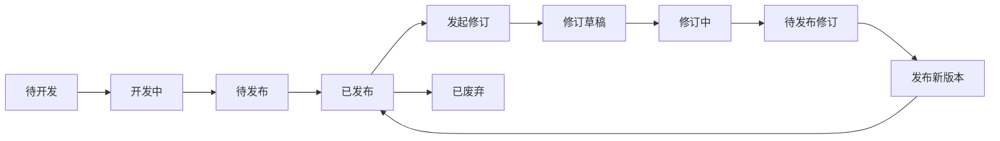

# 语义工作台与 Cube 生命周期重构设计

> 日期：2026-04-03
> 主题：将语义工作台重构为 AI 辅助建模主场，并把已发布 Cube 收口到资产管理流

## 1. 背景

当前语义中心已经明确了几条产品边界：

- `语义工作台` 应承接真实的数据开发流程，而不是停留在孤立的工具页形态
- Cube 开发应从手工配置转向 `AI 辅助建模`
- 顶部只保留 `发布`
- `YAML` 页负责 `校验 / 保存`
- `PY` 页只读
- `预览` 页统一承接 `DSL / 编译 / 编译执行 / SQL / 结果 / 报错`
- 不再保留独立 compiler 页
- 单 Cube / Joined Cube 不做显式切换，而是由 join 上下文隐式决定

但当前实现仍存在三个关键问题：

1. `Cube 管理` 仍保留 `新建 Cube` 主入口，导致资产管理页与开发工作台职责重叠
2. 当前“新建 Cube”页面以关系画布和技术面板为中心，不符合 AI 辅助建模的目标流程，也不符合当前平台统一风格
3. 已发布 Cube 仍与开发中对象混在同一工作语义里，没有形成清晰的生命周期流转与修改机制

本设计的目标不是再增加一套新页面，而是统一语义中心的信息架构，让用户在一个稳定心智下完成：

`选择数据源 -> 选择表/数据集 -> AI 生成 Cube 初稿 -> 微调 -> 预览调试 -> 发布`

## 2. 设计前提

本设计以当前已确认的业务约束为准：

- 平台用户主要是数据工程师、分析师
- `语义工作台` 是开发流，不是资产流
- `Cube 管理` 是资产流，不是开发流
- 运行中的工作对象与正式发布资产需要分离
- 已发布资产的修改不能直接在正式版本上裸改，而应通过修订机制回到开发流

## 3. 目标与非目标

### 3.1 目标

- 把 `新建 Cube` 的唯一主入口迁移到 `语义工作台`
- 让 `语义工作台` 成为 AI 辅助建模、微调、调试、发布的一体化主场
- 让 `Cube 管理` 回归资产管理，只负责浏览、筛选、查看和发起修订
- 建立 `开发态 -> 已发布 -> 修订态` 的清晰生命周期
- 统一语义中心与平台其他模块的视觉风格和交互风格

### 3.2 非目标

- 当前阶段不扩展为复杂的多版本管理中心
- 当前阶段不引入额外一级导航
- 当前阶段不改变 `YAML / PY / 预览` 的既定职责
- 当前阶段不围绕画布设计新的显式“单 Cube / Joined Cube”切换器

## 4. 方案比较

### 方案 A：工作台承接完整开发流，Cube 管理承接资产流

做法：

- `新建 Cube` 主入口迁移到 `/semantic/workbench`
- `/semantic/workbench` 首屏改为 AI 建模起始页
- 生成草稿后在同一工作台内切换到开发态
- `Cube 管理` 移除 `新建 Cube`
- 已发布 Cube 通过 `发起修订` 回流工作台

优点：

- 最符合真实数据开发流程
- 符合 `KISS`，入口和职责最清楚
- 符合 `DRY`，避免“列表里新建一次、工作台里再做一次”
- 最利于后续把 AI 建模、调试和发布串成连续链路

缺点：

- 需要对现有 `/semantic/workbench` 和 `/semantic/cubes/new` 的职责重新收口

### 方案 B：工作台做开发门户，创建后再进入独立编辑页

做法：

- 工作台只做“开始 AI 建模”和“继续工作”
- 生成初稿后跳转到独立的 Cube 编辑工作区

优点：

- 对现有路由影响较小

缺点：

- 用户仍会感知到“从首页跳到另一个创建页”
- 工作流仍然被切断，不够统一

### 方案 C：保留列表页新建入口，只弱化其权重

做法：

- `Cube 管理` 中保留 `新建 Cube`
- 工作台也提供 AI 建模入口

优点：

- 短期迁移成本最低

缺点：

- 明显违背 `DRY`
- 容易重新制造双入口和双心智
- 长期会继续混淆资产流和开发流

### 推荐结论

采用 **方案 A：工作台承接完整开发流，Cube 管理承接资产流**。

## 5. 新的信息架构

### 5.1 页面职责

#### 语义工作台 `/semantic/workbench`

职责：

- 选择数据源
- 选择表 / 数据集
- AI 生成 Cube 初稿
- 微调指标、维度、日期属性和基础定义
- 预览、校验、编译执行、查看 SQL 与结果
- 发布

不承担：

- 全量资产浏览
- 已发布资产的长期驻留展示
- 作为第二个 `Cube 管理`

#### Cube 管理 `/semantic/cubes`

职责：

- 浏览正式语义资产
- 筛选、搜索、查看详情
- 对已发布资产发起修订
- 管理已废弃对象

不承担：

- 新建 Cube
- 作为开发主入口
- 承接开发中对象的主工作流

### 5.2 工作台首页骨架

工作台首页采用 `1 个主任务区 + 2 个辅助区` 的平台式布局：

1. 顶部上下文条
2. 中间主任务区：`AI 辅助建模`
3. 右侧继续工作区：`最近草稿 / 最近发布 / 待处理失败项`
4. 底部轻量流程说明

主任务区顺序固定为：

1. 选择数据源
2. 选择表 / 数据集
3. 展示已选对象摘要
4. 点击 `生成 Cube 初稿`

### 5.3 工作台开发态骨架

生成初稿后，不再跳独立新建页，而是在同一个 `/semantic/workbench` 内切换到开发态。

开发态主 Tab 固定顺序为：

1. `建模`
2. `预览`
3. `YAML`
4. `PY`

默认打开规则：

- 新建成功后：默认停在 `建模`
- 从草稿进入：默认停在 `建模`
- 从已发布对象进入查看态：默认停在 `预览`
- 校验失败 / 编译失败：自动切到 `预览`

各 Tab 职责如下：

- `建模`：AI 推荐结果微调主场，负责指标、维度、日期属性、名称、描述、来源绑定与 join 上下文编辑
- `预览`：统一承接 `DSL / 编译 / 编译执行 / SQL / 结果 / 报错`
- `YAML`：负责 `校验 / 保存`
- `PY`：只读

### 5.4 创建态与工作态切换

工作台内部固定存在四类状态：

1. `空白起始态`
2. `待生成态`
3. `草稿生成态`
4. `开发工作态`

切换规则：

- 用户在首屏完成数据源和表选择后，进入 `待生成态`
- 点击 `生成 Cube 初稿` 成功后，进入 `草稿生成态`
- 页面在同一路由下切换为 `开发工作态`
- 顶部上下文条开始展示当前 Cube 名称、来源和状态

失败规则：

- 生成失败时，不离开起始态
- 保留已选数据源和表
- 在主任务区内给出可重试的错误提示

## 6. 生命周期设计

### 6.1 生命周期状态

将 Cube 生命周期拆为两类：

#### 过程态

- 待开发
- 开发中
- 待发布
- 修订草稿
- 修订中
- 待发布修订
- 校验失败

这些状态属于 `语义工作台`。

#### 资产态

- 已发布
- 已废弃

这些状态属于 `Cube 管理`。

### 6.2 状态流转

### 6.3 设计约束

- 发布后对象应从工作台主列表自然退出，回流到 `Cube 管理`
- 已发布对象不应长期驻留在工作台首页
- 已发布对象不能直接以“编辑正式版本”的方式进入开发态
- 所有发布后修改都必须先创建修订草稿

## 7. 已发布 Cube 的修改机制

### 7.1 主链路

已发布 Cube 的修改链路固定为：

1. 在 `Cube 管理` 查看已发布对象
2. 点击 `发起修订`
3. 系统基于当前发布版本创建 `修订草稿`
4. 自动跳回 `语义工作台`
5. 用户在 `建模 / 预览 / YAML / PY` 中修改
6. 再次 `发布`
7. 新版本回流 `Cube 管理`

### 7.2 按钮语义

#### 工作台

- `保存`
- `预览验证`
- `发布`

#### Cube 管理

- `查看`
- `发起修订`
- `废弃`

不建议对已发布对象继续保留泛化的 `编辑` 按钮，以免混淆“编辑线上对象”和“基于线上发起下一版修订”。

## 8. Cube 管理页重构要求

### 8.1 页面定位

`Cube 管理` 固定为资产管理页，不再承担创建职责。

### 8.2 页面结构

建议使用 `列表主区 + 详情抽屉` 的平台式结构：

1. 页头：标题、副标题、刷新
2. 筛选条：生命周期、领域、数据源、发布时间、关键词
3. 列表主区：名称、领域、来源、状态、发布时间、最近修订时间
4. 详情抽屉：基础信息、字段摘要、发布信息、最近修订信息

### 8.3 默认筛选

默认筛选停在 `已发布`，而不是 `全部`。

原因：

- 强化资产管理定位
- 避免工作台和列表页再次重叠
- 减少“开发对象和正式资产混在一个默认视图里”的噪声

## 9. 路由收口建议

### 9.1 保留的主入口

- `/semantic/workbench`：语义开发主场
- `/semantic/cubes`：Cube 资产管理
- `/semantic/domains`：领域目录
- `/semantic/modeling`、`/semantic/domains/:id`：领域建模与画布

### 9.2 需要收口的旧入口

- `/semantic/cubes/new` 不再作为长期主入口
- `/semantic/cubes/:name/edit` 最终应回流为工作台对象态
- 现有旧别名路由继续保留兼容重定向，但不再作为主 IA

技术实现上，允许通过对象态 URL 或 query 参数保存工作台上下文，但用户心智上必须始终是“仍在工作台里工作”。

## 10. 视觉与交互原则

### 10.1 平台统一风格

- 使用平台统一页头、间距、卡片、抽屉、表单和空态
- 创建首屏以结构化表单、推荐卡片和摘要面板为主
- 不再用关系画布作为默认创建首页

### 10.2 建模体验原则

- 优先让 AI 先给出可工作的初稿
- 用户主要做“删、改、补、确认”，而不是从零写定义
- 无 join 上下文时默认按单 Cube 处理
- 有 join 上下文时自然进入 Joined Cube 语义，不增加显式切换器

## 11. 原则评估

### KISS

- `工作台` 与 `Cube 管理` 各自只承担一种主职责
- 用户只需要理解“开发流”和“资产流”两种心智

### YAGNI

- 当前只引入 `修订草稿`，不急于扩展为完整版本中心
- 不新增更多一级导航和更多独立工具页

### SOLID

- 过程管理与资产管理解耦
- `建模 / 预览 / YAML / PY` 各自职责稳定，不互相越界

### DRY

- 取消 `Cube 管理` 中的 `新建 Cube`
- 避免相同对象在工作台和列表页中同时承担主入口

## 12. 实施建议

建议按以下顺序实施：

1. 先重构 `语义工作台` 首页，落地 AI 建模起始页
2. 将当前 `/semantic/cubes/new` 的创建职责迁入工作台
3. 将当前 `YAML / PY / 预览` 能力整合为工作台后半段固定 Tab
4. 重构 `Cube 管理`，移除 `新建 Cube`，改为资产管理视图
5. 增加 `发起修订` 主链路
6. 最后再收口旧路由与兼容跳转

## 13. 完成标准

本设计落地完成时，必须同时满足：

1. `新建 Cube` 的主入口只存在于 `语义工作台`
2. `Cube 管理` 不再承担创建职责
3. 工作台可以完成 `AI 生成 -> 微调 -> 预览 -> 校验 -> 发布`
4. 已发布 Cube 的修改必须通过 `发起修订`
5. 已发布对象从默认工作台视图中退出，并回流到 `Cube 管理`
6. 页面视觉与交互风格与当前平台保持统一
