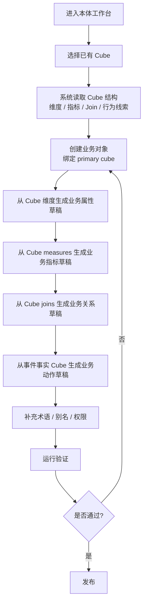

# 本体工作台基于 Cube 的建模重构设计

> 状态：已被 [`2026-04-14-ontology-workbench-object-aggregate-design.md`](./2026-04-14-ontology-workbench-object-aggregate-design.md) 替代。
> 说明：本稿将 `Cube` 过度提升为前台建模主聚合根，与后续确认的“对象聚合根 + 专项索引辅助”方向不一致，保留仅供历史追溯。

> 日期：2026-04-14
> 主题：将 `/semantic/ontology` 从“Ontology 先录入、Cube 后校验”重构为“基于 Cube 长出业务语义”的建模工作台

## 1. 背景

当前本体工作台已经具备对象、属性、业务指标、关系、动作、术语、权限七类资产的最小建模、投影预览、联邦追踪、运行验证和发布校验能力。

但从实际建模体验看，当前流程仍存在一个核心偏差：

- 产品设计意图是“业务语义建立在分析语义 `Cube` 之上”
- 当前实现更接近“先录入业务语义，再由 `Semantic Mapper` 去猜测、匹配、校验和回看 `Cube`”

这导致用户在建模阶段难以感知 `Cube` 的参与，只能在投影预览、联邦追踪、运行验证或发布校验阶段看到 `Cube` 的存在。

最终结果是：

1. 用户会觉得本体模型是悬空建出来的
2. `measure_refs`、`event_cube_refs` 等关键绑定以自由文本方式录入，缺少强约束
3. 关系和对象仍大量依赖名称/标题/别名匹配，稳定性不足
4. `Cube` 明明是执行真相源，却没有在前台建模流程里成为第一等对象

## 2. 问题诊断

### 2.1 当前工作流的问题

当前 `/semantic/ontology` 的工作流近似于：

`选择资产类型 -> 手工录入表单 -> 保存 -> 查看投影/运行验证 -> 发布`

这条链路的问题不在于能力不足，而在于建模真相源暴露顺序不对。

- 对象：不显式绑定 `Cube`，而是保存后再做候选匹配
- 指标：虽然有 `measure_refs`，但只是文本输入，不是从 `Cube.measure` 选择
- 关系：不显式绑定 `Join Path`，而是保存后再从对象候选 `Cube` 中推导
- 动作：虽然有 `event_cube_refs`，但仍是文本输入

### 2.2 与设计原则的冲突

- `KISS`
  - 当前用户必须脑补“这个业务对象到底对应哪个 Cube”，建模心智不够直接
- `YAGNI`
  - 当前通过大量事后预览和校验来弥补建模期缺少绑定，造成额外复杂度
- `SOLID`
  - 页面同时承担录入、绑定、预览、运行验证、治理检查，职责边界不够清楚
- `DRY`
  - 业务语义和分析语义之间的关系没有在建模时显式确立，后续只能重复通过匹配逻辑推断

## 3. 目标与非目标

### 3.1 目标

- 让本体建模显式建立在 `Cube / Measure / Join / Event Cube` 之上
- 让用户在建模第一步就看到并选择分析真相源
- 把关键绑定从“自由文本 + 事后校验”收敛为“结构化选择 + 即时约束”
- 保留 `Ontology` 与 `Cube` 的分层边界，不把 SQL 或执行公式写回 `Ontology`
- 保留当前投影、联邦、运行验证、治理发布链条，但将其从“补救型能力”转为“确认型能力”

### 3.2 非目标

- 当前阶段不重做 `Cube` 工作台本身
- 当前阶段不改变 `Execution Compiler`、`Semantic Router` 的核心职责
- 当前阶段不引入完整版本编排或复杂多域映射中心
- 当前阶段不让 `Ontology` 持有 SQL、DSL 或执行表达式

## 4. 方案比较

### 方案 A：基于 Cube 的辅助式本体建模

做法：

- 用户先选 `Cube`
- 再从 `Cube` 派生对象、属性、指标、关系、动作
- 本体录入围绕结构化绑定进行

优点：

- 最符合“本体基于分析模型”的设计意图
- 最容易解释真相源边界
- 大幅减少自由文本引用和名称猜测
- 发布校验、联邦追踪和运行验证会更自然

缺点：

- 需要调整当前前端 IA 和后端接口契约
- 需要补一层从 `Cube` 生成本体草稿的编排能力

### 方案 B：维持 Ontology-first，但增加显式绑定步骤

做法：

- 保留当前七类资产录入模式
- 在每类资产下增加“分析层绑定”区
- 让名称匹配从默认机制改成“建议 + 人工确认”

优点：

- 改造成本较低
- 能兼容当前表单和接口

缺点：

- 用户心智仍然是“先建本体，再补绑定”
- `Cube` 仍不是建模第一入口
- 容易继续保留大量双阶段逻辑

### 推荐结论

采用 **方案 A：基于 Cube 的辅助式本体建模**。

原因：

- 它最符合产品原始意图
- 它最能解决用户“建模过程中看不到 Cube”的核心问题
- 它在不破坏 `Ontology / Cube` 分层边界的前提下，把 `Cube` 提升为建模起点，而不是事后验证目标

## 5. 推荐方案总览

新的核心建模链路调整为：

`选择 Cube -> 生成本体草稿 -> 完成业务语义补充 -> 运行验证 -> 治理发布`

这里的“生成本体草稿”不是自动替用户做完建模，而是帮助用户完成以下映射：

- `Cube -> BusinessObject`
- `Cube.dimensions -> BusinessProperty`
- `Cube.measures -> BusinessMetric`
- `Cube.joins -> BusinessRelation`
- `Event / Behavior Cube -> BusinessAction`

术语和权限仍属于业务语义增强层，应放在建模后半段补齐。

## 6. 新的信息架构

### 6.1 页面定位

`/semantic/ontology` 仍然保留为本体工作台入口，但职责从“七类资产并列录入”调整为“基于 Cube 的业务语义建模工作台”。

### 6.2 一级结构

页面一级结构改为三个任务阶段：

1. `建模`
2. `验证`
3. `治理发布`

左侧资产浏览器继续保留七类资产分类，但降为当前模型上下文中的资产过滤器，而不是主流程入口。

### 6.3 建模阶段的一级步骤

建模阶段的主流程固定为：

1. 选择 `Cube`
2. 创建或确认 `业务对象`
3. 确认 `业务属性`
4. 确认 `业务指标`
5. 确认 `业务关系`
6. 确认 `业务动作`
7. 补充 `术语`
8. 补充 `权限`

### 6.4 三栏布局职责

- 左栏：`Cube 上下文 + 资产过滤 + 当前模型资产列表`
- 中栏：当前阶段主任务区
- 右栏：检查器，展示状态、绑定摘要、生命周期、最近操作

## 7. 目标用户流程

### 7.1 主流程

### 7.2 各步骤的用户动作

#### 第一步：选择 Cube

用户需要先回答：

- 这个业务语义落在哪个分析 `Cube` 上？
- 它的主分析对象是什么？

系统展示：

- `Cube` 名称、标题、来源数据集、状态
- 维度数、指标数、Join 数
- 是否有认证指标、是否有事件事实特征

#### 第二步：创建业务对象

系统基于选中的 `Cube` 创建对象草稿：

- 默认标题可由 `Cube.title` 衍生
- 默认标识可由 `Cube.name` 衍生
- 新增显式字段：`primary_cube_ref`

用户补充：

- 业务对象标题
- 业务描述
- 业务别名

#### 第三步：确认业务属性

属性不再主要依赖手工录入，而是从当前 `Cube` 的维度中选择：

- 字段名
- 标题
- 数据类型
- 维度角色

用户做的是：

- 勾选哪些维度应暴露为业务属性
- 修正属性名称和业务含义

#### 第四步：确认业务指标

指标从当前 `Cube.measure` 中选择，而不是自由输入 `measure_refs`。

系统生成：

- `metric_name`
- `measure_ref`
- 默认指标标题

用户补充：

- 业务口径说明
- 语义标签
- 业务别名

#### 第五步：确认业务关系

关系从当前 `Cube.joins` 推导，不再靠纯事后匹配。

系统生成：

- 源 `Cube`
- 目标 `Cube`
- `join_path`
- `relationship`

用户确认：

- 这个 Join 在业务上叫什么关系
- 它对应哪个业务对象与目标业务对象

#### 第六步：确认业务动作

动作优先从事件事实 `Cube` 或行为型 `Cube` 生成。

系统生成：

- `event_cube_ref`
- 可能的时间字段
- 与对象的关联提示

用户补充：

- 动作名称
- 触发条件
- 业务描述

#### 第七步：补充术语与权限

术语与权限是语义增强层，不应成为建模起点。

术语负责：

- 别名
- 标准口径命名
- 问数可识别词汇

权限负责：

- 谁能看对象 / 属性 / 指标 / 动作
- 在路由和执行时如何阻断

## 8. 核心数据模型调整

### 8.1 需要新增或显式化的绑定字段

- `BusinessObject.primary_cube_ref`
- `BusinessProperty.dimension_ref` 或 `field_ref`
- `BusinessMetric.measure_refs` 保留，但来源改为结构化选择
- `BusinessRelation.join_path_ref`
- `BusinessAction.event_cube_refs` 保留，但来源改为结构化选择

### 8.2 元数据写入原则

从 `Cube` 派生到 `Ontology` 的默认标题、描述和元信息，不应默认双写为独立真相源。

推荐规则：

- 用户未修改时：运行时优先回退读取 `Cube` 元数据
- 用户显式修改时：只保存业务侧 override

这样可以避免：

- `Cube` 元数据更新后，`Ontology` 里残留陈旧副本
- 在两个层次重复维护同一份描述

### 8.3 真相源边界

必须继续坚持：

- `Cube` 是执行真相源
- `Ontology` 是业务语义真相源
- `Ontology` 只记录“业务表达”和“显式绑定”
- `SQL / DSL / Tool expression` 仍留在 `Cube` 或执行层

这部分继续符合：

- `SOLID`：业务语义与执行语义分离
- `DRY`：不双写执行逻辑

## 9. 前端改造方案

### 9.1 页面结构改造

当前首页从“七类资产并列入口”改为“先选 Cube 的建模起始页”。

建模阶段中栏改成多步工作区：

1. `选择 Cube`
2. `对象`
3. `属性`
4. `指标`
5. `关系`
6. `动作`
7. `术语`
8. `权限`

### 9.2 关键交互改造

- 指标：`measure_refs` 改为 `Cube / Measure` 选择器
- 动作：`event_cube_refs` 改为事件 `Cube` 选择器
- 关系：新增 `Join Path` 选择器
- 对象：新增主 `Cube` 绑定展示
- 属性：改为从候选维度中批量选择，而不是完全空白录入

### 9.3 验证页收口

验证页继续保留：

- 投影结果
- 联邦追踪
- 路由预演
- 执行计划
- 执行结果

但语义从“我建完后看看能不能投影”改成“我基于真实 `Cube` 建出来后确认是否一致”。

## 10. 后端改造方案

### 10.1 新增编排接口

建议新增一组本体建模辅助接口：

- `GET /api/v1/ontology/modeling/cubes`
  - 返回可选 `Cube` 列表和摘要
- `GET /api/v1/ontology/modeling/cubes/<cube_name>/schema`
  - 返回维度、指标、Join、候选事件线索
- `POST /api/v1/ontology/modeling/bootstrap`
  - 基于选定 `Cube` 生成本体草稿
  - 推荐只返回结构化候选与映射建议，不直接代后端持久化完整本体对象

建议 `bootstrap` 返回内容包括：

- `cube_summary`
- `object_draft`
- `property_candidates`
- `metric_candidates`
- `relation_candidates`
- `action_candidates`
- `binding_hints`

不建议在该接口中直接写入数据库。

### 10.2 保留现有接口

以下现有接口仍然保留：

- 七类资产的 `list/get/save`
- `preview / stale-check / consistency-report`
- `links / backlinks`
- `route / plan / execute-plan`
- `publish / impact / history`

原因：

- 这些能力仍然是本体工作台的后半段核心价值
- 当前改造重点是建模起点，而不是推倒现有验证和治理链

### 10.3 保存接口契约收紧

现有 `save` 接口可以保留，但必须补充强校验：

- `primary_cube_ref` 必须真实存在
- `dimension_ref / field_ref` 必须存在于对应 `Cube`
- `measure_refs` 必须能被真实解析
- `join_path_ref` 必须存在于源 `Cube`
- `event_cube_refs` 必须真实存在

只有这样，“结构化选择 + 即时约束”才不会在后端落空。

### 10.4 服务层改造

建议新增一层 `OntologyModelingBootstrapService`：

- 读取 `Cube` 定义
- 生成对象、属性、指标、关系、动作草稿
- 输出结构化绑定信息

同时把现有 `SemanticMapperPreviewService` 的“名称匹配兜底”保留为回退机制，而不是默认主链。

另建议补充 `OntologyDependencyGuardService`：

- 在 `Cube` 发布、修订或字段变更后扫描受影响的本体资产
- 将受影响资产标记为 `binding_warning / binding_stale`
- 把结果透出到本体工作台检查器与治理发布页

## 11. 迁移策略

### 11.1 存量资产兼容

对已有资产：

- 已存在 `measure_refs`、`event_cube_refs` 的资产直接兼容
- 没有显式 `primary_cube_ref`、`join_path_ref` 的旧资产可继续通过 `Mapper` 推断
- 前台 UI 对旧资产显示“待确认绑定”提示

### 11.2 增量资产规则

从新流程创建的资产应优先满足：

- 对象具备 `primary_cube_ref`
- 指标通过结构化选择写入 `measure_refs`
- 关系具备 `join_path_ref`
- 动作通过结构化选择写入 `event_cube_refs`

### 11.3 底层 Cube 变更级联

当底层 `Cube` 发生以下变化时：

- 维度删除或重命名
- Measure 删除或重命名
- Join 路径失效
- 事件事实 `Cube` 下线

系统应自动触发依赖检查，并将相关本体资产标记为：

- `待确认绑定`
- `绑定失效`
- `需重新发布`

避免把问题延后到执行期才暴露。

## 12. 风险与缓解

### 风险 1：改造成本较高

缓解：

- 先保留现有保存接口
- 前端先新增 `Cube-assisted` 起始流
- 老表单作为兼容编辑态暂时保留

### 风险 2：存量数据缺少显式绑定

缓解：

- 对旧资产允许回退到现有 `Mapper` 逻辑
- 新 UI 中对“推断绑定”明确标记为待确认

### 风险 3：对象与 Cube 并非总是一一对应

缓解：

- 第一阶段只支持 `primary_cube_ref`
- 多 `Cube` 聚合对象作为后续增强，不在当前范围

这符合 `YAGNI`。

### 风险 4：跨 Cube 指标在第一阶段受限

单 `primary_cube_ref` 策略虽然能快速收口主流程，但真实业务对象常常会消费多个 `Cube` 的指标。

第一阶段建议采用折中策略：

- 对象仍只有一个 `primary_cube_ref`
- 指标选择器允许引入其他 `Cube` 的 `measure`
- 但这些外部指标必须具备可达 `Join` 路径或明确标记为“跨 Cube 指标”

这样既不提前做完整多 `Cube` 对象建模，也不堵死真实业务需求。

### 风险 5：多人协作下的草稿冲突

本体建模改为多步工作区后，草稿停留时间会变长。

建议增加：

- 草稿版本号
- 保存时乐观锁校验
- 底层 `Cube` 版本戳检查

如果用户编辑过程中底层 `Cube` 已被他人修改，保存时应提示：

- 哪些绑定已过期
- 是否需要重新拉取 `Cube` 结构
- 是否保留本地未保存编辑

## 13. 验证策略

### 13.1 产品验收

- 用户能在建模第一步看到并选择 `Cube`
- 用户创建业务指标时不再手工录入 `measure_refs`
- 用户创建业务关系时能看到来源于 `Join` 的结构化路径
- 用户创建业务动作时能看到事件 `Cube` 绑定
- 用户能理解 `Ontology` 与 `Cube` 的职责边界
- 当底层 `Cube` 变化时，用户能及时看到绑定失效提示
- 跨 `Cube` 指标在第一阶段有明确的约束和提示，不会悄悄失败

### 13.2 工程验收

- 新增 `Cube-assisted` 流程后，原有联邦追踪与运行验证仍可用
- 旧资产可正常打开和编辑
- 发布校验继续生效
- 不引入 `Ontology` 与 `Cube` 执行公式双写
- 保存接口会对所有结构化绑定做强校验
- 草稿保存具备版本检查，不会静默覆盖

## 14. 推荐实施顺序

1. 新增 `Cube` 选择与建模草稿接口
2. 前端引入 `Cube-assisted` 起始页
3. 把指标与动作改成结构化选择
4. 把关系改成 `Join Path` 显式绑定
5. 为旧资产补“待确认绑定”兼容态
6. 最后再收紧发布规则

## 15. 结论

本次改版的关键不是“把页面做得更好看”，而是把本体工作台的建模真相源表达正确。

推荐将 `/semantic/ontology` 重构为：

`基于 Cube 的业务语义建模工作台`

而不是继续维持：

`先录入 Ontology，再去猜测和校验 Cube`

这样才能真正实现：

- `Cube` 负责分析执行
- `Ontology` 负责业务语义
- 二者在建模阶段就显式绑定，而不是在验证阶段才勉强汇合
